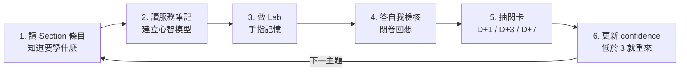

# 01 如何使用本 Vault

## 🧱 筆記的固定結構

每篇 `03-核心服務` 的筆記都長一樣，方便你快速掃描：

```
# 服務名稱
## 一句話定位        ← 考場上腦中要先跳出這句
## 心智模型           ← 它實際上怎麼運作（圖/流程）
## 核心概念           ← 必懂的名詞
## 關鍵設定與限制 🔢  ← 會被考的數字
## 常用操作           ← gcloud / YAML / 程式碼
## 考點速記           ← 「看到 X 就想到 Y」
## 真實場景陷阱       ← 上線後才會痛的那些事
## 自我檢核           ← 3–5 題，答不出來就回頭
## 相關
```

## 🔁 推薦的學習循環（每個主題）



> [!important] 最重要的一步是「4. 閉卷回想」
> 讀完就覺得懂 = 熟悉感，不是記憶。**蓋住筆記、把心智模型講出來**，才會真的留下。每篇筆記末尾的「自我檢核」就是為此設計的。

---

## 🏷️ 標籤系統

| 標籤 | 用途 |
|---|---|
| `#gcp/pcd` | 全部筆記 |
| `#service/cloud-run`、`#service/gke` … | 依服務歸類 |
| `#exam/s1` ～ `#exam/s4` | 對應考試範圍 |
| `#pattern` | 設計模式 / 決策樹 |
| `#lab` | 動手實作 |
| `#numbers` | 有必背數字 |
| `#weak` | **你自己加**：不熟的地方，考前搜尋 `tag:#weak` |

> [!tip] 弱點管理法
> 每次答錯或卡住，就在那一段上方加一行 `#weak`。考前兩天用 Obsidian 搜尋 `tag:#weak`，那就是你的個人化複習清單 — 比任何通用重點都有效。

---

## 🃏 閃卡格式（Spaced Repetition 外掛）

`08-Flashcards` 使用 **單行格式**：

```markdown
Cloud Run 預設每個實例的並行請求數是多少？::80
```

多行格式（需要圖或程式碼時）：

```markdown
Pub/Sub 的 exactly-once delivery 適用範圍？
?
只保證**同一個訂閱**在 ack deadline 內不會重複送達；
跨訂閱、跨 region 仍需自行冪等。
```

外掛設定：`Settings → Spaced Repetition`
- Flashcard tags: `#flashcards`
- Single-line separator: `::`
- Multiline separator: `?`

沒安裝外掛也能用：把它當成「問題 :: 答案」的問答清單，蓋住右邊自測。

---

## 📈 進度追蹤

1. 每天打開 [[25 天衝刺計劃]]，勾掉當天的 `- [ ]`。
2. 每篇筆記讀完，把 frontmatter 的 `status` / `confidence` 更新。
3. 每週日打開 [[每日追蹤模板]] 做一次 15 分鐘回顧。

---

## 💡 高效使用的五個小技巧

1. **用 Graph View 檢查理解**：打開圖表視圖，如果某個服務的節點孤零零沒連線，代表你還沒把它放進整體架構裡。
2. **決策樹先背，服務後補**：先把 [[決策樹 運算平台選型]] 三張決策樹記熟，讀服務筆記時就有掛鉤點。
3. **把 Lab 的錯誤訊息貼回筆記**：真實錯誤（權限不足、image pull 失敗、cold start 超時）是最好的考點記憶。
4. **英文術語不要翻譯**：考試是英文。筆記刻意保留 `revision`、`ack deadline`、`session affinity` 等原文。
5. **用 Canvas 畫一張總圖**：第 21 天的任務就是在 Obsidian Canvas 上憑記憶畫出「一個完整的雲端原生應用」— 畫不出來的地方就是漏洞。

## 🔗 相關

- [[02 Obsidian 設定與外掛建議]]
- [[25 天衝刺計劃]]
- [[每日追蹤模板]]
