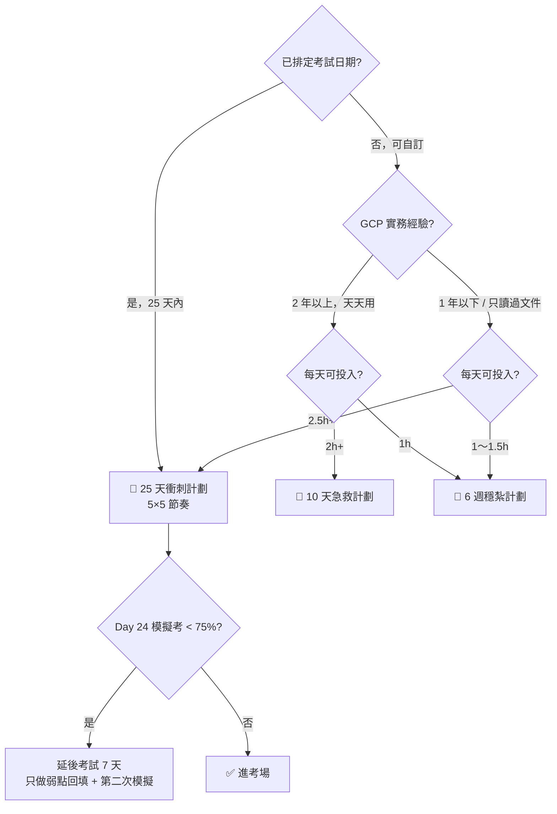

# 替代方案 比較與選擇

> [!abstract] 先回答你的問題：有沒有比 25 天更好的計劃？
> **有，但取決於你的條件。** 25 天是「時間固定」下的最佳解；如果你的目標是**考完還記得住**（而不只是通過），我的第一推薦其實是 [[6 週穩紮計劃]]。下面給你判斷依據。

## 🧭 30 秒選擇決策樹

## 📊 三種計劃對照

| 維度 | [[25 天衝刺計劃]] | [[6 週穩紮計劃]] | [[10 天急救計劃]] |
|---|---|---|---|
| 總時數 | ~62 小時（2.5h × 25） | ~63 小時（1.5h × 42） | ~25 小時（2.5h × 10） |
| 每日負擔 | 2.5 h（重） | 1.5 h（可持續） | 2.5 h（極高強度） |
| 節奏 | 4 天新知 + 1 天複習 | 5 天新知 + 週末複習/Lab | 只讀高頻 + 決策樹 |
| 間隔重複次數 | 每個主題 3～4 次 | 每個主題 **5～6 次** ⭐ | 1～2 次 |
| 動手實作 | 6 個 Lab 全做 | 6 個 Lab 全做 + 自由專案 | 只做 Lab 01、03 |
| 長期記憶保留 | 中上 | **最佳** ⭐ | 低（考完就忘） |
| 適合的人 | 有基礎、日期已定 | 上班族、想真的學會 | 資深、只缺證照 |
| 風險 | 第 3 週容易疲乏 | 戰線長，需要自律 | 冷門考點會失分 |

> [!important] 我的建議
> 1. **若考試日期已定且在 25 天內** → 照 [[25 天衝刺計劃]] 跑，不要自創順序。它的順序是按「相依性 + 考試權重」排的（Cloud Run 先於 GKE，IAM 先於 CI/CD，資料模型先於訊息）。
> 2. **若日期可自訂** → 選 [[6 週穩紮計劃]]，並把考試訂在第 6 週週末。多出來的 17 天全部用在「間隔重複」，這是投報率最高的時間投資。
> 3. **無論哪種，這三件事不可省**：
>    - 每個區塊的**複習日**（閉卷回想）
>    - **Day 24 等級的全真模擬考**（計時、不查資料）
>    - **自己動手寫三張決策樹**（運算、資料庫、訊息）

## 🔀 混合方案（很多人實際上最適合這個）

**「25 天骨架 + 週末加倍」**
- 週一～週五：只做 25 天計劃裡的「🔁 暖身 + 📖 主餐」（110 分鐘）
- 週六：把那週所有 🛠 Lab 一次做完（3～4 小時）
- 週日：複習日 + 情境題（2 小時）
- 實際天數會拉到 ~32 天，但每天的心理負擔低很多，完成率高得多。

## 🚫 三種常見但無效的計劃

| 反模式 | 為什麼無效 | 改成 |
|---|---|---|
| 「先把官方文件從頭讀完再做題」 | 沒有回想壓力，讀完 80% 會忘掉 | 每讀一個服務就立刻答自我檢核 |
| 「刷 500 題題庫」 | 題庫與真題偏離、且訓練的是「記答案」而非「判準」 | 每題強迫寫出「關鍵詞 → 判準」 |
| 「全部看影片課程」 | 被動輸入，感覺很有效但提取率最低 | 影片當補充，主線放筆記 + 動手 |

## ⚖️ 如果你只剩下 X 天

| 剩餘天數 | 做什麼（優先序） |
|---|---|
| **1 天** | [[數字與限制速記]] → 三張決策樹 → [[常見陷阱與誘答選項識別]] |
| **3 天** | 上述 + [[Cloud Run]] + [[GKE 工作負載 健康檢查與自動擴充]] + 一次模擬考 |
| **7 天** | [[10 天急救計劃]] 壓縮版：Day 1–5 照跑，Day 6–7 模擬考 + 弱點 |
| **10 天** | [[10 天急救計劃]] |
| **25 天** | [[25 天衝刺計劃]] |
| **42 天+** | [[6 週穩紮計劃]] |

## 🔗 相關

- [[25 天衝刺計劃]]
- [[6 週穩紮計劃]]
- [[10 天急救計劃]]
- [[每日追蹤模板]]
- [[00 考試總覽]]
