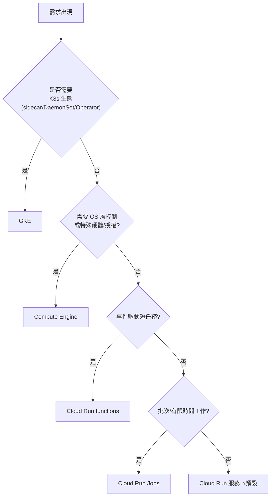

# Section 1 — 設計可擴充、安全、可靠的雲端原生應用（~32%）

> [!abstract] 這一節在考什麼
> **「給你需求，選對設計。」** 這是全卷最重的一節，也是最像 Architect 的一節。
> 三個子範圍：`1.1 高效能應用與 API`、`1.2 安全應用`、`1.3 資料儲存與存取`。
> 讀完這節你要能在 30 秒內回答：**要用什麼運算平台、什麼資料庫、怎麼串接、怎麼保護。**

---

## 1.1 設計高效能的應用與 API

| 官方考點 | 對應筆記 | 一句話重點 |
|---|---|---|
| 依使用情境選平台（Compute Engine / GKE / Cloud Run） | [[決策樹 運算平台選型]]、[[Cloud Run]]、[[GKE 基礎與 Autopilot]]、[[Compute Engine 與 App Engine]] | 預設選 Cloud Run；需要 K8s 能力才上 GKE；需要作業系統控制才用 VM |
| 建置、重構、部署應用容器到 Cloud Run 與 GKE | [[Cloud Run]]、[[GKE 工作負載 健康檢查與自動擴充]]、[[12-Factor 與雲端原生設計原則]] | 容器契約：無狀態、監聽 `$PORT`、優雅關閉 |
| Google Cloud 服務的地理分布（延遲、regional、zonal） | [[地理分布 區域與可用區設計]] | 分清 zonal / regional / multi-regional 的失效範圍 |
| 負載平衡器的使用情境 | [[Load Balancing 與 Session Affinity]] | 全球 vs 區域、L7 vs L4、serverless NEG |
| 啟用 session affinity 以提升內容傳遞效能 | [[Load Balancing 與 Session Affinity]]、[[Session 管理]] | affinity 是效能最佳化，**不是**狀態管理方案 |
| 實作快取解決方案（Memorystore） | [[Memorystore 與快取策略]] | cache-aside 是預設模式；注意穿透/雪崩/一致性 |
| 建立與部署 API（HTTP REST、gRPC） | [[API 設計 REST 與 gRPC]] | 內部高頻低延遲 → gRPC；公開/瀏覽器 → REST |
| 應用的速率限制、驗證、可觀測性（Apigee、API Gateway） | [[API 管理 Apigee 與 API Gateway]] | 需要完整 API 生命週期/變現/開發者門戶 → Apigee |
| 用非同步/事件驅動方式整合（Eventarc、Pub/Sub） | [[Pub Sub]]、[[Eventarc]]、[[決策樹 訊息與事件選型]] | 解耦、削峰、扇出 |
| 定義工作負載的資源需求 | [[成本與資源最佳化]]、[[GKE 工作負載 健康檢查與自動擴充]] | requests 決定排程與擴充；limits 決定被殺的時機 |
| 最佳化成本與資源使用 | [[成本與資源最佳化]] | 先量測再最佳化；min-instances vs 冷啟動的取捨 |
| 資料複寫如何支援 zonal / regional 容錯 | [[一致性 交易與資料複寫]]、[[地理分布 區域與可用區設計]] | 每個資料服務的 failover 單位不同 |
| 流量分流策略（漸進發布、rollback、A/B 測試） | [[Cloud Run]]、[[Cloud Deploy 與部署策略]] | Cloud Run revision 百分比；GKE 用兩個 Deployment 或 Gateway/Mesh |
| 用 Workflows、Eventarc、Cloud Tasks、Cloud Scheduler 編排服務 | [[Workflows 與 Cloud Scheduler]]、[[Eventarc]]、[[Cloud Tasks]]、[[決策樹 訊息與事件選型]] | 四者定位完全不同，必考 |

### 🎯 1.1 的核心判準

---

## 1.2 設計安全的應用

| 官方考點 | 對應筆記 | 一句話重點 |
|---|---|---|
| 資料保留與組織政策（GCS 物件生命週期、retention policy 與 lock） | [[Cloud Storage]] | lifecycle 省錢、retention 合規、**lock 之後不可逆** |
| 識別漏洞與保護服務的機制（IAP、Web Security Scanner） | [[IAP Identity Platform 與 Web Security Scanner]] | IAP = 應用層的身分守門員，取代 VPN |
| 回應與修復漏洞（Artifact Analysis、Security Command Center） | [[供應鏈安全 Artifact Analysis 與 Binary Authorization]] | 掃描 → 分級 → 重建映像 → 重新部署 |
| 儲存/存取/輪替祕密、憑證、加密金鑰（Secret Manager、Cloud KMS、WIF） | [[Secret Manager 與 Cloud KMS]]、[[Workload Identity Federation]] | 祕密 ≠ 金鑰；能不存就不存（用聯邦身分） |
| 驗證到 Google Cloud 服務（ADC、JWT、OAuth 2.0、Cloud SQL / AlloyDB Auth Proxy、Identity Platform、WIF） | [[驗證與授權 ADC OAuth JWT]]、[[Cloud SQL 與 AlloyDB]] | ADC 的搜尋順序是必考 |
| 用 IAM 角色保護資源（服務帳戶） | [[IAM 與服務帳戶]] | 每個服務一個專屬 SA，最小權限 |
| 安全的服務間通訊（Cloud Service Mesh、K8s Network Policy、Direct VPC egress、私有連線） | [[Cloud Service Mesh 與 Network Policy]]、[[VPC 連線 Serverless VPC Access 與 Direct VPC Egress]] | 身分驗證（誰）+ 網路隔離（從哪）兩層都要 |
| 以最小權限執行服務 | [[IAM 與服務帳戶]] | 不要用 default compute SA（權限過大） |
| 用 Binary Authorization 保護應用產出物 | [[供應鏈安全 Artifact Analysis 與 Binary Authorization]] | 只有帶合法 attestation 的映像能部署 |

### 🎯 1.2 的核心判準
> [!important] 安全題的「最 Google 答案」排序
> 1. **不要有祕密** → Workload Identity Federation / 附加服務帳戶（無金鑰）
> 2. 非得有祕密 → **Secret Manager**（版本化 + IAM + 稽核），不是 env var、不是 config 檔、絕不進 git
> 3. 要自管金鑰 → **Cloud KMS（CMEK）**，最嚴格才用 EKM
> 4. 權限 → **predefined role + 專屬 SA**；basic role（Owner/Editor）在考試裡永遠是錯的
> 5. 網路 → **私有連線**（Private Service Connect / Direct VPC egress）優於公開 IP + 防火牆

---

## 1.3 儲存與存取資料

| 官方考點 | 對應筆記 | 一句話重點 |
|---|---|---|
| 依資料量與效能需求選儲存系統 | [[決策樹 資料庫選型]] | 先問：結構化？交易？規模？延遲？全球？ |
| 為結構化（AlloyDB、Spanner）與非結構化（Bigtable、Firestore）資料庫設計 schema | [[Spanner]]、[[Cloud SQL 與 AlloyDB]]、[[Bigtable]]、[[Firestore]] | schema 設計題幾乎都在考**避免熱點** |
| 理解 AlloyDB / Bigtable / Cloud SQL / Spanner / Cloud Storage 的最終一致與強一致複寫 | [[一致性 交易與資料複寫]] | read replica = 最終一致；Spanner = 外部一致 |
| 建立 signed URL 授權存取 GCS 物件 | [[Cloud Storage]] | 時效性、不需要 Google 帳號、V4 簽章 |
| 為分析與 AI/ML 工作負載寫入 BigQuery | [[BigQuery 給開發者]]、[[Vertex AI Gemini API 給開發者]] | Storage Write API / 批次載入 / Pub/Sub BQ 訂閱 |

### 🎯 1.3 的核心判準
| 關鍵詞 | 答案 |
|---|---|
| 文件、行動端、即時監聽、離線同步 | [[Firestore]] |
| 關聯式、既有 MySQL/PostgreSQL、單區域夠用 | [[Cloud SQL 與 AlloyDB]] |
| PostgreSQL 相容 + 高效能 + HTAP/分析加速 | AlloyDB（見 [[Cloud SQL 與 AlloyDB]]） |
| 關聯式 + 全球 + 強一致 + 水平擴展 + 99.999% | [[Spanner]] |
| 時間序列 / IoT / 超高寫入吞吐 / 單位毫秒延遲 / 無需 SQL | [[Bigtable]] |
| 物件、檔案、備份、靜態網站、資料湖 | [[Cloud Storage]] |
| 分析、SQL 查 TB/PB、BI、ML 訓練資料 | [[BigQuery 給開發者]] |
| 亞毫秒、session、排行榜、rate limit 計數器 | [[Memorystore 與快取策略]] |

---

## ✍️ Section 1 自我檢核

1. 一個既有的 Java 單體應用要上雲，要求「最少程式修改」且「自動擴充」→ 你怎麼選？若追加「需要 sidecar 做流量加密」呢？
2. 全球使用者、購物車要跨區域強一致、要 SQL → 選什麼？若改成「只要單一區域、成本敏感」呢？
3. 使用者上傳 2GB 影片，怎麼設計上傳路徑才不會壓垮後端？權限怎麼給？
4. 服務 A（Cloud Run）要呼叫服務 B（Cloud Run，需驗證），列出完整的身分設定步驟。
5. 一個 API 要限制每個客戶每分鐘 1000 次呼叫，並產生使用報表 → 用什麼？
6. Bigtable 的 row key 設成 `timestamp` 會發生什麼事？怎麼修？

> 答不出 2 題以上 → 回頭讀對應筆記，並在該處加 `#weak`。

## 🔗 相關

- [[Section 2 建置與測試應用]]
- [[Section 3 設定雲端原生應用的部署]]
- [[Section 4 整合 Google Cloud 服務]]
- [[情境題 Section 1]]
- [[00 服務索引]]
