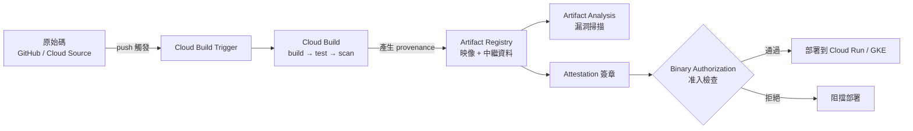

# Section 2 — 建置與測試應用（~23%）

> [!abstract] 這一節在考什麼
> **開發者的日常工具鏈。** 三個子範圍：`2.1 開發環境`、`2.2 建置`、`2.3 測試`。
> 官方條目很少（只有 7 條），但**投報率最高**：考點固定、答案明確，讀一次就能拿分。
> 2026 版在這裡新增了大量 **AI 輔助開發** 內容（Gemini Code Assist、Cloud Assist、MCP server），是最容易被舊考古題漏掉的區域。

---

## 2.1 設定開發環境

| 官方考點 | 對應筆記 | 一句話重點 |
|---|---|---|
| 用 gcloud CLI **模擬（emulate）** Google Cloud 服務，做本地開發與單元測試 | [[開發環境 Cloud Code Shell Workstations 與 AI 工具]] | 記住有 emulator 的服務清單：Firestore / Datastore / Pub/Sub / Bigtable / Spanner |
| 使用 Console、Cloud SDK、**Cloud Code**、**Gemini Cloud Assist**、**Cloud Shell**、**Cloud Workstations** | [[開發環境 Cloud Code Shell Workstations 與 AI 工具]] | Cloud Shell = 臨時免費；Workstations = 團隊級、可自訂、在你的 VPC 裡 |
| 設定 IDE 整合（Cloud SDK、AI 工具：coding assistant、**MCP server**） | [[開發環境 Cloud Code Shell Workstations 與 AI 工具]] | Cloud Code 讓你在 IDE 內直接部署/除錯 Cloud Run 與 GKE |

> [!tip] 模擬器的考點
> 題目常問：「如何在**沒有雲端連線/不產生費用**的情況下跑整合測試？」→ 答案是 **emulator**。
> 反向陷阱：**Cloud Storage 沒有官方 emulator**（實務上用第三方 fake-gcs-server 或專用測試 bucket）；BigQuery 也沒有官方 emulator。

---

## 2.2 建置

| 官方考點 | 對應筆記 | 一句話重點 |
|---|---|---|
| 用 **Cloud Build** 與 **Artifact Registry** 從原始碼建置並儲存容器 | [[Cloud Build]]、[[Artifact Registry]] | `gcloud builds submit` / 觸發器 / `cloudbuild.yaml` |
| 在 Cloud Build 設定 **provenance**（配合 Binary Authorization） | [[Cloud Build]]、[[供應鏈安全 Artifact Analysis 與 Binary Authorization]] | provenance = 建置來源的可驗證紀錄（SLSA），是 Binary Auth 的依據 |

### 🎯 2.2 必記流程

---

## 2.3 測試

| 官方考點 | 對應筆記 | 一句話重點 |
|---|---|---|
| **借助 AI coding assistant 撰寫單元測試** | [[開發環境 Cloud Code Shell Workstations 與 AI 工具]] | 2026 新增：Gemini Code Assist 產生測試、補齊邊界案例 |
| 在 **Cloud Build 中執行自動化整合測試** | [[Cloud Build]] | 用額外的 build step 跑測試；失敗就中斷 pipeline（fail fast） |

### 🎯 測試金字塔對應 Google Cloud
| 層級 | 測什麼 | 在 Google Cloud 上怎麼做 |
|---|---|---|
| 單元測試 | 單一函式/類別，無外部依賴 | 本地 + **emulator**；在 Cloud Build 的第一個 step |
| 整合測試 | 服務與資料庫/訊息的互動 | Cloud Build step + emulator，或部署到**測試專案**後測 |
| 合約測試 | API 介面相容性 | OpenAPI / protobuf 檢查；API Gateway 設定驗證 |
| 端對端測試 | 完整使用者流程 | 部署到 staging（Cloud Run `--no-traffic` + tag URL），跑 E2E 後才切流量 |
| 負載測試 | 擴充行為、上限 | 對 staging 打壓測，觀察 HPA / Cloud Run 擴充曲線 |
| 生產驗證 | 真實流量下的健康 | canary + SLO 監控（見 [[Cloud Monitoring 與 SLO]]） |

> [!important] Cloud Run 的 `--no-traffic` + `--tag` 是這一節的隱形考點
> 部署新 revision 但不給流量，再用 tag 專屬 URL 做 E2E 測試 → 測過才 `gcloud run services update-traffic`。
> 題目關鍵詞：`test the new version in production environment without affecting users`。詳見 [[Cloud Run]]。

---

## ✍️ Section 2 自我檢核

1. 你要在 CI 裡測試一段「寫入 Firestore 然後發 Pub/Sub」的程式碼，不想花錢也不想連雲端 → 怎麼做？哪些服務辦不到？
2. `cloudbuild.yaml` 裡的多個 step，預設是循序還是平行？怎麼讓兩個 step 平行跑？
3. Cloud Build 建置很慢，有哪三種加速手段？
4. Cloud Shell 與 Cloud Workstations 的差別？什麼情況一定要用後者？
5. 如何確保「只有經過 CI 建置且通過掃描的映像」才能部署到 GKE？需要哪幾個服務？
6. 在 Cloud Run 上，如何在真實環境驗證新版本而不影響任何使用者？

## 🔗 相關

- [[Section 1 設計可擴充安全可靠的雲端原生應用]]
- [[Section 3 設定雲端原生應用的部署]]
- [[情境題 Section 2 與 3]]
- [[Lab 04 CI CD Cloud Build Artifact Registry Cloud Deploy]]
- [[00 服務索引]]
