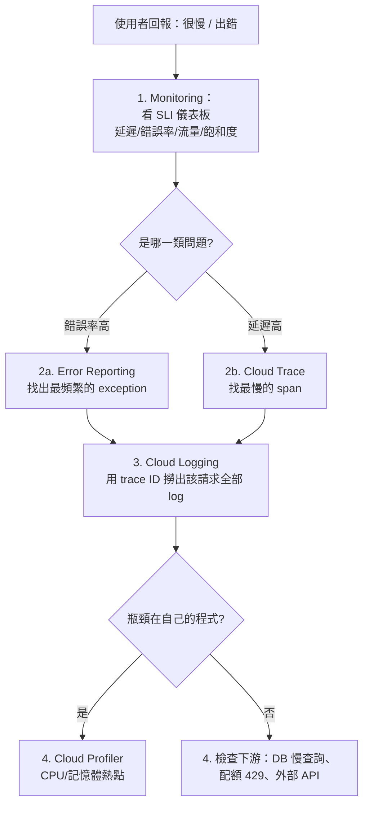

# Section 4 — 整合應用與 Google Cloud 服務（~21%）

> [!abstract] 這一節在考什麼
> **寫程式的那一面。** 三個子範圍：`4.1 資料與儲存整合`、`4.2 使用 Cloud API`、`4.3 疑難排解與可觀測性`。
> 這是全卷最「程式碼」的一節：連線管理、用戶端程式庫、分頁、退避重試、trace 關聯。
> 很多人低估 4.3（可觀測性），但它幾乎每份考卷都有 4～6 題。

---

## 4.1 整合應用與資料及儲存服務

| 官方考點 | 對應筆記 | 一句話重點 |
|---|---|---|
| 管理到各種資料儲存的**連線**（Cloud SQL、Firestore、Cloud Storage） | [[Cloud SQL 與 AlloyDB]]、[[Firestore]]、[[Cloud Storage]] | serverless 的連線爆炸問題 → 連線池 + 上限控制 |
| 讀寫各種 Google Cloud 資料來源 | [[Cloud API 呼叫最佳實務]]、[[程式碼片段 Python Node Go]] | 一律用 **Cloud Client Libraries**，不要手刻 REST |
| 用訊息服務發布與消費資料 | [[Pub Sub]]、[[Cloud Tasks]]、[[韌性模式 重試 冪等 退避 斷路器]] | 消費端必須冪等 |

### 🎯 4.1 的頭號考點：連線管理
> [!warning] Serverless + 關聯式資料庫 = 連線數陷阱
> Cloud Run 擴到 100 個實例 × 每個 10 條連線 = 1000 條，遠超 Cloud SQL 上限 → 連線被拒。
>
> **解法組合（考試愛問）：**
> 1. 每個實例用**小的連線池**（例如 max 2～5），並**在全域範圍重用用戶端**（不要每個請求 new 一個）
> 2. 限制 `--max-instances`
> 3. 用 **Cloud SQL Auth Proxy / Connector** 管理連線與 TLS
> 4. 高扇出場景改用 **PgBouncer** 或 AlloyDB 的連線管理
> 5. 能改的話，把讀取分流到 **read replica** 或加 [[Memorystore 與快取策略]]

```python
# ✅ 正確：用戶端在全域建立一次，跨請求重用
from google.cloud import firestore
db = firestore.Client()          # 模組載入時建立，實例生命週期內重用

def handler(request):
    return db.collection("orders").document(request.args["id"]).get().to_dict()

# ❌ 錯誤：每次請求都建立用戶端（浪費連線與握手成本）
def bad_handler(request):
    db = firestore.Client()      # 每個請求都重新建立
    ...
```

---

## 4.2 使用 Google Cloud API

| 官方考點 | 對應筆記 | 一句話重點 |
|---|---|---|
| **啟用** Google Cloud 服務 | [[Cloud API 呼叫最佳實務]] | `gcloud services enable run.googleapis.com`；沒啟用會回 403 SERVICE_DISABLED |
| 用支援的方式呼叫 API（Cloud Client Libraries、REST、gRPC、API Explorer） | [[Cloud API 呼叫最佳實務]]、[[API 設計 REST 與 gRPC]] | 優先序：Client Library > gRPC > REST |
| ↳ **批次（batching）請求** | [[Cloud API 呼叫最佳實務]] | 減少往返；注意批次內單筆失敗的處理 |
| ↳ **限制回傳資料**（欄位遮罩） | [[Cloud API 呼叫最佳實務]] | `fields` / `FieldMask` → 省頻寬與延遲 |
| ↳ **分頁**結果 | [[Cloud API 呼叫最佳實務]] | `pageToken` / iterator；不要一次拉全部 |
| ↳ **快取**結果 | [[Memorystore 與快取策略]] | 讀多寫少的中繼資料最值得快取 |
| ↳ **錯誤處理（指數退避）** | [[韌性模式 重試 冪等 退避 斷路器]] | 只重試可重試錯誤（429/503/504），加 jitter |
| 用**服務帳戶**呼叫 Cloud API | [[IAM 與服務帳戶]]、[[驗證與授權 ADC OAuth JWT]] | ADC + 附加 SA，不要金鑰檔案 |

### 🎯 4.2 的錯誤碼判斷表（考試常直接給錯誤碼）
| 錯誤 | 意義 | 該做什麼 |
|---|---|---|
| `400 INVALID_ARGUMENT` | 請求本身錯 | **不要重試**，修程式 |
| `401 UNAUTHENTICATED` | 沒有有效憑證 | 檢查 ADC / token |
| `403 PERMISSION_DENIED` | 有身分但缺角色 | 補 IAM 角色（不是改 token） |
| `403 SERVICE_DISABLED` | API 沒啟用 | `gcloud services enable` |
| `404 NOT_FOUND` | 資源不存在 | 不要重試 |
| `409 ALREADY_EXISTS` / `ABORTED` | 衝突（樂觀鎖失敗） | ABORTED 可重試整個交易 |
| `429 RESOURCE_EXHAUSTED` | 超過配額/速率 | **指數退避重試** + 申請提額 |
| `499 CANCELLED` | 用戶端取消 | 檢查 timeout 設定 |
| `500 / 503 UNAVAILABLE` | 暫時性故障 | **指數退避重試**（冪等操作才安全） |
| `504 DEADLINE_EXCEEDED` | 超時 | 退避重試 + 檢查 timeout/分頁大小 |

---

## 4.3 疑難排解與可觀測性

| 官方考點 | 對應筆記 | 一句話重點 |
|---|---|---|
| 用 metrics / logs / traces 對程式碼做 instrumentation | [[OpenTelemetry 與 Trace 關聯]]、[[Cloud Logging]]、[[Cloud Monitoring 與 SLO]] | OpenTelemetry 是官方推薦的統一做法 |
| 用 Google Cloud Observability 找出並解決問題 | [[Cloud Monitoring 與 SLO]]、[[Cloud Trace Profiler 與 Error Reporting]] | 從症狀（SLI 違反）→ trace → log → profile |
| 用 **Error Reporting** 管理應用問題 | [[Cloud Trace Profiler 與 Error Reporting]] | 自動把相同 stack trace 聚合成一個「issue」 |
| 用 **trace ID 關聯跨服務的 span** | [[OpenTelemetry 與 Trace 關聯]] | 傳播 `traceparent` / `X-Cloud-Trace-Context`；log 要帶 `logging.googleapis.com/trace` |
| 使用 **AI 輔助的可觀測性** | [[Cloud Monitoring 與 SLO]] | 2026 新增：Gemini Cloud Assist 做根因推測與查詢生成 |

### 🎯 4.3 的排查順序（考題常問「你會先做什麼」）


> [!important] 黃金訊號（Four Golden Signals）
> **延遲 / 流量 / 錯誤 / 飽和度**。題目問「該監控什麼」時，答案幾乎都落在這四個裡，而不是 CPU 使用率本身。

---

## ✍️ Section 4 自我檢核

1. Cloud Run 服務連 Cloud SQL 偶發 `too many connections`，列出 4 個可行的修法。
2. 呼叫 Cloud API 收到 `429`，你的重試策略要包含哪三個元素？收到 `400` 呢？
3. 要列出某 bucket 裡 500 萬個物件的名稱，程式要怎麼寫才不會 OOM？
4. 一個請求經過 API Gateway → Cloud Run A → Pub/Sub → Cloud Run B，如何在 Logging 裡一次撈出這條鏈的所有 log？
5. Error Reporting 沒有收到你的例外，可能的原因有哪些？
6. 什麼時候該用 log-based metric 而不是自訂指標？

## 🔗 相關

- [[Section 1 設計可擴充安全可靠的雲端原生應用]]
- [[Section 2 建置與測試應用]]
- [[Section 3 設定雲端原生應用的部署]]
- [[情境題 Section 4]]
- [[Lab 06 可觀測性 OpenTelemetry Trace 與 SLO]]
- [[00 服務索引]]
