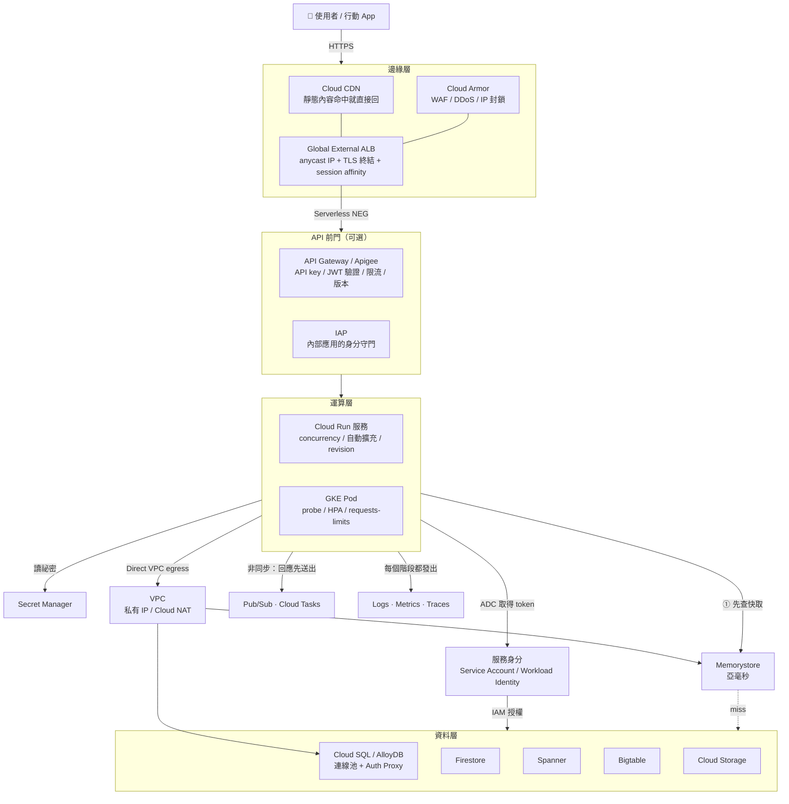
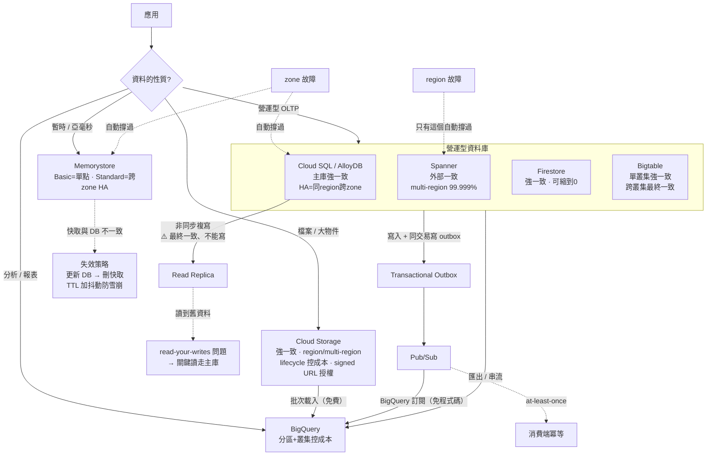
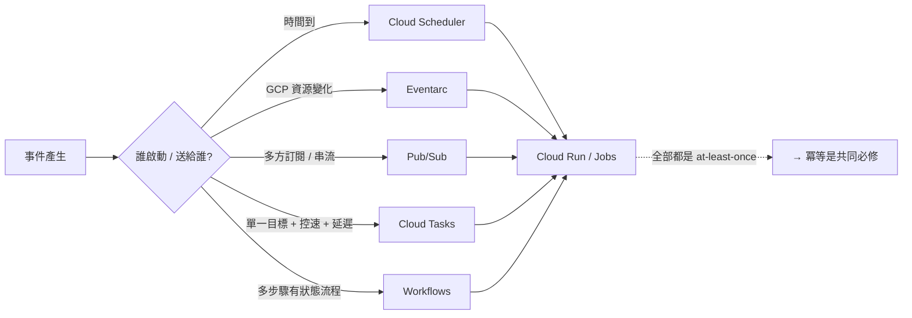
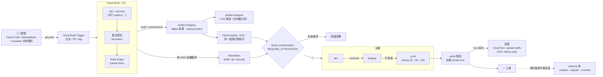
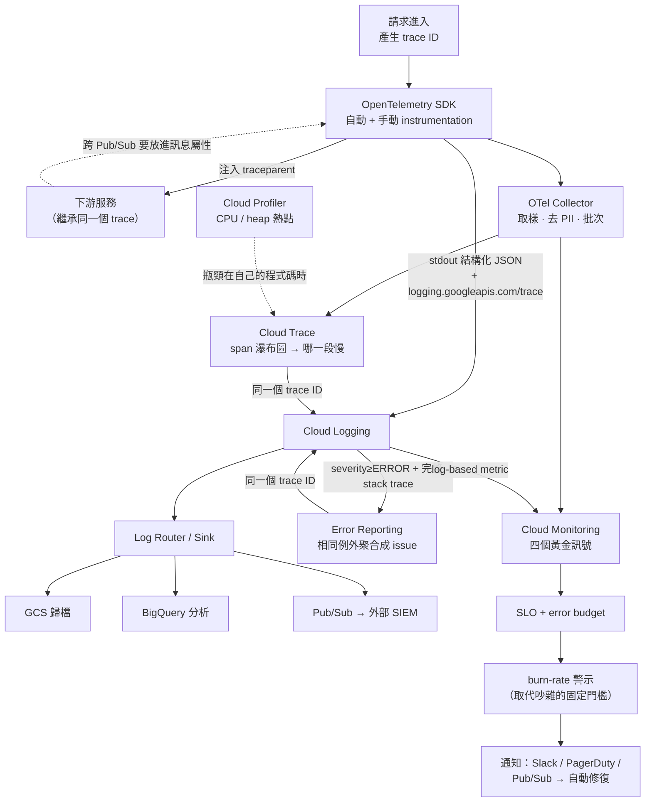

# 00 技術關聯地圖

> [!abstract] 這篇跟 [[00 服務索引]] 差在哪
> **服務索引回答「有哪些服務」（分類清單）；這篇回答「它們怎麼串在一起」（資料流與依賴）。**
> 四條主線串起整個雲端原生系統。每個節點都可以點進去看細節。
>
> 🎯 **考前用法**：閉卷把這四張圖畫出來。畫不出來的地方就是你的架構盲區。

---

## ① 一個請求的完整生命週期

從使用者按下按鈕，到資料寫進資料庫再回來，中間經過的每一層。



**這張圖要能回答的問題**
| 問題 | 相關筆記 |
|---|---|
| TLS 在哪裡終結？誰負責憑證？ | [[Load Balancing 與 Session Affinity]] |
| 要驗證「呼叫方是誰」有幾層可以做？ | [[API 管理 Apigee 與 API Gateway]]、[[IAP Identity Platform 與 Web Security Scanner]]、[[驗證與授權 ADC OAuth JWT]] |
| 程式碼怎麼「知道自己是誰」？ | [[IAM 與服務帳戶]]、[[驗證與授權 ADC OAuth JWT]] |
| 為什麼 Cloud Run 連 Memorystore 一定要經過 VPC？ | [[VPC 連線 Serverless VPC Access 與 Direct VPC Egress]] |
| 一個實例能同時處理幾個請求？這怎麼決定成本？ | [[Cloud Run]]、[[成本與資源最佳化]] |
| 回應送出後還能做事嗎？ | [[Cloud Run]]、[[Cloud Tasks]] |

---

## ② 資料層的依賴、一致性與容錯

「這份資料放哪裡、壞掉時影響多大、讀到的是不是最新的。」



**這張圖要能回答的問題**
| 問題 | 相關筆記 |
|---|---|
| 五個資料庫怎麼選？關鍵詞是什麼？ | [[決策樹 資料庫選型]] |
| 哪些服務的複寫是最終一致的？會造成什麼症狀？ | [[一致性 交易與資料複寫]] |
| zone 故障 vs region 故障，各要什麼配置？ | [[地理分布 區域與可用區設計]] |
| 「資料存了就一定要發出事件」怎麼保證？ | [[一致性 交易與資料複寫]]（outbox） |
| 快取與資料庫不一致怎麼處理？ | [[Memorystore 與快取策略]] |
| 事件重複送達會怎樣？怎麼防？ | [[韌性模式 重試 冪等 退避 斷路器]] |

### 非同步串接的四個工具（同一層，不同用途）

→ 判準見 [[決策樹 訊息與事件選型]]

---

## ③ 從 commit 到上線的交付鏈

每一個箭頭都是一道可以插入檢查的關卡。



**這張圖要能回答的問題**
| 問題 | 相關筆記 |
|---|---|
| Cloud Build 與 Cloud Deploy 的分工？ | [[Cloud Build]]、[[Cloud Deploy 與部署策略]] |
| 為什麼部署要用 digest 不是 tag？ | [[供應鏈安全 Artifact Analysis 與 Binary Authorization]] |
| 「不能跳過測試直接上生產」怎麼用技術保證？ | [[供應鏈安全 Artifact Analysis 與 Binary Authorization]] |
| CI 要用什麼身分部署？最常漏的權限是什麼？ | [[Cloud Build]]（actAs）、[[IAM 與服務帳戶]] |
| 外部 CI（GitHub Actions）怎麼免金鑰部署？ | [[Workload Identity Federation]] |
| 五種部署策略怎麼選？回滾有幾層？ | [[Cloud Deploy 與部署策略]] |
| 本地怎麼測試而不連雲端？ | [[開發環境 Cloud Code Shell Workstations 與 AI 工具]] |

---

## ④ 可觀測性的訊號流

一個請求產生三種訊號，三種訊號靠 **trace ID** 縫在一起。



**排查順序（考題愛問「你會先做什麼」）**
```
Monitoring 看 SLI（有問題嗎）
  → Trace 找最慢的 span（在哪裡）
    → Logging 用 trace ID 撈上下文（為什麼）
      → Profiler 找熱點函式（哪一行）
```

**這張圖要能回答的問題**
| 問題 | 相關筆記 |
|---|---|
| 三種訊號各適合放什麼？哪一種不能放高基數資料？ | [[OpenTelemetry 與 Trace 關聯]] |
| trace 關聯的三個必要條件？ | [[OpenTelemetry 與 Trace 關聯]]、[[Cloud Logging]] |
| Error Reporting 抓不到例外的原因？ | [[Cloud Trace Profiler 與 Error Reporting]] |
| 警示太吵怎麼改？ | [[Cloud Monitoring 與 SLO]] |
| log 太貴怎麼省？ | [[Cloud Logging]] |

---

## 🔁 四條主線的交會點

這幾個概念**橫跨多條主線**，也是考試最愛的整合題來源：

| 交會概念 | 出現在哪幾條線 | 核心筆記 |
|---|---|---|
| **服務身分（SA / Workload Identity）** | ①運算→資料、③CI 部署、④送 telemetry | [[IAM 與服務帳戶]] |
| **冪等** | ②資料寫入、非同步串接、③重試部署 | [[韌性模式 重試 冪等 退避 斷路器]] |
| **trace ID** | ①請求穿越所有層、④縫合三種訊號 | [[OpenTelemetry 與 Trace 關聯]] |
| **不可變產出物（digest / revision）** | ③交付鏈、①部署與回滾 | [[Cloud Deploy 與部署策略]] |
| **VPC 私有連線** | ①運算→資料、③private worker pool | [[VPC 連線 Serverless VPC Access 與 Direct VPC Egress]] |
| **向後相容** | ②schema 變更、③漸進式發布、API 版本化 | [[API 設計 REST 與 gRPC]] |
| **成本槓桿** | ①concurrency/實例數、②儲存分層、④log 與指標量 | [[成本與資源最佳化]] |

---

## 🧭 接下來往哪走

| 你想做的事 | 去哪裡 |
|---|---|
| 對著需求選服務 | [[決策樹 運算平台選型]]、[[決策樹 資料庫選型]]、[[決策樹 訊息與事件選型]] |
| 看單一服務的完整細節 | [[00 服務索引]] |
| 動手把上面的圖跑起來 | [[Lab 01 Cloud Run 端到端]] → [[Lab 02 事件驅動 Pub Sub Eventarc Cloud Tasks]] → [[Lab 03 GKE 部署與 HPA]] → [[Lab 04 CI CD Cloud Build Artifact Registry Cloud Deploy]] → [[Lab 05 安全 Secret WIF 與 Binary Authorization]] → [[Lab 06 可觀測性 OpenTelemetry Trace 與 SLO]] |
| 查指令與程式碼 | [[gcloud 速查]]、[[kubectl 與 YAML 速查]]、[[程式碼片段 Python Node Go]] |
| 準備考試 | [[README]] 的應試入口 |

## 🔗 相關

- [[00 服務索引]]
- [[README]]
- [[12-Factor 與雲端原生設計原則]]
- [[決策樹 運算平台選型]]
- [[決策樹 資料庫選型]]
- [[決策樹 訊息與事件選型]]
- [[韌性模式 重試 冪等 退避 斷路器]]
- [[一致性 交易與資料複寫]]
- [[地理分布 區域與可用區設計]]
- [[成本與資源最佳化]]
