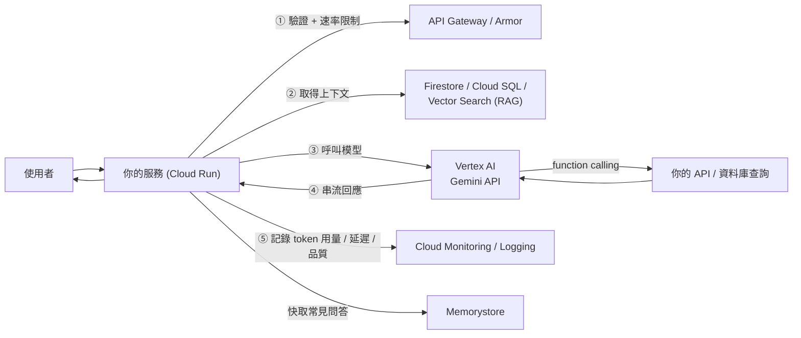

# Vertex AI / Gemini API 給開發者

> [!abstract] 為什麼這篇存在
> 2026 版官方考試指南在角色描述中**新增**：
> 「**整合進階機器學習能力**」、「**負責使用生成式 AI API 打造智慧使用者體驗**」。
> 這是舊考古題完全沒有的區域。考的**不是 ML 理論**，而是**開發者怎麼把 Gen AI 正確地整合進雲端原生應用**。

---

## 🧠 整合心智模型



---

## 🔌 呼叫模型的兩條路

| | **Vertex AI**（`aiplatform.googleapis.com`） | **Gemini Developer API**（AI Studio 金鑰） |
|---|---|---|
| 驗證 | **IAM + ADC / 服務帳戶** ⭐ | API key |
| 適合 | **生產環境、企業**（VPC-SC、CMEK、資料落地、稽核） | 快速原型 |
| 考試偏好 | **Vertex AI**（因為符合 IAM 與最小權限原則） | — |

```python
# Vertex AI + ADC（不需要 API key，見 驗證與授權 筆記）
from google import genai
from google.genai import types

client = genai.Client(vertexai=True, project=PROJECT, location="asia-east1")

resp = client.models.generate_content(
    model="gemini-2.5-flash",
    contents="用三句話摘要這份訂單問題",
    config=types.GenerateContentConfig(
        system_instruction="你是客服助理，只用繁體中文回答。",
        temperature=0.2,          # 低溫度 → 更穩定、更適合抽取/分類
        max_output_tokens=512,
        response_mime_type="application/json",   # 強制結構化輸出
    ),
)
print(resp.text)
```
**需要的角色**：`roles/aiplatform.user`（呼叫模型）。

---

## 🧩 開發者必懂的五個能力

### 1. 串流（streaming）
長回應要用串流，否則使用者要等很久看不到東西。
```python
for chunk in client.models.generate_content_stream(model="gemini-2.5-flash", contents=prompt):
    yield chunk.text            # 以 SSE / chunked 回傳給前端
```
> [!warning] 與 Cloud Run 的互動
> 串流回應時間可能長 → 注意 **請求逾時**（預設 5 分鐘，最長 60 分鐘）與 **並行設定**（LLM 呼叫是 I/O 等待，concurrency 可以較高，但記憶體要夠）。見 [[Cloud Run]]。

### 2. 結構化輸出（structured output）
用 `response_mime_type="application/json"` + JSON schema → **輸出可以直接餵給程式**，不用正則解析。
> 這是把 LLM 接進既有系統最重要的技巧。考點：「如何確保模型輸出能被程式可靠解析」→ **結構化輸出 / JSON schema**。

### 3. Function calling（工具呼叫）
讓模型「決定要呼叫哪個你提供的函式」，由**你的程式碼實際執行**，再把結果回給模型。
```python
get_order = types.FunctionDeclaration(
    name="get_order_status",
    description="查詢訂單狀態",
    parameters={"type": "object", "properties": {"order_id": {"type": "string"}}, "required": ["order_id"]},
)
resp = client.models.generate_content(
    model="gemini-2.5-flash", contents=user_msg,
    config=types.GenerateContentConfig(tools=[types.Tool(function_declarations=[get_order])]),
)
call = resp.candidates[0].content.parts[0].function_call
if call and call.name == "get_order_status":
    result = db.get_order(call.args["order_id"])      # ⚠️ 權限檢查在這裡做，不是交給模型
    # 把 result 回傳給模型產生最終回答
```
> [!danger] 安全原則
> **模型的輸出是「請求」，不是「授權」。** 所有權限檢查、輸入驗證、額度檢查都必須在**你的程式碼**裡做。
> 絕對不要把「模型說可以」當成授權依據 —— 這是 prompt injection 的主要風險。

### 4. Grounding 與 RAG
| 做法 | 說明 |
|---|---|
| **Grounding with Google Search** | 讓回答基於搜尋結果，降低幻覺 |
| **Grounding with your data** | 接 Vertex AI Search / 你的資料來源 |
| **RAG（embedding + 向量檢索）** | 用 embedding 模型把文件向量化 → 存 **Vertex AI Vector Search**（或 AlloyDB/Spanner 的向量欄位）→ 查詢時取回最相關片段塞進 prompt |

```python
emb = client.models.embed_content(model="text-embedding-005", contents=["訂單退款政策..."])
# 把向量存到 Vector Search / AlloyDB pgvector，查詢時取 top-k 當上下文
```
> 考點：「模型回答公司內部政策時會亂講」→ **RAG / grounding**（不是 fine-tuning，除非是要改變風格或格式）。

### 5. 安全設定與內容過濾
- **Safety settings**：可調各類別（騷擾、仇恨、危險、露骨）的阻擋門檻。
- **系統指示（system instruction）**：定義角色與邊界。
- **輸入/輸出檢查**：自己也要驗證（長度、格式、是否含 PII）。

---

## 💰 成本與效能（開發者最該注意的）

| 議題 | 做法 |
|---|---|
| **模型選擇** | 便宜快速的（Flash 類）處理分類/摘要；貴而強的（Pro 類）處理複雜推理 → **不要所有請求都用最大模型** |
| **Token 是成本單位** | 精簡 prompt、限制 `max_output_tokens`、避免把整份文件塞進 context |
| **快取** | 相同/相似請求用 [[Memorystore 與快取策略]] 快取回應；長 prompt 用 **context caching** |
| **批次** | 非即時需求用批次預測，成本較低 |
| **監控** | 把 **token 用量、延遲、錯誤率、被過濾率** 送到 [[Cloud Monitoring 與 SLO]] |
| **配額與重試** | `429 RESOURCE_EXHAUSTED` 要**指數退避**（見 [[韌性模式 重試 冪等 退避 斷路器]]） |
| **逾時** | LLM 呼叫慢 → 設定合理 timeout、提供降級回應（fallback） |

> [!important] 把 Gen AI 當「一個慢、貴、會失敗的外部 API」來設計
> 這句話涵蓋了所有考點：**要有 timeout、重試、斷路器、快取、降級、監控**。
> 也就是 [[韌性模式 重試 冪等 退避 斷路器]] 的全部內容都適用。

---

## 🎯 考點速記

| 看到題目說… | 就想到 |
|---|---|
| `add generative AI to an app, enterprise controls` | **Vertex AI**（IAM/ADC，不是 API key） |
| `model output must be parseable by code` | **結構化輸出（JSON schema）** |
| `model should query our internal system` | **Function calling**（權限檢查在你的程式碼） |
| `answers must be based on our documents` | **RAG / grounding**（不是 fine-tuning） |
| `reduce hallucination` | grounding + 低 temperature + 結構化輸出 |
| `long responses, better UX` | **串流** |
| `reduce cost` | 小模型 + 精簡 prompt + **快取** + 批次 |
| `429 from the model API` | **指數退避** + 配額提升 |
| `monitor AI feature health` | 自訂指標：token 用量、延遲、錯誤、被過濾率 |
| `prompt injection 風險` | 不信任模型輸出；權限與驗證在程式碼裡 |
| `sensitive data must not leave the region` | Vertex AI 的 **region 選擇**（+ VPC-SC / CMEK） |

## 💣 真實場景陷阱

1. **把 API key 放前端**：直接被盜用。呼叫一律經過你的後端。
2. **信任模型輸出去執行動作**（如 SQL、刪除資料）：必須白名單化與參數化。
3. **沒有 timeout 與降級**：模型慢 → 整個請求卡住 → 使用者體驗崩壞。
4. **把整份 PDF 塞進 prompt**：token 爆炸且效果反而差 → 用 RAG 取相關片段。
5. **同步等待長生成**：改用串流或非同步（[[Cloud Tasks]] + 通知）。
6. **沒有監控 token 成本**：月底帳單驚喜。
7. **以為要 fine-tuning**：多數「答案不對」的問題是**上下文不足（要 RAG）**或 **prompt 不好**，不是模型能力問題。

## ✍️ 自我檢核

1. Vertex AI 與 Gemini Developer API 的驗證差異？生產環境該選哪個、為什麼？
2. 如何確保模型輸出能被程式可靠解析？
3. Function calling 的執行流程？權限檢查該在哪一步做？
4. 「回答必須基於公司文件」該用什麼技術？為什麼不是 fine-tuning？
5. 把 Gen AI 整合進服務時，哪五個韌性機制是必要的？
6. 控制 Gen AI 成本的四個具體做法？
7. Cloud Run 上跑串流 LLM 回應，要注意哪兩個設定？

## 🔗 相關

- [[Cloud Run]]
- [[韌性模式 重試 冪等 退避 斷路器]]
- [[Memorystore 與快取策略]]
- [[Cloud Monitoring 與 SLO]]
- [[BigQuery 給開發者]]
- [[API 管理 Apigee 與 API Gateway]]
- [[IAM 與服務帳戶]]
- [[開發環境 Cloud Code Shell Workstations 與 AI 工具]]
- [[Cloud API 呼叫最佳實務]]
- [[Section 1 設計可擴充安全可靠的雲端原生應用]]
