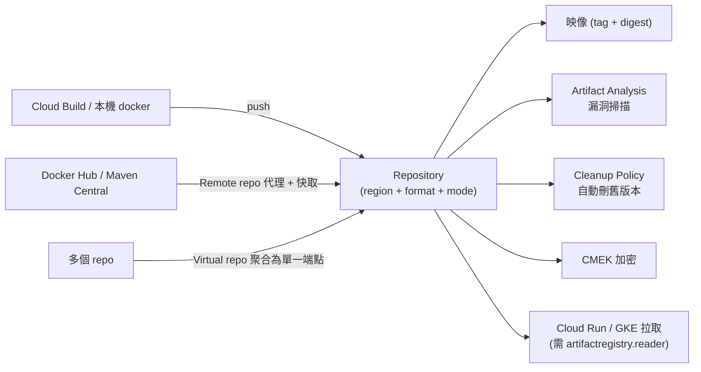

# Artifact Registry

> [!abstract] 一句話定位
> **Google Cloud 的產出物倉庫**：容器映像 + 語言套件（Maven/npm/Python/Go/apt/yum）+ Helm chart，全部在一個服務裡。
> 它**取代了舊的 Container Registry (gcr.io)** — 考試中若同時出現兩者，選 Artifact Registry。

---

## 🧠 核心概念



| 概念 | 說明 |
|---|---|
| **Repository** | 最小管理單位：有 **location（region/multi-region）**、**format**、**mode**、獨立 IAM |
| **Format** | `DOCKER`、`MAVEN`、`NPM`、`PYTHON`、`GO`、`APT`、`YUM`、`KUBEFLOW`、`GENERIC` |
| **Mode: Standard** | 你自己推上去的 |
| **Mode: Remote** | **代理並快取**外部倉庫（Docker Hub、Maven Central、PyPI）→ 避免上游速率限制與可用性風險 |
| **Mode: Virtual** | 把多個 repo（含 remote）聚合成**單一端點**，有優先序 → 使用者只要記一個網址 |
| **Cleanup policy** | 依條件自動刪除（保留最新 N 個、刪除超過 N 天的未標記版本） |
| **不可變 tag（immutable tags）** | 禁止重新指向已存在的 tag → 保證可重現 |

---

## ⚙️ 常用操作

```bash
# 建立 Docker 倉庫
gcloud artifacts repositories create apps \
  --repository-format=docker --location=asia-east1 \
  --description="application images" \
  --kms-key=projects/$PROJECT/locations/asia-east1/keyRings/ar/cryptoKeys/ar-key   # CMEK

# 設定 docker 驗證
gcloud auth configure-docker asia-east1-docker.pkg.dev

# 推送
IMG=asia-east1-docker.pkg.dev/$PROJECT/apps/api:$(git rev-parse --short HEAD)
docker build -t $IMG . && docker push $IMG

# Remote repo：代理 Docker Hub（避免 rate limit）
gcloud artifacts repositories create dockerhub-remote \
  --repository-format=docker --location=asia-east1 \
  --mode=remote-repository --remote-repo-config-desc="Docker Hub" \
  --remote-docker-repo=DOCKER-HUB

# 清理政策
gcloud artifacts repositories set-cleanup-policies apps \
  --location=asia-east1 --policy=cleanup.json

# 查詢漏洞
gcloud artifacts docker images list-vulnerabilities \
  asia-east1-docker.pkg.dev/$PROJECT/apps/api@sha256:abc...

# 不可變 tag
gcloud artifacts repositories update apps --location=asia-east1 --immutable-tags
```

```json
// cleanup.json：保留最新 10 個 tag 版本，刪除 30 天以上的未標記版本
[
  {
    "name": "keep-recent",
    "action": {"type": "Keep"},
    "mostRecentVersions": {"keepCount": 10}
  },
  {
    "name": "delete-old-untagged",
    "action": {"type": "Delete"},
    "condition": {"tagState": "UNTAGGED", "olderThan": "30d"}
  }
]
```

---

## 🔐 權限與安全

| 角色 | 用於 |
|---|---|
| `roles/artifactregistry.reader` | **拉取**（Cloud Run 的服務代理、GKE 節點 SA 需要） |
| `roles/artifactregistry.writer` | 推送（Cloud Build SA） |
| `roles/artifactregistry.admin` | 管理 repo |

> [!warning] `ImagePullBackOff` 的第一嫌疑
> GKE 節點的服務帳戶（Standard 叢集預設是 compute default SA）缺 `artifactregistry.reader`，或跨專案拉取沒授權。
> **跨專案**時要在 repo 上授權對方專案的節點 SA / Cloud Run 服務代理。

**其他安全要點**
- **同 region 存放**：映像與運算同 region → 拉取快、無跨區流量費。
- **CMEK**：可用自己的金鑰加密 repo（見 [[Secret Manager 與 Cloud KMS]]）。
- **漏洞掃描**：on-push + 持續分析（見 [[供應鏈安全 Artifact Analysis 與 Binary Authorization]]）。
- **VPC-SC**：可納入資料邊界。

---

## 🎯 考點速記

| 看到題目說… | 就想到 |
|---|---|
| `store container images on Google Cloud` | **Artifact Registry**（不是 Container Registry） |
| `also store npm / Maven / Python packages` | Artifact Registry（多格式） |
| `avoid Docker Hub rate limits / 上游不可用` | **Remote repository**（代理 + 快取） |
| `one URL for internal and external packages` | **Virtual repository** |
| `automatically delete old images` | **Cleanup policy** |
| `guarantee a tag never changes` | **Immutable tags**（或一律用 digest） |
| `scan images for CVEs automatically` | Artifact Analysis（在 AR 上啟用） |
| `encrypt the registry with our own key` | **CMEK** |
| `GKE 拉不到映像` | 節點 SA 缺 **`artifactregistry.reader`** |
| `多 region 部署要降低拉取延遲` | 各 region 建 repo，或用 multi-region repo |

## 💣 真實場景陷阱

1. **repo 與叢集不同 region**：拉映像慢且有跨區費用。
2. **只用 `:latest`**：無法追溯、rollback 困難、Binary Auth 不接受。
3. **沒有 cleanup policy**：映像無限累積，儲存費用與漏洞殘留。
4. **跨專案權限沒開**：CI 在 A 專案建置、部署到 B 專案，拉取失敗。
5. **仍在用 `gcr.io`**：Container Registry 已被取代，遷移到 Artifact Registry。
6. **把敏感資料烤進映像**（`.env`、金鑰檔）：映像是可被 pull 的產出物。祕密走 [[Secret Manager 與 Cloud KMS]]。

## ✍️ 自我檢核

1. Standard / Remote / Virtual 三種 mode 各解決什麼問題？
2. GKE `ImagePullBackOff` 最常見的權限原因？該補什麼角色給誰？
3. 為什麼不該用 `:latest` 部署？至少說三個理由。
4. cleanup policy 能做什麼？為什麼重要？
5. Artifact Registry 與 Container Registry 的關係？考試該選哪個？
6. 映像 repo 的 location 選擇會影響什麼？

## 🔗 相關

- [[Cloud Build]]
- [[供應鏈安全 Artifact Analysis 與 Binary Authorization]]
- [[Cloud Deploy 與部署策略]]
- [[Cloud Run]]
- [[GKE 基礎與 Autopilot]]
- [[Secret Manager 與 Cloud KMS]]
- [[IAM 與服務帳戶]]
- [[Lab 04 CI CD Cloud Build Artifact Registry Cloud Deploy]]
- [[Section 2 建置與測試應用]]
