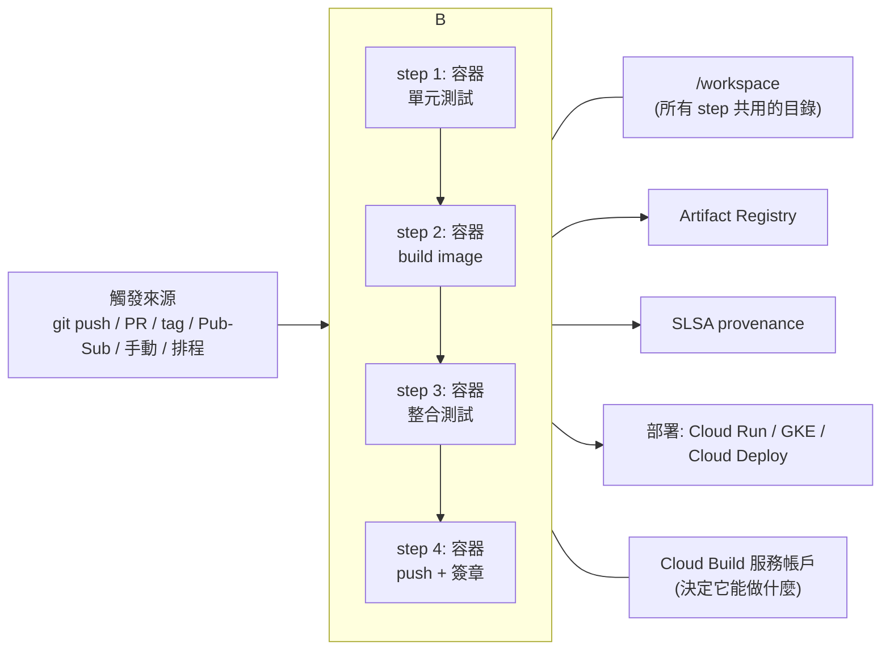

# Cloud Build

> [!abstract] 一句話定位
> **無伺服器 CI/CD 引擎，每個步驟就是一個容器。** 官方 Section 2.2 兩條考點都在這裡：
> **「用 Cloud Build 與 Artifact Registry 從原始碼建置並儲存容器」** 與 **「在 Cloud Build 設定 provenance」**；
> Section 2.3 還有 **「在 Cloud Build 執行自動化整合測試」**。

---

## 🧠 心智模型



**兩個必懂概念**
1. **每個 step 是一個容器**（`name:` 就是映像）。要用什麼工具，就用含那個工具的映像。
2. **`/workspace` 是唯一共用的目錄**。step 之間傳遞檔案靠它；環境變數**不會**跨 step 保留。

---

## 📝 `cloudbuild.yaml` 完整範例

```yaml
substitutions:
  _REGION: asia-east1
  _REPO: apps
  _SERVICE: api

steps:
  # ① 單元測試（失敗就中斷整個 build — fail fast）
  - id: unit-test
    name: python:3.12
    entrypoint: bash
    args: ['-c', 'pip install -q -r requirements.txt && pytest -q tests/unit']

  # ② 建置映像（用 kaniko 或 docker；--cache 加速）
  - id: build
    name: gcr.io/cloud-builders/docker
    args:
      - build
      - '--cache-from=${_REGION}-docker.pkg.dev/$PROJECT_ID/${_REPO}/${_SERVICE}:latest'
      - '-t'
      - '${_REGION}-docker.pkg.dev/$PROJECT_ID/${_REPO}/${_SERVICE}:$SHORT_SHA'
      - '-t'
      - '${_REGION}-docker.pkg.dev/$PROJECT_ID/${_REPO}/${_SERVICE}:latest'
      - '.'
    waitFor: ['unit-test']

  # ③ 推送
  - id: push
    name: gcr.io/cloud-builders/docker
    args: ['push', '--all-tags', '${_REGION}-docker.pkg.dev/$PROJECT_ID/${_REPO}/${_SERVICE}']

  # ④ 整合測試：用模擬器 + 剛建好的映像（Section 2.3 考點）
  - id: integration-test
    name: ${_REGION}-docker.pkg.dev/$PROJECT_ID/${_REPO}/${_SERVICE}:$SHORT_SHA
    entrypoint: bash
    env: ['FIRESTORE_EMULATOR_HOST=localhost:8080', 'PUBSUB_EMULATOR_HOST=localhost:8085']
    args: ['-c', 'pytest -q tests/integration']
    waitFor: ['push']

  # ⑤ 取得祕密（用 availableSecrets，不要硬寫）
  - id: notify
    name: gcr.io/cloud-builders/curl
    secretEnv: ['SLACK_HOOK']
    entrypoint: bash
    args: ['-c', 'curl -s -X POST "$$SLACK_HOOK" -d "{\"text\":\"built $SHORT_SHA\"}"']

  # ⑥ 部署（Cloud Build SA 需要 run.developer + actAs 執行時 SA）
  - id: deploy
    name: gcr.io/google.com/cloudsdktool/cloud-sdk
    entrypoint: gcloud
    args:
      - run
      - deploy
      - ${_SERVICE}
      - '--image=${_REGION}-docker.pkg.dev/$PROJECT_ID/${_REPO}/${_SERVICE}:$SHORT_SHA'
      - '--region=${_REGION}'
      - '--service-account=api-sa@$PROJECT_ID.iam.gserviceaccount.com'
      - '--no-allow-unauthenticated'

availableSecrets:
  secretManager:
    - versionName: projects/$PROJECT_ID/secrets/slack-hook/versions/latest
      env: SLACK_HOOK

images:                       # 宣告產出物 → 自動推送並記錄
  - '${_REGION}-docker.pkg.dev/$PROJECT_ID/${_REPO}/${_SERVICE}:$SHORT_SHA'

options:
  logging: CLOUD_LOGGING_ONLY
  machineType: E2_HIGHCPU_8   # 加速建置
  requestedVerifyOption: VERIFIED   # 產生 provenance

timeout: 1200s
```

### 內建替代變數（**會考**）
| 變數 | 內容 |
|---|---|
| `$PROJECT_ID` | 專案 ID |
| `$BUILD_ID` | 建置 ID |
| `$COMMIT_SHA` / `$SHORT_SHA` | 完整 / 短 commit SHA ⭐ 用來當映像 tag |
| `$BRANCH_NAME` / `$TAG_NAME` | 分支 / git tag |
| `$REVISION_ID` | 版本 |
| `$_XXX` | 使用者自訂的 substitution |

> [!tip] 映像 tag 的最佳實務
> 用 **`$SHORT_SHA` 或 digest** 當主要識別，不要只用 `:latest`。
> 原因：可追溯、可重現、**Binary Authorization 需要 digest**（見 [[供應鏈安全 Artifact Analysis 與 Binary Authorization]]）。

---

## ⚡ 加速建置的四招（考題常問）

| 方法 | 說明 |
|---|---|
| **平行化步驟** | `waitFor: ['-']` 表示不等任何步驟 → 立即開始。沒設 `waitFor` 則預設**循序**執行 |
| **快取** | Docker `--cache-from`、kaniko 的 `--cache=true`、或把依賴快取存 GCS |
| **更大的機器** | `options.machineType: E2_HIGHCPU_8` / `E2_HIGHCPU_32` |
| **精簡 Dockerfile** | 多階段建置、把不常變的層放前面（善用 layer cache） |

```yaml
steps:
  - id: lint
    name: node:20
    args: ['npx', 'eslint', '.']
    waitFor: ['-']          # 與 test 平行
  - id: test
    name: node:20
    args: ['npm', 'test']
    waitFor: ['-']
  - id: build
    name: gcr.io/cloud-builders/docker
    args: [...]
    waitFor: ['lint', 'test']   # 兩者都完成才建置
```

---

## 🔔 觸發器（Triggers）

```bash
# push 到 main 就建置
gcloud builds triggers create github \
  --name=deploy-main --repo-owner=ChunPingWang --repo-name=my-app \
  --branch-pattern='^main$' --build-config=cloudbuild.yaml

# PR 觸發（只跑測試，不部署）
gcloud builds triggers create github \
  --name=pr-check --repo-owner=ChunPingWang --repo-name=my-app \
  --pull-request-pattern='.*' --build-config=cloudbuild.test.yaml \
  --comment-control=COMMENTS_ENABLED

# tag 觸發（發版）
gcloud builds triggers create github --tag-pattern='^v.*'  ...
```
| 觸發類型 | 用途 |
|---|---|
| 分支 push | 持續整合/部署 |
| Pull request | PR 檢查（只測試） |
| Tag | 正式發版 |
| **手動 + 核准（approval）** | 生產部署需人工核准 → `--require-approval` |
| Pub/Sub | 由事件觸發（例如上游映像更新） |
| Webhook | 外部系統觸發 |

---

## 🔐 安全與權限

| 項目 | 要點 |
|---|---|
| **Cloud Build 服務帳戶** | 建置時使用的身分。**新專案建議用自訂 SA**（`--service-account`），只給必要角色 |
| 要部署 Cloud Run 需要 | `roles/run.developer` + **對執行時 SA 的 `roles/iam.serviceAccountUser`（actAs）** |
| 要推 Artifact Registry | `roles/artifactregistry.writer` |
| 要讀祕密 | `roles/secretmanager.secretAccessor`（用 `availableSecrets`） |
| **祕密處理** | 用 `availableSecrets` + `secretEnv`；**不要**寫在 `substitutions` 或 log 裡 |
| **Private pool** | 建置在你的 VPC 內 → 可存取私有資源（私有 GKE、地端 DB）、固定出口 IP |
| **Provenance** | `requestedVerifyOption: VERIFIED` → 產生可驗證的建置來源紀錄（SLSA），供 Binary Auth 使用 |

> [!warning] 常見權限錯誤
> 「Cloud Build 部署 Cloud Run 失敗：`iam.serviceaccounts.actAs` denied」
> → Cloud Build 的 SA 需要對**執行時 SA** 有 `roles/iam.serviceAccountUser`。這是超高頻的實務與考試點。

---

## 🎯 考點速記

| 看到題目說… | 就想到 |
|---|---|
| `build container from source without managing servers` | **Cloud Build** |
| `run integration tests automatically in CI` | Cloud Build 額外的 **build step** |
| `speed up builds` | **平行 step（`waitFor: ['-']`）+ 快取 + 大機器** |
| `builds must reach a private GKE cluster / on-prem DB` | **private worker pool** |
| `production deploy needs manual approval` | 觸發器 **`--require-approval`** |
| `pass secrets to a build securely` | **`availableSecrets` + Secret Manager** |
| `verifiable record of what built this image` | **provenance（VERIFIED）** |
| `PR 應該只跑測試不要部署` | 分開的 PR 觸發器 + 不同 config |
| `deploy 失敗說 actAs denied` | 補 **`roles/iam.serviceAccountUser`** |
| `建置後自動做 canary 晉升` | 交給 **Cloud Deploy**（見 [[Cloud Deploy 與部署策略]]） |
| `build from source without a Dockerfile` | **Buildpacks**（`gcloud run deploy --source .` / `pack`） |

## 💣 真實場景陷阱

1. **以為環境變數會跨 step**：不會。要傳值就寫到 `/workspace` 的檔案。
2. **祕密寫進 substitution**：會出現在 build 紀錄裡。
3. **沒設 timeout**：預設有上限，長建置會被砍；或反過來卡住很久才失敗。
4. **`:latest` 部署**：無法追溯是哪個 commit 在線上。
5. **Cloud Build SA 權限過大**（預設含不少部署權限）：改用自訂 SA 最小化。
6. **測試在建置後才跑但已經推了映像**：壞映像進了 registry。順序應為「測試 → 建置 → 整合測試 → 推送/簽章」，或推到 staging repo 再晉升。

## ✍️ 自我檢核

1. Cloud Build 的每個 step 本質是什麼？step 之間怎麼共用資料？
2. 預設是循序還是平行？怎麼讓兩個 step 平行？
3. 加速建置的四種方法？
4. 在 Cloud Build 裡安全使用祕密的方式？錯誤的方式是什麼？
5. Cloud Build 要部署 Cloud Run，需要哪些 IAM 角色（含最容易漏的那個）？
6. 什麼情況需要 private worker pool？
7. provenance 是什麼？和 Binary Authorization 的關係？

## 🔗 相關

- [[Artifact Registry]]
- [[Cloud Deploy 與部署策略]]
- [[供應鏈安全 Artifact Analysis 與 Binary Authorization]]
- [[開發環境 Cloud Code Shell Workstations 與 AI 工具]]
- [[Secret Manager 與 Cloud KMS]]
- [[IAM 與服務帳戶]]
- [[Workload Identity Federation]]
- [[Cloud Run]]
- [[Lab 04 CI CD Cloud Build Artifact Registry Cloud Deploy]]
- [[Section 2 建置與測試應用]]
