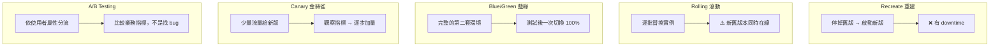
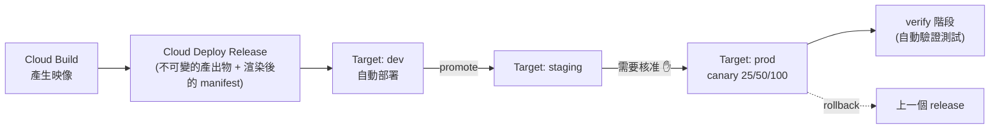

# Cloud Deploy 與部署策略

> [!abstract] 一句話定位
> 官方考點原文：**「使用流量分流策略（漸進式發布、回滾、A/B 測試）於 Cloud Run 或 GKE 上的新服務」**。
> 這篇分兩半：**① 部署策略的原理與選擇**、**② Cloud Deploy 怎麼幫你自動化**。

---

## 🎭 五種部署策略（**必背對照表**）



| 策略 | 做法 | 優點 | 缺點 | 何時用 |
|---|---|---|---|---|
| **Recreate** | 全停再全開 | 簡單、無版本共存 | **有 downtime** | 可接受中斷的內部工具、schema 不相容時 |
| **Rolling update** | 逐批替換 | 無 downtime、資源需求低 | 新舊共存（需向後相容）、回滾較慢 | ⭐ GKE 的預設 |
| **Blue/Green** | 兩套完整環境，一次切換 | **回滾瞬間完成**、可完整測試 | **需要雙倍資源** | 高風險發布、需要完整 E2E 驗證 |
| **Canary** | 5% → 25% → 100% | **風險最小**、真實流量驗證 | 需要好的指標與自動化 | ⭐ 生產環境的最佳實務 |
| **A/B testing** | 依 header/cookie/地區分流 | 驗證**業務假設** | 需要實驗設計與統計 | 產品決策（不是技術驗證） |

> [!important] Canary vs A/B testing 的差別（常考）
> - **Canary** 的目的是**發現技術問題**（錯誤率、延遲）→ 分流依比例，看的是**技術指標**。
> - **A/B testing** 的目的是**比較商業成效**（轉換率）→ 分流依**使用者屬性**，看的是**業務指標**。
> 題目說 `compare conversion rates` → A/B；說 `reduce risk of a bad release` → canary。

### ⚠️ 所有漸進式策略的隱含前提
**新舊版本必須能同時存在** → 這要求：
1. **資料庫 schema 向後相容**（先加欄位、不要立刻刪；用 expand-contract 模式）
2. **API 向後相容**（見 [[API 設計 REST 與 gRPC]]）
3. **訊息格式向後相容**（新欄位可選）
4. **功能開關（feature flag）** 與部署解耦

---

## 🚦 各平台的實作方式

### Cloud Run（最簡單）
```bash
# 部署但不給流量 + 掛 tag → 可用 tag URL 做 E2E 測試
gcloud run deploy api --image IMG --no-traffic --tag canary

# Canary：10% → 50% → 100%
gcloud run services update-traffic api --to-tags canary=10
gcloud run services update-traffic api --to-tags canary=50
gcloud run services update-traffic api --to-latest

# Blue/Green：測完一次切換
gcloud run services update-traffic api --to-tags green=100

# 立即回滾
gcloud run services update-traffic api --to-revisions api-00007-abc=100
```
> **Cloud Run 的優勢**：流量分流是平台內建功能，回滾是**改設定**而非重新部署 → 秒級。

### GKE
| 方法 | 說明 |
|---|---|
| **Rolling update**（預設） | `maxSurge` / `maxUnavailable` 控制節奏；`kubectl rollout undo` 回滾 |
| **兩個 Deployment + Service selector** | 手動 blue/green（切 Service 的 selector） |
| **Gateway API 權重路由** | 宣告式的百分比分流（比 Ingress 強） |
| **Cloud Service Mesh VirtualService** | 最細緻（權重 + header 條件 + 自動重試），見 [[Cloud Service Mesh 與 Network Policy]] |
| **Cloud Deploy** | 幫你把上述流程自動化 |

```yaml
# 滾動更新節奏控制
spec:
  strategy:
    type: RollingUpdate
    rollingUpdate:
      maxSurge: 25%          # 最多額外多 25% 的 Pod
      maxUnavailable: 0      # 不允許減少可用 Pod（最安全，但需要額外資源）
```

---

## 🚚 Cloud Deploy

**定位**：代管的**持續交付（CD）**服務 — 管理「**同一個產出物依序晉升（promote）過多個環境**」的流程。



| 概念 | 說明 |
|---|---|
| **Delivery pipeline** | 定義環境序列與策略 |
| **Target** | 一個部署目標（GKE 叢集 / Cloud Run 服務 / GKE fleet） |
| **Release** | **不可變**的一次發布（綁定映像 digest + 渲染後的設定） |
| **Rollout** | 一次「把 release 部到某個 target」的動作 |
| **Promote** | 把同一個 release 晉升到下一個 target（**同樣的產出物，不重新建置**） |
| **Approval** | 晉升到生產前需人工核准 |
| **Verify** | 部署後自動執行驗證步驟（smoke test） |
| **Rollback** | 一個指令回到前一個 release |
| **底層** | 使用 **Skaffold** 渲染 manifest |

```yaml
# clouddeploy.yaml
apiVersion: deploy.cloud.google.com/v1
kind: DeliveryPipeline
metadata: { name: api-pipeline }
serialPipeline:
  stages:
    - targetId: dev
      profiles: [dev]
    - targetId: staging
      profiles: [staging]
    - targetId: prod
      profiles: [prod]
      strategy:
        canary:
          runtimeConfig:
            cloudRun: { automaticTrafficControl: true }
          canaryDeployment:
            percentages: [25, 50]
            verify: true          # 每個階段後跑驗證
---
apiVersion: deploy.cloud.google.com/v1
kind: Target
metadata: { name: prod }
requireApproval: true             # ✋ 生產需核准
run:
  location: projects/PROJECT/locations/asia-east1
```

```bash
gcloud deploy apply --file=clouddeploy.yaml --region=asia-east1
gcloud deploy releases create rel-$SHORT_SHA --delivery-pipeline=api-pipeline \
  --region=asia-east1 --images=api=asia-east1-docker.pkg.dev/$PROJECT/apps/api@sha256:$DIGEST
gcloud deploy releases promote --release=rel-$SHORT_SHA --delivery-pipeline=api-pipeline --region=asia-east1
gcloud deploy rollouts approve ROLLOUT --delivery-pipeline=api-pipeline --release=rel-$SHORT_SHA --region=asia-east1
```

> [!important] Cloud Build vs Cloud Deploy 的分工（考點）
> - **Cloud Build = CI**：建置、測試、產生產出物。
> - **Cloud Deploy = CD**：把**同一個產出物**依序晉升過 dev → staging → prod，含核准、canary、驗證、回滾。
> 題目出現 `promote the same artifact through environments`、`approval before production`、`managed canary with rollback` → **Cloud Deploy**。

---

## 🔙 回滾的三個層次

| 層次 | 方法 | 速度 |
|---|---|---|
| **流量層** | Cloud Run `update-traffic --to-revisions`；mesh 改權重 | **秒** |
| **工作負載層** | `kubectl rollout undo`；Cloud Deploy `rollback` | 分鐘 |
| **資料層** | 資料庫 migration 的回復腳本 / PITR | **困難** ⚠️ |

> [!warning] 資料是回滾的真正難點
> 程式可以秒回，**資料變更不行**。所以：
> - migration 要**向後相容**（expand → migrate → contract 三階段）
> - 破壞性變更（刪欄位/改型別）要等**所有舊版本下線後**才做
> - 重要變更前先備份 / 確認 PITR 可用（見 [[Cloud SQL 與 AlloyDB]]）

---

## 🎯 考點速記

| 看到題目說… | 就想到 |
|---|---|
| `gradually shift traffic to the new version` | **Canary**（Cloud Run 流量百分比） |
| `instantly roll back` | Cloud Run `--to-revisions`（**流量層回滾**） |
| `test the new version with real traffic from a few users` | Canary |
| `compare two versions' conversion rate` | **A/B testing** |
| `switch all traffic at once after full testing` | **Blue/Green** |
| `zero downtime with minimal extra resources` | **Rolling update** |
| `promote the same image through dev → staging → prod` | **Cloud Deploy** |
| `require approval before production deployment` | Cloud Deploy `requireApproval`（或 Cloud Build 核准） |
| `automatically verify after each canary step` | Cloud Deploy **verify** |
| `新舊版本同時在線` 的前置條件 | **向後相容**（API / schema / 訊息） |
| `資料庫變更怎麼安全發布` | **expand-contract**（先加、後遷、最後刪） |

## 💣 真實場景陷阱

1. **canary 沒有觀測指標**：分了 10% 流量卻沒看錯誤率 → 等於盲目發布。要搭 [[Cloud Monitoring 與 SLO]] 的 SLO/error budget。
2. **schema 破壞性變更 + rolling update**：舊版本讀到新 schema 直接崩。
3. **blue/green 忘記雙倍資源與配額**：切換時配額不足。
4. **回滾了程式但沒回滾資料**：資料已被新版本寫成新格式。
5. **Cloud Run canary 用 `latest` tag**：`--to-latest` 會把流量全給最新，失去控制。
6. **健康檢查通過但業務壞掉**：canary 的驗證要看**業務指標**，不只是 HTTP 200。

## ✍️ 自我檢核

1. 五種部署策略的優缺點與適用場景？
2. Canary 與 A/B testing 的目的差異？題目怎麼區分？
3. 所有漸進式發布的共同前置條件是什麼？涉及哪四種相容性？
4. Cloud Run 上做 canary 與立即回滾的指令分別是什麼？
5. Cloud Build 與 Cloud Deploy 的分工？什麼關鍵詞指向 Cloud Deploy？
6. 回滾的三個層次？哪一層最難、為什麼？
7. 資料庫欄位要改名，安全的三階段流程是什麼？

## 🔗 相關

- [[Cloud Build]]
- [[Artifact Registry]]
- [[Cloud Run]]
- [[GKE 工作負載 健康檢查與自動擴充]]
- [[Cloud Service Mesh 與 Network Policy]]
- [[Cloud Monitoring 與 SLO]]
- [[API 設計 REST 與 gRPC]]
- [[Cloud SQL 與 AlloyDB]]
- [[Lab 04 CI CD Cloud Build Artifact Registry Cloud Deploy]]
- [[Section 3 設定雲端原生應用的部署]]
