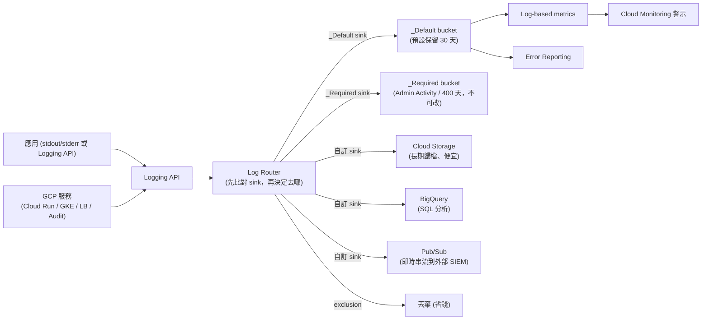

# Cloud Logging

> [!abstract] 一句話定位
> **集中式日誌**：所有 GCP 服務與你的應用的 log 都流進這裡，可查詢、可路由、可轉成指標。
> Section 4.3 的核心工具之一。考點集中在 **結構化記錄**、**log router / sink**、**log-based metric**、**trace 關聯**。

---

## 🧠 心智模型



---

## 🧱 結構化記錄（Structured Logging）— **最重要的實作考點**

在 Cloud Run / GKE / Functions 上，**直接把 JSON 寫到 stdout**，Logging 會自動解析成 `jsonPayload`：

```python
import json, logging, os, sys

def log(severity, message, **kwargs):
    entry = {
        "severity": severity,                  # ← 特殊欄位，決定 log 層級
        "message": message,                    # ← 摘要顯示的內容
        "logging.googleapis.com/trace":
            f"projects/{os.environ['GOOGLE_CLOUD_PROJECT']}/traces/{kwargs.pop('trace_id', '')}",
        "logging.googleapis.com/spanId": kwargs.pop("span_id", ""),
        "logging.googleapis.com/labels": {"component": "orders"},
        **kwargs,                              # 任意結構化欄位
    }
    print(json.dumps(entry), file=sys.stdout)

log("INFO", "order created", order_id="o-987", user_id="u-123", amount=299)
log("ERROR", "payment failed", order_id="o-987", error_code="CARD_DECLINED")
```

| 特殊欄位 | 作用 |
|---|---|
| `severity` | `DEBUG` / `INFO` / `NOTICE` / `WARNING` / `ERROR` / `CRITICAL` / `ALERT` / `EMERGENCY` |
| `message` | 顯示在 log 列表的主文字 |
| **`logging.googleapis.com/trace`** | **把 log 關聯到 Cloud Trace 的 trace** ⭐ 高頻考點 |
| `logging.googleapis.com/spanId` | 關聯到特定 span |
| `logging.googleapis.com/labels` | 自訂標籤（可用於篩選） |
| `logging.googleapis.com/sourceLocation` | 檔案/行號 |
| `httpRequest` | 請求詳情（方法、狀態、延遲）→ 會有專屬 UI |

> [!important] 為什麼要結構化
> 非結構化（純文字）log **只能字串比對**；結構化後可以 `jsonPayload.order_id="o-987"` 精準查詢、可做 log-based metric、可關聯 trace。
> 考題：「如何能依 order ID 快速找到某筆訂單的所有 log」→ **結構化記錄 + 欄位查詢**。

### 多行 stack trace 的處理
Python/Java 的 exception 是多行 → 若直接 print，會被拆成多筆 log。
**解法**：用結構化 log 把整個 stack trace 放在單一欄位（`message` 或 `stack_trace`），並設 `severity: ERROR` → 這也是 **Error Reporting 能正確聚合** 的前提。

---

## 🔍 查詢語言（Logging Query Language）

```
# 基本
resource.type="cloud_run_revision"
resource.labels.service_name="api"
severity>=ERROR
timestamp>="2026-09-27T00:00:00Z"

# 結構化欄位
jsonPayload.order_id="o-987"
jsonPayload.amount>1000

# 用 trace ID 撈出整條請求鏈（跨服務）⭐
trace="projects/my-project/traces/4bf92f3577b34da6a3ce929d0e0e4736"

# HTTP 請求
httpRequest.status>=500
httpRequest.latency>="2s"

# 組合與否定
severity>=WARNING AND resource.labels.service_name=("api" OR "worker")
NOT textPayload:"health"

# GKE
resource.type="k8s_container"
resource.labels.namespace_name="prod"
labels."k8s-pod/app"="orders"
```

```bash
gcloud logging read 'resource.type="cloud_run_revision" AND severity>=ERROR' \
  --limit=50 --freshness=1h --format=json
gcloud logging tail 'resource.labels.service_name="api"'      # 即時尾隨
```

---

## 🚚 Log Router、Sink 與 Exclusion

| 概念 | 說明 |
|---|---|
| **Log Router** | 所有 log 的第一站，依 sink 條件決定去向 |
| **Sink** | 「符合這個 filter 的 log → 送到這個目的地」 |
| 目的地 | **Logging bucket**、**Cloud Storage**（歸檔）、**BigQuery**（分析）、**Pub/Sub**（串到外部 SIEM）、另一個專案/組織的 Logging bucket |
| **`_Required` sink** | Admin Activity / System Event audit log，**保留 400 天、不可修改、不計費** |
| **`_Default` sink** | 其他所有 log → `_Default` bucket（**預設保留 30 天** 🔢，可改 1–3650 天） |
| **Exclusion（排除）** | 在 sink 上排除某些 log → **不儲存、不計費**（省錢主要手段） |
| **Log bucket** | 可自建，指定 region 與保留期；可設 **CMEK** |

```bash
# ① 歸檔到 GCS（長期保存、便宜）
gcloud logging sinks create archive-errors \
  storage.googleapis.com/projects/$PROJECT/buckets/log-archive \
  --log-filter='severity>=ERROR'

# ② 送到 BigQuery 做分析
gcloud logging sinks create to-bq \
  bigquery.googleapis.com/projects/$PROJECT/datasets/logs \
  --log-filter='resource.type="cloud_run_revision"' --use-partitioned-tables

# ③ 即時串到外部系統
gcloud logging sinks create to-siem \
  pubsub.googleapis.com/projects/$PROJECT/topics/log-stream \
  --log-filter='protoPayload.methodName:"SetIamPolicy"'

# ④ 排除健康檢查噪音（省錢）
gcloud logging sinks update _Default \
  --add-exclusion=name=skip-health,filter='httpRequest.requestUrl:"/healthz"'

# ⑤ 延長保留期
gcloud logging buckets update _Default --location=global --retention-days=90
```

> [!important] 建立 sink 後要授權
> sink 會有一個 **writer identity（服務帳戶）**，必須把它加到目的地的 IAM（例如 GCS 的 `roles/storage.objectCreator`、BQ 的 `roles/bigquery.dataEditor`）。
> 忘記授權 → sink 建了但什麼都沒進去。**這是很常考的細節。**

---

## 📊 Log-based Metrics

把 log 轉成可以警示的指標。

| 類型 | 說明 |
|---|---|
| **Counter** | 符合 filter 的 log 筆數（例如「每分鐘 5xx 的次數」） |
| **Distribution** | 從 log 欄位擷取數值做分布（例如從 `jsonPayload.latency_ms` 算 p95） |
| **System（內建）** | Google 預先提供的（如 `logging.googleapis.com/log_entry_count`） |
| **Labels** | 可從 log 欄位擷取成標籤，用於分組（⚠️ 注意基數爆炸） |

```bash
gcloud logging metrics create payment_failures \
  --description="failed payments per minute" \
  --log-filter='jsonPayload.error_code="CARD_DECLINED"'
```

> [!tip] 什麼時候用 log-based metric vs 自訂指標？
> - **已經有 log、不想改程式** → log-based metric（最快）
> - **需要精確計數/高頻/低延遲、或要記錄業務數值** → 用 **OpenTelemetry 自訂指標**（見 [[OpenTelemetry 與 Trace 關聯]]）
> - log-based metric 有取樣/延遲，不適合精算計費類數據

---

## 🔐 權限與稽核

| 角色 | 用途 |
|---|---|
| `roles/logging.logWriter` | **工作負載寫 log 需要**（Cloud Run/GKE 的 SA） |
| `roles/logging.viewer` | 看 log（不含 Data Access） |
| `roles/logging.privateLogViewer` | 看 **Data Access** log |
| `roles/logging.configWriter` | 管理 sink / metric |

**Audit log 四類**
| 類型 | 預設 | 內容 |
|---|---|---|
| **Admin Activity** | **永遠開啟、免費** | 修改設定/資源的操作 |
| **Data Access** | **預設關閉**（BigQuery 除外）、會計費 | 讀寫資料的操作 |
| System Event | 開啟 | Google 系統自動行為 |
| Policy Denied | 開啟 | 被政策拒絕的請求 |

> 考題：「要稽核誰讀取了 GCS 物件」→ 必須先**啟用 Data Access audit log**（見 [[IAM 與服務帳戶]]）。

---

## 🎯 考點速記

| 看到題目說… | 就想到 |
|---|---|
| `search logs by a business field (order ID)` | **結構化記錄（jsonPayload）** |
| `correlate all logs of one request across services` | **trace ID** + `logging.googleapis.com/trace` |
| `keep logs for 7 years at low cost` | Sink → **Cloud Storage**（+ lifecycle 到 Archive） |
| `analyze logs with SQL` | Sink → **BigQuery** |
| `stream logs to Splunk / external SIEM` | Sink → **Pub/Sub** |
| `reduce logging costs` | **Exclusion**（排除健檢/DEBUG）+ 縮短保留期 |
| `alert when error rate spikes` | **Log-based metric** + Monitoring 警示 |
| `logs must stay in the EU` | 自建 **regional log bucket** |
| `sink created but no data arrives` | 忘記給 **writer identity** 目的地權限 |
| `audit who read the data` | 啟用 **Data Access audit log** |
| `Cloud Run 沒有 log` | SA 缺 `roles/logging.logWriter` |
| `多行 stack trace 被拆成多筆` | 用結構化 log 把整個 trace 放一個欄位 |

## 💣 真實場景陷阱

1. **log 太多太貴**：健康檢查、DEBUG log 佔了 90% 的量。用 exclusion。
2. **把敏感資料寫進 log**（密碼、信用卡、PII）：log 會被很多人看到且保留很久 → **遮罩/去識別化**（可用 Cloud DLP）。
3. **sink 沒授權**：靜默失敗。
4. **依賴 `textPayload` 字串比對**：改一個字就壞掉。用結構化欄位。
5. **log-based metric 的 label 基數爆炸**：用 user ID 當 label → 指標數量爆炸、費用飆升。
6. **以為 log 是永久的**：`_Default` 預設只留 30 天。

## ✍️ 自我檢核

1. 結構化記錄怎麼做？哪三個特殊欄位最重要？
2. 要把一個請求在四個服務中的 log 一起撈出來，需要什麼？程式要做什麼？
3. Log Router、sink、exclusion、bucket 的關係？
4. 建 sink 到 BigQuery 之後 log 沒進去，先檢查什麼？
5. Log-based metric 與 OpenTelemetry 自訂指標的取捨？
6. `_Required` 與 `_Default` bucket 的差別？各保留多久？
7. 要稽核資料讀取需要先做什麼？為什麼預設關閉？

## 🔗 相關

- [[Cloud Monitoring 與 SLO]]
- [[Cloud Trace Profiler 與 Error Reporting]]
- [[OpenTelemetry 與 Trace 關聯]]
- [[Cloud Storage]]
- [[BigQuery 給開發者]]
- [[Pub Sub]]
- [[IAM 與服務帳戶]]
- [[Cloud Run]]
- [[Lab 06 可觀測性 OpenTelemetry Trace 與 SLO]]
- [[Section 4 整合 Google Cloud 服務]]
