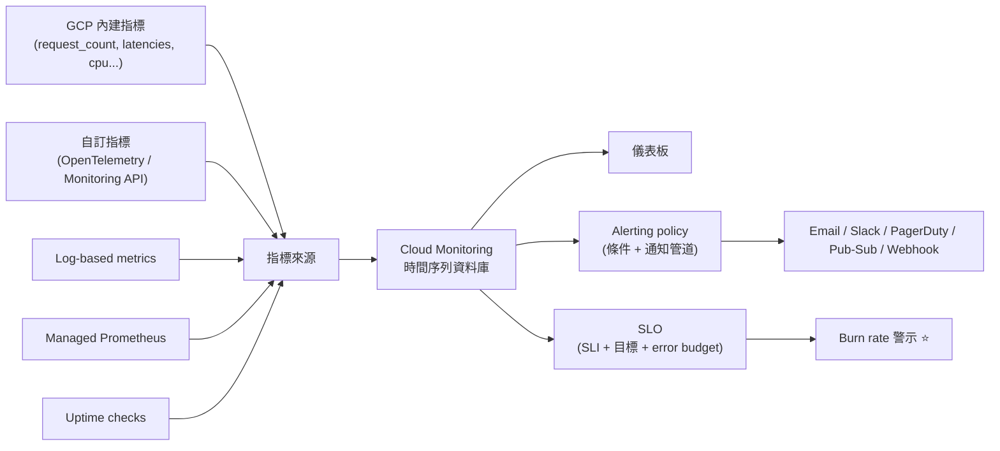
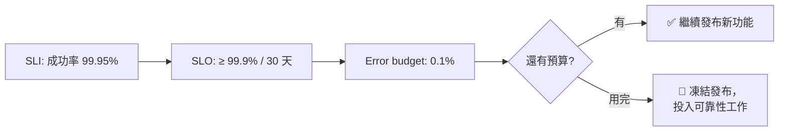

# Cloud Monitoring 與 SLO

> [!abstract] 一句話定位
> **指標（metrics）、儀表板、警示、uptime check、SLO。**
> 考試角度：**你要監控什麼**（四個黃金訊號）、**警示怎麼設才不會吵**（SLO / error budget）、**自訂指標怎麼送**。

---

## 🧠 心智模型



---

## 📐 四個黃金訊號（**該監控什麼的標準答案**）

| 訊號 | 對應指標 | 為什麼重要 |
|---|---|---|
| **延遲（Latency）** | p50 / **p95 / p99** 回應時間 | 使用者體驗；**要看百分位，不是平均** |
| **流量（Traffic）** | 每秒請求數、訊息吞吐 | 容量規劃、異常偵測 |
| **錯誤（Errors）** | 5xx 比率、例外數 | 正確性 |
| **飽和度（Saturation）** | CPU/記憶體使用率、佇列長度、連線池使用率 | 距離極限還有多遠 |

> [!important] 考點
> 題目問「該對什麼設警示」→ **面向使用者的症狀（延遲、錯誤率）**，而不是原因（CPU 使用率）。
> CPU 高不一定有問題；使用者拿到 500 一定有問題。
> **平均延遲會騙人** → 一定選 **p95/p99**。

---

## 🎯 SLI / SLO / Error Budget（**高分關鍵**）

| 術語 | 定義 | 例子 |
|---|---|---|
| **SLI**（指標） | 服務品質的量測值 | 「成功請求 / 全部請求」、「延遲 < 300ms 的請求比例」 |
| **SLO**（目標） | SLI 的目標值 + 時間窗 | 「30 天內 99.9% 的請求成功」 |
| **Error budget**（誤差預算） | `1 - SLO` = 允許失敗的量 | 99.9% → 30 天可失敗 **0.1%**（約 43 分鐘） |
| **SLA**（協議） | 對客戶的**合約承諾**（含罰則） | 通常比 SLO 寬鬆 |
| **Burn rate** | 消耗誤差預算的速度 | 1x = 剛好用完；**14.4x = 1 小時燒掉 2% 預算** |



> [!important] Error budget 的管理意義（考試會考觀念）
> 它把「要穩定」與「要快速發布」的矛盾**量化成一個可協商的數字**：
> 預算還有 → 可以繼續冒險發布；預算燒光 → 停下來修穩定性。

### 多視窗 burn-rate 警示（業界最佳實務）
| 警示 | 條件 | 意義 |
|---|---|---|
| **快速燒**（page 人） | 1 小時 burn rate > 14.4x **且** 5 分鐘也超過 | 嚴重事故，立刻處理 |
| **慢速燒**（開 ticket） | 6 小時 burn rate > 6x | 漸進性劣化，工作時間處理 |

> 好處：**比「錯誤率 > 1% 持續 5 分鐘」少很多假警報**，因為它考慮了「這對月預算的實際影響」。

```bash
# 建立 SLO（以 Cloud Run 服務為例，概念示意）
gcloud monitoring dashboards list
# SLO 通常在 Console 的 Services → SLOs 建立，或用 API：
# ServiceLevelObjective: goal=0.999, rollingPeriod=30d,
#   serviceLevelIndicator.requestBased.goodTotalRatio{good: 2xx, total: all}
```

---

## 🔔 Alerting Policy

| 元素 | 說明 |
|---|---|
| **條件（condition）** | 指標 + 篩選 + 聚合 + 門檻 + 持續時間 |
| **對齊（alignment）與聚合** | 例如「每 60 秒對齊、取 p95、依 service 分組」 |
| **持續時間** | 避免瞬間抖動誤報 |
| **通知管道** | Email、SMS、Slack、PagerDuty、**Pub/Sub**（可自動化處理）、Webhook |
| **自動關閉（auto-close）** | 條件恢復後關閉事件 |
| **文件（documentation）** | 附上 runbook 連結 → **實務與考試都推薦** |
| **Log-based alert** | 直接對 log 條件警示（不需先做 metric） |

```yaml
# alerting policy（YAML 概念示意）
displayName: "API 5xx rate high"
combiner: OR
conditions:
  - displayName: "5xx > 1% for 5 min"
    conditionThreshold:
      filter: >
        resource.type="cloud_run_revision"
        AND metric.type="run.googleapis.com/request_count"
        AND metric.labels.response_code_class="5xx"
      aggregations:
        - alignmentPeriod: 60s
          perSeriesAligner: ALIGN_RATE
          crossSeriesReducer: REDUCE_SUM
      comparison: COMPARISON_GT
      thresholdValue: 0.01
      duration: 300s
notificationChannels: [projects/PROJECT/notificationChannels/123]
documentation:
  content: "Runbook: https://wiki/runbooks/api-5xx"
```

### Uptime Check
從**全球多個位置**定期打你的端點。
- 可檢查 HTTP(S)/TCP，驗證回應內容、狀態碼、SSL 憑證有效期。
- 失敗會觸發警示；**多位置**避免單一探測點的網路問題造成誤報。
- 考點：「從使用者角度確認服務可用」→ **uptime check**（黑箱監控）；「服務內部健康」→ probe（見 [[GKE 工作負載 健康檢查與自動擴充]]）。

---

## 📈 自訂指標

三種送法：
| 方式 | 說明 | 建議 |
|---|---|---|
| **OpenTelemetry**（+ GCP exporter） | 廠商中立的標準，metrics/traces/logs 一套解決 | ⭐ **官方推薦** |
| **Monitoring API**（`custom.googleapis.com/...`） | 直接呼叫 API 寫時間序列 | 簡單場景 |
| **Managed Service for Prometheus** | 相容 Prometheus 生態、可用 **PromQL** 查詢 | ⭐ GKE 上有 Prometheus 經驗時 |

```python
# OpenTelemetry 送自訂指標到 Cloud Monitoring
from opentelemetry import metrics
from opentelemetry.exporter.cloud_monitoring import CloudMonitoringMetricsExporter
from opentelemetry.sdk.metrics import MeterProvider
from opentelemetry.sdk.metrics.export import PeriodicExportingMetricReader

reader = PeriodicExportingMetricReader(CloudMonitoringMetricsExporter(), export_interval_millis=60000)
metrics.set_meter_provider(MeterProvider(metric_readers=[reader]))
meter = metrics.get_meter("orders")

orders_counter = meter.create_counter("orders_created", unit="1", description="orders created")
orders_counter.add(1, {"tier": "vip", "region": "asia-east1"})   # ⚠️ 標籤基數要控制
```

> [!warning] 指標基數（cardinality）
> 標籤不要用 user ID、request ID、完整 URL 這類**高基數**值 → 時間序列數量爆炸、費用飆升、查詢變慢。
> 高基數資訊應該放在 **log 或 trace**，不是 metric label。**這是很常考的設計判斷。**

**查詢語言**：**MQL**（Monitoring Query Language）與 **PromQL**（搭配 Managed Prometheus）。

---

## 🤖 AI 輔助的可觀測性（2026 新增考點）
**Gemini Cloud Assist** 可以：解釋警示、推測根因、由自然語言產生查詢、建議調查步驟。
> 定位：**加速診斷**。它不取代 SLO 設計與正確的 instrumentation。見 [[開發環境 Cloud Code Shell Workstations 與 AI 工具]]。

---

## 🎯 考點速記

| 看到題目說… | 就想到 |
|---|---|
| `what should we monitor?` | **四個黃金訊號**（延遲/流量/錯誤/飽和度） |
| `average latency looks fine but users complain` | 改看 **p95 / p99** |
| `reduce alert fatigue / too many false alarms` | **SLO + multi-window burn rate 警示** |
| `balance reliability against feature velocity` | **Error budget** |
| `verify availability from a user's perspective` | **Uptime check**（多位置） |
| `track business metric like orders per minute` | **自訂指標**（OpenTelemetry） |
| `already have logs, need an alert` | **Log-based metric** / log-based alert |
| `Prometheus 相容 + PromQL` | **Managed Service for Prometheus** |
| `alert should trigger an automated remediation` | 通知管道用 **Pub/Sub** → Cloud Run/Functions |
| `too many time series / costs rising` | 指標**基數**過高 → 移除高基數標籤 |
| `SLA vs SLO` | SLA 是**對外合約**，SLO 是**內部目標**（通常更嚴） |

## 💣 真實場景陷阱

1. **只警示 CPU**：CPU 正常但使用者拿 500。要警示**症狀**。
2. **門檻式警示太吵**：一天 50 個警示 → 大家都關通知。改用 burn rate。
3. **指標 label 放 user ID**：帳單暴增。
4. **SLO 訂得太高**（99.99%）：預算極小，任何維護都超標；先量測現況再訂目標。
5. **沒有 runbook**：半夜被叫起來卻不知道要做什麼。警示要附文件。
6. **忘記工作負載的 metric 權限**：SA 缺 `roles/monitoring.metricWriter` → 自訂指標送不出去。
7. **uptime check 打到需要驗證的路徑**：永遠失敗。

## ✍️ 自我檢核

1. 四個黃金訊號是什麼？為什麼不該只監控 CPU？
2. SLI / SLO / SLA / error budget 的定義與關係？99.9% / 30 天 的預算約多少分鐘？
3. Burn rate 警示為什麼比固定門檻好？兩個常用視窗與倍率是什麼？
4. 自訂指標的三種送法？官方推薦哪個？
5. 為什麼不能用 user ID 當 metric label？該放哪裡？
6. Uptime check 與 readinessProbe 的差別？
7. 要讓警示自動觸發修復動作，通知管道該選什麼？

## 🔗 相關

- [[Cloud Logging]]
- [[Cloud Trace Profiler 與 Error Reporting]]
- [[OpenTelemetry 與 Trace 關聯]]
- [[GKE 工作負載 健康檢查與自動擴充]]
- [[Cloud Deploy 與部署策略]]
- [[韌性模式 重試 冪等 退避 斷路器]]
- [[成本與資源最佳化]]
- [[Lab 06 可觀測性 OpenTelemetry Trace 與 SLO]]
- [[Section 4 整合 Google Cloud 服務]]
