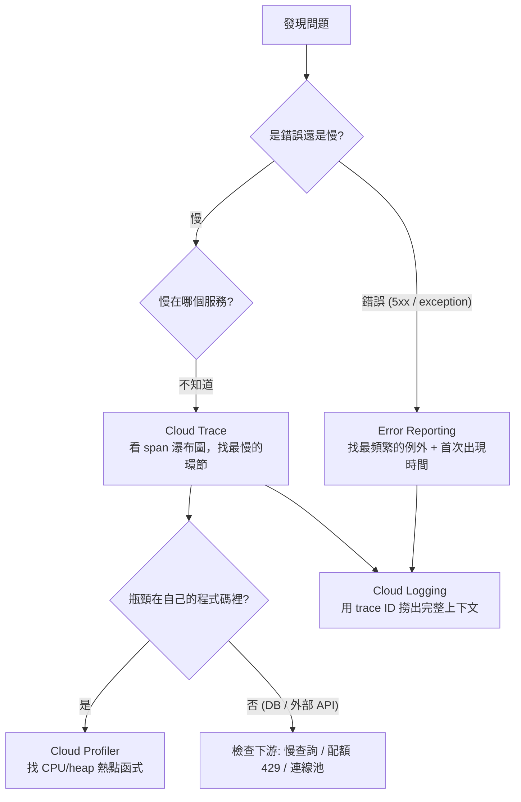
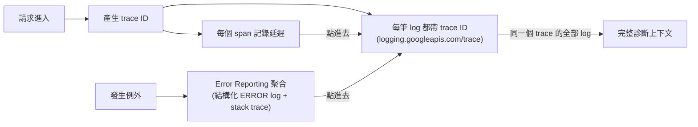

# Cloud Trace、Cloud Profiler 與 Error Reporting

> [!abstract] 一句話定位
> 三個工具回答三個不同問題：
> - **Cloud Trace** — 「**這個請求的時間花在哪裡？**」（跨服務延遲分解）
> - **Cloud Profiler** — 「**我的程式碼裡哪一行在燒 CPU/記憶體？**」（單一服務內部）
> - **Error Reporting** — 「**哪個例外最常發生、什麼時候開始的？**」（例外聚合）

---

## 🧭 什麼時候用哪一個



---

## 🔬 Cloud Trace

| 概念 | 說明 |
|---|---|
| **Trace** | 一個請求的完整旅程（由一個 trace ID 串起） |
| **Span** | 旅程中的一段工作（一次 RPC、一次 DB 查詢、一段運算），可嵌套 |
| **Context propagation** | 把 trace ID + span ID 透過 HTTP header 傳給下游 |
| **取樣（sampling）** | 不會 100% 記錄（成本/效能）；可調整取樣率 |
| **自動 instrument** | Cloud Run / App Engine / LB 會自動產生部分 span；GCP 用戶端程式庫也會 |
| **分析報告** | 延遲分布、比較兩個時間段（判斷「這次發布是否變慢」） |

**傳播的 header**
| Header | 來源 |
|---|---|
| `X-Cloud-Trace-Context` | Google 傳統格式（`TRACE_ID/SPAN_ID;o=1`） |
| **`traceparent`** | **W3C 標準**（OpenTelemetry 預設）⭐ |

> [!important] 一定要做的事
> 你的服務必須**把收到的 trace context 往下游傳**，否則鏈路會斷成好幾段，看不出全貌。
> 用 **OpenTelemetry 自動 instrumentation** 可以自動處理 → 見 [[OpenTelemetry 與 Trace 關聯]]。

```python
# 手動建立 span（OpenTelemetry）
from opentelemetry import trace
tracer = trace.get_tracer(__name__)

def create_order(payload):
    with tracer.start_as_current_span("validate_order") as span:
        span.set_attribute("order.id", payload["id"])
        span.set_attribute("order.amount", payload["amount"])
        validate(payload)
    with tracer.start_as_current_span("charge_payment"):
        charge(payload)          # 呼叫下游時，context 會自動注入 header
```

> [!tip] Span 屬性 vs Metric label
> 高基數資訊（order ID、user ID）**放 span 屬性**沒問題；放 metric label 會爆。見 [[Cloud Monitoring 與 SLO]]。

---

## 🔥 Cloud Profiler

**定位**：**低開銷的持續性效能剖析**，可以在**生產環境**長期開著。

| 剖析類型 | 支援語言（概念） |
|---|---|
| CPU time | Go, Java, Python, Node.js |
| Heap / allocated heap | Go, Java, Node.js |
| Contention / threads | Go, Java |
| Wall time | Go, Java, Python |

```python
# Python：在程式啟動時初始化
import googlecloudprofiler
try:
    googlecloudprofiler.start(service="orders-api", service_version="1.2.3", verbose=0)
except Exception:
    pass          # profiler 失敗不該影響服務
```
```go
// Go
import "cloud.google.com/go/profiler"
func main() {
    profiler.Start(profiler.Config{Service: "orders-api", ServiceVersion: "1.2.3"})
}
```

**看什麼**：火焰圖（flame graph）中**最寬的框** = 佔用最多資源的函式。可比較不同版本（`service_version`）來確認最佳化是否有效。
**權限**：SA 需要 `roles/cloudprofiler.agent`。

> 考點：「延遲高，trace 顯示時間都花在我們自己的服務內部」→ **Cloud Profiler**。
> 「記憶體持續上升懷疑洩漏」→ **Profiler 的 heap 剖析**。

---

## 🚨 Error Reporting

**定位**：把**相同的例外聚合成一個 issue**，顯示發生次數、趨勢、首次/最後出現時間，並可通知。

| 特性 | 說明 |
|---|---|
| 自動偵測 | 從 log 中辨識 stack trace（**Cloud Run / GKE / Functions 的 `severity>=ERROR` 且含 stack trace**） |
| 聚合 | 依 stack trace 的形狀分組 → 「同一個 bug」只出現一次 |
| 顯示 | 發生次數、影響使用者數、第一次出現的版本 ⭐ |
| 通知 | **新錯誤出現時**可發通知（email / Pub/Sub / 行動 App） |
| 手動回報 | 可用 Error Reporting API / 程式庫主動送 |

**如何確保錯誤被抓到**
```python
import json, sys, traceback

def report_exception(e, trace_id=None):
    entry = {
        "severity": "ERROR",
        # ⭐ 關鍵：整個 stack trace 要在同一筆 log 的同一個字串欄位裡
        "message": "".join(traceback.format_exception(type(e), e, e.__traceback__)),
        "logging.googleapis.com/trace": f"projects/{PROJECT}/traces/{trace_id}" if trace_id else None,
        "serviceContext": {"service": "orders-api", "version": "1.2.3"},
    }
    print(json.dumps({k: v for k, v in entry.items() if v is not None}), file=sys.stderr)
```

> [!warning] Error Reporting 沒收到錯誤的四個原因（考題常問）
> 1. log 的 `severity` **不是 ERROR 或以上**
> 2. **stack trace 被拆成多行多筆 log**（沒用結構化記錄）
> 3. 例外被 **catch 了但沒重新記錄**（吞掉了）
> 4. 用了不被辨識的格式（不像 stack trace 的純文字）

---

## 🧩 三者 + Logging 的協作（**整合考點**）



> 這張圖就是 Section 4.3 想考的能力：**metrics 告訴你「有問題」，trace 告訴你「在哪裡」，log 告訴你「為什麼」，profiler 告訴你「哪一行」。**

---

## 🎯 考點速記

| 看到題目說… | 就想到 |
|---|---|
| `find which service in the chain is slow` | **Cloud Trace** |
| `correlate spans across services` | 傳播 **traceparent / X-Cloud-Trace-Context** |
| `latency is inside our own code` | **Cloud Profiler** |
| `suspect a memory leak in production` | Profiler **heap** 剖析（低開銷，可在生產開） |
| `group identical exceptions together` | **Error Reporting** |
| `notify the team when a new error type appears` | Error Reporting 通知 |
| `which release introduced this error` | Error Reporting 的 **首次出現版本** + `serviceContext.version` |
| `Error Reporting 看不到我的例外` | severity / 多行 stack trace / 被吞掉 |
| `see all logs for one specific request` | Logging 用 **trace=** 查詢 |
| `standard instrumentation across languages` | **OpenTelemetry** |

## 💣 真實場景陷阱

1. **沒傳 trace context**：trace 斷裂，看不到跨服務鏈路。
2. **100% 取樣**：成本與效能負擔。用合理取樣率（錯誤路徑可提高取樣）。
3. **例外被吞**：`except: pass` → Error Reporting 永遠看不到。
4. **stack trace 多行**：被拆成十幾筆 log，聚合失敗。
5. **沒設 `service_version`**：無法判斷是哪個版本引入的問題，也無法比較最佳化效果。
6. **忘了給權限**：`cloudtrace.agent` / `cloudprofiler.agent` / `logging.logWriter`。
7. **只有工具沒有流程**：警示來了沒人知道要先看哪個工具 → 寫進 runbook。

## ✍️ 自我檢核

1. Trace / Profiler / Error Reporting 各回答什麼問題？
2. 要讓跨四個服務的 trace 完整串起來，你的程式碼要做什麼？
3. Error Reporting 收不到例外的四個可能原因？
4. 「生產環境記憶體持續上升」用什麼工具？為什麼可以在生產環境開？
5. 從「使用者說很慢」到定位到某一行程式碼，完整的工具使用順序？
6. 為什麼要設定 `service_version`？
7. 高基數資訊（order ID）該放在 span 屬性還是 metric label？為什麼？

## 🔗 相關

- [[Cloud Logging]]
- [[Cloud Monitoring 與 SLO]]
- [[OpenTelemetry 與 Trace 關聯]]
- [[Cloud Run]]
- [[Cloud API 呼叫最佳實務]]
- [[韌性模式 重試 冪等 退避 斷路器]]
- [[Lab 06 可觀測性 OpenTelemetry Trace 與 SLO]]
- [[Section 4 整合 Google Cloud 服務]]
