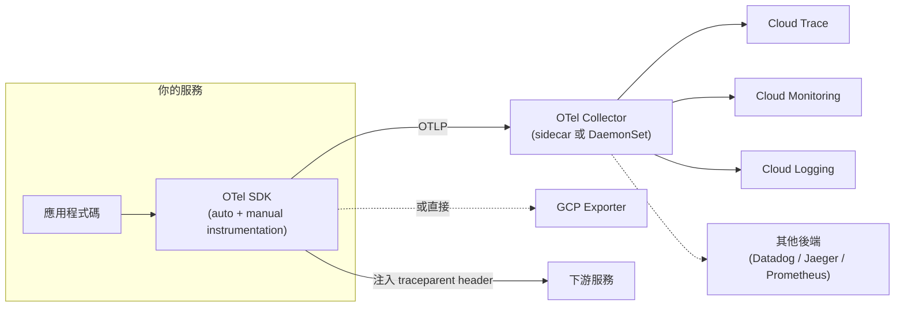
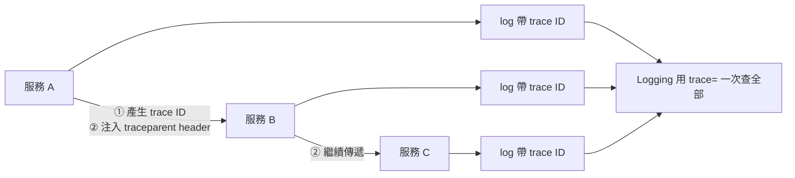

# OpenTelemetry 與 Trace 關聯

> [!abstract] 一句話定位
> 官方考點原文：**「對程式碼做 instrumentation 以便用 metrics、logs、traces 疑難排解」** 與 **「用 trace ID 關聯跨服務的 span」**。
> **OpenTelemetry (OTel)** 是 Google 官方推薦的標準做法：**一套 SDK，同時產出 traces / metrics / logs，且不綁定廠商。**

---

## 📘 技術理解
*原理、限制與實務操作 —— 不為考試也該懂的部分。*

### 🧠 心智模型



**三種訊號（signals）**
| 訊號 | 回答 | 特性 |
|---|---|---|
| **Traces** | 「請求走了哪些路、各段多久」 | 高基數 OK（可放 order ID） |
| **Metrics** | 「整體趨勢如何」 | **低基數**（不要放 ID） |
| **Logs** | 「當時發生了什麼細節」 | 高基數 OK，成本較高 |

---

### 🔗 Trace 關聯的三個必要條件（**核心考點**）



1. **傳播（propagate）**：呼叫下游時把 `traceparent`（W3C）或 `X-Cloud-Trace-Context` 放進 header。
2. **繼承（extract）**：收到請求時從 header 取出 context，作為新 span 的 parent。
3. **關聯 log**：每筆 log 寫入 `logging.googleapis.com/trace` 欄位 → 這樣 Logging 與 Trace 才能互相跳轉。

> [!important] 只做 1 和 2 是不夠的
> 很多人做了 trace 傳播，但 log 沒帶 trace ID → 在 Trace 裡看到慢的 span，卻無法一鍵跳到對應的 log。
> **考題「如何用 trace ID 關聯跨服務的 log」的答案包含這三步。**

#### 非 HTTP 的傳播（容易忽略）
- **Pub/Sub**：把 trace context 放進**訊息屬性（attributes）**，消費端取出來續接。
- **Cloud Tasks**：放進 HTTP header（Tasks 會原樣傳給目標）。
- **佇列/批次**：至少把 trace ID 記在 log 裡，讓人能手動關聯。

```python
# Pub/Sub 的 trace context 傳播
from opentelemetry import trace, propagate

# 發布端
carrier = {}
propagate.inject(carrier)                       # 產生 {"traceparent": "..."}
publisher.publish(topic, data, **carrier)       # 放進訊息屬性

# 消費端
ctx = propagate.extract(dict(message.attributes))
with tracer.start_as_current_span("handle_message", context=ctx):
    handle(message.data)
```

---

### 🛠 實作：Python（自動 + 手動）

```bash
pip install opentelemetry-distro opentelemetry-exporter-gcp-trace \
            opentelemetry-instrumentation-flask opentelemetry-instrumentation-requests
```

```python
# main.py — 初始化（在應用啟動時做一次）
from opentelemetry import trace
from opentelemetry.sdk.trace import TracerProvider
from opentelemetry.sdk.trace.export import BatchSpanProcessor
from opentelemetry.exporter.cloud_trace import CloudTraceSpanExporter
from opentelemetry.sdk.resources import Resource
from opentelemetry.propagate import set_global_textmap
from opentelemetry.propagators.cloud_trace_propagator import CloudTraceFormatPropagator
from opentelemetry.instrumentation.flask import FlaskInstrumentor
from opentelemetry.instrumentation.requests import RequestsInstrumentor

resource = Resource.create({"service.name": "orders-api", "service.version": "1.2.3"})
provider = TracerProvider(resource=resource)
provider.add_span_processor(BatchSpanProcessor(CloudTraceSpanExporter()))
trace.set_tracer_provider(provider)
# 若要同時相容 Google 的舊 header 格式
set_global_textmap(CloudTraceFormatPropagator())

app = Flask(__name__)
FlaskInstrumentor().instrument_app(app)     # 自動為每個請求建 span
RequestsInstrumentor().instrument()         # 自動為 outbound 呼叫建 span + 注入 header
```

```python
# 把 trace ID 寫進每筆 log（讓 Logging ↔ Trace 互通）
import json, os, sys
from opentelemetry import trace

PROJECT = os.environ["GOOGLE_CLOUD_PROJECT"]

def log(severity, message, **fields):
    span = trace.get_current_span()
    ctx = span.get_span_context()
    entry = {"severity": severity, "message": message, **fields}
    if ctx and ctx.trace_id:
        entry["logging.googleapis.com/trace"] = f"projects/{PROJECT}/traces/{format(ctx.trace_id, '032x')}"
        entry["logging.googleapis.com/spanId"] = format(ctx.span_id, "016x")
        entry["logging.googleapis.com/trace_sampled"] = ctx.trace_flags.sampled
    print(json.dumps(entry), file=sys.stdout)

log("INFO", "order created", order_id="o-987")
```

> [!tip] 自動 instrumentation 能覆蓋 80%
> Flask/Django/FastAPI、`requests`/`httpx`、SQLAlchemy、Redis、GCP 用戶端程式庫都有現成的 instrumentation 套件。
> **手動 span 只加在「業務上有意義的區段」**（驗證、計價、外部 API 呼叫）。

---

### 📦 OTel Collector

| 為什麼要用 | 說明 |
|---|---|
| **解耦** | 應用只送 OTLP，要換後端改 collector 設定即可 |
| **處理** | 取樣、過濾、加標籤、去識別化（移除 PII） |
| **批次與重試** | 減少應用的負擔與網路呼叫 |
| 部署形態 | Cloud Run **sidecar**、GKE **DaemonSet/Deployment** |

```yaml
# collector 設定（概念）
receivers:
  otlp: { protocols: { grpc: {}, http: {} } }
processors:
  batch: {}
  probabilistic_sampler: { sampling_percentage: 10 }
  attributes:
    actions: [{ key: user.email, action: delete }]     # 移除 PII
exporters:
  googlecloud: {}
service:
  pipelines:
    traces:  { receivers: [otlp], processors: [probabilistic_sampler, batch], exporters: [googlecloud] }
    metrics: { receivers: [otlp], processors: [batch], exporters: [googlecloud] }
```

---

### 🎲 取樣策略

| 策略 | 說明 |
|---|---|
| **Head-based（機率取樣）** | 在請求開始時決定取不取樣（例如 10%）→ 簡單、低成本 |
| **Tail-based** | 等 trace 完成後依結果決定（**錯誤或慢的一定留**）→ 需要 collector 支援，成本較高但更有用 |
| **Parent-based** | 跟隨上游的決定（保持一條 trace 的一致性）⭐ 預設 |

> 實務建議：**正常流量低取樣 + 錯誤/高延遲全取樣**（tail-based），兼顧成本與可用性。

---

## 🎯 應試
*考場上的提取線索與自我測驗 —— 備考期才需要。*

### 🎯 考點速記

| 看到題目說… | 就想到 |
|---|---|
| `vendor-neutral instrumentation` | **OpenTelemetry** |
| `correlate spans across services` | 傳播 **`traceparent`** header |
| `find all logs belonging to one request` | log 寫 **`logging.googleapis.com/trace`** + Logging `trace=` 查詢 |
| `trace across Pub/Sub` | 把 context 放進**訊息屬性** |
| `reduce tracing cost but keep errors` | **tail-based sampling** |
| `strip PII before sending telemetry` | **OTel Collector** 的 processor |
| `switch observability backend later` | Collector + OTLP（不綁廠商） |
| `metrics 與 traces 用同一套 SDK` | OpenTelemetry |
| `Cloud Run 要跑 collector` | **sidecar 容器**（Cloud Run 支援多容器） |

### 💣 真實場景陷阱

1. **trace 斷裂**：某個服務沒傳 header（常見於自己手刻的 HTTP client 或訊息佇列）。
2. **log 沒帶 trace ID**：有 trace 也無法關聯 log。
3. **在每個請求裡初始化 SDK**：巨大的效能負擔。初始化只做一次。
4. **同步 exporter**：每個 span 都同步送出 → 延遲暴增。用 `BatchSpanProcessor`。
5. **取樣 100%**：成本與後端負擔。
6. **PII 進 span 屬性**：telemetry 資料通常權限較寬鬆 → 要遮罩。
7. **同時裝多套 SDK**（OTel + 舊的 Stackdriver SDK）：span 重複或衝突。

### ✍️ 自我檢核

1. OTel 的三種訊號？哪一種不能放高基數資料？
2. Trace 關聯的三個必要條件？只做前兩個會少什麼能力？
3. 怎麼讓 trace 跨過 Pub/Sub？
4. Head-based 與 tail-based 取樣的差別？實務上怎麼組合？
5. OTel Collector 提供哪四種價值？在 Cloud Run 上怎麼部署？
6. 自動 instrumentation 與手動 span 的分工原則？
7. 為什麼要用 `BatchSpanProcessor`？

## 🔗 相關

- [[Cloud Trace Profiler 與 Error Reporting]]
- [[Cloud Logging]]
- [[Cloud Monitoring 與 SLO]]
- [[Pub Sub]]
- [[Cloud Run]]
- [[Cloud API 呼叫最佳實務]]
- [[Lab 06 可觀測性 OpenTelemetry Trace 與 SLO]]
- [[Section 4 整合 Google Cloud 服務]]
