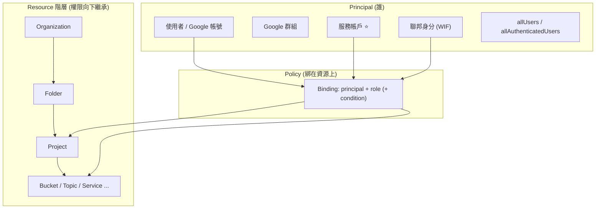

# IAM 與服務帳戶

> [!abstract] 一句話定位
> IAM 回答一個問題：**「誰（principal）可以對哪個資源（resource）做什麼（role）」。**
> 對 PCD 而言，最重要的是**服務帳戶**：你的程式碼在雲上「是誰」，以及怎麼把權限收到最小。

---

## 📘 技術理解
*原理、限制與實務操作 —— 不為考試也該懂的部分。*

### 🧠 心智模型



> [!important] 三個必懂規則
> 1. **政策綁在資源上，權限往下繼承**：在 project 上給的角色，專案內所有資源都適用。
> 2. **只有 allow，沒有 implicit deny**（除了明確的 **Deny Policy**）。繼承來的權限**不能用低層的 allow 收回** → 要用 **IAM Deny Policy** 才能阻擋。
> 3. **最終權限 = 所有層級的聯集**（再扣掉 deny policy）。

---

### 🎭 角色的三種類型

| 類型 | 例子 | 何時用 |
|---|---|---|
| **Basic（原始）** | `roles/owner`、`roles/editor`、`roles/viewer` | ❌ **考試中幾乎永遠是錯的**（權限太廣） |
| **Predefined（預先定義）** | `roles/run.invoker`、`roles/pubsub.publisher`、`roles/storage.objectViewer` | ⭐ **預設選擇** |
| **Custom（自訂）** | 自己挑 permission 組合 | 預定義角色仍過寬時；維護成本較高 |

#### 開發者最該記的預定義角色
| 角色 | 能做什麼 |
|---|---|
| `roles/run.invoker` | 呼叫 Cloud Run 服務 |
| `roles/run.developer` / `run.admin` | 部署 / 完全管理 Cloud Run |
| `roles/pubsub.publisher` / `subscriber` | 發布 / 訂閱訊息 |
| `roles/storage.objectViewer` / `objectCreator` / `objectAdmin` | GCS 物件層級 |
| `roles/storage.admin` | bucket + 物件全部（**比需要的多，小心**） |
| `roles/cloudsql.client` | 透過 Connector/Proxy 連線 Cloud SQL |
| `roles/secretmanager.secretAccessor` | **讀取祕密值**（不是管理祕密） |
| `roles/datastore.user` | Firestore 讀寫 |
| `roles/artifactregistry.reader` / `writer` | 拉 / 推映像 |
| `roles/cloudbuild.builds.editor` | 觸發建置 |
| `roles/logging.logWriter`、`roles/monitoring.metricWriter` | 寫 log / 指標（工作負載常需要） |
| `roles/cloudtrace.agent` | 送 trace |
| `roles/iam.serviceAccountTokenCreator` | **代表（impersonate）** 服務帳戶、簽 blob/JWT |
| `roles/iam.serviceAccountUser` | 把 SA **附加**到資源上（部署時需要，即 `actAs`） |
| `roles/eventarc.eventReceiver` | 接收 Eventarc 事件 |

> [!tip] `serviceAccountUser` vs `serviceAccountTokenCreator`（常考）
> - **`serviceAccountUser`（actAs）**：部署時把 SA **指派給資源**（Cloud Run/GCE/Cloud Build 以該 SA 執行）。
> - **`serviceAccountTokenCreator`**：**動態取得該 SA 的 token**（impersonation、簽 signed URL）。

---

### 🤖 服務帳戶（Service Account）

#### 三種使用方式（**安全性由高到低**）
| 方式 | 說明 | 評價 |
|---|---|---|
| **① 附加到資源** | Cloud Run / GKE（Workload Identity）/ GCE 以該 SA 身分執行；ADC 自動取得 token | ⭐⭐⭐ **最推薦**，完全沒有長期憑證 |
| **② Impersonation** | 用你自己的身分「扮演」SA 取得**短期憑證** | ⭐⭐ 適合本機開發與 CI 的權限提升 |
| **③ 匯出 JSON 金鑰** | 下載 `key.json` 放在檔案系統/環境變數 | ❌ **長期憑證、會外洩、難輪替** → 考試中的錯誤答案 |
| **④ 外部工作負載** | 用 [[Workload Identity Federation]] 換取短期憑證 | ⭐⭐⭐ GitHub Actions / 其他雲的正解 |

```bash
# ① 附加：部署時指定
gcloud run deploy api --service-account api-sa@$PROJECT.iam.gserviceaccount.com

# ② Impersonation（本機開發、不用金鑰）
gcloud config set auth/impersonate_service_account api-sa@$PROJECT.iam.gserviceaccount.com
# 或單次：
gcloud storage ls --impersonate-service-account=api-sa@$PROJECT.iam.gserviceaccount.com
# 需要：你的帳號對該 SA 有 roles/iam.serviceAccountTokenCreator

# ③ 停用金鑰建立（組織政策，最佳實務）
# constraints/iam.disableServiceAccountKeyCreation
```

#### 服務帳戶的雙重身分（容易混淆）
一個 SA 同時是：
1. **Principal（身分）**：可以被授予角色 → `--member=serviceAccount:x@...`
2. **Resource（資源）**：本身可以有 IAM 政策（誰能 impersonate 它、誰能 actAs 它）

#### ⚠️ 預設服務帳戶（考試常考的反模式）
| 預設 SA | 預設權限 | 問題 |
|---|---|---|
| **Compute Engine 預設 SA**（`PROJECT_NUMBER-compute@…`） | 傳統上有 `roles/editor` | 權限過大；Cloud Run / GCE 不指定 SA 時就用它 |
| **App Engine 預設 SA** | 類似 | 同上 |
| **Cloud Build SA** | 需要的部署權限 | 要收斂到最小 |

> **正解一律是**：為每個工作負載建立**專屬 SA**，只授予它需要的預定義角色。

---

### 🎯 最小權限實作範例

```bash
# 訂單服務：只需要讀祕密、寫 Firestore、發 Pub/Sub、寫 log/trace
SA=orders-sa@$PROJECT.iam.gserviceaccount.com
gcloud iam service-accounts create orders-sa --display-name="orders service"

# ✅ 在「資源層級」授權，而不是專案層級（範圍更小）
gcloud secrets add-iam-policy-binding db-password \
  --member="serviceAccount:$SA" --role="roles/secretmanager.secretAccessor"
gcloud pubsub topics add-iam-policy-binding order-events \
  --member="serviceAccount:$SA" --role="roles/pubsub.publisher"

# 專案層級只給必要的觀測性角色
for R in roles/datastore.user roles/logging.logWriter roles/cloudtrace.agent; do
  gcloud projects add-iam-policy-binding $PROJECT --member="serviceAccount:$SA" --role="$R"
done

gcloud run deploy orders --service-account=$SA
```

> [!important] 「在最小的資源層級授權」是高分關鍵
> `gcloud secrets add-iam-policy-binding`（單一祕密）優於 `projects add-iam-policy-binding`（整個專案的所有祕密）。
> 考題若有兩個選項都給對角色，**選範圍較小的那個**。

---

### 🧩 進階機制

#### IAM Conditions（條件式存取）
```bash
# 只允許在特定時間、對特定前綴的物件存取
gcloud storage buckets add-iam-policy-binding gs://reports \
  --member="serviceAccount:$SA" --role="roles/storage.objectViewer" \
  --condition='expression=resource.name.startsWith("projects/_/buckets/reports/objects/public/"),title=public-only'
```
常用條件屬性：`request.time`、`resource.name`、`resource.type`、`request.path`。
> 考點：「只在上班時間可存取」、「只能存取名稱以 X 開頭的資源」→ **IAM Condition**。

#### IAM Deny Policy
在 org/folder/project 上明確**拒絕**某些權限，**優先於所有 allow**。
> 考點：「即使有人被授予 Editor，也絕對不能刪除 bucket」→ **Deny policy**。

#### 其他相關
| 機制 | 用途 |
|---|---|
| **Organization Policy（組織政策）** | 限制「能不能做某類設定」（例如禁止建立 SA 金鑰、禁止公開 bucket、限制可用 region） |
| **VPC Service Controls** | 建立資料邊界，防止資料外流到邊界外的專案 |
| **Policy Analyzer / Recommender** | 分析誰有什麼權限、建議移除未使用的角色 → 「如何實作最小權限」的實務答案 |
| **Cloud Audit Logs** | Admin Activity（永遠開啟）、Data Access（預設關閉，需啟用） |

---

## 🎯 應試
*考場上的提取線索與自我測驗 —— 備考期才需要。*

### 🎯 考點速記

| 看到題目說… | 就想到 |
|---|---|
| `least privilege` | 專屬 SA + **predefined role** + **資源層級**綁定 |
| `do not use service account keys` | 附加 SA / **Workload Identity Federation** / impersonation |
| `grant a developer temporary elevated access` | **impersonation**（`serviceAccountTokenCreator`） |
| `deploy a service running as a specific SA` | `roles/iam.serviceAccountUser`（actAs） |
| `service A calls service B` | B 上給 A 的 SA `roles/run.invoker` |
| `access only during business hours` / `only objects with prefix` | **IAM Condition** |
| `nobody, not even an owner, may delete X` | **Deny policy**（或 retention lock 視情境） |
| `prevent anyone from creating SA keys` | **Organization Policy** |
| `who has access to this resource?` | **Policy Analyzer / Policy Troubleshooter** |
| `find and remove excess permissions` | **IAM Recommender** |
| `audit who read the data` | 啟用 **Data Access audit logs** |
| `prevent data exfiltration between projects` | **VPC Service Controls** |

### 💣 真實場景陷阱

1. **用預設 compute SA 跑所有服務**：一旦被入侵，等於整個專案被拿下。
2. **在 project 層級給 `roles/storage.admin`**：只是要讀一個 bucket 卻能刪所有 bucket。
3. **JSON 金鑰進 git**：最常見的事故來源。用 WIF / 附加 SA，並用組織政策禁止建金鑰。
4. **以為「在子資源上拿掉角色」能收回繼承的權限**：不行，要用 deny policy。
5. **忘了 `actAs`**：部署指定 SA 時出現難懂的權限錯誤。
6. **Data Access log 沒開就想查誰讀了資料**：查不到（Admin Activity 只記管理操作）。

### ✍️ 自我檢核

1. IAM 的三種角色類型？考試中哪一種幾乎永遠是錯的？
2. `serviceAccountUser` 與 `serviceAccountTokenCreator` 的差別？各在什麼場景用？
3. 服務帳戶的四種使用方式，依安全性排序並說明理由。
4. 「在專案層級給角色」與「在資源層級給角色」哪個好？為什麼考試會考這個？
5. 繼承來的權限能在子層級移除嗎？要達到「絕對禁止」怎麼做？
6. 一個 Cloud Run 服務要：讀某個祕密、寫 Firestore、發某個 topic → 寫出最小權限的授權指令思路。
7. 要稽核「誰讀取了 GCS 物件」需要先做什麼？

## 🔗 相關

- [[驗證與授權 ADC OAuth JWT]]
- [[Workload Identity Federation]]
- [[Secret Manager 與 Cloud KMS]]
- [[Cloud Run]]
- [[GKE 基礎與 Autopilot]]
- [[供應鏈安全 Artifact Analysis 與 Binary Authorization]]
- [[Cloud Logging]]
- [[Lab 05 安全 Secret WIF 與 Binary Authorization]]
- [[Section 1 設計可擴充安全可靠的雲端原生應用]]
