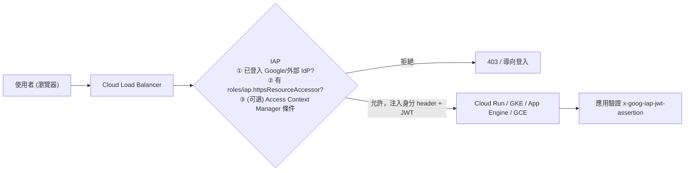
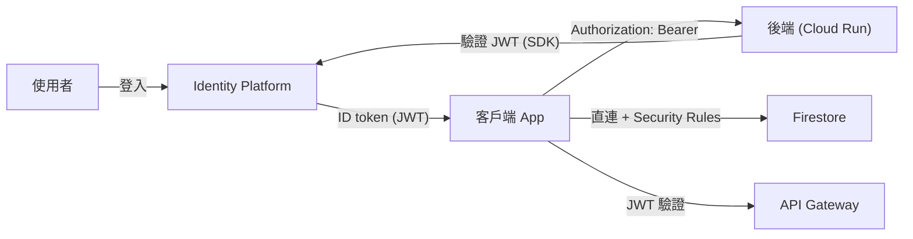

# IAP、Identity Platform 與 Web Security Scanner

> [!abstract] 一句話定位
> 官方考點原文：**「使用能識別漏洞並保護服務與資源的安全機制（例如 Identity-Aware Proxy、Web Security Scanner）」**。
> 這三個服務解決三個不同的問題：
> - **IAP** — 「誰可以打開這個應用？」（**存取守門員**，取代 VPN）
> - **Identity Platform** — 「我的 App 的終端使用者怎麼註冊登入？」（**CIAM**）
> - **Web Security Scanner** — 「我的網站有沒有常見漏洞？」（**自動掃描**）

---

## 🚪 Identity-Aware Proxy (IAP)

### 心智模型


**核心價值**：把「身分驗證」從應用裡拉到 LB 層。應用不需要實作登入，只要相信 IAP 注入的身分。
**注入的 header**：`X-Goog-Authenticated-User-Email`、`X-Goog-Authenticated-User-Id`、以及**可驗證的 `x-goog-iap-jwt-assertion`**。

> [!warning] 一定要驗證 JWT assertion
> 光讀 `X-Goog-Authenticated-User-Email` header 是**不安全的** — 如果有人能繞過 IAP 直接打到後端，就能偽造 header。
> **正解**：驗證 `x-goog-iap-jwt-assertion`（檢查簽章 + `aud` = IAP 的資源識別碼），**並且**把後端鎖成只接受來自 LB 的流量（`--ingress=internal-and-cloud-load-balancing`）。

```bash
# 授權特定使用者/群組存取 IAP 保護的資源
gcloud iap web add-iam-policy-binding \
  --resource-type=backend-services --service=my-backend \
  --member="group:engineering@example.com" --role="roles/iap.httpsResourceAccessor"

# Cloud Run 後端鎖死，只接受 LB 流量
gcloud run services update internal-admin --ingress=internal-and-cloud-load-balancing
```

### IAP 的使用場景
| 場景 | 說明 |
|---|---|
| **內部管理後台** | 員工用 Google 帳號登入，不需要 VPN → **BeyondCorp / 零信任** 的核心 |
| **TCP 轉送（IAP for TCP）** | SSH/RDP 到沒有公開 IP 的 VM（`gcloud compute ssh --tunnel-through-iap`） |
| **搭配 Access Context Manager** | 加上裝置狀態、IP 範圍、地理位置條件 |

> [!important] 考題判準
> - `internal application`、`employees only`、`without a VPN` → **IAP**
> - `SSH to a VM without a public IP` → **IAP for TCP forwarding**（或 Cloud Identity-Aware Proxy tunnel）
> - `millions of consumer users sign up` → **不是** IAP，是 **Identity Platform**

---

## 👥 Identity Platform / Firebase Authentication

**定位**：你的應用的**終端使用者**身分系統（CIAM）。

| 能力 | 說明 |
|---|---|
| 多種登入方式 | Email/密碼、電話、Google / Apple / Facebook / GitHub、匿名、**SAML / OIDC 企業 IdP** |
| MFA | 多因素驗證 |
| **簽發 JWT** | 登入後給客戶端一個 ID token（JWT），客戶端帶著呼叫你的後端 |
| 多租戶（multi-tenancy） | 一個專案多個租戶，各有獨立的使用者池 → **SaaS 必考** |
| 與 Firestore 整合 | `request.auth.uid` 直接用在 [[Firestore]] 的 Security Rules |



```python
# 後端驗證 Identity Platform / Firebase 的 ID token
import firebase_admin
from firebase_admin import auth
firebase_admin.initialize_app()

def get_uid(authorization_header: str) -> str:
    token = authorization_header.removeprefix("Bearer ")
    decoded = auth.verify_id_token(token)   # 驗簽 + iss + aud + exp 一次做完
    return decoded["uid"]
```

> [!important] Identity Platform vs IAM（**必考區分**）
> | | 管誰 | 規模 |
> |---|---|---|
> | **IAM** | 你的**團隊/服務帳戶**（存取 GCP 資源） | 數十～數千 |
> | **Identity Platform** | 你的**App 終端使用者** | 數百萬 |
> 「App 的使用者」永遠不該是 IAM principal。

---

## 🔎 Web Security Scanner

**定位**：自動爬你的 Web 應用，測試常見漏洞。

| 特性 | 說明 |
|---|---|
| 偵測項目 | XSS、混合內容（mixed content）、明文傳輸密碼、過時/有漏洞的函式庫、可清除的儲存空間、Flash injection 等 |
| 適用目標 | App Engine、Compute Engine、GKE（有公開 URL 的 Web 應用） |
| 模式 | 隨需掃描或排程掃描 |
| 屬於 | **Security Command Center** 的一部分 |

> [!danger] 掃描器會實際操作你的應用
> 它會填表單、點按鈕 → **可能建立/刪除資料、寄出信件**。
> **務必先在 staging 環境掃描**，或使用排除 URL 設定。這是很常考的注意事項。

---

## 🛡 Security Command Center（SCC）

**定位**：安全態勢的集中檢視 — 把各種偵測結果匯總成 **findings**。

| 來源 | 偵測什麼 |
|---|---|
| **Security Health Analytics** | 錯誤設定（公開 bucket、過寬 IAM、未加密磁碟、防火牆開太大） |
| **Web Security Scanner** | Web 應用漏洞 |
| **Event Threat Detection** | 從 log 偵測威脅（異常登入、挖礦、資料外洩） |
| **Artifact Analysis** | 容器映像漏洞（見 [[供應鏈安全 Artifact Analysis 與 Binary Authorization]]） |

> 官方考點：「**回應與修復漏洞，包含由 Artifact Analysis 與 Security Command Center 識別的漏洞**」
> → 開發者的處理流程：**SCC finding → 定位到程式碼/設定 → 修 → 重建映像 → 重新部署 → 確認 finding 關閉**。

---

## 🎯 考點速記

| 看到題目說… | 就想到 |
|---|---|
| `internal app for employees, no VPN` | **IAP** |
| `SSH to a VM with no external IP` | **IAP TCP forwarding** |
| `application must not implement login itself` | **IAP**（+ 驗證 JWT assertion） |
| `millions of consumer users, social login, MFA` | **Identity Platform** |
| `multi-tenant SaaS user isolation` | Identity Platform **multi-tenancy** |
| `mobile app users only see their own Firestore data` | Identity Platform + **Security Rules** |
| `automatically detect XSS and outdated libraries` | **Web Security Scanner** |
| `central view of misconfigurations across projects` | **Security Command Center** |
| `public bucket / over-permissive IAM 被發現` | SCC **Security Health Analytics** |
| 掃描可能破壞資料 | 在 **staging** 掃 / 排除 URL |

## 💣 真實場景陷阱

1. **只讀 IAP 的 email header 不驗 JWT**：後端若能被繞過就等於無驗證。
2. **IAP 開了但後端仍公開**：直接打後端 URL 就繞過 IAP。要鎖 ingress。
3. **用 IAP 管終端消費者**：IAP 的 principal 是 IAM 身分，不適合百萬使用者。
4. **在生產環境跑 Web Security Scanner**：資料被亂改、垃圾信寄出去。
5. **前端驗證 JWT 就當安全**：所有授權判斷必須在後端做。
6. **忽略 SCC findings**：考試強調「要有回應流程」，不只是偵測。

## ✍️ 自我檢核

1. IAP 解決什麼問題？它注入哪些 header？為什麼一定要驗證 JWT assertion？
2. 「IAP 保護的 Cloud Run」要怎麼設定 ingress 才不會被繞過？
3. IAM 與 Identity Platform 的分工？各管多少規模的身分？
4. 行動 App 使用者登入後，後端怎麼知道他是誰？程式碼要做什麼？
5. Web Security Scanner 有什麼風險？該怎麼安全使用？
6. SCC 的四類來源？發現 critical finding 後你的處理流程是什麼？

## 🔗 相關

- [[IAM 與服務帳戶]]
- [[驗證與授權 ADC OAuth JWT]]
- [[供應鏈安全 Artifact Analysis 與 Binary Authorization]]
- [[Load Balancing 與 Session Affinity]]
- [[API 管理 Apigee 與 API Gateway]]
- [[Firestore]]
- [[Cloud Run]]
- [[Section 1 設計可擴充安全可靠的雲端原生應用]]
