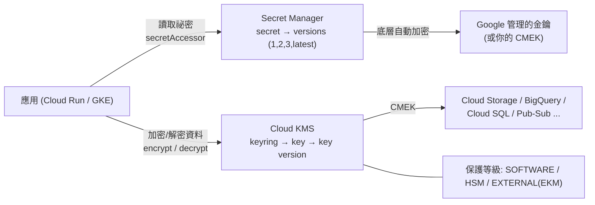
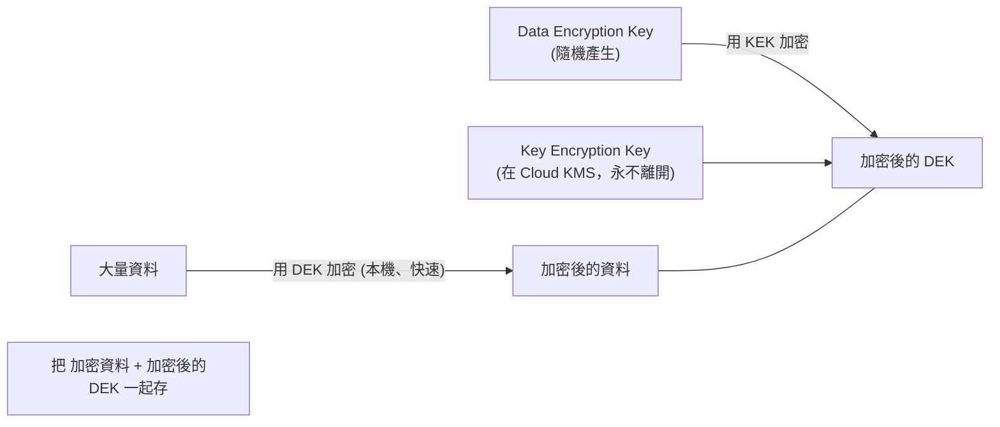

# Secret Manager 與 Cloud KMS

> [!abstract] 一句話定位
> - **Secret Manager**：存放**祕密本身**（密碼、API key、憑證、私鑰字串），有版本、有 IAM、有稽核、可輪替。
> - **Cloud KMS**：管理**加密金鑰**，用來加密其他東西（信封加密、CMEK）。
>
> 一句話區分：**要存「值」→ Secret Manager；要管「鑰匙」→ KMS。**

---

## 📘 技術理解
*原理、限制與實務操作 —— 不為考試也該懂的部分。*

### 🧠 兩者的關係



---

### 🔐 Secret Manager

#### 核心概念
| 概念 | 說明 |
|---|---|
| **Secret** | 容器（有名稱、IAM 政策、複寫設定、輪替設定） |
| **Version** | 實際的祕密值。**不可變**；新值 = 新版本 |
| **`latest` 別名** | 永遠指向最新啟用的版本 |
| **版本狀態** | `ENABLED` / `DISABLED` / `DESTROYED`（destroy 後值永久消失） |
| **複寫策略** | `automatic`（Google 選多區域）或 `user-managed`（你指定 region，資料落地需求） |
| **輪替（rotation）** | 可設定輪替週期 + 通知 topic → **但實際換值要你自己實作**（Secret Manager 只發通知） |

```bash
# 建立祕密並寫入版本
echo -n "s3cr3t" | gcloud secrets create db-password --data-file=- \
  --replication-policy=user-managed --locations=asia-east1

echo -n "newS3cr3t" | gcloud secrets versions add db-password --data-file=-

# 最小權限：只給讀取，且只給這個祕密
gcloud secrets add-iam-policy-binding db-password \
  --member="serviceAccount:api-sa@$PROJECT.iam.gserviceaccount.com" \
  --role="roles/secretmanager.secretAccessor"

# 設定輪替通知
gcloud secrets update db-password \
  --next-rotation-time="2026-12-01T00:00:00Z" --rotation-period="90d" \
  --topic=projects/$PROJECT/topics/secret-rotation
```

#### 在 Cloud Run / GKE 使用
```bash
# Cloud Run：注入為環境變數（啟動時解析一次）
gcloud run deploy api --set-secrets="DB_PASS=db-password:latest"

# Cloud Run：掛載為檔案（可在不重啟的情況下讀到新值，若用 latest）
gcloud run deploy api --set-secrets="/secrets/db/password=db-password:latest"
```
```yaml
# GKE：Secret Manager CSI driver（考試偏好，優於 K8s Secret）
apiVersion: secrets-store.csi.x-k8s.io/v1
kind: SecretProviderClass
metadata: { name: app-secrets }
spec:
  provider: gcp
  parameters:
    secrets: |
      - resourceName: "projects/PROJECT/secrets/db-password/versions/latest"
        path: "db-password.txt"
```

> [!important] `latest` vs 釘住版本（pin）
> - `latest`：輪替後自動取到新值，**但也可能在你不知情時改變行為**。
> - `db-password:3`（釘住）：可重現、可控，**但輪替後要重新部署**。
> **生產環境建議釘住版本 + 有意識地升版**；考題若強調「自動取得輪替後的新密碼」則用 `latest` + volume 掛載。

#### 程式碼讀取（含快取）
```python
from google.cloud import secretmanager
from functools import lru_cache

client = secretmanager.SecretManagerServiceClient()

@lru_cache(maxsize=8)                    # ⚠️ 快取避免每次請求都呼叫 API（配額與延遲）
def get_secret(name: str, version="latest") -> str:
    path = f"projects/{PROJECT}/secrets/{name}/versions/{version}"
    return client.access_secret_version(name=path).payload.data.decode()
```
> **陷阱**：在每個 HTTP 請求裡呼叫 `access_secret_version` → 延遲增加、觸發配額限制。要在啟動時讀一次或加快取。

---

### 🗝 Cloud KMS

#### 階層與概念
```
Project → Location → KeyRing → CryptoKey → CryptoKeyVersion
```
| 概念 | 說明 |
|---|---|
| **KeyRing** | 金鑰的容器，綁定 location（**建立後不能刪除、不能移動**） |
| **CryptoKey** | 邏輯金鑰，有用途（`ENCRYPT_DECRYPT`、`ASYMMETRIC_SIGN`、`MAC`） |
| **CryptoKeyVersion** | 實際的金鑰材料；輪替會產生新版本，舊版本仍可解密舊資料 |
| **自動輪替** | `--rotation-period=90d` → 新的加密用新版本，解密自動找對版本 |
| **保護等級** | `SOFTWARE`、**`HSM`**（FIPS 140-2 Level 3）、`EXTERNAL`（EKM，金鑰在你的外部 KMS） |

#### 三種加密模式（**必考對照**）
| 模式 | 誰持有金鑰 | 說明 |
|---|---|---|
| **Google-managed（預設）** | Google | 所有資料預設就加密，你什麼都不用做 |
| **CMEK**（Customer-Managed） | **你在 Cloud KMS 裡管理** | 你能輪替、停用、撤銷 → **撤銷金鑰就無法讀取資料** |
| **CSEK**（Customer-Supplied） | 你自己保管，呼叫時傳入 | 僅部分服務支援（如 GCS/GCE），Google 不儲存金鑰 |
| **EKM**（External Key Manager） | 你的外部/第三方 KMS | 最高主權要求（金鑰完全不在 Google） |

> [!important] 考題判準
> - `我們必須能夠自行輪替與撤銷加密金鑰` → **CMEK**
> - `金鑰不能存放在 Google Cloud` → **EKM**（或 CSEK）
> - `符合 FIPS 140-2 Level 3` → **HSM 保護等級**
> - 沒有特別要求 → 預設加密就夠（不要過度設計）

#### 信封加密（Envelope Encryption）

> 為什麼：KMS 的 `encrypt` API 有大小限制（適合小資料）。大檔案要**本機用 DEK 加密、只把 DEK 交給 KMS 加密**。
> 考題關鍵詞：`encrypt large files`、`minimize KMS API calls` → **envelope encryption**。

```python
from google.cloud import kms
client = kms.KeyManagementServiceClient()
key = client.crypto_key_path(PROJECT, "asia-east1", "app-ring", "data-key")

enc = client.encrypt(request={"name": key, "plaintext": b"small secret"})
dec = client.decrypt(request={"name": key, "ciphertext": enc.ciphertext})
```

**常用角色**
| 角色 | 能做什麼 |
|---|---|
| `roles/cloudkms.cryptoKeyEncrypterDecrypter` | 用金鑰加解密（**應用要的就是這個**） |
| `roles/cloudkms.admin` | 管理金鑰（**不含**使用金鑰 → 職責分離） |
| `roles/cloudkms.viewer` | 查看中繼資料 |

> [!tip] 職責分離是考點
> KMS admin **不能**用金鑰解密，使用者**不能**管理金鑰 → 這是刻意的設計。

---

### ⚖️ Secret Manager vs 其他存放方式

| 方式 | 評價 |
|---|---|
| **Secret Manager** | ⭐ 正解：版本化、IAM 細緻、稽核、可輪替 |
| 環境變數（直接寫在部署設定裡） | ❌ 會出現在部署設定與 log；沒有版本與稽核 |
| 設定檔進 git | ❌❌ 最糟 |
| Kubernetes Secret（僅 base64） | ⚠️ 只是編碼，不是加密 → 改用 CSI driver 從 Secret Manager 取 |
| KMS 加密後存 GCS | ⚠️ 可行但要自己做版本與存取管理 → Secret Manager 已經幫你做了 |

---

## 🎯 應試
*考場上的提取線索與自我測驗 —— 備考期才需要。*

### 🎯 考點速記

| 看到題目說… | 就想到 |
|---|---|
| `store database passwords / API keys securely` | **Secret Manager** |
| `rotate credentials regularly with audit trail` | Secret Manager 版本 + 輪替通知 |
| `data residency: secret must stay in a region` | **user-managed replication** |
| `application must pick up new secret without redeploy` | `latest` + **volume 掛載** |
| `reproducible deployments` | **釘住版本號** |
| `manage our own encryption keys, be able to revoke` | **CMEK**（Cloud KMS） |
| `keys must never be stored in Google Cloud` | **EKM / CSEK** |
| `FIPS 140-2 Level 3` | **HSM** 保護等級 |
| `encrypt many large files efficiently` | **信封加密**（DEK + KEK） |
| `KMS 管理者不該能解密資料` | 職責分離：`admin` vs `cryptoKeyEncrypterDecrypter` |
| `Kubernetes Secret 不夠安全` | **Secret Manager CSI driver** |
| 每個請求都讀祕密造成延遲 | 啟動時讀一次 / **快取** |

### 💣 真實場景陷阱

1. **在請求路徑上呼叫 Secret Manager**：延遲 + 配額。啟動載入或快取。
2. **用 `latest` 卻以環境變數注入**：env 只在啟動時解析 → 輪替後沒生效，還以為會自動更新。
3. **銷毀（destroy）版本後才發現還在用**：無法復原。先 `disable` 觀察再 destroy。
4. **CMEK 金鑰被停用/刪除**：所有依賴它的資料立刻無法讀取（這是特性，也是風險）。金鑰的 location 必須和資源相容。
5. **KeyRing 建錯 location**：不能移動也不能刪除。
6. **把整個專案的 `secretAccessor` 給服務**：能讀所有祕密。要在**單一祕密**上授權。

### ✍️ 自我檢核

1. Secret Manager 與 Cloud KMS 的分工？各存什麼？
2. `latest` 與釘住版本的取捨？「不重新部署就取得新密碼」該怎麼配置？
3. Google-managed / CMEK / CSEK / EKM 四者的差別？各對應什麼需求詞？
4. 什麼是信封加密？為什麼需要它？
5. 為什麼 KMS admin 不能解密？這叫什麼原則？
6. 為什麼 Kubernetes Secret 不算安全儲存？正解是什麼？
7. 讀取祕密的程式碼放在哪裡才對？放錯會有什麼症狀？

## 🔗 相關

- [[IAM 與服務帳戶]]
- [[驗證與授權 ADC OAuth JWT]]
- [[Workload Identity Federation]]
- [[Cloud Run]]
- [[GKE 基礎與 Autopilot]]
- [[Cloud Storage]]
- [[Cloud SQL 與 AlloyDB]]
- [[Cloud Build]]
- [[Lab 05 安全 Secret WIF 與 Binary Authorization]]
- [[Section 1 設計可擴充安全可靠的雲端原生應用]]
