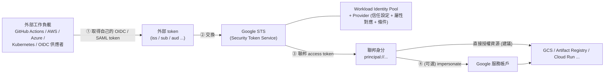

# Workload Identity Federation (WIF)

> [!abstract] 一句話定位
> **讓 Google Cloud 之外的工作負載，用它「原本的身分」換取 Google Cloud 的短期憑證 — 完全不需要服務帳戶金鑰檔案。**
> 考題關鍵詞：`GitHub Actions`、`AWS`、`on-premises`、`without service account keys`、`eliminate long-lived credentials`。

---

## 🧠 心智模型



**四個步驟**
1. 外部平台給工作負載一個**它自己簽發的 OIDC token**（例如 GitHub Actions 的 `id-token`）。
2. 用這個 token 呼叫 Google **STS** 交換。
3. Google 依你設定的 **Workload Identity Pool + Provider**（信任哪個 issuer、要滿足什麼條件）驗證後，回一個短期的 Google 憑證。
4. 這個聯邦身分可以**直接被授予 IAM 角色**，或**impersonate 一個服務帳戶**。

> [!important] 為什麼這是「正解」
> 服務帳戶 JSON 金鑰是**長期有效的明文憑證** — 會被 commit 進 git、留在 CI 設定裡、無法自動輪替。
> WIF 換來的憑證**存活數十分鐘**，且可以用條件限制「只有 `main` 分支的 workflow 才能拿到」。

---

## ⚙️ 設定範例：GitHub Actions 部署到 Cloud Run

```bash
# 1) 建立 pool 與 provider
gcloud iam workload-identity-pools create github-pool --location=global

gcloud iam workload-identity-pools providers create-oidc github-provider \
  --location=global --workload-identity-pool=github-pool \
  --issuer-uri="https://token.actions.githubusercontent.com" \
  --attribute-mapping="google.subject=assertion.sub,attribute.repository=assertion.repository,attribute.ref=assertion.ref" \
  --attribute-condition="assertion.repository=='ChunPingWang/my-app' && assertion.ref=='refs/heads/main'"
  # ↑ 條件是關鍵：只信任這個 repo 的 main 分支

# 2) 讓這個外部身分可以 impersonate 部署用的 SA
POOL="projects/$PROJECT_NUMBER/locations/global/workloadIdentityPools/github-pool"
gcloud iam service-accounts add-iam-policy-binding deployer@$PROJECT.iam.gserviceaccount.com \
  --role=roles/iam.workloadIdentityUser \
  --member="principalSet://iam.googleapis.com/$POOL/attribute.repository/ChunPingWang/my-app"
```

```yaml
# .github/workflows/deploy.yml
permissions:
  contents: read
  id-token: write          # ← 沒有這行拿不到 OIDC token
jobs:
  deploy:
    runs-on: ubuntu-latest
    steps:
      - uses: actions/checkout@v4
      - uses: google-github-actions/auth@v2
        with:
          workload_identity_provider: projects/PROJECT_NUMBER/locations/global/workloadIdentityPools/github-pool/providers/github-provider
          service_account: deployer@PROJECT.iam.gserviceaccount.com
      - run: gcloud run deploy api --source . --region asia-east1
```

---

## 🧩 三種 principal 寫法（考試會出現）

| 寫法 | 範圍 |
|---|---|
| `principal://iam.googleapis.com/POOL/subject/SUBJECT` | **單一**外部身分 |
| `principalSet://iam.googleapis.com/POOL/attribute.repository/owner/repo` | 符合某個**屬性**的一群身分 |
| `principalSet://iam.googleapis.com/POOL/*` | 該 pool 的**所有**身分（⚠️ 太寬） |

**兩種授權方式**
1. **直接授權聯邦身分**（`principalSet://…` 直接綁在資源上）→ 更少中介、更簡單（建議）。
2. **Impersonate 服務帳戶**（給 `roles/iam.workloadIdentityUser`）→ 相容既有以 SA 為中心的權限設計。

---

## 🆚 相關但不同的三個東西（**高頻混淆**）

| 名稱 | 用在哪 | 解決什麼 |
|---|---|---|
| **Workload Identity Federation** | **GCP 之外**的工作負載（GitHub、AWS、地端 K8s） | 外部身分 → GCP 短期憑證 |
| **Workload Identity Federation for GKE** | **GKE 內的 Pod** | KSA → GSA，Pod 免金鑰存取 GCP（見 [[GKE 基礎與 Autopilot]]） |
| **Workforce Identity Federation** | **人類使用者**（企業 IdP 如 Okta、AD） | 員工用公司帳號登入 GCP Console/CLI，不需 Google 帳號 |

> 考題只要出現 **「人」** → Workforce；出現 **「機器/CI/其他雲」** → Workload。

---

## 🎯 考點速記

| 看到題目說… | 就想到 |
|---|---|
| `GitHub Actions / GitLab CI 部署到 GCP` + `no keys` | **WIF** |
| `workload running in AWS needs to read a GCS bucket` | **WIF**（AWS provider） |
| `eliminate long-lived service account keys` | **WIF**（或附加 SA，若在 GCP 內） |
| `on-premises app needs GCP access securely` | **WIF**（OIDC provider） |
| `only the main branch may deploy to production` | Provider 的 **attribute-condition** |
| `Pod in GKE needs to call Pub/Sub` | **Workload Identity for GKE**（不是一般 WIF） |
| `employees log in with Okta to use the Console` | **Workforce Identity Federation** |
| `organization policy to ban SA keys` | `constraints/iam.disableServiceAccountKeyCreation` |

## 💣 真實場景陷阱

1. **沒設 `attribute-condition`**：任何 GitHub repo 的 workflow 都能拿到你的憑證 → **嚴重漏洞**。條件是必需的，不是可選的。
2. **忘了 `id-token: write` 權限**：GitHub workflow 拿不到 OIDC token，錯誤訊息不明顯。
3. **用 pool 的 `*` 當 principalSet**：範圍過寬。
4. **以為 WIF 能取代 GKE 的 Workload Identity**：GKE 內有專用機制，不要混用。
5. **把 WIF 設定檔當成祕密保護**：那個 JSON 設定檔**不含祕密**（它只描述如何交換），可以放進版控。
6. **憑證有效期沒考慮**：長時間的 job 需要處理 token 續期（用戶端程式庫通常會處理）。

## ✍️ 自我檢核

1. WIF 的四個步驟是什麼？哪一步驗證信任？
2. 為什麼 `attribute-condition` 是必要的？不設會怎樣？
3. `principal://` 與 `principalSet://` 的差別？
4. WIF、WIF for GKE、Workforce Identity Federation 的差別？各用在哪？
5. GitHub Actions 要部署 Cloud Run，完整需要哪些設定（GCP 端 + workflow 端）？
6. 為什麼 WIF 的設定檔可以放進 git？

## 🔗 相關

- [[IAM 與服務帳戶]]
- [[驗證與授權 ADC OAuth JWT]]
- [[GKE 基礎與 Autopilot]]
- [[Secret Manager 與 Cloud KMS]]
- [[Cloud Build]]
- [[Lab 05 安全 Secret WIF 與 Binary Authorization]]
- [[Section 1 設計可擴充安全可靠的雲端原生應用]]
