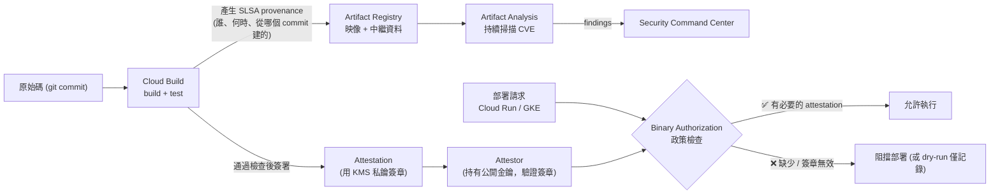
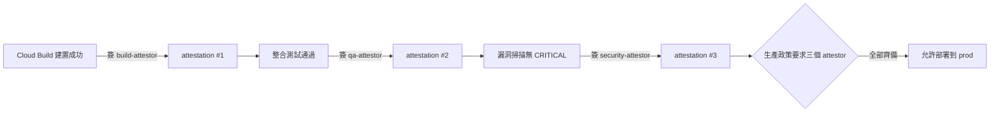

# 供應鏈安全：Artifact Analysis 與 Binary Authorization

> [!abstract] 一句話定位
> 官方考點在兩個 Section 都出現：
> - S1.2：**「用 Binary Authorization 保護應用產出物」**、**「回應與修復由 Artifact Analysis 與 SCC 識別的漏洞」**
> - S2.2：**「在 Cloud Build 設定 provenance（例如 Binary Authorization）」**
>
> 核心問題：**你怎麼證明「正在生產環境跑的這個映像」確實是從你信任的原始碼、經過你信任的流程建出來的？**

---

## 📘 技術理解
*原理、限制與實務操作 —— 不為考試也該懂的部分。*

### 🧠 完整供應鏈心智模型



---

### 🔍 Artifact Analysis（原 Container Analysis）

| 功能 | 說明 |
|---|---|
| **自動掃描（on-push）** | 映像推進 Artifact Registry 時自動掃描 OS 套件漏洞 |
| **持續分析** | 映像已存在但**新 CVE 公布後**會更新既有映像的漏洞資訊 |
| **語言套件掃描** | 除 OS 套件外，也可掃描 Go / Java / Python / Node 等依賴 |
| **SBOM** | 產生軟體物料清單 |
| **中繼資料儲存** | 掃描結果、attestation、build provenance 都以 **Note / Occurrence** 形式存放 |

```bash
# 開啟掃描
gcloud services enable containerscanning.googleapis.com

# 查詢某個映像的漏洞
gcloud artifacts docker images list-vulnerabilities \
  asia-east1-docker.pkg.dev/$PROJECT/repo/api@sha256:abc...

# 在 CI 中依嚴重度 gate（概念示意）
gcloud artifacts docker images describe IMAGE --show-package-vulnerability \
  --format="value(package_vulnerability_summary)"
```

#### 漏洞回應流程（**考題會問「你的處理順序」**）
1. **分級**：看嚴重度（CRITICAL/HIGH）+ **是否可利用**（有沒有實際暴露路徑）。
2. **定位來源**：是基底映像（base image）還是應用依賴？
3. **修復**：
   - 基底映像 → **更新基底映像版本並重建**（最常見）
   - 應用依賴 → 升級套件版本、重建
   - 無修補 → 記錄例外、加補償控制（WAF、網路隔離）
4. **重新部署**，並確認 finding 關閉。
5. **預防**：用 **distroless / minimal 基底映像**（減少攻擊面）、固定基底映像 digest、在 CI 加掃描 gate。

> [!important] 考點
> 「映像有 critical 漏洞，最有效的長期解法」→ **改用 minimal/distroless 基底映像 + 在 CI pipeline 加自動掃描 gate**，而不是只手動修這一次。

---

### 🛂 Binary Authorization

**定位**：部署時的**准入控制（admission control）**。它問一個問題：「這個映像有沒有我要求的簽章？」

#### 核心概念
| 概念 | 說明 |
|---|---|
| **Policy（政策）** | 定義規則：預設規則 + 依叢集/命名空間的例外規則 |
| **Evaluation mode** | `ALWAYS_ALLOW`（全通）、`ALWAYS_DENY`（全擋）、**`REQUIRE_ATTESTATION`**（需簽章） |
| **Attestor（驗證者）** | 持有**公開金鑰**，負責驗證 attestation 的簽章。通常一個階段一個 attestor（如 `build-attestor`、`qa-attestor`、`security-attestor`） |
| **Attestation（證明）** | 「某個映像 digest 通過了某個檢查」的**簽章聲明**（用 [[Secret Manager 與 Cloud KMS]] 的非對稱金鑰簽） |
| **Allowlist（豁免映像）** | 例如 `gcr.io/google-containers/*`（系統元件） |
| **Dry-run 模式** | 只記錄違規、不阻擋 → **導入時的必經階段** |
| **Breakglass** | 緊急情況下用特定 annotation 繞過（會被稽核記錄） |

```yaml
# Binary Authorization policy（匯出/匯入用 gcloud container binauthz policy）
defaultAdmissionRule:
  evaluationMode: REQUIRE_ATTESTATION
  enforcementMode: ENFORCED_BLOCK_AND_AUDIT_LOG
  requireAttestationsBy:
    - projects/PROJECT/attestors/build-attestor
    - projects/PROJECT/attestors/security-attestor
clusterAdmissionRules:
  "asia-east1.dev-cluster":                 # 開發叢集寬鬆一點
    evaluationMode: ALWAYS_ALLOW
    enforcementMode: DRYRUN_AUDIT_LOG_ONLY
admissionWhitelistPatterns:
  - namePattern: "asia-east1-docker.pkg.dev/PROJECT/base/*"
globalPolicyEvaluationMode: ENABLE          # 同時信任 Google 維護的系統映像清單
```

```bash
# 建立 attestor（使用 KMS 非對稱簽章金鑰）
gcloud container binauthz attestors create build-attestor \
  --attestation-authority-note=build-note --attestation-authority-note-project=$PROJECT
gcloud container binauthz attestors public-keys add --attestor=build-attestor \
  --keyversion-project=$PROJECT --keyversion-location=asia-east1 \
  --keyversion-keyring=binauthz --keyversion-key=build-key --keyversion=1

# 在 Cloud Build 通過測試後簽署映像
gcloud container binauthz attestations sign-and-create \
  --artifact-url="asia-east1-docker.pkg.dev/$PROJECT/repo/api@sha256:$DIGEST" \
  --attestor=build-attestor --attestor-project=$PROJECT \
  --keyversion-project=$PROJECT --keyversion-location=asia-east1 \
  --keyversion-keyring=binauthz --keyversion-key=build-key --keyversion=1

# 在 Cloud Run 啟用（服務層級）
gcloud run deploy api --image ...@sha256:$DIGEST --binary-authorization=default
```

> [!important] Binary Authorization 只認 **digest**，不認 tag
> `:latest` 這種可變 tag 無法保證內容 → 部署必須用 `@sha256:...`。
> 這是很常考的細節：「為什麼 Binary Auth 要求用 digest 部署？」→ tag 可被重新指向，digest 不可變。

#### 多階段簽章（真實流程）

→ 這就是「**不能跳過測試直接部署到生產**」的技術保證。

---

### 🧱 其他供應鏈最佳實務（考試會零散出現）

| 實務 | 說明 |
|---|---|
| **固定基底映像 digest** | `FROM node:20@sha256:...` 而不是 `FROM node:latest` |
| **多階段建置（multi-stage build）** | 編譯階段與執行階段分離 → 最終映像不含編譯器與原始碼 |
| **distroless / minimal 映像** | 沒有 shell、沒有套件管理器 → 攻擊面極小 |
| **不以 root 執行** | `USER nonroot`；GKE 可用 PodSecurity / Autopilot 預設限制 |
| **Artifact Registry 清理政策** | 自動刪除舊映像，減少未修補的殘留 |
| **SLSA provenance** | Cloud Build 可產生「這個映像從哪個 commit、用什麼流程建出」的可驗證紀錄 |
| **Assured Open Source Software** | Google 掃描並簽署過的 OSS 套件 |

```dockerfile
# 多階段 + distroless + 非 root 的範例
FROM golang:1.23@sha256:aaaa AS build
WORKDIR /src
COPY go.* ./
RUN go mod download
COPY . .
RUN CGO_ENABLED=0 go build -o /out/server ./cmd/server

FROM gcr.io/distroless/static-debian12:nonroot
COPY --from=build /out/server /server
USER nonroot:nonroot
ENTRYPOINT ["/server"]
```

---

## 🎯 應試
*考場上的提取線索與自我測驗 —— 備考期才需要。*

### 🎯 考點速記

| 看到題目說… | 就想到 |
|---|---|
| `only images built by our CI may be deployed` | **Binary Authorization** + attestation |
| `prevent deploying images that skipped testing` | 多階段 **attestor** |
| `automatically scan images for vulnerabilities` | **Artifact Analysis**（on-push + 持續分析） |
| `新 CVE 公布後要知道既有映像有沒有中` | Artifact Analysis **持續分析** |
| `roll out Binary Auth without breaking deployments` | **dry-run / DRYRUN_AUDIT_LOG_ONLY** 先觀察 |
| `emergency deployment during an incident` | **breakglass**（會留稽核紀錄） |
| `verifiable record of how the image was built` | **provenance（SLSA）** from Cloud Build |
| `reduce container attack surface` | **distroless / minimal base + 多階段建置 + 非 root** |
| `centrally see all vulnerability findings` | **Security Command Center** |
| `為什麼不能用 :latest 部署` | Binary Auth 需要**不可變的 digest** |

### 💣 真實場景陷阱

1. **直接開 ENFORCED 模式**：所有既有部署被擋，生產事故。一定先 dry-run。
2. **用 tag 部署**：Binary Auth 無法驗證，部署被拒。
3. **只掃不修**：Artifact Analysis 報了 100 個 CVE，沒有分級與修復流程 → 等於沒做。
4. **base image 沒固定**：同樣的 Dockerfile 今天與下週建出不同內容，無法重現。
5. **忘記系統映像 allowlist**：GKE 的系統 Pod（如 kube-proxy）被政策擋住，叢集異常。
6. **簽章金鑰權限太鬆**：任何人都能簽 → 整個機制失效。簽章金鑰只能給 CI 的 SA。

### ✍️ 自我檢核

1. 從 commit 到生產部署，供應鏈上有哪些安全關卡？各由什麼服務負責？
2. Attestor 與 attestation 的關係？金鑰放在哪裡？誰該有簽章權限？
3. 為什麼 Binary Authorization 要求用 digest 而不是 tag？
4. 導入 Binary Authorization 的安全步驟是什麼？
5. Artifact Analysis 報了 CRITICAL CVE，你的五步處理流程？
6. 「不能跳過測試直接部署到生產」怎麼用技術保證？
7. 減少容器攻擊面的四個具體做法？

## 🔗 相關

- [[Cloud Build]]
- [[Artifact Registry]]
- [[Secret Manager 與 Cloud KMS]]
- [[IAM 與服務帳戶]]
- [[IAP Identity Platform 與 Web Security Scanner]]
- [[Cloud Deploy 與部署策略]]
- [[GKE 基礎與 Autopilot]]
- [[Cloud Run]]
- [[Lab 05 安全 Secret WIF 與 Binary Authorization]]
- [[Section 2 建置與測試應用]]
