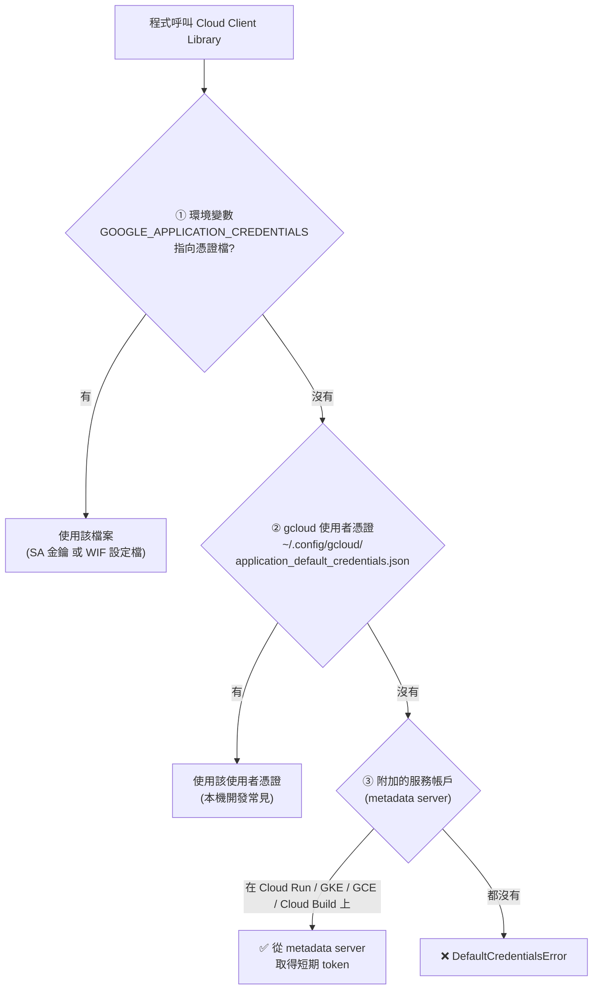
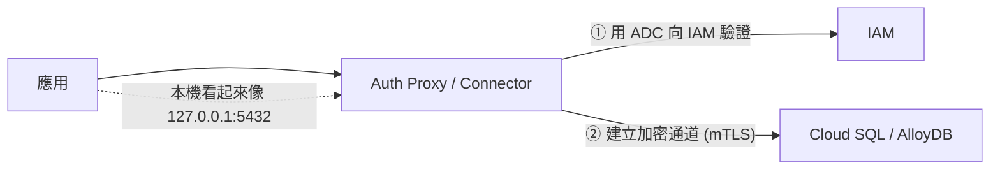

# 驗證與授權：ADC、OAuth 2.0、JWT

> [!abstract] 一句話定位
> 官方考點原文：**「驗證到 Google Cloud 服務（Application Default Credentials、JWT、OAuth 2.0、Cloud SQL Auth Proxy、AlloyDB Auth Proxy、Identity Platform、WIF）」**。
> 這篇要解決兩個最容易混淆的問題：**① ADC 到底怎麼找到憑證？② 什麼時候用 access token、什麼時候用 ID token？**

---

## 📘 技術理解
*原理、限制與實務操作 —— 不為考試也該懂的部分。*

### 🔍 Application Default Credentials (ADC)

**ADC 是一個「憑證搜尋策略」**，讓同一份程式碼在本機、CI、雲上都能自動找到身分。用戶端程式庫預設就用它。



```bash
# 本機開發：讓 ADC 使用你的 Google 帳號
gcloud auth application-default login

# 本機開發但想用 SA 的權限（不下載金鑰）⭐ 推薦
gcloud auth application-default login \
  --impersonate-service-account=api-sa@$PROJECT.iam.gserviceaccount.com
```

```python
# 程式碼完全不需要知道自己在哪裡執行
from google.cloud import storage
client = storage.Client()          # ADC 自動處理

# 也可以明確取得憑證與 token
import google.auth
credentials, project = google.auth.default()
```

> [!important] 三個必考重點
> 1. **在 Cloud Run / GKE / GCE 上，不需要任何憑證檔案** — metadata server 會給短期 token。
> 2. `GOOGLE_APPLICATION_CREDENTIALS` 指向的可以是 SA 金鑰，**也可以是 WIF 的設定檔**（外部身分）。
> 3. 順序是固定的 → 本機「明明設了環境變數卻用到別的身分」通常是搞錯優先序。

#### Metadata server（值得記住的細節）
```bash
# 在 GCE/GKE/Cloud Run 內部可直接取得 token（考題偶爾出現）
curl -H "Metadata-Flavor: Google" \
  "http://metadata.google.internal/computeMetadata/v1/instance/service-accounts/default/token"

# 取得 ID token（呼叫 Cloud Run 用）
curl -H "Metadata-Flavor: Google" \
  "http://metadata.google.internal/computeMetadata/v1/instance/service-accounts/default/identity?audience=https://svc-b-xxx.a.run.app"
```
> `Metadata-Flavor: Google` header 是必須的（防 SSRF）。

---

### 🎫 Access token vs ID token（**最高頻混淆點**）

| | **Access token** | **ID token（JWT）** |
|---|---|---|
| 回答的問題 | 「我**被允許**做什麼」（授權） | 「我**是誰**」（身分） |
| 格式 | 不透明字串（`ya29.…`） | **JWT**（有 header/payload/signature，可解碼驗證） |
| 關鍵欄位 | scope | **`aud`（audience）**、`iss`、`email`、`exp` |
| 用來呼叫 | **Google Cloud API**（Storage、Pub/Sub、Firestore…） | **Cloud Run / Cloud Functions / IAP / API Gateway** 等「服務端點」 |
| 怎麼取得 | ADC 自動 / `gcloud auth print-access-token` | `fetch_id_token(audience)` / `gcloud auth print-identity-token` |

```python
# 呼叫 Google Cloud API → 用戶端程式庫自動用 access token
from google.cloud import pubsub_v1
pubsub_v1.PublisherClient().publish(topic, b"hi")        # 你什麼都不用做

# 呼叫另一個 Cloud Run 服務 → 需要 ID token，audience = 目標 URL
import google.auth.transport.requests, google.oauth2.id_token, requests
AUD = "https://svc-b-xxxx.a.run.app"
tok = google.oauth2.id_token.fetch_id_token(google.auth.transport.requests.Request(), AUD)
requests.get(AUD + "/api", headers={"Authorization": f"Bearer {tok}"})
```

> [!warning] 最常見的 401 原因
> 用 **access token** 去呼叫需驗證的 Cloud Run → 401。必須用 **ID token**，且 `aud` 要等於目標服務的 URL。
> 反之，用 ID token 去呼叫 Firestore API → 也會失敗。

---

### 🔑 OAuth 2.0 的三種流程（考試只需分辨用途）

| 流程 | 誰是主角 | 用途 |
|---|---|---|
| **Authorization Code（+ PKCE）** | **終端使用者** | 「讓我的 App 代表使用者存取他的 Google Drive/Gmail」→ 使用者同意畫面 |
| **Service Account（JWT bearer / 2-legged）** | **機器** | 伺服器對伺服器，沒有使用者參與 → 就是 ADC 背後做的事 |
| **Client Credentials** | 機器 | 第三方 API 常見（Apigee 可簽發） |

**Scope（範圍）**：access token 攜帶的權限範圍，例如 `https://www.googleapis.com/auth/cloud-platform`（最廣）、`…/devstorage.read_only`。
> **Scope 限制 token 能做什麼，IAM 限制身分能做什麼 → 兩者都要通過。**

#### JWT 的結構與驗證（要能看懂）
```
header.payload.signature

# payload（ID token 的典型內容）
{
  "iss": "https://accounts.google.com",
  "aud": "https://svc-b-xxxx.a.run.app",      ← 必須驗證！
  "sub": "1234567890",
  "email": "api-sa@proj.iam.gserviceaccount.com",
  "email_verified": true,
  "iat": 1790000000,
  "exp": 1790003600                            ← 必須驗證！
}
```
**驗證 JWT 的必要步驟**：① 用發行者的公開金鑰（JWKS）驗簽 → ② 檢查 `iss` → ③ 檢查 **`aud`** → ④ 檢查 `exp`/`nbf`。
> 考題：「後端如何驗證前端傳來的 Firebase token」→ 用官方 SDK 驗證（會做完上述四步）；**不要**自己解 base64 就相信。

---

### 🗄 資料庫的驗證：Auth Proxy 與 IAM 資料庫驗證

官方指南特別點名 **Cloud SQL Auth Proxy** 與 **AlloyDB Auth Proxy**。


| 好處 | 說明 |
|---|---|
| 不用管理 SSL 憑證 | Proxy 自動處理加密 |
| 不用開放公開 IP / 授權網路 | 走 Google 的控制平面 |
| 可搭 **IAM 資料庫驗證** | **完全不需要資料庫密碼**（用 SA 身分登入） |

```bash
./cloud-sql-proxy $PROJECT:asia-east1:orders-db --auto-iam-authn
# 需要：roles/cloudsql.client + roles/cloudsql.instanceUser
```
詳見 [[Cloud SQL 與 AlloyDB]]。

---

### 👤 終端使用者驗證（vs 服務身分）

| 你要驗證的對象 | 用什麼 |
|---|---|
| **服務 / 機器**（我的 Cloud Run 呼叫你的 Cloud Run） | 服務帳戶 + **ID token** |
| **企業內部使用者**（員工要開內部管理後台） | **IAP**（見 [[IAP Identity Platform 與 Web Security Scanner]]） |
| **App 的終端消費者**（百萬個使用者註冊登入） | **Identity Platform / Firebase Auth** → 簽發 JWT，後端驗證 |
| **第三方應用代表使用者** | OAuth 2.0 authorization code |

> [!important] 不要混淆
> **IAM 不是用來管理你 App 的終端使用者的。** 幾百萬個 App 使用者不會是 IAM principal。
> 「行動 App 使用者登入」→ **Identity Platform**；「使用者只能看自己的資料」→ Firestore **Security Rules** 或後端依 JWT 的 `sub` 過濾。

---

## 🎯 應試
*考場上的提取線索與自我測驗 —— 備考期才需要。*

### 🎯 考點速記

| 看到題目說… | 就想到 |
|---|---|
| `code works locally and on Cloud Run without changes` | **ADC** |
| `no credentials file on the VM / container` | metadata server 提供短期 token |
| 呼叫 Google Cloud API | **access token**（用戶端程式庫自動） |
| 呼叫另一個 Cloud Run / IAP 保護的服務 | **ID token**，`aud` = 目標 URL |
| `401 Unauthorized` 呼叫 Cloud Run | token 型別錯（用了 access token）或 `aud` 錯 |
| `403 PERMISSION_DENIED` | 身分正確但缺 IAM 角色 |
| `act on behalf of the end user's Google Drive` | **OAuth 2.0 authorization code** |
| `connect to Cloud SQL without managing certs or passwords` | **Auth Proxy + IAM 資料庫驗證** |
| `authenticate millions of app users` | **Identity Platform / Firebase Auth** |
| `internal app, employees only, no VPN` | **IAP** |
| `external CI (GitHub Actions) deploying to GCP` | **Workload Identity Federation** |
| `verify a JWT` | 驗簽 + `iss` + **`aud`** + `exp` |

### 💣 真實場景陷阱

1. **本機用自己的帳號跑通，上雲後 403**：本機是你的個人權限，雲上是 SA 權限 → 開發時就用 impersonation 模擬 SA。
2. **把 `GOOGLE_APPLICATION_CREDENTIALS` 設在生產容器裡**：等於放了長期金鑰。雲上根本不需要。
3. **token 快取不當**：每次請求都重新取 token → 延遲增加、觸發配額。用戶端程式庫會自動快取，**不要自己手刻**。
4. **自己解 JWT 卻不驗簽**：任何人都能偽造。
5. **忽略 `aud`**：接受了給別的服務的 token（token 重放攻擊）。
6. **用 API key 存取需要使用者身分的資源**：API key 不代表身分。

### ✍️ 自我檢核

1. 完整說出 ADC 的搜尋順序（三個位置）。在 Cloud Run 上走到哪一步？
2. Access token 與 ID token 的差別？各用來呼叫什麼？搞錯的錯誤碼是什麼？
3. 呼叫 Cloud Run 的 ID token，`aud` 應該填什麼？誰驗證它？
4. 驗證 JWT 的四個必要檢查？
5. 本機開發要模擬生產環境的 SA 權限，正確做法是什麼？
6. 「連 Cloud SQL 不要有密碼」怎麼做？需要哪些角色？
7. 為什麼不能用 IAM 管理 App 的百萬終端使用者？該用什麼？

## 🔗 相關

- [[IAM 與服務帳戶]]
- [[Workload Identity Federation]]
- [[Cloud Run]]
- [[Cloud SQL 與 AlloyDB]]
- [[IAP Identity Platform 與 Web Security Scanner]]
- [[API 管理 Apigee 與 API Gateway]]
- [[Cloud API 呼叫最佳實務]]
- [[Secret Manager 與 Cloud KMS]]
- [[Section 4 整合 Google Cloud 服務]]
