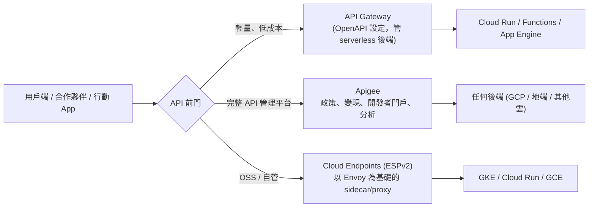

# API 管理：Apigee 與 API Gateway

> [!abstract] 一句話定位
> 官方考點原文：**「使用應用程式的速率限制、驗證與可觀測性（例如 Apigee、Cloud API Gateway）」** 以及 **「在應用中版本化、公開與保護 API（例如 Apigee）」**。
> 也就是：**API 的「前門」該放什麼**。

---

## 📘 技術理解
*原理、限制與實務操作 —— 不為考試也該懂的部分。*

### 🧠 三個選項的層級



| | **API Gateway** | **Apigee** | **Cloud Endpoints (ESPv2)** |
|---|---|---|---|
| 定位 | 輕量代管閘道 | **企業級 API 管理平台** | 以 Envoy 為基礎的 API proxy |
| 設定方式 | **OpenAPI 2.0 spec**（或 gRPC 設定） | 政策（policy）+ API proxy 設計 | OpenAPI / gRPC 設定 |
| 後端 | 主要是 **GCP serverless**（Cloud Run / Functions / App Engine） | **任何後端**（含多雲、地端） | GKE / Cloud Run / GCE（sidecar） |
| 驗證 | API key、Google ID token、JWT（Firebase / Auth0 / 自訂 issuer） | OAuth2、API key、JWT、SAML、mTLS… | API key、JWT |
| 限流 | 基本 quota（透過 API key / 服務管理） | **完整 quota / spike arrest / 配額分層** | 基本 quota |
| 轉換 / 編排 | ❌ 幾乎沒有 | ✅ 請求/回應轉換、JSON↔XML、mediation、多後端組合 | 有限 |
| 開發者門戶 / 變現 | ❌ | ✅ **developer portal、API 產品、計費** | ❌ |
| 分析 | 基本（Cloud Monitoring/Logging） | ✅ 豐富的 API 分析儀表板 | 基本 |
| 成本與複雜度 | 低 | **高** | 中 |

> [!important] 考題判準（一句話）
> - `簡單地保護並公開一個 Cloud Run / Cloud Functions API`、`minimal cost` → **API Gateway**
> - `API 產品化`、`合作夥伴/外部開發者`、`developer portal`、`monetization`、`quota tiers`、`request/response transformation`、`多雲後端` → **Apigee**
> - 題目提到 `既有的 Cloud Endpoints` 或 `在 GKE 以 sidecar 方式做 API 管理` → **ESPv2**

---

### 🔧 API Gateway 實作要點

```yaml
# openapi.yaml — API Gateway 的設定核心
swagger: "2.0"
info:
  title: orders-api
  version: "1.0.0"
schemes: [https]
produces: [application/json]

# 安全定義：用 Firebase / Identity Platform 簽發的 JWT 驗證終端使用者
securityDefinitions:
  firebase:
    authorizationUrl: ""
    flow: implicit
    type: oauth2
    x-google-issuer: "https://securetoken.google.com/MY_PROJECT"
    x-google-jwks_uri: "https://www.googleapis.com/service_accounts/v1/metadata/x509/securetoken@system.gserviceaccount.com"
    x-google-audiences: "MY_PROJECT"
  api_key:
    type: apiKey
    name: key
    in: query

paths:
  /v1/orders:
    get:
      operationId: listOrders
      security:
        - firebase: []
      x-google-backend:
        address: https://orders-xxx.a.run.app      # 後端 Cloud Run
        path_translation: APPEND_PATH_TO_ADDRESS
        jwt_audience: https://orders-xxx.a.run.app # Gateway 以自己的身分取得 ID token
      responses: { 200: { description: OK } }

    post:
      operationId: createOrder
      security:
        - api_key: []
      x-google-quota:                              # 配額（需搭配 management 設定）
        metricCosts:
          write-requests: 1
      x-google-backend:
        address: https://orders-xxx.a.run.app
      responses: { 201: { description: Created } }
```

```bash
gcloud api-gateway apis create orders-api
gcloud api-gateway api-configs create v1 --api=orders-api --openapi-spec=openapi.yaml \
  --backend-auth-service-account=gw-sa@$PROJECT.iam.gserviceaccount.com
gcloud api-gateway gateways create orders-gw --api=orders-api --api-config=v1 --location=asia-east1
```

> [!tip] 關鍵機制
> `x-google-backend.jwt_audience` 讓 Gateway 用自己的服務帳戶取得 **ID token** 去呼叫需驗證的 Cloud Run
> → **後端可以設成 `--no-allow-unauthenticated`，只信任 Gateway**。這是很常考的安全組合。

---

### 🏛 Apigee 要記的概念（不需要很深）

| 概念 | 說明 |
|---|---|
| **API proxy** | Apigee 對外的端點，前後分為 ProxyEndpoint 與 TargetEndpoint |
| **Policy** | 掛在流程上的可組合元件：`VerifyAPIKey`、`OAuthV2`、**`Quota`**、**`SpikeArrest`**、`JSONtoXML`、`AssignMessage`、`JavaScript`… |
| **API product** | 把一組 API 操作包成「產品」，綁定配額與存取層級（免費版/付費版） |
| **Developer / App / API key** | 外部開發者註冊 App → 取得 key/secret |
| **Developer portal** | 文件、試用、註冊 |
| **Environment** | `test` / `prod` 等部署環境 |
| **Analytics** | 流量、延遲、錯誤、開發者使用量報表 |

> [!note] Quota 與 Spike Arrest 的差別（Apigee 常考小點）
> - **Quota**：一段時間內的**總量**限制（例如每月 100 萬次）→ 商業配額。
> - **Spike Arrest**：**瞬時速率**平滑（例如每秒 10 次）→ 保護後端不被突刺打掛。
> 兩者常一起用。

---

### 🔐 API 的驗證選項總覽（考試常混在一起問）

| 需求 | 機制 |
|---|---|
| 識別「哪個應用程式」在呼叫（非安全驗證） | **API key** |
| 驗證「哪個終端使用者」 | **JWT**（Firebase / Identity Platform / Auth0）→ 見 [[IAP Identity Platform 與 Web Security Scanner]] |
| 驗證「哪個 GCP 服務/服務帳戶」 | **Google 簽發的 ID token** + `run.invoker` → 見 [[驗證與授權 ADC OAuth JWT]] |
| 第三方 OAuth 授權（代表使用者存取資源） | **OAuth 2.0 授權碼流程** |
| 企業內部應用的存取守門 | **IAP** |
| 服務間雙向加密與身分 | **mTLS / Cloud Service Mesh** → 見 [[Cloud Service Mesh 與 Network Policy]] |

> [!warning] API key 不是驗證
> API key 只是識別「呼叫方是哪個專案/應用」，**可被複製、不代表使用者身分**。
> 考題若強調 `authenticate users` → 要 JWT / OAuth，不是 API key。

---

### 🧱 API 版本化與相容性（Section 3.1 考點）

| 做法 | 範例 | 評價 |
|---|---|---|
| **URI 路徑版本** | `/v1/orders`、`/v2/orders` | ⭐ 最常見、最直覺，Google API 設計指南也用這種 |
| Header 版本 | `Accept: application/vnd.api.v2+json` | 乾淨但對使用者不友善 |
| 查詢參數 | `?version=2` | 不建議 |

**向後相容的變更規則（Google API 設計指南）**
- ✅ 可以：新增可選欄位、新增端點、新增 enum 值（用戶端要容忍未知值）
- ❌ 不可以：刪除/重新命名欄位、改變欄位型別或語意、把可選變必填、改變預設值
- 破壞性變更 → **新版本 + 並行運行 + 棄用公告 + sunset 期限**

---

## 🎯 應試
*考場上的提取線索與自我測驗 —— 備考期才需要。*

### 🎯 考點速記

| 看到題目說… | 就想到 |
|---|---|
| `expose a Cloud Run API with API key and quota, minimal effort` | **API Gateway** |
| `developer portal`、`monetize`、`partner APIs`、`API products` | **Apigee** |
| `transform requests between JSON and XML` / `多後端組合` | **Apigee** |
| `smooth out traffic spikes to the backend` | Apigee **SpikeArrest** |
| `limit each customer to 1M calls/month` | Apigee **Quota** / API Gateway 配額 |
| `backend must only accept calls from the gateway` | 後端 `--no-allow-unauthenticated` + Gateway 的 **jwt_audience** |
| `authenticate end users of a mobile app` | **Firebase/Identity Platform JWT** 驗證 |
| `internal web app, no VPN` | **IAP** |
| `breaking change to API` | **新版本路徑 `/v2`** + 棄用流程 |
| `既有地端 API 也要納管` | **Apigee**（API Gateway 主要面向 GCP serverless） |

### 💣 真實場景陷阱

1. **把 API key 當成安全機制**：key 洩漏就等於裸奔。至少加上配額 + 監控異常。
2. **Gateway 後面的 Cloud Run 還是公開的**：繞過 Gateway 直接打後端 → 一定要設 `--no-allow-unauthenticated` 或 `--ingress=internal`。
3. **用 Apigee 解決簡單需求**：成本與學習曲線都高，題目強調 `simple` / `cost-effective` 時它是誘答。
4. **OpenAPI spec 與實際後端不同步**：Gateway 驗證通過但後端 404。
5. **版本化沒有棄用計畫**：v1 永遠下不了線。
6. **在 Gateway 做重運算的轉換**：延遲增加且難以除錯。

### ✍️ 自我檢核

1. API Gateway 與 Apigee 的五個維度差異？題目出現哪些詞就選 Apigee？
2. 如何確保「只有 API Gateway 能呼叫後端 Cloud Run」？
3. API key 與 JWT 的本質差異？各適合什麼需求？
4. Quota 與 SpikeArrest 的差別？
5. 列出三個「向後相容」與三個「破壞相容」的 API 變更。
6. 一個公開 REST API 需要：識別呼叫方、限流、使用量報表、外部開發者自助註冊 → 選什麼？

## 🔗 相關

- [[API 設計 REST 與 gRPC]]
- [[Load Balancing 與 Session Affinity]]
- [[驗證與授權 ADC OAuth JWT]]
- [[IAP Identity Platform 與 Web Security Scanner]]
- [[Cloud Run]]
- [[Cloud Monitoring 與 SLO]]
- [[Memorystore 與快取策略]]
- [[Section 1 設計可擴充安全可靠的雲端原生應用]]
