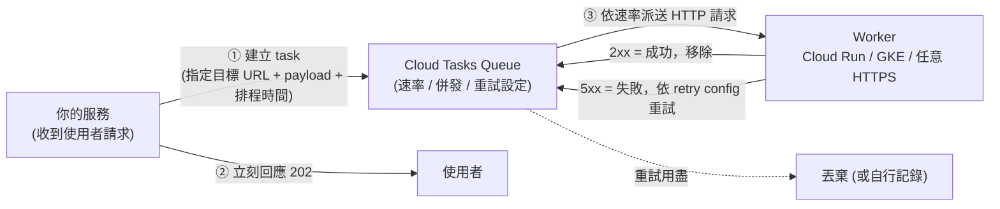

# Cloud Tasks

> [!abstract] 一句話定位
> **對「單一已知目標」的非同步任務佇列**，而且你可以**精確控制速率、併發、排程與重試**。
> 一句話記住它與 [[Pub Sub]] 的差別：**Pub/Sub 是廣播，Cloud Tasks 是派工。**

---

## 📘 技術理解
*原理、限制與實務操作 —— 不為考試也該懂的部分。*

### 🧠 心智模型



**關鍵特性**
- 目標在**建立任務時**就決定（不像 Pub/Sub 由訂閱決定）。
- **佇列層級的流量控制**：`max-dispatches-per-second`、`max-concurrent-dispatches` → 這是「保護下游」的主要工具。
- **可排程單一任務**：`scheduleTime` 最長可排到約 **30 天後**。
- **任務名稱去重**：同名任務在一段時間內不會重複建立 → 天然的冪等輔助。
- 重試設定：`max-attempts`、`min/max-backoff`、`max-doublings`、`max-retry-duration`。

---

### ⚙️ 常用操作

```bash
# 建立佇列並限制速率（保護下游的第三方 API）
gcloud tasks queues create email-queue \
  --location=asia-east1 \
  --max-dispatches-per-second=10 \
  --max-concurrent-dispatches=5 \
  --max-attempts=5 \
  --min-backoff=10s --max-backoff=300s

# 檢視 / 暫停 / 恢復（事故處理很常用）
gcloud tasks queues describe email-queue --location=asia-east1
gcloud tasks queues pause  email-queue --location=asia-east1
gcloud tasks queues resume email-queue --location=asia-east1
```

```python
from google.cloud import tasks_v2
from google.protobuf import timestamp_pb2, duration_pb2
import datetime, json

client = tasks_v2.CloudTasksClient()
parent = client.queue_path(PROJECT, "asia-east1", "email-queue")

task = {
    "http_request": {
        "http_method": tasks_v2.HttpMethod.POST,
        "url": "https://worker-xxx.a.run.app/send-email",
        "headers": {"Content-Type": "application/json"},
        "body": json.dumps({"to": "a@b.com", "orderId": "o-987"}).encode(),
        # 讓 Cloud Tasks 帶 OIDC token → Cloud Run 可驗證且可設 no-allow-unauthenticated
        "oidc_token": {
            "service_account_email": f"tasks-invoker@{PROJECT}.iam.gserviceaccount.com",
            "audience": "https://worker-xxx.a.run.app",
        },
    },
    # 延遲 10 分鐘執行
    "schedule_time": timestamp_pb2.Timestamp(
        seconds=int((datetime.datetime.utcnow() + datetime.timedelta(minutes=10)).timestamp())),
    "dispatch_deadline": duration_pb2.Duration(seconds=600),   # worker 可處理多久
    # 指定 name 可做去重（同名任務短期內不會重複建立）
    "name": client.task_path(PROJECT, "asia-east1", "email-queue", "order-o-987-confirm"),
}
client.create_task(parent=parent, task=task)
```

> [!important] OIDC token 的重要性
> 讓 worker 可以設成 `--no-allow-unauthenticated`，只接受帶有合法 token 的呼叫。
> 需要：該 SA 有 worker 的 `roles/run.invoker`；建立任務者有 `roles/cloudtasks.enqueuer` 與對 SA 的 `iam.serviceAccounts.actAs`。

---

### 🎯 典型使用場景

| 場景 | 為什麼 Cloud Tasks 最合適 |
|---|---|
| 使用者按下「送出」後要寄信/產 PDF/呼叫第三方 | 立刻回應使用者，工作丟佇列（**回應時間解耦**） |
| 呼叫有嚴格 rate limit 的外部 API | **佇列速率限制**天生就是節流器 |
| 「30 分鐘後如果還沒付款就取消訂單」 | **scheduleTime** 延遲執行 |
| Webhook 送不出去要指數退避重試 | 內建 retry config |
| 保護脆弱的下游（舊系統只能承受 5 併發） | `max-concurrent-dispatches=5` |
| 大量 fan-out 但要控速 | 建立多個 task，佇列自然節流 |

> [!tip] 「回應後還要做事」的三種解法比較
> 1. **Cloud Tasks**（⭐ 最推薦）：明確、可重試、可觀測、不佔用請求生命週期。
> 2. Cloud Run `--no-cpu-throttling` + 背景執行緒：簡單但沒有重試保證、實例可能被回收。
> 3. Pub/Sub：可行，但若只有一個消費者且需要控速/排程，Tasks 更貼合。

---

### ⚖️ Cloud Tasks vs Pub/Sub vs Workflows vs Scheduler

| 需求 | 選擇 |
|---|---|
| 一則事件多方訂閱、串流、資料管線 | [[Pub Sub]] |
| 單一目標、控速、排程、重試 | **Cloud Tasks** |
| 多步驟有狀態流程、條件分支、等待 | [[Workflows 與 Cloud Scheduler]] 的 Workflows |
| 定期（cron）觸發 | Cloud Scheduler |
| GCP 資源狀態變化觸發 | [[Eventarc]] |

完整決策樹見 [[決策樹 訊息與事件選型]]。

---

## 🎯 應試
*考場上的提取線索與自我測驗 —— 備考期才需要。*

### 💣 真實場景陷阱

1. **Worker 不冪等**：重試會重複寄信/重複扣款。用 task name 或業務冪等鍵去重。
2. **`dispatch_deadline` 比 worker 實際處理時間短**：Cloud Tasks 判定失敗並重試，造成重複處理。
3. **重試用盡就消失**：Cloud Tasks **沒有 DLQ 概念** → 要自己在最後一次失敗時記錄（例如寫 Firestore 的 `failed_tasks`）或回 2xx 後自行處理。
4. **把 Cloud Tasks 當廣播用**：需要多個下游就得建多個 task，此時 Pub/Sub 更適合。
5. **佇列速率設太高**：把下游打掛，失去使用 Cloud Tasks 的意義。
6. **忘記 `actAs` 權限**：建立帶 OIDC 的任務會失敗，錯誤訊息不直觀。

### ✍️ 自我檢核

1. Cloud Tasks 與 Pub/Sub 的四個決定性差異？
2. 「呼叫每秒只能 10 次的第三方 API」怎麼設定？
3. 「30 分鐘後檢查訂單是否付款」怎麼做？
4. 如何讓 worker 設成需要驗證，同時 Cloud Tasks 仍能呼叫它？需要哪些權限？
5. Cloud Tasks 重試用盡後訊息去哪？和 Pub/Sub 有什麼不同？該怎麼補？
6. 使用者按下送出後要做 3 件耗時的事，你的設計是什麼？

## 🔗 相關

- [[決策樹 訊息與事件選型]]
- [[Pub Sub]]
- [[Eventarc]]
- [[Workflows 與 Cloud Scheduler]]
- [[Cloud Run]]
- [[韌性模式 重試 冪等 退避 斷路器]]
- [[Lab 02 事件驅動 Pub Sub Eventarc Cloud Tasks]]
