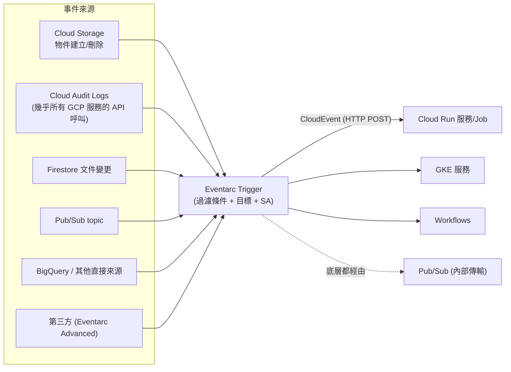

# Eventarc

> [!abstract] 一句話定位
> **Google Cloud 的事件路由器**：把「某個 GCP 資源發生了什麼事」以標準 **CloudEvents** 格式送到你的 Cloud Run / GKE / Workflows。
> 官方指南把它寫進 Section 3.1「用觸發器調用 Cloud Run 服務」與「設定事件接收端」 → **必考**。

---

## 📘 技術理解
*原理、限制與實務操作 —— 不為考試也該懂的部分。*

### 🧠 心智模型



> [!important] Eventarc 底層就是 Pub/Sub
> Eventarc 會為你建立/使用 Pub/Sub topic 與訂閱作為傳輸層。所以它**繼承 Pub/Sub 的特性**：
> **at-least-once 傳遞 → 你的處理器必須冪等。** 見 [[韌性模式 重試 冪等 退避 斷路器]]。

---

### 🎯 三種事件來源（考點）

| 來源類型 | 說明 | 延遲 | 範例事件類型 |
|---|---|---|---|
| **直接事件（direct）** | 服務原生發出的事件 | 較低 | `google.cloud.storage.object.v1.finalized`、`google.cloud.firestore.document.v1.written` |
| **Cloud Audit Logs** | 透過稽核日誌捕捉幾乎任何 GCP API 呼叫 | 較高（要等 log 寫入） | `serviceName=compute.googleapis.com` + `methodName=v1.compute.instances.insert` |
| **Pub/Sub 訊息** | 自訂事件：你自己 publish | 低 | 任何 topic |

> [!tip] 判準
> - GCS 上傳、Firestore 文件變更 → **直接事件**（最常考）
> - 「有人建立了 VM / 修改了 IAM 政策時通知我」→ **Cloud Audit Logs 觸發器**（需要啟用該服務的 audit log）
> - 自家服務之間的自訂事件 → 直接用 **Pub/Sub**

---

### ⚙️ 建立觸發器

```bash
# ① GCS 物件上傳 → Cloud Run
gcloud eventarc triggers create img-uploaded \
  --location=asia-east1 \
  --destination-run-service=thumbnailer \
  --destination-run-region=asia-east1 \
  --event-filters="type=google.cloud.storage.object.v1.finalized" \
  --event-filters="bucket=my-uploads" \
  --service-account=eventarc-sa@$PROJECT.iam.gserviceaccount.com

# ② Cloud Audit Log：有人建立 VM
gcloud eventarc triggers create vm-created \
  --location=asia-east1 \
  --destination-run-service=auditor \
  --event-filters="type=google.cloud.audit.log.v1.written" \
  --event-filters="serviceName=compute.googleapis.com" \
  --event-filters="methodName=v1.compute.instances.insert" \
  --service-account=eventarc-sa@$PROJECT.iam.gserviceaccount.com

# ③ Firestore 文件寫入 → Workflows
gcloud eventarc triggers create order-written \
  --location=asia-east1 \
  --destination-workflow=process-order \
  --event-filters="type=google.cloud.firestore.document.v1.written" \
  --event-filters="database=(default)" \
  --event-filters-path-pattern="document=orders/{orderId}" \
  --service-account=eventarc-sa@$PROJECT.iam.gserviceaccount.com
```

**必要的 IAM（很常考）**
| 誰 | 需要什麼 |
|---|---|
| 觸發器的 SA | 目標服務的 `roles/run.invoker`（或 `roles/workflows.invoker`） |
| 觸發器的 SA | `roles/eventarc.eventReceiver` |
| Cloud Storage 服務代理 | `roles/pubsub.publisher`（GCS 事件需要） |
| 建立者 | `roles/eventarc.developer` + 對 SA 的 `iam.serviceAccounts.actAs` |

---

### 📦 接收 CloudEvent

```python
import functions_framework

@functions_framework.cloud_event
def on_object_finalized(cloud_event):
    # CloudEvents 標準欄位
    print(cloud_event["id"], cloud_event["type"], cloud_event["source"])
    data = cloud_event.data
    bucket, name = data["bucket"], data["name"]
    # ⚠️ 冪等：同一個物件事件可能重送
    ...
```

用純 Cloud Run 服務接收時，事件以 HTTP POST 進來，CloudEvents 屬性放在 header（`ce-id`、`ce-type`、`ce-source`…）或 structured JSON body：

```python
from flask import Flask, request
app = Flask(__name__)

@app.post("/")
def handle():
    event_id   = request.headers.get("ce-id")
    event_type = request.headers.get("ce-type")
    payload    = request.get_json()
    # 用 ce-id 做去重
    return "", 204        # 2xx = ack；非 2xx = 重試
```

> [!warning] 回傳碼決定重試
> 回 **2xx** 才算成功。回 5xx → Eventarc（底層 Pub/Sub）會重送。
> **永久性錯誤請回 2xx 並自行記錄/送 DLQ**，否則會無限重試。

---

### 🆚 Eventarc vs Pub/Sub push vs Cloud Tasks

| | **Eventarc** | **Pub/Sub push** | **Cloud Tasks** |
|---|---|---|---|
| 事件來源 | **GCP 服務事件**（GCS、Firestore、Audit Log…）+ Pub/Sub | 你自己 publish 的訊息 | 你自己建立的任務 |
| 格式 | **CloudEvents 標準** | 自訂 payload | 自訂 HTTP 請求 |
| 過濾 | 觸發器條件（type / bucket / methodName / path pattern） | subscription filter（屬性） | 無（建立時就指定） |
| 典型用途 | 「當某資源變化時」 | 「當我的服務發出事件時」 | 「稍後執行這件工作」 |

> [!tip] 一句話
> **Eventarc 是「GCP 事件的轉接頭」**；如果事件是你自己產生的，直接用 Pub/Sub 就好。

---

## 🎯 應試
*考場上的提取線索與自我測驗 —— 備考期才需要。*

### 🎯 考點速記

| 看到題目說… | 就想到 |
|---|---|
| `when a file is uploaded to Cloud Storage, process it` | **Eventarc 觸發器** → Cloud Run |
| `when a Firestore document changes` | Eventarc Firestore 直接事件 |
| `notify when someone modifies IAM policy / creates a VM` | Eventarc **Cloud Audit Logs** 觸發器 |
| `standard event format across sources` | **CloudEvents** |
| `事件被處理兩次` | Eventarc 底層是 Pub/Sub → **at-least-once → 冪等** |
| `事件處理失敗要有上限` | 底層訂閱設 **dead-letter topic** |
| `觸發 Workflows 編排多步驟` | Eventarc → Workflows |
| `跨專案 / 第三方事件、進階路由` | Eventarc Advanced（bus / pipeline） |

### 💣 真實場景陷阱

1. **Audit Log 觸發器沒啟用對應的 audit log**：建了觸發器但什麼都收不到。Data Access log 預設關閉。
2. **GCS 事件的無限迴圈**：函式處理物件後又寫回**同一個 bucket** → 再次觸發自己。解法：輸出到不同 bucket 或用 prefix 過濾。
3. **忘記冪等**：同一張圖被縮圖三次、同一封信寄三次。
4. **回 5xx 當作「記錄錯誤」**：造成無限重送與費用爆炸。
5. **觸發器的 region 與目標不一致**：GCS 的 bucket location 與 trigger location 需匹配規則。
6. **IAM 少一塊**：最常見是漏了 `roles/run.invoker` 或 GCS 服務代理的 `pubsub.publisher`。

### ✍️ 自我檢核

1. Eventarc 的三種事件來源？各自的延遲特性？
2. 「有人刪除了 BigQuery 資料集就通知我」該用哪種來源？前置條件是什麼？
3. Eventarc 底層用什麼傳輸？這對你的處理器有什麼要求？
4. 處理器回傳 500 會發生什麼？永久性錯誤該回什麼？
5. 建立一個 GCS → Cloud Run 的觸發器，需要哪些 IAM 授權？
6. 「處理完的縮圖寫回原 bucket」會發生什麼事？怎麼避免？

## 🔗 相關

- [[決策樹 訊息與事件選型]]
- [[Pub Sub]]
- [[Cloud Tasks]]
- [[Workflows 與 Cloud Scheduler]]
- [[Cloud Run]]
- [[Cloud Run Jobs 與 Functions]]
- [[Cloud Storage]]
- [[Firestore]]
- [[韌性模式 重試 冪等 退避 斷路器]]
- [[Lab 02 事件驅動 Pub Sub Eventarc Cloud Tasks]]
