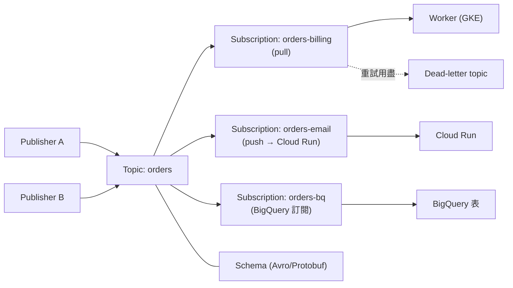
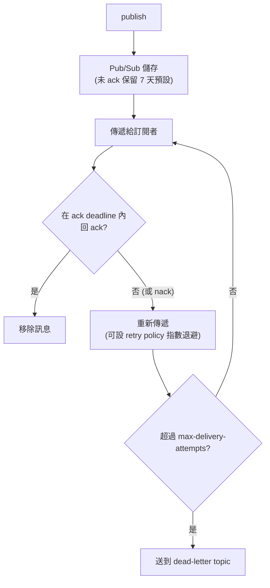

# Pub/Sub

> [!abstract] 一句話定位
> **全球規模的訊息總線**：發布者與訂閱者完全解耦，一則訊息可以扇出（fan-out）給很多訂閱者，並自動吸收流量尖峰。
> 它是 PCD 考試中「非同步整合」的核心答案，也是**冪等/重試**題目的舞台。

---

## 📘 技術理解
*原理、限制與實務操作 —— 不為考試也該懂的部分。*

### 🧠 心智模型



> [!important] 一個 topic 多個 subscription = 扇出
> **每個 subscription 各自拿到一份完整訊息副本**。同一個 subscription 有多個 consumer 時，訊息會在它們之間**分攤**（負載平衡），不是每個都拿到。
> 這是最常被搞錯的概念：想要「兩個服務都處理每則訊息」→ 建**兩個 subscription**。

---

### 📬 傳遞方式

| 類型 | 機制 | 適合 |
|---|---|---|
| **Pull** | 訂閱者主動呼叫 `pull` | 批次處理、可控速率 |
| **StreamingPull** | 長連線持續推送（**用戶端程式庫的預設**） | 高吞吐、低延遲的工作者 |
| **Push** | Pub/Sub 對你的 HTTPS 端點發 POST | Cloud Run / Cloud Run functions（**serverless 最常用**） |
| **BigQuery 訂閱** | 直接寫入 BQ 表，不用程式 | 事件分析 |
| **Cloud Storage 訂閱** | 直接寫成 GCS 檔案 | 歸檔 |

**Push 訂閱的驗證（考點）**
```bash
# 建立帶 OIDC token 的 push 訂閱 → Cloud Run 可以驗證來源
gcloud pubsub subscriptions create orders-email \
  --topic=orders \
  --push-endpoint=https://email-svc-xxx.a.run.app/handle \
  --push-auth-service-account=pubsub-invoker@$PROJECT.iam.gserviceaccount.com \
  --ack-deadline=30 \
  --dead-letter-topic=orders-dlq --max-delivery-attempts=5
```
→ 該 SA 需要目標服務的 `roles/run.invoker`；Pub/Sub 服務代理需要 `roles/iam.serviceAccountTokenCreator`。

> [!tip] Push vs Pull 判準
> - **Cloud Run / serverless，不想自己跑 worker** → **Push**（或 Eventarc）
> - **需要控制消費速率 / 批次 / 長時間處理** → **Pull**
> - Push 的流量控制較弱；下游變慢會造成大量重送 → 搭配 ack deadline 與 DLQ

---

### ⏱ Ack、重試與 Dead-letter（**最重要的考點群**）



| 概念 | 說明 | 🔢 數字 |
|---|---|---|
| **Ack deadline** | 訂閱者必須在此時間內 ack，否則重送 | **預設 10 秒**，最長 **600 秒（10 分）** |
| **Ack deadline 自動延長** | 用戶端程式庫會自動 `modifyAckDeadline` 續命（最長總時限有上限） | — |
| **訊息保留（subscription）** | 未 ack 訊息保留多久 | **預設 7 天**（10 分 ～ 7 天） |
| **訊息保留（topic）** | 可讓訊息在 topic 層保留供 replay | 最長 **31 天** |
| **Retry policy** | 立即重送 或 **指數退避**（建議） | — |
| **Dead-letter topic** | 重試用盡的訊息轉送處 | `max-delivery-attempts` 5～100 |
| **Seek / Snapshot** | 把訂閱游標移到某時間點或快照 → **重播訊息** | 需要 topic 保留或 snapshot |

> [!danger] 傳遞保證：**at-least-once**（預設）
> 重複送達是**正常行為**，不是 bug。原因包括：ack 遺失、處理超過 deadline、內部重試。
> → **消費端必須冪等。** 這是 PCD 最愛考的設計題，詳見 [[韌性模式 重試 冪等 退避 斷路器]]。

#### Exactly-once delivery
- 可在**訂閱層啟用**（`--enable-exactly-once-delivery`），適用 pull 訂閱。
- 保證：在 ack 成功後**不會再重送**同一則訊息（單一訂閱範圍內）。
- **仍然不是端到端 exactly-once 處理**：如果你的處理已完成但 ack 前程序崩潰，重啟後還是會再處理一次 → **冪等仍然需要**。
- 代價：吞吐較低、延遲略高。

---

### 🔢 其他關鍵限制（查核日 2026-09-27）

| 項目 | 值 |
|---|---|
| 訊息（`data`）大小上限 | **10 MB** |
| 每則訊息屬性數 / key / value | 100 個 / 256 B / 1024 B |
| 單次 publish 請求 | 10 MB 或 1000 則 |
| Pull 回應 | 最多 1000 則 / 10 MB |
| 單一 topic 的訂閱數 | 10,000 |
| **單一 ordering key 的發布吞吐** | **約 1 MB/s** ⚠️ |
| StreamingPull 單一串流吞吐 | 10 MB/s |

> [!warning] 大訊息的處理方式
> 超過 10 MB（或接近）→ **claim-check 模式**：把 payload 存到 [[Cloud Storage]]，訊息只帶 GCS 路徑。

---

### 🔢 順序、篩選與結構

#### Ordering keys（順序保證）
```python
publisher = pubsub_v1.PublisherClient(
    publisher_options=pubsub_v1.types.PublisherOptions(enable_message_ordering=True))
publisher.publish(topic, b'{"id":1}', ordering_key="user-123")   # 同 key 保證順序
```
- 只保證**同一個 ordering key 內**的順序，且訂閱要開 `--enable-message-ordering`。
- **代價**：單一 key 吞吐受限（~1 MB/s）；一則失敗會**阻塞同 key 的後續訊息**。
- 考點：「同一個帳戶的事件必須依序處理」→ ordering key = accountId。
- 反考點：「全域嚴格順序」→ Pub/Sub 不適合，要重新設計（或用單一 key，但會犧牲吞吐）。

#### Subscription filter
```bash
gcloud pubsub subscriptions create orders-vip --topic=orders \
  --message-filter='attributes.tier = "vip"'
```
- 依**訊息屬性**過濾（不能看 payload 內容）。
- **建立後不能修改** filter。
- 好處：不符合的訊息由 Pub/Sub 直接 ack 掉，訂閱者收不到 → 省下游成本。

#### Schema
- topic 可綁 **Avro / Protocol Buffers** schema，發布時驗證 → 防止破壞性變更。
- 考點：「確保發布者不會送出不合格式的訊息」→ **topic schema**。

---

### 💻 消費端程式碼（含冪等）

```python
from google.cloud import pubsub_v1, firestore

db = firestore.Client()
subscriber = pubsub_v1.SubscriberClient()

def callback(message):
    event_id = message.message_id            # 或使用業務層的 idempotency key
    try:
        # 冪等守門：同一個事件只會成功 create 一次
        db.document(f"processed/{event_id}").create({"at": firestore.SERVER_TIMESTAMP})
    except Exception:                         # AlreadyExists → 已處理過
        message.ack()
        return
    try:
        handle(message.data)
        message.ack()
    except TransientError:
        message.nack()                        # 交給 Pub/Sub 重試
    except PermanentError:
        message.ack()                         # 或讓它進 DLQ，不要無限重試

flow = pubsub_v1.types.FlowControl(max_messages=100, max_bytes=50*1024*1024)
future = subscriber.subscribe(sub_path, callback=callback, flow_control=flow)
future.result()
```

> [!tip] Flow control
> 限制「同時在手上未 ack」的訊息數，避免一次拉太多導致超過 ack deadline 而被重送。
> 考題：「訊息一直被重複處理，worker CPU 滿載」→ 降低 flow control 的 `max_messages` 或延長 ack deadline。

---

## 🎯 應試
*考場上的提取線索與自我測驗 —— 備考期才需要。*

### 🎯 考點速記

| 看到題目說… | 就想到 |
|---|---|
| `decouple services`、`fan-out`、`absorb traffic spikes` | **Pub/Sub** |
| `multiple services must each process every message` | **多個 subscription**（不是多個 consumer） |
| `duplicate messages` / `at-least-once` | **冪等鍵**（Firestore `create()` / Redis `SETNX`） |
| `messages stuck retrying forever` / `poison message` | **dead-letter topic** + `max-delivery-attempts` |
| `process events in order per user` | **ordering key** = userId |
| `only deliver events where region=EU` | **subscription filter**（訊息屬性） |
| `replay yesterday's events` | **topic retention + seek**，或 **snapshot** |
| `payload larger than 10 MB` | **claim-check**：GCS + 訊息帶路徑 |
| `stream events to BigQuery without code` | **BigQuery 訂閱** |
| `Cloud Run 處理事件` | **Push 訂閱（含 OIDC）** 或 **Eventarc** |
| `worker 處理很久（> 10 分）` | 縮短處理 / 改用 [[Cloud Tasks]] / 把工作丟給 Cloud Run Jobs |
| `guarantee no duplicate delivery` | 訂閱開 **exactly-once delivery**（但仍要冪等） |
| `依積壓量自動擴充` | HPA External metric: `num_undelivered_messages`，見 [[GKE 工作負載 健康檢查與自動擴充]] |

---

### ⚖️ Pub/Sub vs Cloud Tasks（**必考對照**）

| | **Pub/Sub** | **Cloud Tasks** |
|---|---|---|
| 模型 | 發布/訂閱，**一對多扇出** | 佇列，**一對一指定目標** |
| 目標 | 訂閱者自己來拿 / push 到端點 | 你在建立任務時就指定 HTTP 目標 |
| 速率控制 | 訂閱端自行控制（flow control） | **佇列層級的速率與併發上限** |
| 排程單一訊息 | ❌（沒有 per-message delay） | ✅ **可指定執行時間**（最長約 30 天） |
| 去重 | 無（需自行冪等） | 有 **task name 去重**（一段時間內） |
| 典型用途 | 事件廣播、資料管線、串流 | 非同步工作、webhook 重試、節流保護下游 |

詳見 [[決策樹 訊息與事件選型]] 與 [[Cloud Tasks]]。

---

### 💣 真實場景陷阱

1. **以為多個 consumer = 每個都收到**：那是負載分攤。要扇出就多建 subscription。
2. **ack deadline 太短**：處理 30 秒但 deadline 10 秒 → 訊息被反覆重送，系統看起來「越忙越重複」。
3. **沒有 DLQ**：一則壞訊息無限重試，塞住整個訂閱、燒錢。
4. **Push 端點回 5xx**：Pub/Sub 視為失敗並重送；如果是**永久性錯誤**要回 2xx 並自行記錄/丟 DLQ。
5. **ordering key 用了低基數的值**（例如 `"all"`）：吞吐被鎖在 1 MB/s。
6. **filter 建立後想改**：不能改，只能新建訂閱。
7. **忘記 Pub/Sub 的 IAM**：`roles/pubsub.publisher` / `subscriber` 要給對的 SA；push 還要 invoker。

### ✍️ 自我檢核

1. 一個 topic、兩個 subscription、每個 subscription 三個 consumer → 一則訊息會被處理幾次（正常情況）？
2. Ack deadline 的預設值與上限？處理需要 20 分鐘怎麼辦？
3. 詳述 at-least-once 下「不重複扣款」的三道防線。
4. Dead-letter topic 怎麼設定？沒有它會發生什麼？
5. ordering key 的保證範圍與兩個代價是什麼？
6. 要重播昨天的事件，有哪兩種機制？各需要什麼前置設定？
7. exactly-once delivery 開了之後，還需要冪等嗎？為什麼？
8. Pub/Sub 與 Cloud Tasks 的四個決定性差異？

## 🔗 相關

- [[決策樹 訊息與事件選型]]
- [[Cloud Tasks]]
- [[Eventarc]]
- [[韌性模式 重試 冪等 退避 斷路器]]
- [[Cloud Run]]
- [[GKE 工作負載 健康檢查與自動擴充]]
- [[BigQuery 給開發者]]
- [[Firestore]]
- [[Lab 02 事件驅動 Pub Sub Eventarc Cloud Tasks]]
- [[數字與限制速記]]
