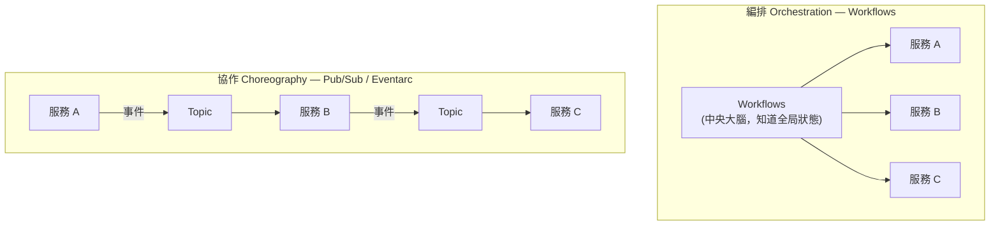

# Workflows 與 Cloud Scheduler

> [!abstract] 一句話定位
> - **Workflows**：**無伺服器的流程編排器**。用 YAML 宣告「先做 A、再依結果決定做 B 或 C、失敗就重試」，狀態由 Google 保管。
> - **Cloud Scheduler**：**全代管 cron**。到時間就去打一個 HTTP 端點 / Pub/Sub topic / Workflows / Cloud Run Job。
>
> 官方指南把兩者和 Eventarc、Cloud Tasks 並列在「編排應用服務」考點裡 → 重點是**四者的分工**。

---

## 📘 技術理解
*原理、限制與實務操作 —— 不為考試也該懂的部分。*

### 🧠 編排 vs 協作（Orchestration vs Choreography）



| | **編排（Workflows）** | **協作（Pub/Sub / Eventarc）** |
|---|---|---|
| 流程知識 | 集中在一個定義檔，**看得見全貌** | 分散在各服務，難以追蹤全局 |
| 狀態 | Workflows 幫你保管執行狀態 | 沒有中央狀態 |
| 錯誤處理 | 內建重試、條件分支、補償步驟 | 各服務自理 |
| 耦合 | 編排器認識所有參與者 | 服務彼此不認識（最鬆耦合） |
| 適合 | 有順序、有條件、要看結果的**業務流程** | 事件廣播、扇出、高吞吐串流 |

> [!important] 考題判準
> - `multi-step business process`、`conditional logic`、`需要知道流程走到哪裡`、`要有補償/回滾步驟` → **Workflows**
> - `broadcast to many consumers`、`high throughput`、`decouple completely` → **Pub/Sub**

---

### 🔧 Workflows 實用要點

```yaml
main:
  params: [event]
  steps:
    - init:
        assign:
          - orderId: ${event.data.orderId}
          - attempts: 0

    - validateOrder:                       # 呼叫 Cloud Run（自動帶 OIDC token）
        try:
          call: http.post
          args:
            url: https://validator-xxx.a.run.app/validate
            auth:
              type: OIDC                   # 呼叫 Cloud Run / Functions 用 OIDC
            body:
              orderId: ${orderId}
          result: validation
        retry:                             # 內建重試政策
          predicate: ${http.default_retry_predicate}
          max_retries: 5
          backoff:
            initial_delay: 1
            max_delay: 60
            multiplier: 2
        except:
          as: e
          steps:
            - logFail:
                call: sys.log
                args: { text: ${"validate failed: " + string(e)}, severity: ERROR }
            - raiseIt:
                raise: ${e}

    - branchOnRisk:                        # 條件分支
        switch:
          - condition: ${validation.body.risk > 0.8}
            next: manualReview
          - condition: true
            next: charge

    - manualReview:                        # 等待人工（callback 模式）
        call: events.create_callback_endpoint
        args: { http_callback_method: "POST" }
        result: cb
    - waitForHuman:
        call: events.await_callback
        args: { callback: ${cb}, timeout: 86400 }
        result: decision
    - afterReview:
        next: charge

    - charge:
        call: googleapis.run.v1.namespaces.services.get   # 也有大量「連接器」可用
        args: {}
        next: done

    - done:
        return: ${orderId}
```

**能力清單（記能力邊界比記語法重要）**
| 能力 | 說明 |
|---|---|
| `call: http.get/post` | 呼叫任何 HTTP 端點；`auth.type: OIDC`（Cloud Run/Functions）或 `OAuth2`（Google API） |
| **連接器（connectors）** | 內建對 Pub/Sub、BigQuery、Cloud Run Jobs、Firestore、Vertex AI… 的呼叫，**自動處理長時間輪詢** |
| `try/retry/except` | 宣告式錯誤處理與指數退避 |
| `switch` / `for` / `parallel` | 條件、迴圈、**平行分支** |
| **Callback** | 產生一個 URL，暫停流程等外部（人工審核、第三方 webhook）呼叫 |
| `sys.sleep` | 等待（可等很久，比在服務裡 sleep 便宜） |
| 執行歷史 | 每步的輸入輸出都留存 → **可觀測性極佳**，適合稽核 |

> [!tip] Workflows 的計費模型
> 按**步驟數**計費，執行期間的「等待」很便宜 → 非常適合「等外部系統回應」或「長時間輪詢」的流程。
> 這是它取代「在 Cloud Run 裡 sleep 等待」的關鍵理由（後者要付運算費）。

---

### ⏰ Cloud Scheduler 實用要點

```bash
# ① 打 HTTP 端點（Cloud Run，帶 OIDC）
gcloud scheduler jobs create http nightly-report \
  --location=asia-east1 \
  --schedule="0 2 * * *" --time-zone="Asia/Taipei" \
  --uri="https://report-xxx.a.run.app/generate" --http-method=POST \
  --oidc-service-account-email=scheduler-sa@$PROJECT.iam.gserviceaccount.com \
  --attempt-deadline=1800s \
  --max-retry-attempts=3 --min-backoff=10s

# ② 發 Pub/Sub 訊息
gcloud scheduler jobs create pubsub cleanup-tick \
  --location=asia-east1 --schedule="*/15 * * * *" \
  --topic=cleanup --message-body='{"scope":"temp"}'

# ③ 觸發 Workflows
gcloud scheduler jobs create http run-wf --location=asia-east1 \
  --schedule="0 * * * *" \
  --uri="https://workflowexecutions.googleapis.com/v1/projects/$PROJECT/locations/asia-east1/workflows/process-order/executions" \
  --oauth-service-account-email=scheduler-sa@$PROJECT.iam.gserviceaccount.com
```

| 要點 | 說明 |
|---|---|
| cron 語法 | 標準 unix cron（或 App Engine 的 `every 5 minutes` 格式） |
| **時區** | 一定要設 `--time-zone`，否則 UTC（夏令時間問題常出錯） |
| 三種目標 | **HTTP**（含 OIDC/OAuth）、**Pub/Sub**、App Engine HTTP |
| 重試 | 有重試設定；但 Scheduler 的保證是 **at-least-once** → **處理器要冪等** |
| `attempt-deadline` | 單次嘗試的等待上限；長任務要改「Scheduler → Pub/Sub / Job」而不是同步等 |

> [!warning] 常見錯誤
> 「每天凌晨跑 3 小時的批次」→ **不要**讓 Scheduler 同步等 Cloud Run 服務回應。
> 正解：Scheduler → **Cloud Run Job**（或 Workflows → Job 連接器），見 [[Cloud Run Jobs 與 Functions]]。

---

### 🧭 四個編排工具的一句話定位（**必背**）

| 服務 | 一句話 | 關鍵詞 |
|---|---|---|
| **Cloud Scheduler** | 「到時間就去戳一下」 | `cron`、`every day at 2am` |
| **Cloud Tasks** | 「這件工作稍後做，而且要控速」 | `rate limit`、`delay`、`retry to one target` |
| **Pub/Sub** | 「這件事發生了，誰想知道自己來訂」 | `fan-out`、`decouple`、`stream` |
| **Eventarc** | 「GCP 資源變化 → 轉成標準事件送出」 | `when a file is uploaded`、`audit log` |
| **Workflows** | 「照這個流程一步步做，我幫你記狀態」 | `multi-step`、`conditional`、`orchestrate` |

完整決策樹見 [[決策樹 訊息與事件選型]]。

---

## 🎯 應試
*考場上的提取線索與自我測驗 —— 備考期才需要。*

### 🎯 考點速記

| 看到題目說… | 就想到 |
|---|---|
| `orchestrate multiple services with conditional logic` | **Workflows** |
| `wait for human approval in the middle of a process` | Workflows **callback** |
| `long-running polling without paying for compute` | Workflows（按步驟計費） |
| `need visibility into which step failed` | Workflows 執行歷史 |
| `run every day at 2 AM` | **Cloud Scheduler** |
| `scheduled batch that runs for hours` | Scheduler → **Cloud Run Job** |
| `retry a step with exponential backoff declaratively` | Workflows `retry` |
| `call Cloud Run securely from Workflows / Scheduler` | **OIDC** token + `run.invoker` |
| `saga / compensating transaction` | Workflows（在 `except` 裡執行補償步驟） |

### 💣 真實場景陷阱

1. **Scheduler 同步等長任務**：超過 `attempt-deadline` 就重試 → 同一個批次跑兩次。
2. **忘記設時區**：以為是台北時間，實際是 UTC，差 8 小時。
3. **Workflows 裡塞商業邏輯**：Workflows 適合**編排**，運算邏輯該放服務裡。表達式寫太複雜會難以維護與測試。
4. **不冪等的步驟 + 重試**：重複建立訂單。用冪等鍵。
5. **用 Workflows 做高吞吐事件處理**：它不是串流引擎，每秒上萬事件請用 Pub/Sub（+ Dataflow）。
6. **權限漏 `actAs`**：Scheduler / Workflows 用 SA 呼叫時需要對該 SA 的 `iam.serviceAccounts.actAs`。

### ✍️ 自我檢核

1. 編排與協作的差別？各自的適用場景與代價？
2. Workflows 的四個關鍵能力（錯誤處理、分支、平行、callback）分別解決什麼問題？
3. 「每天 2 點跑 3 小時的 ETL」正確的服務組合是什麼？錯誤的做法為什麼錯？
4. Workflows 呼叫 Cloud Run 要用哪種 auth？呼叫 Google Cloud API 呢？
5. 四個編排工具（Scheduler / Tasks / Pub/Sub / Eventarc）+ Workflows 各一句話定位。
6. 流程中要等人工審核 24 小時，怎麼實作最省成本？

## 🔗 相關

- [[決策樹 訊息與事件選型]]
- [[Cloud Tasks]]
- [[Pub Sub]]
- [[Eventarc]]
- [[Cloud Run Jobs 與 Functions]]
- [[韌性模式 重試 冪等 退避 斷路器]]
- [[IAM 與服務帳戶]]
- [[Lab 02 事件驅動 Pub Sub Eventarc Cloud Tasks]]
