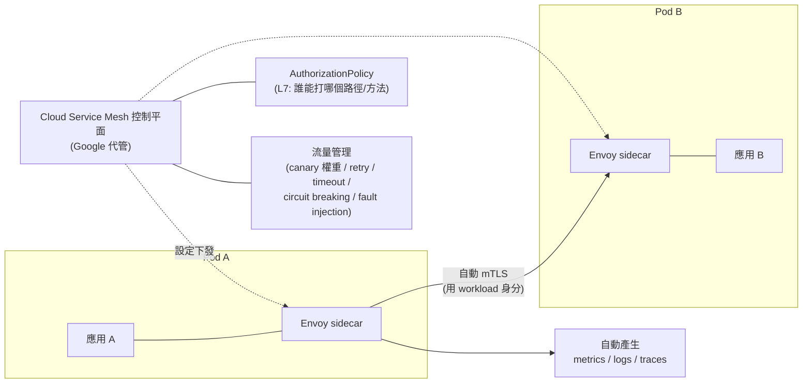

# Cloud Service Mesh 與 Kubernetes Network Policy

> [!abstract] 一句話定位
> 官方考點原文：**「納入安全的服務間通訊（例如 Cloud Service Mesh、Kubernetes Network Policies、Direct VPC egress、私有服務連線）」**。
> 兩個工具解決兩個不同層次：
> - **Network Policy** — **L3/L4**：「哪個 Pod 可以在哪個 port 連到哪個 Pod」（網路隔離）
> - **Cloud Service Mesh** — **L7 + 身分**：「哪個**服務身分**可以呼叫哪個 API 路徑」（mTLS + 授權 + 流量管理）

---

## 🧱 Kubernetes Network Policy

**預設行為**：Kubernetes 叢集內**所有 Pod 可以互相通訊**（全通）。Network Policy 讓你收斂它。

```yaml
# ① 預設拒絕所有入向流量（零信任的起點）
apiVersion: networking.k8s.io/v1
kind: NetworkPolicy
metadata: { name: default-deny-ingress, namespace: prod }
spec:
  podSelector: {}                 # 套用到 namespace 內所有 Pod
  policyTypes: [Ingress]
---
# ② 只允許 frontend 連到 backend 的 8080
apiVersion: networking.k8s.io/v1
kind: NetworkPolicy
metadata: { name: allow-frontend-to-backend, namespace: prod }
spec:
  podSelector:
    matchLabels: { app: backend }
  policyTypes: [Ingress]
  ingress:
    - from:
        - podSelector:
            matchLabels: { app: frontend }
        - namespaceSelector:
            matchLabels: { env: prod }
      ports:
        - protocol: TCP
          port: 8080
---
# ③ 限制出向：只允許連 DNS 與特定 CIDR
apiVersion: networking.k8s.io/v1
kind: NetworkPolicy
metadata: { name: restrict-egress, namespace: prod }
spec:
  podSelector: { matchLabels: { app: backend } }
  policyTypes: [Egress]
  egress:
    - to: [{ namespaceSelector: { matchLabels: { "kubernetes.io/metadata.name": kube-system } } }]
      ports: [{ protocol: UDP, port: 53 }]
    - to: [{ ipBlock: { cidr: 10.0.0.0/8 } }]
```

| 要點 | 說明 |
|---|---|
| 生效條件 | GKE 需啟用 Network Policy（Dataplane V2 預設支援） |
| 邏輯 | **白名單制**：一旦有 policy 選中某 Pod，未被允許的就被拒絕 |
| 多個 policy | 效果是**聯集**（allow 的總和） |
| 粒度 | L3/L4（IP + port），**不看 HTTP 路徑，不看身分** |
| 常見用途 | namespace 隔離、限制資料庫只能被特定服務連、封鎖 Pod 對外連網 |

> [!warning] 忘記允許 DNS
> 加了 egress policy 後，Pod 連不上任何東西 —— 因為 **DNS（kube-dns，UDP 53）也被擋了**。這是最常見的踩坑。

---

## 🕸 Cloud Service Mesh

**定位**：Google 代管的服務網格（以 Istio / Envoy 為基礎），提供**身分、加密、流量管理與可觀測性**，且**不用改應用程式碼**。



### 四大能力
| 能力 | 說明 | 對應考點 |
|---|---|---|
| **自動 mTLS** | sidecar 之間自動雙向 TLS，憑證自動輪替 | 「服務間通訊要加密且雙向驗證，但不想改程式」 |
| **L7 授權（AuthorizationPolicy）** | 依**服務身分 + HTTP 方法/路徑**授權 | 「只有 frontend 能呼叫 `POST /orders`」 |
| **流量管理** | 權重分流（canary）、重試、逾時、**斷路器（circuit breaking）**、故障注入 | 「GKE 上做 canary 並自動重試」 |
| **可觀測性** | 自動產生黃金訊號指標與 trace，不需 instrument | 「不改程式就取得服務間延遲/錯誤率」 |

```yaml
# 強制整個 namespace 只接受 mTLS
apiVersion: security.istio.io/v1beta1
kind: PeerAuthentication
metadata: { name: default, namespace: prod }
spec:
  mtls: { mode: STRICT }
---
# L7 授權：只有 frontend 的服務帳戶能 POST /orders
apiVersion: security.istio.io/v1
kind: AuthorizationPolicy
metadata: { name: orders-policy, namespace: prod }
spec:
  selector: { matchLabels: { app: orders } }
  action: ALLOW
  rules:
    - from:
        - source:
            principals: ["cluster.local/ns/prod/sa/frontend-ksa"]
      to:
        - operation:
            methods: ["POST"]
            paths: ["/orders"]
---
# canary：90/10 權重分流
apiVersion: networking.istio.io/v1
kind: VirtualService
metadata: { name: orders }
spec:
  hosts: [orders]
  http:
    - route:
        - destination: { host: orders, subset: v1 }
          weight: 90
        - destination: { host: orders, subset: v2 }
          weight: 10
      retries: { attempts: 3, perTryTimeout: 2s, retryOn: "5xx,reset" }
      timeout: 10s
```

> [!note] Cloud Run 也能加入網格
> Cloud Run 可加入 Cloud Service Mesh（或用 sidecar 模式），讓 serverless 與 GKE 服務在同一個網格內互通。
> 但在考試中，**mesh 的題目幾乎都以 GKE 為背景**。

---

## ⚖️ 三層防護的分工（**必考對照**）

| 層 | 工具 | 回答的問題 |
|---|---|---|
| **網路層（L3/L4）** | **Network Policy**、VPC 防火牆 | 「這個 IP/Pod 能不能連到那個 port？」 |
| **身分/應用層（L7）** | **Cloud Service Mesh**（mTLS + AuthorizationPolicy） | 「這個**服務身分**能不能呼叫那個 API？」 |
| **平台授權** | **IAM**（如 `run.invoker`） | 「這個 GCP principal 能不能呼叫這個服務？」 |

> [!important] 考題判準
> - `encrypt service-to-service traffic without changing code` → **Cloud Service Mesh（mTLS）**
> - `restrict which pods can talk to the database pod` → **Network Policy**
> - `only allow POST /admin from the admin service` → **Mesh AuthorizationPolicy**（L7 才做得到）
> - `Cloud Run A 呼叫 Cloud Run B` → **IAM `run.invoker` + ID token**（不需要 mesh）
> - `fine-grained canary on GKE with automatic retries` → **Mesh**（或 Gateway API）

---

## 💣 真實場景陷阱

1. **egress policy 忘記放行 DNS**：整個服務看起來「什麼都連不到」。
2. **以為 Network Policy 能看 HTTP 路徑**：它只到 L4。要 L7 就得用 mesh。
3. **mTLS 設 STRICT 但有服務還沒注入 sidecar**：流量全被拒。**先用 `PERMISSIVE` 過渡**再切 STRICT。
4. **Mesh 的複雜度被低估**：sidecar 增加延遲、記憶體與除錯難度。小系統用 IAM + TLS 就夠。
5. **忘記 Autopilot 的限制**：sidecar 注入可行，但某些低階網路操作受限。
6. **只做加密不做授權**：mTLS 只證明「對方是網格成員」，還要 AuthorizationPolicy 才限制「能做什麼」。

## ✍️ 自我檢核

1. Kubernetes 的預設 Pod 間通訊行為是什麼？Network Policy 如何改變它？
2. 加了 egress policy 後 Pod 什麼都連不到，最可能漏了什麼？
3. Network Policy 與 Cloud Service Mesh 的授權粒度差在哪？各能/不能做什麼？
4. 「服務間通訊要加密且不改程式」怎麼做？導入 mTLS 的安全步驟？
5. GKE 上要做 10% canary + 失敗自動重試，有哪兩種做法？
6. Cloud Run 之間的安全呼叫需要 mesh 嗎？正解是什麼？

## 🔗 相關

- [[GKE 基礎與 Autopilot]]
- [[GKE 工作負載 健康檢查與自動擴充]]
- [[VPC 連線 Serverless VPC Access 與 Direct VPC Egress]]
- [[Load Balancing 與 Session Affinity]]
- [[IAM 與服務帳戶]]
- [[韌性模式 重試 冪等 退避 斷路器]]
- [[Cloud Deploy 與部署策略]]
- [[Section 1 設計可擴充安全可靠的雲端原生應用]]
