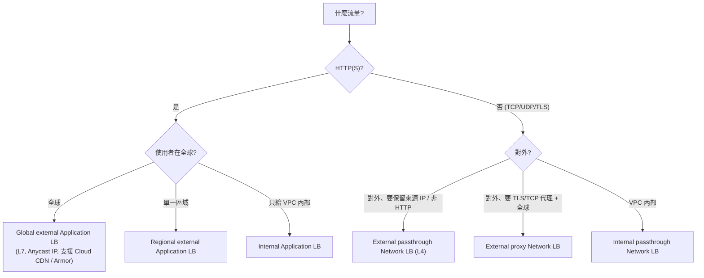

# Cloud Load Balancing 與 Session Affinity

> [!abstract] 一句話定位
> 官方考點原文：**「理解負載平衡器的使用情境」** 與 **「為高效能內容傳遞啟用 session affinity」**。
> 對開發者來說要記三件事：**選哪一種 LB、怎麼把 serverless 掛上去、affinity 的代價**。

---

## 📘 技術理解
*原理、限制與實務操作 —— 不為考試也該懂的部分。*

### 🧠 LB 家族心智模型



| LB | 層 | 範圍 | 重點能力 |
|---|---|---|---|
| **Global external Application LB** | L7 | 全球（單一 anycast IP） | URL map 路由、**Cloud CDN**、**Cloud Armor**、serverless NEG、header 改寫、流量分流 |
| Regional external Application LB | L7 | 區域 | 需資料落地、以 Envoy 為基礎 |
| Internal Application LB | L7 | VPC 內 | 微服務之間的 L7 路由 |
| External passthrough Network LB | L4 | 區域 | **保留原始來源 IP**、非 HTTP 協定、極低延遲 |
| Proxy Network LB（TCP/SSL proxy） | L4 | 全球 | 全球 TCP/TLS 終結 |
| Internal passthrough Network LB | L4 | VPC 內 | 內部 TCP/UDP（GKE `Service: LoadBalancer` 的內部版本） |

#### 組成元件（考題常問「要設定什麼」）
```
轉送規則 (Forwarding Rule) → 目標代理 (Target Proxy) → URL Map → 後端服務 (Backend Service) → 後端 (Backend)
                                                                         ↓
                                                              健康檢查 (Health Check)
```
**後端的三種型態**
| 型態 | 用於 |
|---|---|
| **Instance group（MIG/UIG）** | Compute Engine |
| **Zonal NEG** | GKE **容器原生負載平衡**（直接把流量送到 Pod IP，跳過 kube-proxy → 延遲更低、健康檢查更準） |
| **Serverless NEG** | **Cloud Run / Cloud Functions / App Engine** ⭐ |

```bash
# 把 Cloud Run 掛到全球 ALB（+ CDN + Armor）
gcloud compute network-endpoint-groups create run-neg --region=asia-east1 \
  --network-endpoint-type=serverless --cloud-run-service=api

gcloud compute backend-services create api-backend --global \
  --load-balancing-scheme=EXTERNAL_MANAGED --enable-cdn
gcloud compute backend-services add-backend api-backend --global \
  --network-endpoint-group=run-neg --network-endpoint-group-region=asia-east1

# 之後建立 url-map / target-https-proxy / forwarding-rule（+ Google 代管憑證）
```
> 掛上 LB 後記得把 Cloud Run 設成 `--ingress=internal-and-cloud-load-balancing`，避免有人繞過 LB 直連。

---

### 🔗 Session Affinity（黏著度）

**定義**：讓「同一個用戶端的請求」盡可能落到**同一個後端實例**。

| 類型（L7 ALB） | 依據 | 穩定性 | 說明 |
|---|---|---|---|
| **NONE**（預設） | — | — | 純負載平衡 |
| **CLIENT_IP** | 來源 IP | 低 | NAT / 行動網路換 IP 就失效；同一辦公室所有人擠到同一後端 |
| **GENERATED_COOKIE** | LB 產生的 cookie（`GCLB`） | 較高 | ⭐ 最常用；LB 負責 cookie，後端不必配合 |
| **HTTP_COOKIE** | 你指定的 cookie 名稱 | 較高 | 與應用既有 cookie 整合 |
| **HEADER_FIELD** | 指定 header | 中 | 需用戶端配合送 header |
| **STRONG_COOKIE_AFFINITY** | 加強版 cookie | 高 | 更嚴格的黏著 |

```bash
gcloud compute backend-services update api-backend --global \
  --session-affinity=GENERATED_COOKIE --affinity-cookie-ttl=3600
```

> [!important] Session affinity 的正確用途（考點）
> **它是效能最佳化，不是狀態管理方案。**
> - ✅ 正當用途：**提高本機快取命中率**、維持長連線（WebSocket/gRPC 串流）、減少重複的暖機成本。
> - ❌ 不該用來：**保存使用者 session 狀態**。因為後端會擴縮、會重啟、affinity 也不保證 100%。
> - 正解：把 session 放 [[Memorystore 與快取策略]] 或用 **JWT 無狀態** → 見 [[Session 管理]]。

> [!warning] Affinity 的四個代價
> 1. **負載不均**：黏著會讓某些實例過熱。
> 2. **擴充效果變差**：新實例拿不到既有連線的流量。
> 3. **失效即掉狀態**：實例重啟/縮容 → 那些使用者的狀態消失。
> 4. **與 Cloud Run 的並行/擴充機制相衝**：可能拉高延遲。

---

### 🚀 Cloud CDN

| 特性 | 說明 |
|---|---|
| 啟用方式 | 在 **backend service 上開 `--enable-cdn`**（只支援 L7 ALB） |
| 快取模式 | `CACHE_ALL_STATIC`（預設快取靜態）、`USE_ORIGIN_HEADERS`（尊重來源的 `Cache-Control`）、`FORCE_CACHE_ALL`（全快取，**小心私有內容**） |
| 快取鍵 | 可設定是否含 query string、header、cookie → **快取鍵越簡單，命中率越高** |
| 失效 | `gcloud compute url-maps invalidate-cdn-cache`（依路徑，可用 `/*`） |
| 私有內容 | **signed URL / signed cookie**（CDN 層級） |
| 其他 | negative caching（快取 404）、cache bypass、Cloud Storage bucket 當後端 |

```bash
gcloud compute backend-services update api-backend --global \
  --enable-cdn --cache-mode=USE_ORIGIN_HEADERS --default-ttl=3600
gcloud compute url-maps invalidate-cdn-cache api-lb --path="/static/*"
```
> 快取的黃金原則：**在來源設正確的 `Cache-Control`**（`public, max-age=31536000, immutable` 給帶版本雜湊的檔名）。

---

### 🛡 Cloud Armor

| 能力 | 說明 |
|---|---|
| **WAF 規則** | 預先調校的 OWASP Top 10 規則（SQLi、XSS、LFI、RCE…） |
| **IP / 地理封鎖** | allow/deny 依 IP 範圍、國家 |
| **速率限制（rate limiting）** | 依用戶端 IP / header 節流，可 `throttle` 或 `ban` |
| **DDoS 防護** | L3/L4 內建；L7 靠規則 + Adaptive Protection（ML 偵測異常） |
| **bot 管理 / reCAPTCHA 整合** | 防自動化濫用 |
| 掛在哪 | **backend service**（只能搭 L7 ALB 或 proxy LB） |

```bash
gcloud compute security-policies create api-armor
gcloud compute security-policies rules create 1000 --security-policy=api-armor \
  --expression="evaluatePreconfiguredExpr('xss-v33-stable')" --action=deny-403
gcloud compute security-policies rules create 2000 --security-policy=api-armor \
  --src-ip-ranges="*" --action=rate-based-ban \
  --rate-limit-threshold-count=100 --rate-limit-threshold-interval-sec=60 \
  --ban-duration-sec=600 --conform-action=allow --exceed-action=deny-429 \
  --enforce-on-key=IP
gcloud compute backend-services update api-backend --global --security-policy=api-armor
```

> [!tip] 限流放哪一層？
> - **粗粒度、擋惡意流量、省後端成本** → **Cloud Armor**（在邊緣就擋掉）
> - **依 API key / 方案分層的商業配額** → **Apigee / API Gateway**（見 [[API 管理 Apigee 與 API Gateway]]）
> - **依業務邏輯（每使用者每分鐘 N 次）** → 應用內用 Redis 計數（見 [[Memorystore 與快取策略]]）

---

### 🩺 健康檢查（很常被忽略的考點）

- LB 依健康檢查決定後端是否可用；**失敗的後端不會收到流量**。
- GKE 的 Ingress/Gateway 會**從 `readinessProbe` 推導**健康檢查 → 兩者不一致就會 502。
- 健康檢查路徑必須**能匿名存取**（不要放在需要登入的路徑後面）。
- Google 的健康檢查來自固定的 IP 範圍 → 防火牆要允許。

---

## 🎯 應試
*考場上的提取線索與自我測驗 —— 備考期才需要。*

### 🎯 考點速記

| 看到題目說… | 就想到 |
|---|---|
| `global users, single IP, HTTP(S)` | **Global external Application LB** |
| `attach Cloud Run to a CDN / WAF` | **Serverless NEG** + Global ALB |
| `preserve client source IP` + 非 HTTP | **External passthrough Network LB (L4)** |
| `internal microservice L7 routing` | **Internal Application LB** |
| `container-native load balancing` | **Zonal NEG**（GKE 直連 Pod） |
| `cache static assets globally` | **Cloud CDN** |
| `block SQL injection / OWASP top 10` | **Cloud Armor** WAF 規則 |
| `block traffic from a country` | Cloud Armor 地理規則 |
| `improve local cache hit rate per instance` | **Session affinity（GENERATED_COOKIE）** |
| `store user session` | **不是** affinity → Memorystore / JWT |
| `502 after deploying to GKE` | 健康檢查 / readinessProbe 不一致 |
| `terminate TLS with a managed certificate` | Google-managed SSL certificate on target proxy |

### 💣 真實場景陷阱

1. **用 affinity 當 session 儲存**：縮容時使用者被登出。
2. **CDN 快取了私有內容**：`FORCE_CACHE_ALL` + 帶個人資料的回應 = 資料外洩。用 `Cache-Control: private` 與 signed URL。
3. **快取鍵包含所有 query string**：命中率趨近 0（每個 `?utm_source=` 都是不同鍵）。
4. **LB 掛好但後端仍公開**：一定要鎖 ingress。
5. **健康檢查打到需要驗證的路徑**：永遠不健康。
6. **忘記 Cloud Armor 只能配 L7/proxy LB**：passthrough L4 不支援。
7. **Cloud CDN 失效以為即時**：invalidation 需要一點時間傳播；更好的做法是**檔名帶版本雜湊**。

### ✍️ 自我檢核

1. 把 Cloud Run 掛到全球 ALB 需要什麼後端型態？之後還要改 Cloud Run 的什麼設定？
2. Session affinity 的正當用途是什麼？為什麼不該用來存 session？四個代價？
3. Cloud CDN 在哪一層啟用？三種 cache mode 的差異？私有內容怎麼處理？
4. 限流可以放在哪三層？各適合什麼需求？
5. GKE Ingress 出現 502，你會檢查哪三件事？
6. 需要保留原始來源 IP 且是 UDP 流量 → 選哪種 LB？

## 🔗 相關

- [[Session 管理]]
- [[Memorystore 與快取策略]]
- [[Cloud Run]]
- [[GKE 基礎與 Autopilot]]
- [[GKE 工作負載 健康檢查與自動擴充]]
- [[API 管理 Apigee 與 API Gateway]]
- [[Cloud Service Mesh 與 Network Policy]]
- [[地理分布 區域與可用區設計]]
- [[Cloud Storage]]
- [[Section 1 設計可擴充安全可靠的雲端原生應用]]
