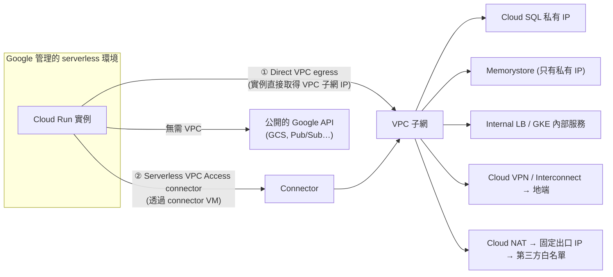

# VPC 連線：Serverless VPC Access 與 Direct VPC Egress

> [!abstract] 一句話定位
> Cloud Run / Cloud Run functions **預設在 Google 管理的網路上，看不到你的 VPC**。
> 要讓它連上 **Cloud SQL 私有 IP、Memorystore、內部 LB、地端系統**，就需要這兩種機制之一。
> 官方考點原文提到 **「Direct VPC egress」** 與 **「私有服務連線」** → 這是 2026 版新增的重點。

---

## 📘 技術理解
*原理、限制與實務操作 —— 不為考試也該懂的部分。*

### 🧠 心智模型



---

### ⚖️ 兩種方式對照

| | **Direct VPC egress** ⭐ 較新 | **Serverless VPC Access connector** |
|---|---|---|
| 機制 | 實例**直接**取得子網中的 IP | 流量經過一組代管的 connector 實例 |
| 延遲 | 較低（少一跳） | 較高 |
| 擴充 | 隨服務實例擴充 | connector 本身有吞吐上限，需自行調整大小 |
| 成本 | 不需為 connector 付費 | **connector VM 持續計費** |
| IP 消耗 | 需要子網有足夠 IP（每個實例一個） | 較少 |
| 支援範圍 | Cloud Run（服務/Job/functions） | Cloud Run、App Engine、Cloud Functions |
| 建議 | **新設計預設選這個** | 既有設定、或子網 IP 不足時 |

```bash
# ① Direct VPC egress
gcloud run deploy api \
  --network=default --subnet=default \
  --vpc-egress=private-ranges-only \
  --network-tags=run-api          # 可用於防火牆規則

# ② Serverless VPC Access connector
gcloud compute networks vpc-access connectors create run-conn \
  --region=asia-east1 --network=default --range=10.8.0.0/28 \
  --min-instances=2 --max-instances=10
gcloud run deploy api --vpc-connector=run-conn --vpc-egress=all-traffic
```

#### `--vpc-egress` 兩種值（考點）
| 值 | 行為 |
|---|---|
| `private-ranges-only`（預設） | **只有 RFC 1918 私有位址**走 VPC；公網流量直接出去 |
| `all-traffic` | **全部**出口流量走 VPC → 可搭 **Cloud NAT 取得固定出口 IP**，或強制走防火牆/檢查 |

> [!important] 「固定出口 IP」考題
> 「第三方 API 要求我們的呼叫來自固定 IP」→ **`--vpc-egress=all-traffic` + Cloud NAT（保留靜態 IP）**。
> 這是 serverless 出口 IP 不固定問題的標準答案。

---

### 🔒 私有存取 Google API 的方式

| 機制 | 說明 | 用途 |
|---|---|---|
| **Private Google Access (PGA)** | 讓**沒有外部 IP** 的 VM/子網能存取 Google API（走 `199.36.153.x` / `private.googleapis.com`） | GCE/GKE 私有節點 |
| **Private Service Connect (PSC)** | 在你的 VPC 內建立一個**私有端點**指向 Google API 或**他人的服務** | 更細緻的控制、跨專案/跨組織的私有服務消費 |
| **Private Service Access（VPC peering）** | 用於 Cloud SQL、Memorystore 等代管服務的私有 IP | 代管服務的私有連線 |
| **VPC Service Controls** | 建立資料邊界，防止資料外流 | 合規、防外洩 |

> [!tip] 考題判準
> - `access Google APIs without public IPs` → **Private Google Access**
> - `consume a service published by another VPC/organization privately` → **Private Service Connect**
> - `Cloud SQL / Memorystore 私有 IP` → **Private Service Access**
> - `prevent data from being copied to a project outside our perimeter` → **VPC Service Controls**

---

### 🌐 相關 VPC 概念（開發者最小集合）

| 概念 | 要記住的 |
|---|---|
| **VPC 是全球性的**，子網是**區域性**的 | 同一個 VPC 可橫跨多個 region |
| 防火牆規則 | 有**方向**（ingress/egress）、優先序、可用 **network tag** 或 **服務帳戶** 當目標 |
| **Cloud NAT** | 讓沒有外部 IP 的資源存取網際網路；可保留靜態 IP |
| **Shared VPC** | 一個 host project 提供網路給多個 service project（企業常見） |
| **Cloud DNS** | 私有區域（private zone）做內部名稱解析 |
| Cloud VPN / Interconnect | 連地端 |

---

## 🎯 應試
*考場上的提取線索與自我測驗 —— 備考期才需要。*

### 🎯 考點速記

| 看到題目說… | 就想到 |
|---|---|
| `Cloud Run needs to reach Cloud SQL private IP` | **Direct VPC egress**（或 connector） |
| `Cloud Run needs Memorystore` | 必須進 VPC（Memorystore 只有私有 IP） |
| `third party requires a static source IP` | `--vpc-egress=all-traffic` + **Cloud NAT** |
| `lowest latency, no extra cost for connectors` | **Direct VPC egress** |
| `existing App Engine app needs VPC access` | **Serverless VPC Access connector** |
| `GKE private nodes need to pull images / call Google APIs` | **Private Google Access** |
| `consume a partner's service privately` | **Private Service Connect** |
| `stop data exfiltration across projects` | **VPC Service Controls** |
| `restrict which service accounts a firewall rule applies to` | 防火牆的 **service account 目標** |

### 💣 真實場景陷阱

1. **忘記進 VPC 就連 Memorystore**：症狀是連線 timeout（不是權限錯誤），很難直覺定位。
2. **子網 IP 不足**：Direct VPC egress 在大規模擴充時耗盡子網 IP → 規劃足夠大的子網。
3. **`all-traffic` 卻沒設 Cloud NAT**：所有公網呼叫（含 Google API）都出不去。
4. **connector 太小**：成為吞吐瓶頸，延遲上升。
5. **防火牆預設拒絕**：egress 到資料庫的 port 沒開。
6. **以為 VPC 連線會加密**：VPC 內流量預設在 Google 網路內加密，但應用層仍應用 TLS。

### ✍️ 自我檢核

1. Direct VPC egress 與 Serverless VPC Access connector 的四個差異？新設計選哪個？
2. `private-ranges-only` 與 `all-traffic` 的差別？後者搭配什麼可得到固定出口 IP？
3. Cloud Run 連不上 Memorystore，最可能的原因與症狀是什麼？
4. Private Google Access、Private Service Connect、Private Service Access 各解決什麼問題？
5. Direct VPC egress 在大規模時的資源限制是什麼？
6. 「防止資料被複製到邊界外的專案」該用什麼？

## 🔗 相關

- [[Cloud Run]]
- [[Memorystore 與快取策略]]
- [[Cloud SQL 與 AlloyDB]]
- [[Load Balancing 與 Session Affinity]]
- [[Cloud Service Mesh 與 Network Policy]]
- [[GKE 基礎與 Autopilot]]
- [[地理分布 區域與可用區設計]]
- [[Section 1 設計可擴充安全可靠的雲端原生應用]]
