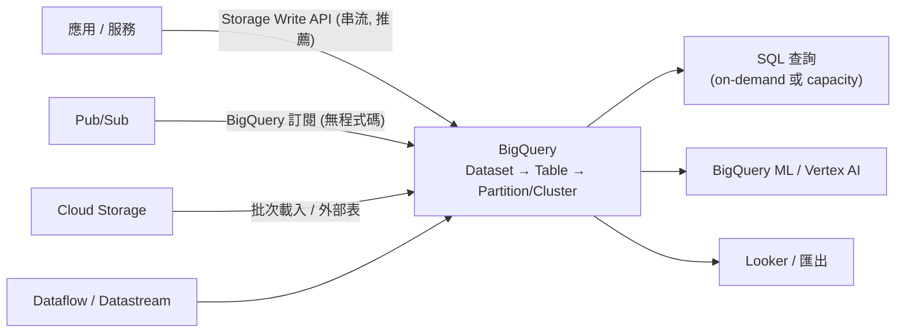

# BigQuery 給開發者

> [!abstract] 一句話定位
> **無伺服器資料倉儲**：用 SQL 查 TB～PB 級資料，運算與儲存分離、按查詢量或容量計費。
> PCD 考的角度不是資料工程，而是官方指南寫的：**「為分析與 AI/ML 工作負載把資料寫入 BigQuery」** — 也就是**應用怎麼把資料送進去、怎麼有效率地查**。

---

## 📘 技術理解
*原理、限制與實務操作 —— 不為考試也該懂的部分。*

### 🧠 心智模型



**層級**：`Project → Dataset（有 location）→ Table / View / Routine`
- **Dataset 的 location 決定資料所在地**，且**查詢不能跨 location JOIN**。

---

### ⬆️ 把資料寫進 BigQuery 的四種方式（考點）

| 方式 | 特性 | 用時機 |
|---|---|---|
| **Storage Write API** | 高吞吐串流，**支援 exactly-once**（用 stream + offset）、比舊 `insertAll` 便宜快速 | ⭐ 應用即時寫入的**推薦做法** |
| 舊 streaming insert (`tabledata.insertAll`) | at-least-once、有 streaming buffer | 舊程式碼；新專案用 Storage Write API |
| **批次載入（load job）** | 從 GCS 載入 CSV/JSON/Avro/Parquet/ORC，**免費**（不收載入費） | 每小時/每天的批次；**最省錢** |
| **Pub/Sub BigQuery 訂閱** | 直接把 topic 寫進表，**不用寫任何程式** | ⭐ 「把事件存進 BQ 做分析」最省事的答案 |

> [!important] 考題判準
> - `real-time dashboard` / `data available within seconds` → **Storage Write API** 或 **Pub/Sub BQ 訂閱**
> - `minimize cost`、`hourly batches` → **批次載入 GCS → BigQuery**（載入免費）
> - `no code / minimal code` + 事件已在 Pub/Sub → **BigQuery 訂閱**

```python
# 用 Storage Write API 的簡化寫法（default stream，at-least-once）
from google.cloud import bigquery_storage_v1
# 實務上多用 google-cloud-bigquery-storage 的 writer helper 或 Beam/Dataflow
# 考試重點：知道它取代 insertAll、支援 exactly-once（committed stream + offset）
```

---

### 💰 成本控制（開發者最常踩的坑）

| 手段 | 說明 |
|---|---|
| **不要 `SELECT *`** | BigQuery 是**列式**儲存，**只讀你選的欄位**。`SELECT *` 掃全部欄位 = 付全額 |
| **分區表（partitioning）** | 依 `DATE`/`TIMESTAMP`/整數範圍/ingestion time 分區 → 查詢加 `WHERE date BETWEEN` 才能**裁剪分區** |
| **叢集（clustering）** | 依欄位排序儲存，縮小掃描範圍（常用於高基數過濾欄位） |
| **`require_partition_filter`** | 強制查詢必須帶分區條件，防止誤掃全表 |
| **預覽而非查詢** | 看資料長相用 `bq head` / Console preview（**免費**），不要 `SELECT * LIMIT 10`（`LIMIT` 不減少掃描量！） |
| **Materialized view / 快取** | 相同查詢 24 小時內有快取（免費）；MV 自動增量維護 |
| **Maximum bytes billed** | 查詢層級的保險絲，超過就直接失敗 |
| **定價模式** | on-demand（按掃描 byte）vs **capacity/slot 預留**（大量穩定用量更便宜） |
| **儲存分層** | 90 天未修改的分區自動轉為 **long-term storage**（較便宜） |

```sql
-- 建分區 + 叢集表，並強制帶分區條件
CREATE TABLE analytics.events (
  event_time TIMESTAMP,
  user_id STRING,
  event_type STRING,
  payload JSON
)
PARTITION BY DATE(event_time)
CLUSTER BY event_type, user_id
OPTIONS (require_partition_filter = TRUE);

-- ✅ 會裁剪分區、只讀兩個欄位
SELECT user_id, COUNT(*) FROM analytics.events
WHERE DATE(event_time) BETWEEN '2026-09-01' AND '2026-09-07'
  AND event_type = 'purchase'
GROUP BY user_id;
```

> [!warning] `LIMIT` 不省錢
> `SELECT * FROM huge_table LIMIT 10` 仍會掃描整張表的所有欄位。要省錢用 **preview / `bq head`**，或加分區條件。

---

### 🔐 存取控制

| 層級 | 機制 |
|---|---|
| Dataset / Table / View | IAM 角色（`bigquery.dataViewer`、`bigquery.jobUser`…） |
| **Authorized view** | 讓使用者只能透過 view 看到過濾/去識別化後的資料，不給底層表權限 |
| **Column-level security** | 用 policy tag（Data Catalog）限制敏感欄位 |
| **Row-level security** | `CREATE ROW ACCESS POLICY` |
| CMEK | 用 [[Secret Manager 與 Cloud KMS]] 的金鑰加密 |

> 「分析師只能看到自己區域的資料列」→ **row-level security** 或 authorized view。
> 「不能看到身分證欄位」→ **column-level security / 去識別化**。

---

### 🤝 與應用整合的實務要點

- **查詢是 job**：非同步提交，用 job ID 追蹤。長查詢不要綁在 HTTP 請求上（用 [[Cloud Tasks]] 或 [[Workflows 與 Cloud Scheduler]]）。
- **`jobs.query` 的 `maximumBytesBilled` 與 `dryRun`**：`dryRun` 可以先估掃描量（免費）→ **上線前防爆的好習慣**。
- **參數化查詢**：一定要用 query parameters，**不要字串拼接**（SQL injection）。
- **分頁讀結果**：大結果集用 **BigQuery Storage Read API** 或分頁 iterator，不要一次抓完（見 [[Cloud API 呼叫最佳實務]]）。
- **BigQuery ML**：可以直接用 SQL 訓練模型、或呼叫 Vertex AI 的模型（`ML.GENERATE_TEXT` 之類）→ 和 [[Vertex AI Gemini API 給開發者]] 相關。
- **外部表 / BigLake**：直接查 GCS 上的 Parquet 而不載入。

```python
from google.cloud import bigquery
client = bigquery.Client()

job_config = bigquery.QueryJobConfig(
    query_parameters=[bigquery.ScalarQueryParameter("uid", "STRING", user_id)],
    maximum_bytes_billed=10 * 1024**3,      # 10 GiB 保險絲
    dry_run=False,
)
rows = client.query(
    "SELECT event_type, COUNT(*) c FROM analytics.events "
    "WHERE DATE(event_time) = CURRENT_DATE() AND user_id = @uid GROUP BY 1",
    job_config=job_config,
).result()
```

---

## 🎯 應試
*考場上的提取線索與自我測驗 —— 備考期才需要。*

### 🎯 考點速記

| 看到題目說… | 就想到 |
|---|---|
| `analyze terabytes with SQL`、`data warehouse` | **BigQuery** |
| `stream events into BigQuery with minimal code` | **Pub/Sub BigQuery 訂閱** |
| `high-throughput streaming inserts, exactly-once` | **Storage Write API** |
| `load data hourly at lowest cost` | GCS → **batch load job**（免費） |
| `reduce query cost` | 不要 `SELECT *` + **分區** + **叢集** + `require_partition_filter` |
| `prevent analysts from running expensive queries` | **maximum bytes billed** + 配額 + slot 預留 |
| `analysts must not see PII column` | **column-level security（policy tag）** |
| `analysts only see their own region's rows` | **row-level security / authorized view** |
| `查詢 GCS 上的檔案但不想搬進 BQ` | **外部表 / BigLake** |
| `OLTP 高頻小量讀寫` | **不是** BigQuery → Firestore / Cloud SQL / Spanner |

### 💣 真實場景陷阱

1. **`SELECT *` 在 PB 級表上**：一次查詢燒掉整月預算。
2. **忘記分區裁剪**：分區表但查詢沒帶 `WHERE` 分區條件 → 全表掃描。
3. **把 BigQuery 當 OLTP**：單筆查詢延遲在秒級、有併發限制，不適合服務即時請求。要低延遲點查 → 用 [[Bigtable]] / [[Firestore]]，或 BigQuery 的加速選項。
4. **跨 location JOIN**：dataset 在 `US` 與 `asia-east1` 無法直接 JOIN。
5. **串流資料立即 UPDATE/DELETE**：streaming buffer 內的資料有限制。
6. **字串拼接 SQL**：injection 風險。

### ✍️ 自我檢核

1. 把應用事件送進 BigQuery 有哪四種方式？成本與即時性各如何？
2. 為什麼 `SELECT * ... LIMIT 10` 不省錢？要看資料長相該怎麼做？
3. 分區與叢集的差別？什麼時候各用哪個？
4. 如何防止分析師誤跑一個掃 100 TB 的查詢？（兩種機制）
5. 「分析師不能看到 email 欄位」與「只能看自己部門的列」分別用什麼？
6. 為什麼 BigQuery 不適合當應用的主資料庫？

## 🔗 相關

- [[決策樹 資料庫選型]]
- [[Pub Sub]]
- [[Cloud Storage]]
- [[Bigtable]]
- [[Vertex AI Gemini API 給開發者]]
- [[Cloud API 呼叫最佳實務]]
- [[成本與資源最佳化]]
- [[Section 1 設計可擴充安全可靠的雲端原生應用]]
