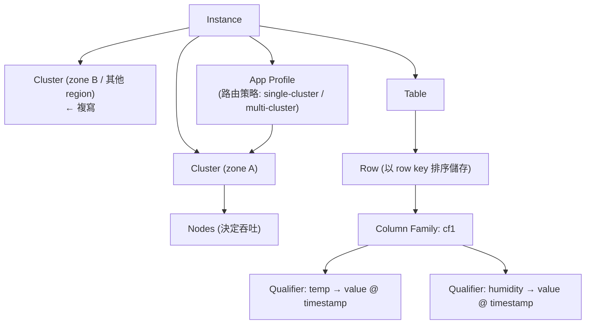

# Bigtable

> [!abstract] 一句話定位
> **超大規模的寬列（wide-column）NoSQL：單位數毫秒延遲、極高寫入吞吐、PB 級容量。**
> 代價：**只能用 row key 查詢**（沒有二級索引、沒有 JOIN、沒有多行交易）。
> 關鍵詞組合：`time-series` / `IoT` / `petabyte` / `millions of writes per second` / `single-digit millisecond`。

---

## 🧠 心智模型



**資料模型**：`row key → column family → column qualifier → (timestamp, value)`
- **row key 是唯一索引**，資料按 row key **字典序排序**儲存。
- **column qualifier 是資料的一部分**（可以有數百萬個，稀疏不佔空間）。
- 每個 cell 可保留多個版本（依 timestamp），用 **GC policy** 控制保留幾版/多久。
- **Tablet（split）**：連續的 row key 範圍，自動在節點間平衡。

> [!important] 「稀疏」的意義
> 沒有值的 column 完全不佔空間 → 可以有數千個 column 而不浪費。這是它與關聯式資料庫最大的思維差異。

---

## 🔑 Row key 設計（**Bigtable 的全部**）

### 能做的查詢只有三種
1. 單一 row key 的 **point lookup**
2. row key 的 **range scan**（前綴或起訖）
3. 全表掃描（極慢，避免）

→ **所有查詢需求都必須編碼進 row key。**

### 反模式與修法
| ❌ 反模式 | 為什麼壞 | ✅ 修法 |
|---|---|---|
| `timestamp` 開頭 | 所有新寫入集中在最後一個 tablet → **熱點** | **欄位翻轉（field promotion）**：把高基數欄位放前面 → `deviceId#timestamp` |
| 自增 ID | 同上 | UUID，或 **salting**（`hash(id)%N#id`） |
| 循序的 `userId`（如 `000001`） | 熱點 | **bit-reverse** 或雜湊前綴 |
| 把大量資料塞進一個 row | row 不能跨 tablet → 單 row 過大 | 拆成多個 row，時間放進 row key |
| row key 過長 | 每個 cell 都存一份 row key → 浪費空間 | 精簡、用縮寫 |

```
# ✅ 時間序列的典型 row key
deviceId#metric#reverseTimestamp
  sensor-8842#temp#9223370468635775807      ← reverse timestamp 讓「最新」排在最前面

# reverse timestamp = Long.MAX_VALUE - epochMillis
# 效果：range scan 時最新資料在前面，不需要反向掃

# ✅ 多租戶
tenantId#entityType#entityId

# ✅ 需要「某裝置某時段」的查詢 → prefix scan
prefix = "sensor-8842#temp#"
```

> [!tip] 熱點診斷工具
> **Key Visualizer** — Bigtable 內建的熱圖工具，能看出哪個 key 範圍被打爆。考題問「如何診斷 Bigtable 效能問題」→ Key Visualizer。

---

## 🔁 複寫與 App Profile

| 概念 | 說明 |
|---|---|
| **多叢集複寫** | 同一 instance 內多個 cluster，資料**最終一致**地互相複寫 |
| **App Profile: single-cluster 路由** | 所有流量導到指定 cluster → **可支援單行交易（read-modify-write、CAS）** |
| **App Profile: multi-cluster 路由** | 自動導到最近/可用的 cluster → **高可用**，但**不支援單行交易** |
| **工作負載隔離** | 用不同 App Profile 把批次（如 Dataflow）與線上查詢導到不同 cluster |

> [!important] 考點
> - 「要 HA、自動 failover」→ **multi-cluster 路由**
> - 「需要 read-modify-write 或 check-and-mutate」→ **single-cluster 路由**
> - 「批次分析不要影響線上延遲」→ 兩個 cluster + 兩個 App Profile

---

## ⚖️ 一致性與交易

| 能力 | 支援？ |
|---|---|
| 單一 row 的原子操作（含多個 column family） | ✅ |
| `ReadModifyWrite`（原子遞增）、`CheckAndMutate`（CAS） | ✅（需 single-cluster 路由） |
| **跨 row 交易** | ❌ |
| 二級索引 | ❌（要自己建「索引表」） |
| SQL / JOIN | ❌（有 SQL 介面用於查詢，但不是關聯式引擎） |
| 單一 cluster 內讀寫 | 強一致 |
| 跨 cluster 複寫 | **最終一致** |

**自建二級索引的模式**：寫入時同時寫一張 `indexTable`，row key = `被索引的值#原始key`。代價：要自己維護一致性。

---

## 📏 容量與效能

| 概念 | 說明 |
|---|---|
| **節點數決定吞吐** | 每個節點提供一定的 QPS 與吞吐；加節點線性提升 |
| **儲存類型** | SSD（低延遲，預設選擇）/ HDD（大容量、成本低、延遲較高） |
| **自動擴充（autoscaling）** | 依 CPU 使用率與儲存量自動調整節點數 |
| **建議 CPU 目標** | 一般保持在 ~60–70%，留出突發空間 |
| **最小 schema 規劃** | column family 數量建議少（< 100），GC policy 要設 |

> [!note] 沒有「縮到 0」
> Bigtable instance 至少 1 個節點持續計費 → **不適合低流量/間歇性工作負載**。低流量選 [[Firestore]]。

---

## ⚙️ 常用操作

```bash
gcloud bigtable instances create prod-bt --display-name="prod" \
  --cluster-config=id=c1,zone=asia-east1-b,nodes=3,autoscaling-min-nodes=3,autoscaling-max-nodes=10,autoscaling-cpu-target=60

cbt -instance prod-bt createtable sensors families=cf1:maxage=30d
cbt -instance prod-bt read sensors prefix=sensor-8842#temp# count=10

# 本地模擬器（Section 2 考點）
gcloud emulators bigtable start
export BIGTABLE_EMULATOR_HOST=localhost:8086
```

```python
from google.cloud import bigtable
client = bigtable.Client(project=PROJECT, admin=False)
table = client.instance("prod-bt").table("sensors")

# 寫入
row = table.direct_row(f"sensor-8842#temp#{reverse_ts}")
row.set_cell("cf1", "value", "23.5")
row.commit()

# 前綴掃描（取某裝置最新 10 筆）
rows = table.read_rows(row_set=RowSet(row_ranges=[RowRange(start_key=b"sensor-8842#temp#")]), limit=10)
```

---

## 🎯 考點速記

| 看到題目說… | 就想到 |
|---|---|
| `time-series`、`IoT sensor data`、`financial ticks` | **Bigtable** |
| `petabytes`、`millions of writes per second` | Bigtable |
| `single-digit millisecond latency at scale` | Bigtable |
| `HBase API 相容` | Bigtable |
| `write hotspot` | row key 設計：**field promotion / salting / bit-reverse** |
| 診斷熱點 | **Key Visualizer** |
| 需要 HA 自動 failover | **multi-cluster App Profile** |
| 需要原子遞增 / CAS | **single-cluster App Profile** |
| 批次工作不要影響線上 | 多 cluster + 不同 App Profile |
| `需要 ad-hoc SQL 查詢 / JOIN` | **不是** Bigtable → BigQuery / Spanner |
| `低流量、想縮到 0` | **不是** Bigtable → Firestore |
| `需要二級索引` | **不是** Bigtable（要自建索引表）→ 考慮 Firestore/Spanner |

## 💣 真實場景陷阱

1. **用 timestamp 當 row key 前綴**：教科書級錯誤，寫入全打在一個 tablet。
2. **建太多 column family**：影響效能與管理；用 qualifier 區分即可。
3. **沒設 GC policy**：cell 版本無限累積，儲存費用暴增。
4. **把 Bigtable 當關聯式用**：需要 JOIN 就是選錯資料庫了。
5. **節點數太少就做大量掃描**：CPU 飆到 100%，線上延遲崩壞。
6. **低流量卻用 Bigtable**：最小 instance 的固定成本吃掉整個預算。

## ✍️ 自我檢核

1. Bigtable 支援哪三種查詢？這對 schema 設計有什麼強制性影響？
2. `timestamp#deviceId` 與 `deviceId#timestamp` 哪個好？為什麼？
3. 什麼是 reverse timestamp？解決什麼問題？
4. multi-cluster 與 single-cluster App Profile 的取捨是什麼？
5. Bigtable 能不能做跨 row 交易？需要時怎麼辦？
6. 每天 10 億筆 IoT 讀數 + 需要「查某裝置最近一小時」→ 設計 row key。
7. 什麼情況下 Bigtable 是錯的選擇？（說三個）

## 🔗 相關

- [[決策樹 資料庫選型]]
- [[Firestore]]
- [[Spanner]]
- [[BigQuery 給開發者]]
- [[一致性 交易與資料複寫]]
- [[Memorystore 與快取策略]]
- [[Section 1 設計可擴充安全可靠的雲端原生應用]]
