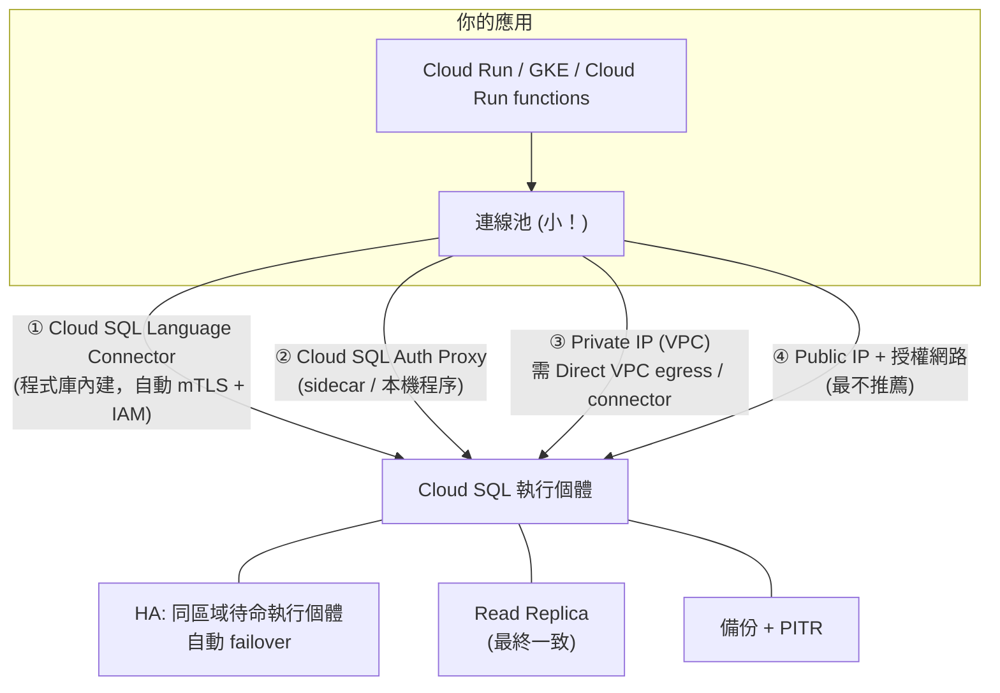

# Cloud SQL 與 AlloyDB

> [!abstract] 一句話定位
> - **Cloud SQL**：代管的 **MySQL / PostgreSQL / SQL Server**。要「就是我熟的那個關聯式資料庫，但不想自己維運」→ 選它。
> - **AlloyDB**：**PostgreSQL 相容**的高效能版本 — 交易更快、內建**列式引擎**做分析加速（HTAP）。要 PostgreSQL 但規模/效能不夠時的升級路徑。
>
> 對開發者而言，這篇最重要的考點不是資料庫本身，而是 **怎麼從 serverless 安全且穩定地連上它**。

---

## 🧠 連線心智模型（PCD 的核心考點）



### 四種連線方式比較
| 方式 | 機制 | 優點 | 注意 |
|---|---|---|---|
| **Language Connector**（`cloud-sql-python-connector` 等） | 程式庫直接處理 TLS + IAM 授權 | 不需額外程序、支援 IAM 驗證 | 需要 `roles/cloudsql.client` |
| **Cloud SQL Auth Proxy** | 本機/ sidecar 代理，建立加密通道 | 不必管理 SSL 憑證、不必開放 IP | GKE 常以 sidecar 部署 |
| **Private IP** | 走 VPC 內部 IP | 延遲低、不經公網 | serverless 需 [[VPC 連線 Serverless VPC Access 與 Direct VPC Egress]] |
| **Public IP + Authorized networks** | IP 白名單 | 最簡單 | serverless 的 IP 不固定 → 不可行（除非 Cloud NAT 固定出口） |

> [!important] 考試判準
> - 「Cloud Run 要連 Cloud SQL，最安全且最少設定」→ **Cloud SQL Connector / Auth Proxy**（+ 私有 IP）
> - 「不要在程式裡放資料庫密碼」→ **IAM database authentication**（用 SA 身分登入）或把密碼放 [[Secret Manager 與 Cloud KMS]]
> - 「serverless IP 不固定，資料庫只允許白名單」→ 不要用授權網路，改私有連線

### 連線數陷阱（**最高頻的 Section 4 考點**）
```python
# ✅ 全域建立一次，並限制池大小
import sqlalchemy
from google.cloud.sql.connector import Connector

connector = Connector()
def getconn():
    return connector.connect(
        "PROJECT:asia-east1:my-instance", "pg8000",
        user="app", db="orders", enable_iam_auth=True,   # 用 IAM 身分，免密碼
    )

engine = sqlalchemy.create_engine(
    "postgresql+pg8000://", creator=getconn,
    pool_size=2, max_overflow=1,      # ← 每個實例只開少量連線
    pool_recycle=1800, pool_pre_ping=True,
)
```
**解法組合**：小連線池 + `--max-instances` 限制 + read replica 分流 + [[Memorystore 與快取策略]] 快取 + 必要時 PgBouncer。

---

## 🛡 高可用與備援（Cloud SQL）

| 機制 | 範圍 | 一致性 | 用途 |
|---|---|---|---|
| **HA 設定（Regional）** | 同區域的另一個 **zone** 有待命執行個體，同步複寫 | 強一致（同步） | **zone 故障自動 failover**，同一個連線名稱不變 |
| **Read replica**（同區或跨區） | 非同步複寫 | **最終一致**（有複寫延遲） | 分擔讀取；可手動 **promote** 成獨立執行個體做跨區災難復原 |
| **Backups（自動 + 隨需）** | 區域 | — | 還原到新執行個體 |
| **Point-in-time recovery (PITR)** | 靠 WAL/binlog | — | 還原到「刪錯資料前一秒」 |
| **Maintenance window** | — | — | 指定可接受維護重啟的時段 |

> [!warning] 三個常被搞混的點
> 1. **HA failover ≠ read replica**。HA 是同步、自動、同區域跨 zone；replica 是非同步、手動 promote。
> 2. **Read replica 不能承接寫入**，且有複寫延遲 → 「讀自己剛寫的資料」會失敗（read-your-writes 問題）。
> 3. Cloud SQL 是 **regional** 服務，不是 global。要全球強一致的關聯式 → [[Spanner]]。

---

## 🚀 AlloyDB 要記什麼

| 特性 | 說明 | 考點 |
|---|---|---|
| **PostgreSQL 相容** | 現有 PostgreSQL 應用幾乎不用改 | 「需要 PostgreSQL 但效能不足」→ AlloyDB |
| **列式引擎（columnar engine）** | 自動把熱資料以列式格式放記憶體，加速分析查詢 | 「同一個資料庫要同時做交易與即時分析（HTAP）」→ AlloyDB |
| **Primary + Read pool** | 讀取節點可獨立擴充 | 讀重負載 |
| **儲存與運算分離** | 智慧型儲存層、快速備份還原 | 大型資料庫的維運 |
| **AlloyDB Auth Proxy** | 同 Cloud SQL Auth Proxy 的角色 | 官方考試指南明確點名 |
| **AlloyDB Omni** | 可在任何地方（含地端）執行 | 混合雲 |

> [!tip] 選型一句話
> `既有 MySQL / SQL Server` → **Cloud SQL**。
> `PostgreSQL + 要更高效能或要即時分析` → **AlloyDB**。
> `全球 + 強一致 + 無上限水平擴展` → **Spanner**。

---

## ⚙️ 常用操作

```bash
# 建立高可用的 PostgreSQL 執行個體（私有 IP）
gcloud sql instances create orders-db \
  --database-version=POSTGRES_16 --tier=db-custom-2-7680 \
  --region=asia-east1 --availability-type=REGIONAL \
  --no-assign-ip --network=projects/$PROJECT/global/networks/default \
  --enable-point-in-time-recovery --backup-start-time=18:00

# 建立唯讀複本
gcloud sql instances create orders-db-replica \
  --master-instance-name=orders-db --region=asia-east1

# 建立 IAM 資料庫使用者（免密碼）
gcloud sql users create app-sa@$PROJECT.iam \
  --instance=orders-db --type=CLOUD_IAM_SERVICE_ACCOUNT

# 本機用 Auth Proxy 連線
./cloud-sql-proxy $PROJECT:asia-east1:orders-db --auto-iam-authn
psql "host=127.0.0.1 port=5432 dbname=orders"

# Cloud Run 直接掛載連線（unix socket /cloudsql/...）
gcloud run deploy api --add-cloudsql-instances $PROJECT:asia-east1:orders-db \
  --set-secrets DB_PASS=db-password:latest
```

---

## 🎯 考點速記

| 看到題目說… | 就想到 |
|---|---|
| `existing MySQL application`、`minimal changes` | **Cloud SQL** |
| `PostgreSQL` + `4x faster` / `real-time analytics on transactional data` | **AlloyDB** |
| `survive a zone failure automatically` | Cloud SQL **HA（REGIONAL）** |
| `offload read traffic` | **Read replica**（注意最終一致） |
| `recover to a specific point in time` | **PITR** |
| `do not store database passwords in code` | **IAM database authentication** 或 Secret Manager |
| `Cloud Run → Cloud SQL 最安全` | **Connector / Auth Proxy + 私有 IP** |
| `too many connections` 錯誤 | 小連線池 + `--max-instances` + 池化 |
| `globally distributed relational with strong consistency` | **Spanner**（不是 Cloud SQL） |
| `read-your-writes 必須成立` | 讀主庫，不要讀 replica |

## 💣 真實場景陷阱

1. **每個請求建一次連線**：TCP + TLS 握手成本高、連線數爆掉。用全域引擎 + 連線池。
2. **把 read replica 當 HA**：zone 掛掉時 replica 不會自動接手。
3. **maintenance window 沒設**：Google 在尖峰時段重啟你的資料庫。
4. **PITR 沒開**：誤刪資料只能還原到最近一次備份。
5. **`db-f1-micro` 用在生產**：share-core 機型沒有 SLA。
6. **schema migration 沒有版本控管**：用 Liquibase/Flyway 並放進 [[Cloud Build]] pipeline。

## ✍️ 自我檢核

1. Cloud SQL 的 HA 與 read replica，在「複寫方式、failover、一致性、用途」四個維度的差異？
2. Cloud Run 連 Cloud SQL 的四種方式，各自的優缺點？考試偏好哪個？
3. 「不要在程式裡出現資料庫密碼」有哪兩種正解？
4. 100 個 Cloud Run 實例 × 每個 10 條連線的問題，列出四個修法。
5. 什麼情況下該從 Cloud SQL 升級到 AlloyDB？什麼情況下該換 Spanner？
6. 為什麼「讀 replica 再讀自己剛寫的資料」會出錯？怎麼解？

## 🔗 相關

- [[決策樹 資料庫選型]]
- [[Spanner]]
- [[Firestore]]
- [[一致性 交易與資料複寫]]
- [[Memorystore 與快取策略]]
- [[VPC 連線 Serverless VPC Access 與 Direct VPC Egress]]
- [[Secret Manager 與 Cloud KMS]]
- [[驗證與授權 ADC OAuth JWT]]
- [[Section 4 整合 Google Cloud 服務]]
