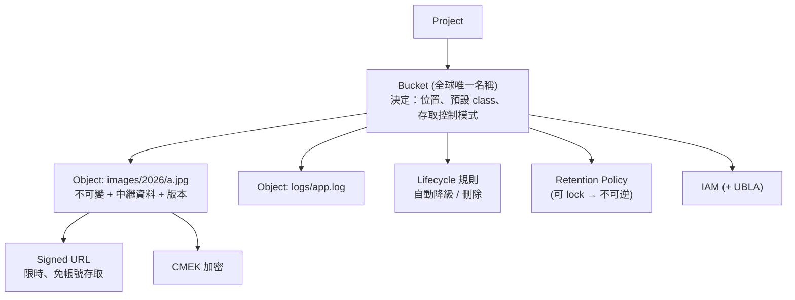

# Cloud Storage (GCS)

> [!abstract] 一句話定位
> **全球物件儲存。** 不是檔案系統、不是資料庫 — 是「用一個名字（key）存取一整個不可變物件」。
> PCD 必考三件事：**storage class 選擇**、**物件生命週期管理**、**signed URL**。

---

## 🧠 心智模型



> [!important] 「資料夾」是假的
> GCS 是**平面命名空間**，`a/b/c.jpg` 只是物件名稱裡有斜線。Console 幫你視覺化成資料夾。
> 影響：列出「資料夾」實際上是 prefix 查詢；重新命名資料夾 = 複製+刪除每個物件。

---

## 🗂 Storage Class（必背）

| Class | 用途 | 最短儲存期 🔢 | 取用費 | 可用性 SLA |
|---|---|---|---|---|
| **Standard** | 頻繁存取、網站內容、進行中的分析 | 無 | 無 | 最高 |
| **Nearline** | 約每月存取一次（備份、長尾內容） | **30 天** | 有 | 高 |
| **Coldline** | 約每季存取一次 | **90 天** | 較高 | 高 |
| **Archive** | 一年一次以下（法規保存、災難備援） | **365 天** | 最高 | 高 |

> [!warning] 最短儲存期的陷阱
> 提早刪除或改 class，**仍會被收取剩餘天數的費用（early deletion charge）**。
> 考題：「資料 7 天後就不需要了，怎麼最省錢？」→ **Standard + lifecycle 刪除**，而不是放 Archive（會被收 365 天）。

**Autoclass**：讓 GCS 依實際存取模式自動在 class 間搬移。
→ 考題關鍵詞：`access patterns are unknown or unpredictable` + `optimize cost without managing rules`。

### 位置類型
| 類型 | 說明 | 用途 |
|---|---|---|
| **Region**（如 `asia-east1`） | 單一區域 | 與同區的運算共置，延遲最低、費用最低 |
| **Dual-region** | 兩個指定區域 | 高可用 + 可預測的地理位置 |
| **Multi-region**（如 `asia`） | 大洲範圍 | 全球內容分發、最高可用性 |

> 運算在 `asia-east1` 卻把 bucket 建在 `us` multi-region → 每次讀取都跨洲，**延遲與出口費用都變高**。

---

## ♻️ 物件生命週期管理（Object Lifecycle Management, OLM）

考點：**自動降級 class + 自動刪除**，用來同時滿足**成本**與**資料保留政策**。

```json
{
  "lifecycle": {
    "rule": [
      {
        "action": { "type": "SetStorageClass", "storageClass": "NEARLINE" },
        "condition": { "age": 30, "matchesPrefix": ["logs/"] }
      },
      {
        "action": { "type": "SetStorageClass", "storageClass": "ARCHIVE" },
        "condition": { "age": 365 }
      },
      {
        "action": { "type": "Delete" },
        "condition": { "age": 2555 }
      },
      {
        "action": { "type": "Delete" },
        "condition": { "numNewerVersions": 3, "isLive": false }
      }
    ]
  }
}
```
```bash
gcloud storage buckets update gs://my-bucket --lifecycle-file=lifecycle.json
```

**常用條件**：`age`、`createdBefore`、`isLive`（是否為目前版本）、`numNewerVersions`、`matchesPrefix/Suffix`、`matchesStorageClass`、`daysSinceNoncurrentTime`。

> [!note] Lifecycle 是非同步的
> 規則每天評估一次，不是即時生效。考題若問「立即刪除」→ 要用程式/指令刪，不是 lifecycle。

---

## 🔒 保留與合規

| 機制 | 作用 | 關鍵特性 |
|---|---|---|
| **Object Versioning** | 保留被覆寫/刪除的舊版本 | 防誤刪；舊版本仍計費 → 搭 lifecycle 清理 |
| **Retention Policy（bucket 層）** | 物件在期限內**不可刪除或覆寫** | **`lock` 之後不可逆、不可縮短**（只能延長） |
| **Object Hold**（`temporaryHold` / `eventBasedHold`） | 單一物件的凍結 | 訴訟保留（litigation hold）；解除後 retention 才開始算 |
| **Bucket Lock** | 鎖住 retention policy | 滿足 SEC 17a-4、FINRA 等法規 |
| **Soft delete** | 刪除後仍可在保留窗內復原 | 防勒索/誤刪 |

> [!danger] 考試最愛的不可逆陷阱
> 「我們要確保稽核紀錄 7 年內絕對無法被任何人刪除（包含管理員）」
> → **Retention policy 設 7 年 + `lock`**。強調 **locked retention policy 無法移除或縮短**，連 Owner 也不行。

---

## 🔑 存取控制

| 機制 | 說明 | 建議 |
|---|---|---|
| **IAM**（bucket / project 層） | 角色式，適合「誰能對整個 bucket 做什麼」 | ⭐ 預設用這個 |
| **ACL**（物件層，舊機制） | 每個物件各自的權限清單 | 盡量不要用 |
| **Uniform bucket-level access (UBLA)** | **停用 ACL**，一律用 IAM | ⭐ 最佳實務，考試偏好 |
| **Signed URL** | 限時的「帶簽章的網址」，**不需要 Google 帳號** | 給外部使用者臨時存取 |
| **Signed policy document** | 限制瀏覽器表單上傳的條件（大小、類型） | 直接從 HTML form 上傳 |
| **公開存取** | 給 `allUsers` 加 `roles/storage.objectViewer` | 只用於真正公開的靜態資源 |

### Signed URL（**必考**）
```bash
# 用服務帳戶簽署，有效 15 分鐘的下載連結
gcloud storage sign-url gs://my-bucket/report.pdf --duration=15m \
  --impersonate-service-account=signer@$PROJECT.iam.gserviceaccount.com
```
```python
from datetime import timedelta
from google.cloud import storage

client = storage.Client()
blob = client.bucket("my-bucket").blob("uploads/user123/photo.jpg")

# 下載用
read_url = blob.generate_signed_url(version="v4", expiration=timedelta(minutes=15), method="GET")

# 上傳用（讓瀏覽器直接 PUT 上去，不經過你的後端）
write_url = blob.generate_signed_url(
    version="v4", expiration=timedelta(minutes=15),
    method="PUT", content_type="image/jpeg",
)
```

> [!important] Signed URL 的三個考點
> 1. **用途**：給沒有 Google 帳號的使用者**限時**存取特定物件。
> 2. **上傳場景**：讓客戶端直接上傳大檔案 → 後端不必轉傳，省頻寬與運算。這是「使用者上傳 2GB 影片」題的標準答案。
> 3. **簽署身分**：需要一個能簽章的服務帳戶。在 Cloud Run 上沒有金鑰檔案時，用 **IAM Credentials API（`iam.serviceAccounts.signBlob`）** 簽署 → 服務身分需要 `roles/iam.serviceAccountTokenCreator`。

---

## ⬆️ 上傳與下載

| 方式 | 適用 |
|---|---|
| **Single-request upload** | 小檔案（一次 PUT/POST） |
| **Resumable upload** | **大檔案 / 網路不穩**：可中斷續傳；官方建議大檔一律用它 |
| **Streaming upload** | 大小未知的串流資料 |
| **Parallel composite upload** | 切片平行上傳後用 **compose** 合併（提升吞吐；注意 CRC32C 與部分工具的相容性） |
| **Storage Transfer Service** | 大量/跨雲/排程搬移 |
| **`gcloud storage cp`** | CLI（新版指令；舊的是 `gsutil cp`） |

**其他常用功能**
- **Compose**：把最多 32 個物件合併成一個（不需下載）。
- **CORS 設定**：讓瀏覽器 JS 能直接讀寫 bucket（signed URL 上傳常需要）。
- **Customer-managed encryption key (CMEK)**：用 [[Secret Manager 與 Cloud KMS]] 的金鑰加密；預設是 Google-managed。
- **一致性**：GCS 對物件的**寫入後讀取是強一致的**（新建與覆寫後立即可讀到最新版本），列出 bucket 內容也是強一致。

---

## 🔢 關鍵限制（概念性）

| 項目 | 值 |
|---|---|
| 單一物件大小上限 | 5 TiB |
| Compose 來源物件數 | 32 |
| Bucket 名稱 | 全球唯一、3–63 字元、不能像 IP |
| 單一 bucket 的物件數 | 無上限 |
| 同一物件的更新頻率 | 建議 ≤ 1 次/秒（同名物件高頻覆寫會被節流） |
| Nearline/Coldline/Archive 最短儲存期 | 30 / 90 / 365 天 |

---

## 🎯 考點速記

| 看到題目說… | 就想到 |
|---|---|
| `grant temporary access to a specific object` | **Signed URL** |
| `let users upload large files directly` | Signed URL（`PUT`）或 signed policy document + **resumable upload** |
| `accessed once a month` / `once a quarter` / `once a year` | Nearline / Coldline / Archive |
| `unknown access pattern` + `optimize cost automatically` | **Autoclass** |
| `automatically move to cheaper storage after 30 days` | **Lifecycle → SetStorageClass** |
| `data must not be deletable for 7 years` | **Retention policy + Bucket Lock** |
| `protect against accidental deletion` | **Object Versioning**（+ soft delete） |
| `disable object ACLs / enforce IAM only` | **Uniform bucket-level access** |
| `serve static website content globally with low latency` | Multi-region bucket + **Cloud CDN** + ALB |
| `encrypt with our own keys` | **CMEK**（Cloud KMS） |
| `resume upload after network failure` | **Resumable upload** |
| `trigger processing when a file is uploaded` | **Eventarc**（GCS 事件）→ Cloud Run，見 [[Eventarc]] |

---

## 💣 真實場景陷阱

1. **把 Archive 當便宜的短期儲存**：7 天後刪除卻被收 365 天費用。
2. **bucket 與運算不同區**：跨區流量費 + 延遲，量大時費用驚人。
3. **開了 versioning 沒設 lifecycle**：舊版本無限累積，費用悄悄上升。
4. **鎖了 retention policy 才發現設錯**：無法縮短、無法刪除 bucket（直到所有物件過期）。
5. **用公開 bucket 傳遞半敏感資料**：改用 signed URL。
6. **高頻覆寫同一個物件當計數器**：GCS 不是資料庫 → 用 [[Firestore]] 或 [[Memorystore 與快取策略]]。
7. **忘記設 CORS**：前端直傳 signed URL 時瀏覽器擋下來。

## ✍️ 自我檢核

1. 四種 storage class 的最短儲存期各是多少？「只留 7 天」該怎麼配置最省？
2. 使用者要上傳 2GB 影片，請描述完整流程（誰簽 URL、用什麼 method、後端做什麼）。
3. 在 Cloud Run（沒有金鑰檔案）上要產生 signed URL，服務帳戶需要什麼權限？
4. 「稽核紀錄 7 年不可刪」與「防止誤刪」分別用什麼機制？差別是什麼？
5. UBLA 開啟後有什麼行為改變？為什麼是最佳實務？
6. GCS 的一致性保證是什麼？和 read replica 式的最終一致有何不同？

## 🔗 相關

- [[決策樹 資料庫選型]]
- [[一致性 交易與資料複寫]]
- [[Secret Manager 與 Cloud KMS]]
- [[IAM 與服務帳戶]]
- [[Eventarc]]
- [[Load Balancing 與 Session Affinity]]
- [[BigQuery 給開發者]]
- [[Section 1 設計可擴充安全可靠的雲端原生應用]]
- [[數字與限制速記]]
