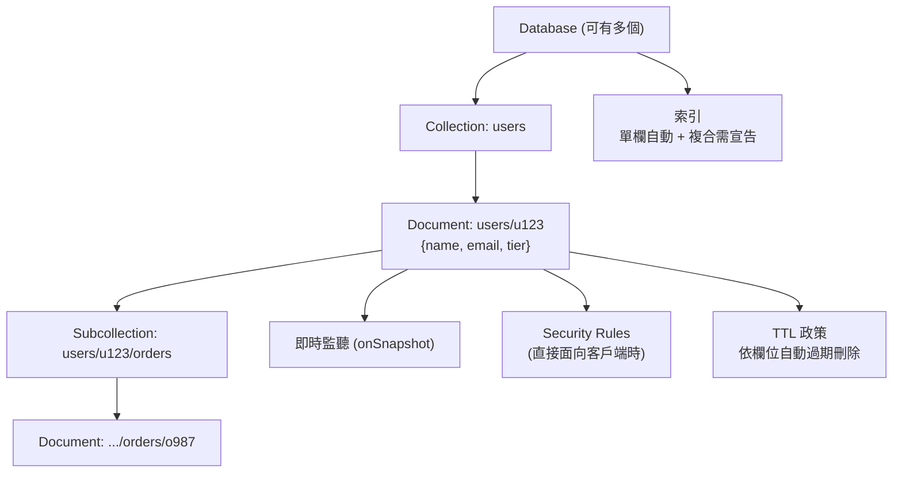

# Firestore

> [!abstract] 一句話定位
> **無伺服器的文件資料庫**：不用管執行個體、自動擴充、強一致，而且**能讓客戶端即時監聽變更並支援離線同步**。
> 「行動/Web app 的後端資料庫」幾乎都是它。

---

## 🧠 心智模型



**四層結構**：`Database → Collection → Document → (Subcollection)`
- **Document** 是 schema-free 的 key-value 集合，可嵌套 map/array。
- **Collection 沒有 schema**，同一集合裡的文件可以長得不一樣。

---

## 🔀 Native mode vs Datastore mode

| | **Native mode** ⭐ | **Datastore mode** |
|---|---|---|
| 客戶端 SDK / 即時監聽 / 離線 | ✅ | ❌（僅伺服器端） |
| Security Rules | ✅ | ❌（用 IAM） |
| 適合 | 行動/Web 直連、即時協作 | 既有 Datastore 應用、純後端大量寫入 |
| 選擇時機 | **新專案預設** | 從 App Engine Datastore 遷移 |

> 一個 Firestore 資料庫**建立時就決定 mode，之後不能改**（但現在可在同一專案建多個資料庫）。

---

## 🔍 查詢模型（最重要的限制）

| 能做 | 不能做 |
|---|---|
| 等值、範圍、`in`、`array-contains`、`array-contains-any` | **沒有 JOIN** |
| 複合條件（需複合索引） | **沒有聚合查詢的完整 SQL 能力**（有 `count()`/`sum()`/`avg()`，但不是 GROUP BY 全功能） |
| `orderBy` + `limit` + cursor 分頁 | **不能用不等式跨多個欄位任意組合**（有限制） |
| **Collection group query**（查所有同名 subcollection） | 跨資料庫查詢 |

> [!important] Firestore 查詢的黃金法則
> **查詢效能與結果集大小成正比，與資料總量無關。** 回 10 筆就是 10 筆的成本，不管集合裡有 10 億筆。
> 代價：**你不能做任意查詢** → 必須為查詢**預先設計資料結構與索引**（denormalize、寫入時就算好）。

### 索引
- **單一欄位索引**：自動建立（可用 exemption 關閉，省寫入成本）。
- **複合索引**：多欄位排序/過濾時需要。**忘記建 → 查詢直接報錯並附上建立連結**（這是考題常見的錯誤情境）。
- 索引越多 → **寫入越慢、成本越高**。大型陣列欄位要考慮 exemption。

### Collection group query
```javascript
// 查所有使用者底下的 orders（不管在哪個 user 之下）
const snap = await db.collectionGroup("orders")
  .where("status", "==", "paid").orderBy("createdAt", "desc").limit(20).get();
```
→ 需要 collection group 的複合索引。

---

## 🔐 交易與一致性

| 機制 | 說明 |
|---|---|
| **強一致** | 讀取一定看到最新已提交的資料（**和 Cloud SQL replica 的最終一致不同**） |
| **Transaction** | 讀 + 寫的原子操作。**樂觀併發**：若讀到的文件在提交前被改動 → 自動重試（可能失敗要處理） |
| **Batched write** | 最多 500 個操作的原子批次 🔢（**只寫不讀**，比交易便宜快速） |
| **`FieldValue.increment()`** | 原子遞增，不需要交易 |
| **`serverTimestamp()`** | 用伺服器時間，避免客戶端時鐘不準 |

```javascript
// 交易：轉帳（需要先讀再寫）
await db.runTransaction(async (tx) => {
  const fromRef = db.doc("accounts/A"), toRef = db.doc("accounts/B");
  const from = await tx.get(fromRef);
  if (from.data().balance < 100) throw new Error("insufficient");
  tx.update(fromRef, { balance: FieldValue.increment(-100) });
  tx.update(toRef,   { balance: FieldValue.increment(100) });
});

// 冪等寫入：用業務鍵當 document ID，重複處理不會產生重複資料
await db.doc(`processedEvents/${eventId}`).create({ at: FieldValue.serverTimestamp() });
// create() 在文件已存在時會失敗 → 天然的去重機制（見 韌性模式）
```

> [!tip] 這個 `create()` 去重技巧是 Pub/Sub 冪等消費的經典解法
> 見 [[韌性模式 重試 冪等 退避 斷路器]]。

---

## 🔢 關鍵限制（查核日 2026-09-27，以官方為準）

| 項目 | 值 |
|---|---|
| 單一文件大小上限 | **1 MiB** |
| 單一文件的**持續寫入速率**建議上限 | 約 **1 次/秒** ⚠️ 熱點的主因 |
| Batched write / transaction 操作數 | **500** |
| 單一索引項目大小、欄位路徑深度 | 有上限（深層嵌套要避免） |
| 集合/文件數量 | 無上限 |
| 查詢結果 | 依 `limit`；建議用 cursor 分頁 |

> [!warning] 「1 次/秒/文件」的實際後果
> 把全站的計數器放在一個文件（`stats/global`）→ 高併發時寫入失敗/延遲爆增。
> **解法：distributed counter（分片計數器）** — 建 N 個 shard 文件，隨機寫其中一個，讀取時把 N 個加總。
> 這是 Firestore 最常考的設計題。

### Schema 設計原則
| 原則 | 說明 |
|---|---|
| **為查詢設計，不為正規化設計** | 需要一起顯示的資料就放一起（denormalize） |
| **避免無界成長的陣列/子欄位** | 文件會撞 1 MiB 上限；改用 subcollection |
| **避免單一熱文件** | 分片計數器、把時間戳當文件 ID 前綴分散 |
| **文件 ID 用業務鍵** | 天然去重、可直接 `get()` 不用查詢 |
| **不要用單調遞增的 ID**（如 `00001`, `00002`） | 會造成寫入熱點（和 [[Bigtable]] 的 row key 問題同源） |
| **TTL 政策** | 設一個 timestamp 欄位，Firestore 自動刪除過期文件（省清理程式） |

---

## 🛡 Security Rules（Native mode，客戶端直連時）

```javascript
rules_version = '2';
service cloud.firestore {
  match /databases/{database}/documents {
    // 使用者只能讀寫自己的文件
    match /users/{uid} {
      allow read, write: if request.auth != null && request.auth.uid == uid;

      match /orders/{orderId} {
        allow read: if request.auth.uid == uid;
        allow create: if request.auth.uid == uid
                      && request.resource.data.total is number
                      && request.resource.data.total > 0;
        allow update, delete: if false;          // 訂單不可改
      }
    }
    match /{document=**} { allow read, write: if false; }   // 預設拒絕
  }
}
```

> [!important] Security Rules vs IAM
> - **Security Rules**：規範**終端使用者**（透過 Firebase/Identity Platform 驗證）從客戶端的存取。
> - **IAM**：規範**服務帳戶/開發者**從伺服器端的存取。**伺服器端 SDK 會繞過 Security Rules。**
> 考題：「行動 App 直連 Firestore，如何確保使用者只能看自己的資料」→ **Security Rules**（不是 IAM）。

---

## ⚙️ 常用操作

```bash
gcloud firestore databases create --location=asia-east1 --type=firestore-native
gcloud firestore indexes composite list
gcloud firestore export gs://my-backup-bucket/$(date +%F)      # 備份
gcloud firestore fields ttls update expiresAt \
  --collection-group=sessions --enable-ttl                      # TTL 政策

# 本地模擬器（Section 2 考點）
gcloud emulators firestore start --host-port=localhost:8080
export FIRESTORE_EMULATOR_HOST=localhost:8080
```

---

## 🎯 考點速記

| 看到題目說… | 就想到 |
|---|---|
| `mobile app` + `real-time updates` + `offline support` | **Firestore Native mode** |
| `serverless`、`no capacity planning`、`document model` | Firestore |
| `users must only access their own data from the client` | **Security Rules** |
| 查詢報錯要求建索引 | **複合索引** |
| `global counter` 寫入瓶頸 | **分片計數器（distributed counter）** |
| `document exceeds 1 MiB` | 改用 subcollection，拆分文件 |
| `automatically delete sessions after 30 days` | **TTL 政策** |
| `需要 SQL JOIN / 複雜聚合` | **不是** Firestore → Spanner / BigQuery |
| `需要跨大量文件的報表分析` | 匯出到 **BigQuery**（Firestore→BQ 匯出/擴充功能） |
| `exactly-once 處理事件` | 用 event ID 當文件 ID + `create()` |

## 💣 真實場景陷阱

1. **N+1 查詢**：迴圈裡逐一 `get()`。改用 `in` 查詢或 denormalize。
2. **索引爆炸**：對每個欄位都建索引 → 寫入成本翻倍。用單欄位索引 exemption。
3. **在 Security Rules 裡做複雜的跨文件讀取**：每次讀取都算費用且變慢。
4. **假設 Firestore 能做 offset 分頁**：沒有真正的 offset（會全掃），用 **cursor（`startAfter`）**。
5. **把 Firestore 當資料倉儲**：報表查詢應該去 [[BigQuery 給開發者]]。
6. **忘記伺服器端 SDK 繞過 rules**：以為 rules 就是全部的安全防線。

## ✍️ 自我檢核

1. Native mode 與 Datastore mode 的差別？新專案該選哪個？可以改嗎？
2. 單一文件的寫入速率上限是多少？全站計數器該怎麼設計？
3. Firestore 的查詢效能取決於什麼？這帶來什麼設計限制？
4. Security Rules 與 IAM 各管什麼？伺服器端 SDK 會不會受 rules 限制？
5. 交易與 batched write 的差別？各自的操作數上限？
6. 如何用 Firestore 實作「事件只處理一次」？
7. 文件超過 1 MiB 怎麼辦？無界成長的陣列該怎麼改？

## 🔗 相關

- [[決策樹 資料庫選型]]
- [[Bigtable]]
- [[Spanner]]
- [[Cloud SQL 與 AlloyDB]]
- [[一致性 交易與資料複寫]]
- [[韌性模式 重試 冪等 退避 斷路器]]
- [[IAP Identity Platform 與 Web Security Scanner]]
- [[開發環境 Cloud Code Shell Workstations 與 AI 工具]]
- [[BigQuery 給開發者]]
- [[數字與限制速記]]
