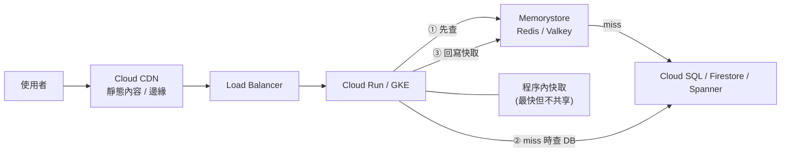

# Memorystore 與快取策略

> [!abstract] 一句話定位
> **Memorystore = 代管的 Redis / Valkey / Memcached**，提供**亞毫秒**存取。
> 官方考試指南明文列出「實作快取解決方案（e.g., Memorystore）」 — 所以除了服務本身，**快取模式**也要會。

---

## 🧠 快取在架構中的位置



**四層快取，各有分工**
| 層級 | 例子 | 適合 | 風險 |
|---|---|---|---|
| 瀏覽器 / 客戶端 | `Cache-Control` | 靜態資源 | 難以失效 |
| **邊緣 CDN** | [[Load Balancing 與 Session Affinity]] 的 Cloud CDN | 靜態檔案、公開 API 的 GET | 私有內容要小心 |
| **共享快取** | **Memorystore** | session、熱資料、計數器、rate limit | 需要處理一致性 |
| 程序內 | Guava / LRU dict | 極熱且可容忍不一致的小資料 | 每個實例一份，無法統一失效 |

---

## 🗃 Memorystore 的三種引擎

| 引擎 | 特性 | 用途 |
|---|---|---|
| **Redis / Valkey** | 豐富資料結構（string / hash / list / set / sorted set / stream）、持久化、複寫、Pub/Sub | **預設選擇**：session、排行榜、佇列、分散式鎖、rate limit |
| **Memcached** | 純 key-value、多執行緒、水平擴充簡單 | 單純的大量簡單快取、不需要持久化 |

**Redis 的服務層級（tier）**
| Tier | 特性 |
|---|---|
| **Basic** | 單節點，**沒有複本 → 重啟會清空資料、無 SLA 級 HA** |
| **Standard (HA)** | 主從跨 zone 複寫 + **自動 failover** |
| **Cluster（Memorystore for Redis Cluster / Valkey）** | 分片架構，橫向擴充到更大容量與吞吐 |

> [!important] 考點
> - 「快取需要高可用、不能因為 zone 故障就全空」→ **Standard tier（HA）**
> - 「session 存這裡但不能遺失」→ Standard + 考慮持久化；更嚴格的資料請放資料庫
> - 「要存超過單節點記憶體的量」→ **Cluster**

**連線方式**：Memorystore 只有**私有 IP（VPC 內）** → Cloud Run 必須用 **Direct VPC egress / Serverless VPC Access**，見 [[VPC 連線 Serverless VPC Access 與 Direct VPC Egress]]。這是很常考的組合題。

---

## 🔄 快取模式（必懂）

### 1. Cache-aside（Lazy loading）— **預設模式**
```python
def get_product(pid):
    key = f"product:{pid}"
    cached = r.get(key)
    if cached:
        return json.loads(cached)              # HIT
    data = db.query_product(pid)               # MISS → 查來源
    r.setex(key, 300, json.dumps(data))        # 回寫，TTL 5 分鐘
    return data
```
✅ 只快取真正被用到的資料｜❌ 第一次一定 miss；資料可能過期

### 2. Write-through
寫入時同時寫快取與資料庫 → 快取永遠是熱的，但寫入變慢。

### 3. Write-behind（write-back）
先寫快取，非同步刷回資料庫 → 寫入極快，但**快取掉了會丟資料**。高風險，很少用在正確性要求高的場景。

### 4. Read-through
由快取層自己負責在 miss 時載入（需要中介層支援）。

---

## 💥 三大快取災難與解法（考題愛考）

| 問題 | 現象 | 解法 |
|---|---|---|
| **快取穿透（penetration）** | 大量查詢不存在的 key → 每次都打到 DB | **快取空值**（短 TTL）+ Bloom filter + 輸入驗證 |
| **快取雪崩（avalanche）** | 大量 key **同時過期** → DB 瞬間被打爆 | **TTL 加隨機抖動**（`ttl + random(0, 60)`）+ 分批預熱 |
| **快取擊穿 / 熱 key（stampede）** | 單一熱門 key 過期，成千個請求同時去 DB 重建 | **互斥鎖 / single-flight**（只讓一個請求重建，其他等待）+ 邏輯過期（先回舊值再背景更新） |

```python
# single-flight：用 Redis SETNX 做鎖，避免擊穿
def get_hot(key):
    v = r.get(key)
    if v: return v
    if r.set(f"lock:{key}", "1", nx=True, ex=10):     # 只有一個請求拿到鎖
        try:
            v = db.load(key); r.setex(key, 300 + random.randint(0, 60), v)
        finally:
            r.delete(f"lock:{key}")
        return v
    time.sleep(0.05)                                   # 其他請求短暫等待再讀
    return r.get(key) or db.load(key)
```

## ♻️ 失效策略（invalidation）
| 策略 | 說明 | 適用 |
|---|---|---|
| **TTL 過期** | 最簡單，容忍一段時間的不一致 | 絕大多數場景 |
| **寫入時主動刪除（write-invalidate）** | 更新 DB 後 `DEL` 快取 key | 需要較強一致性 |
| **版本化 key** | `product:v3:123`，改版就換 key，不必刪舊的 | 大量 key 一次失效 |
| **事件驅動失效** | 資料變更發 [[Pub Sub]] → 各服務清自己的快取 | 多服務共用資料 |

> [!warning] 「先刪快取還是先更新 DB」
> 標準做法：**先更新 DB，再刪快取**（cache-aside + invalidate）。
> 仍有極小競態窗口 → 需要更強一致就縮短 TTL 或用版本化 key。考試通常只要你答出「更新 DB 後讓快取失效」。

---

## 🧰 Redis 在系統設計中的其他用途（Section 1 常見）

| 用途 | 做法 |
|---|---|
| **Session 儲存** | `SETEX session:<id> 1800 <payload>` → 讓應用真正無狀態，見 [[Session 管理]] |
| **Rate limiting** | `INCR` + `EXPIRE`（固定窗口）或 sorted set（滑動窗口） |
| **排行榜** | `ZADD` / `ZREVRANGE`（sorted set） |
| **分散式鎖** | `SET key val NX EX 10`（注意要設 TTL 避免死鎖） |
| **去重 / 冪等鍵** | `SET processed:<eventId> 1 NX EX 86400` → 見 [[韌性模式 重試 冪等 退避 斷路器]] |
| **輕量佇列** | List / Stream（但正式佇列請用 [[Pub Sub]] / [[Cloud Tasks]]） |

```python
# 滑動窗口 rate limit：每分鐘 100 次
def allow(user_id, limit=100, window=60):
    now = time.time(); key = f"rl:{user_id}"
    p = r.pipeline()
    p.zremrangebyscore(key, 0, now - window)   # 移除窗口外的
    p.zadd(key, {str(now): now})
    p.zcard(key)
    p.expire(key, window)
    return p.execute()[2] <= limit
```

---

## 🎯 考點速記

| 看到題目說… | 就想到 |
|---|---|
| `sub-millisecond latency` | **Memorystore（Redis）** |
| `reduce load on the database` | 快取（cache-aside） |
| `session state for a stateless app` | Memorystore Redis |
| `leaderboard` / `top N` | Redis **sorted set** |
| `rate limiting` | Redis `INCR`/sorted set，或 **Apigee / API Gateway** 的政策 |
| `cache must survive a zone failure` | Redis **Standard tier（HA）** |
| `cache larger than one node` | Redis **Cluster** |
| `static content, global users` | **Cloud CDN**（不是 Memorystore） |
| Cloud Run 要連 Memorystore | **Direct VPC egress / Serverless VPC Access** |
| 大量 key 同時過期打爆 DB | TTL **抖動** + 預熱 |
| 熱門 key 重建打爆 DB | **互斥鎖 / single-flight** |

## 💣 真實場景陷阱

1. **Basic tier 用在生產 session**：節點重啟 → 所有使用者被登出。
2. **忘了 Cloud Run 要進 VPC**：連不上 Memorystore（私有 IP），錯誤是 timeout 而不是明確的權限錯誤。
3. **沒設 TTL**：記憶體滿了觸發 eviction，行為不可預期（依 `maxmemory-policy`）。
4. **快取大物件**（幾 MB 的 JSON）：網路與序列化成本吃掉快取的好處。
5. **把快取當可靠儲存**：Redis 不是資料庫，重要資料要有來源。
6. **快取與 DB 不一致造成業務錯誤**（如庫存）→ 強一致需求不要快取，或用短 TTL + 交易驗證。

## ✍️ 自我檢核

1. cache-aside 的三個步驟？優缺點？
2. 快取穿透、雪崩、擊穿分別是什麼？各自的標準解法？
3. Redis Basic 與 Standard tier 的差別？生產環境該選哪個？
4. Cloud Run 要連 Memorystore 需要哪些網路設定？
5. 用 Redis 做「每個使用者每分鐘 100 次」的限流，寫出思路。
6. 更新資料時，先刪快取還是先更新資料庫？為什麼？
7. 什麼情況下應該用 Cloud CDN 而不是 Memorystore？

## 🔗 相關

- [[決策樹 資料庫選型]]
- [[Session 管理]]
- [[Load Balancing 與 Session Affinity]]
- [[VPC 連線 Serverless VPC Access 與 Direct VPC Egress]]
- [[Cloud SQL 與 AlloyDB]]
- [[韌性模式 重試 冪等 退避 斷路器]]
- [[Cloud API 呼叫最佳實務]]
- [[Section 1 設計可擴充安全可靠的雲端原生應用]]
