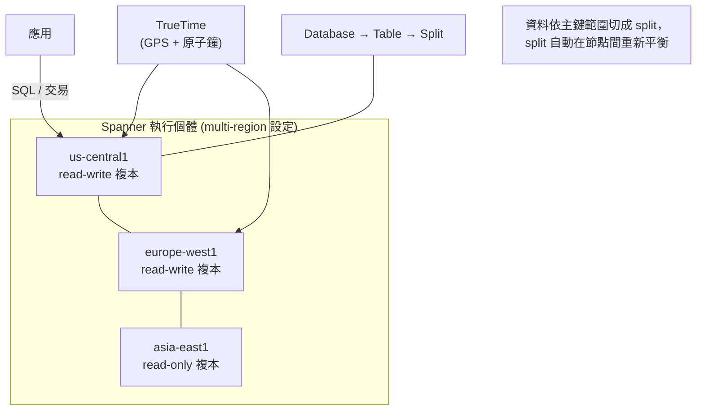

# Spanner

> [!abstract] 一句話定位
> **全球分散、水平擴展、強一致、支援 SQL 與跨行交易的關聯式資料庫。**
> 它是唯一能同時給你「關聯式 + 全球強一致 + 無限水平擴展」的選項 — 這三個詞同時出現在題目裡，答案就是 Spanner。

---

## 📘 技術理解
*原理、限制與實務操作 —— 不為考試也該懂的部分。*

### 🧠 心智模型



**核心機制**
- **TrueTime**：Google 的全球同步時鐘（GPS + 原子鐘），讓分散節點能對事件排序 → 這是「外部一致性」的基礎。
- **外部一致性（external consistency）**：比一般「強一致」更嚴格 — 交易的順序與**真實世界的時間順序**一致。這是 Spanner 最強的保證。
- **Split**：資料依**主鍵範圍**切分，自動在節點間搬移以平衡負載。
- **容量單位**：**processing units (PU)**（100 PU = 0.1 node）或 **node**（1 node = 1000 PU）。可自動擴充。

---

### 🗺 執行個體設定（instance configuration）

| 類型 | 可用性 SLA 🔢 | 寫入延遲 | 說明 |
|---|---|---|---|
| **Regional** | 99.99% | 較低 | 三個複本在同區域不同 zone |
| **Multi-region** | **99.999%** | 較高（需跨區達成共識） | 跨區域複本，可在多地就近讀取 |

> [!important] 考點
> - `99.999% availability` + relational → **Spanner multi-region**。
> - Multi-region 的代價是**寫入延遲增加**（要跨洲取得多數共識）。題目問「全球寫入低延遲」要小心 — Spanner 給的是一致性，不是最低寫入延遲。

---

### 🔑 Schema 設計（考試重點）

#### 1. 主鍵設計：避免熱點（**必考**）
```sql
-- ❌ 單調遞增主鍵 → 所有寫入集中在最後一個 split（熱點）
CREATE TABLE Events (
  EventId INT64 NOT NULL,        -- 自增序號
  ...
) PRIMARY KEY (EventId);

-- ❌ 時間戳開頭 → 同樣造成寫入熱點
PRIMARY KEY (CreatedAt, EventId)

-- ✅ 用 UUIDv4 / 隨機值
CREATE TABLE Events (
  EventId STRING(36) NOT NULL,   -- UUID
  CreatedAt TIMESTAMP NOT NULL,
) PRIMARY KEY (EventId);

-- ✅ 或把雜湊值放前面（bit-reverse / shard key）
PRIMARY KEY (ShardId, CreatedAt, EventId)
```
> **原則**：主鍵的第一個欄位要**分布均勻**。單調遞增（自增 ID、timestamp）= 熱點。
> 需要按時間查詢時，仍可對 `CreatedAt` 建**二級索引**（Spanner 支援二級索引，[[Bigtable]] 不支援）。

#### 2. Interleaved tables（交錯表）
把子表的資料**實體上存在父表列的旁邊**，讓 JOIN 與一起讀取變得很快。

```sql
CREATE TABLE Customers (
  CustomerId STRING(36) NOT NULL,
  Name STRING(MAX),
) PRIMARY KEY (CustomerId);

CREATE TABLE Orders (
  CustomerId STRING(36) NOT NULL,   -- 必須以父表主鍵開頭
  OrderId    STRING(36) NOT NULL,
  Total      NUMERIC,
) PRIMARY KEY (CustomerId, OrderId),
  INTERLEAVE IN PARENT Customers ON DELETE CASCADE;
```
> [!tip] 何時用 interleave
> 「父子關係 + 幾乎總是一起查」→ interleave（例如 Customer 與其 Orders）。
> 「子表資料量極大、且常獨立查詢」→ 不要 interleave（避免單一父鍵下的資料過大）。

#### 3. 二級索引與 STORING
```sql
CREATE INDEX OrdersByDate ON Orders(CreatedAt DESC);
-- 覆蓋索引：把常用欄位放進索引，查詢不用回主表
CREATE INDEX OrdersByStatus ON Orders(Status) STORING (Total, CustomerId);
```
**強制使用索引**：`SELECT ... FROM Orders@{FORCE_INDEX=OrdersByStatus} WHERE ...`

#### 4. 其他要知道的
- **`NUMERIC`** 型別做金額（避免浮點誤差）。
- **`ARRAY` / `STRUCT`** 支援半結構化資料；也支援 **JSON** 型別。
- **Commit timestamp**：`OPTIONS (allow_commit_timestamp=true)` → 讓 Spanner 填入提交時間（單調，但要注意熱點）。
- **GoogleSQL 與 PostgreSQL 兩種方言**：建立資料庫時選定。既有 PostgreSQL 應用遷移可選 PG 方言。

---

### 🔄 讀取模式（考點）

| 模式 | 說明 | 使用時機 |
|---|---|---|
| **Strong read**（預設） | 保證讀到最新已提交資料 | 需要正確性（read-your-writes） |
| **Stale read（exact staleness / bounded staleness）** | 讀取「N 秒前」的快照 | **效能最佳化**：可從最近的複本讀，延遲更低、不影響主複本 |
| **Read-only transaction** | 多次讀取看到同一個一致快照，不需鎖 | 報表、批次讀 |
| **Read-write transaction** | 悲觀鎖 + 兩階段提交 | 需要讀後寫 |
| **Partitioned DML** | 大量更新/刪除切分執行 | `UPDATE ... WHERE` 影響數百萬列 |

```python
# Bounded staleness：接受 15 秒內的舊資料，換取更低延遲
with database.snapshot(exact_staleness=datetime.timedelta(seconds=15)) as snapshot:
    rows = snapshot.execute_sql("SELECT * FROM Products WHERE Category=@c",
                                params={"c": "books"}, param_types={"c": spanner.param_types.STRING})
```

> [!important] 考點
> 「儀表板讀取量很大，容忍幾秒舊資料，想降低對主資料庫的影響」→ **stale read**。
> 「交易後立刻要讀到自己寫的」→ **strong read**。

---

### ⚙️ 常用操作

```bash
gcloud spanner instances create prod \
  --config=regional-asia-east1 --processing-units=1000 --description="prod"

gcloud spanner databases create orders --instance=prod \
  --ddl-file=schema.sql

gcloud spanner databases execute-sql orders --instance=prod \
  --sql="SELECT COUNT(*) FROM Orders"

# 本地模擬器（Section 2 考點）
gcloud emulators spanner start
export SPANNER_EMULATOR_HOST=localhost:9010
```

---

## 🎯 應試
*考場上的提取線索與自我測驗 —— 備考期才需要。*

### 🎯 考點速記

| 看到題目說… | 就想到 |
|---|---|
| `relational` + `global` + `strong consistency` + `horizontal scale` | **Spanner** |
| `99.999% availability` | Spanner **multi-region** |
| `ACID transactions across regions` | Spanner |
| `write hotspot` / `monotonically increasing key` | 改用 **UUID / 雜湊前綴 / bit-reverse** |
| `father-child data always read together` | **INTERLEAVE IN PARENT** |
| `reduce load on primary, tolerate slightly stale data` | **stale read** |
| `avoid reading base table` | 索引加 **STORING**（覆蓋索引） |
| `bulk update millions of rows` | **Partitioned DML** |
| `既有 PostgreSQL 想水平擴展` | Spanner **PostgreSQL 方言**（或先評估 AlloyDB） |
| `成本敏感、單區域、資料量不大` | **不要** Spanner → Cloud SQL |

### 💣 真實場景陷阱

1. **用自增主鍵**：上線後寫入全擠在一個 split，吞吐上不去。改主鍵要重建表 → 設計階段就要做對。
2. **無限制的 interleave**：某個父鍵底下塞了千萬列 → split 無法再切（interleave 的資料必須同 split 群組）。
3. **拿 Spanner 當低成本 Cloud SQL 替代品**：最小容量的成本明顯高於小型 Cloud SQL。
4. **在交易裡做遠端呼叫**：鎖持有時間變長 → 衝突與 `ABORTED` 大增。交易要短。
5. **忽略 `ABORTED` 重試**：Spanner 讀寫交易可能因衝突被中止，**用戶端程式庫通常會重試，但你的交易函式必須可重入（沒有副作用）**。
6. **多區域寫入延遲沒評估**：跨洲寫入延遲可能到數十到上百毫秒。

### ✍️ 自我檢核

1. 為什麼 `PRIMARY KEY (Timestamp)` 是壞設計？三種修法是什麼？
2. Interleaved table 的好處與風險？什麼情況不該用？
3. Strong read 與 stale read 的差別？各在什麼場景用？
4. Spanner 與 Cloud SQL 的四個決定性差異（一致性、擴展、SLA、成本）？
5. 「外部一致性」比「強一致」多保證了什麼？靠什麼技術實現？
6. 交易收到 `ABORTED` 該怎麼處理？對你的程式碼有什麼要求？

## 🔗 相關

- [[決策樹 資料庫選型]]
- [[Cloud SQL 與 AlloyDB]]
- [[Bigtable]]
- [[Firestore]]
- [[一致性 交易與資料複寫]]
- [[地理分布 區域與可用區設計]]
- [[Section 1 設計可擴充安全可靠的雲端原生應用]]
