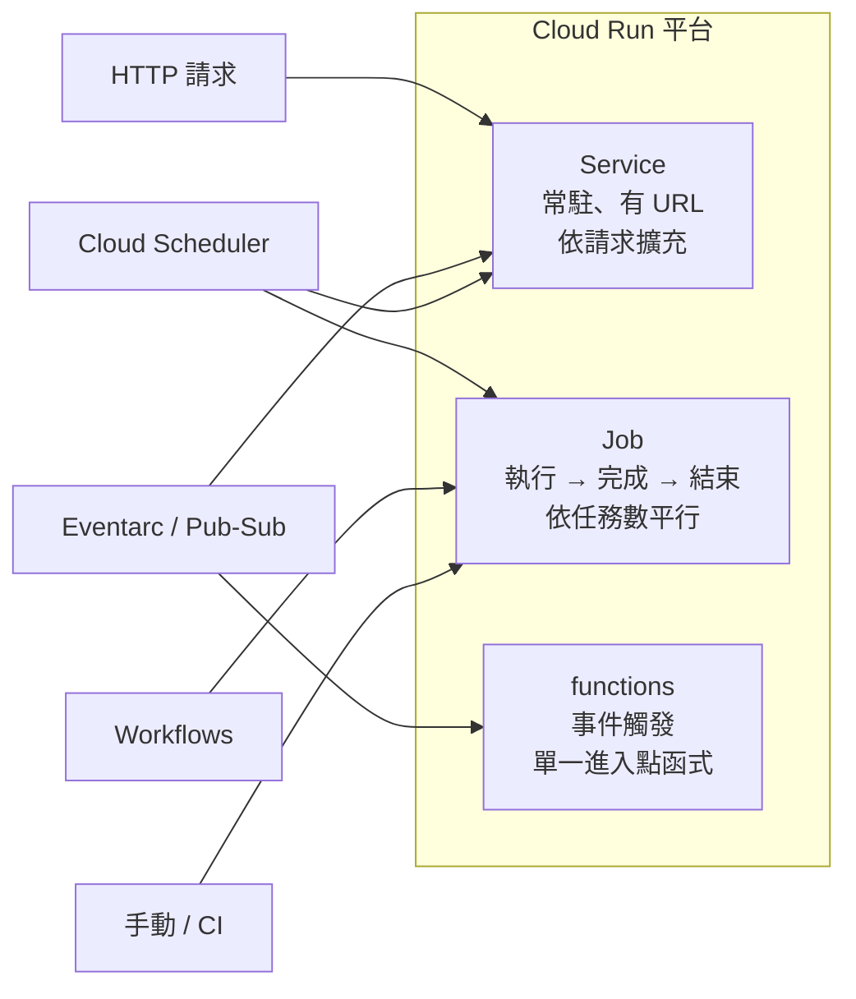

# Cloud Run Jobs 與 Cloud Run functions

> [!abstract] 一句話定位
> 同一個 Cloud Run 平台的三種形態：
> - **Service** — 長駐、接請求、有 URL（見 [[Cloud Run]]）
> - **Job** — 跑完就結束的**批次工作**，沒有 URL，不接請求
> - **functions** — 由**事件**觸發的單一函式（原 Cloud Functions，現已整併進 Cloud Run）

---

## 📘 技術理解
*原理、限制與實務操作 —— 不為考試也該懂的部分。*

### 🧠 三形態心智模型



---

### 📦 Cloud Run Jobs

#### 核心概念
| 概念 | 說明 |
|---|---|
| **Job** | 工作定義（映像 + 設定） |
| **Execution** | 一次執行；一個 Job 可被執行多次 |
| **Task** | Execution 內的平行單位。`--tasks=10` → 10 個平行任務 |
| `CLOUD_RUN_TASK_INDEX` | 環境變數，告訴容器「我是第幾號任務」（0-based） → 用來切分工作 |
| `CLOUD_RUN_TASK_COUNT` | 總任務數 |
| `--parallelism` | 同時最多跑幾個任務（控制對下游的壓力） |
| `--task-timeout` | 單一任務的時限 |
| `--max-retries` | 任務失敗的重試次數 |

> [!important] Job 的成功定義
> **所有 task 都成功結束（exit code 0）** 才算 execution 成功。任一 task 用盡重試仍失敗 → execution 失敗。

#### 典型用法：切分資料的平行批次
```python
import os
idx   = int(os.environ["CLOUD_RUN_TASK_INDEX"])    # 0..N-1
total = int(os.environ["CLOUD_RUN_TASK_COUNT"])

rows = fetch_all_ids()                              # 例如 1,000,000 筆
mine = rows[idx::total]                             # 每個 task 處理自己的分片
for r in mine:
    process(r)
```

```bash
gcloud run jobs create nightly-etl \
  --image asia-east1-docker.pkg.dev/$PROJECT/repo/etl:v1 \
  --region asia-east1 --tasks 20 --parallelism 5 \
  --task-timeout 30m --max-retries 3 \
  --service-account etl-sa@$PROJECT.iam.gserviceaccount.com

gcloud run jobs execute nightly-etl --region asia-east1 --wait
```

**排程執行**：用 [[Workflows 與 Cloud Scheduler]] 的 Cloud Scheduler 打 Jobs API，或用 Workflows 串接多個 Job。

#### 何時選 Job 而不是 Service
| 訊號 | 選擇 |
|---|---|
| 沒有 HTTP 端點需求、跑完就好 | **Job** |
| 執行時間可能超過 60 分鐘 | **Job**（Service 請求上限 60 分）|
| 需要平行切分大量資料 | **Job** + tasks |
| 需要「失敗自動重試某一片」 | **Job** 的 `max-retries` |
| 需要回應使用者 | Service |

---

### ⚡ Cloud Run functions（原 Cloud Functions）

> [!note] 命名演進
> Cloud Functions（2nd gen）本來就是建構在 Cloud Run + Eventarc 之上；現在官方統一稱 **Cloud Run functions**。考題可能用任一名稱，**把它當成「只寫一個函式、平台幫你包容器」的 Cloud Run**。

#### 兩種觸發型態
| 型態 | 觸發來源 | 函式簽章特徵 |
|---|---|---|
| **HTTP function** | HTTPS 請求 | 收 `request`、回 `response` |
| **Event-driven function** | Eventarc（含 Pub/Sub、GCS、Firestore、Audit Log…） | 收 **CloudEvent** |

```python
# HTTP function（Python, functions-framework）
import functions_framework

@functions_framework.http
def hello(request):
    return {"msg": "ok"}, 200

# CloudEvent function：GCS 物件上傳觸發
@functions_framework.cloud_event
def on_upload(cloud_event):
    data = cloud_event.data
    print(f"bucket={data['bucket']} name={data['name']}")
```

#### 與 Cloud Run Service 的取捨
| 你需要 | 選 |
|---|---|
| 只有一支函式、不想管 Dockerfile、不想管路由 | **functions** |
| 多路由、自訂框架、sidecar、完整控制容器 | **Cloud Run service** |
| 相同事件驅動需求但想要一個服務處理多種事件 | **Cloud Run service** + [[Eventarc]] 多個 trigger |

> [!tip] 考試傾向
> 新版考試指南把部署章節寫成「部署到 **Cloud Run**」與「部署到 **GKE**」，**functions 的獨立比重下降**。遇到「單一小函式 + 事件觸發」選 functions；其他情況預設 Cloud Run service。

#### 重試行為（重要考點）
- **Event-driven function 預設不重試**；要開 `--retry` 才會在失敗時重送。
- 開了重試 → **可能無限重試同一個壞事件**（毒藥訊息）。解法：設定重試上限/DLQ（用 Pub/Sub 訂閱 + dead-letter topic），並確保函式**冪等**。見 [[韌性模式 重試 冪等 退避 斷路器]]。

---

### 🔢 關鍵限制（概念性，細節以官方為準）

| 項目 | Service | Job | functions（gen2） |
|---|---|---|---|
| 最長執行時間 | 請求 60 分鐘 | **task 可長於 60 分鐘**（以官方上限為準） | HTTP 最長同 Service；事件驅動較短 |
| 縮到 0 | ✅ | N/A（跑完即止） | ✅ |
| 需要 HTTP 伺服器 | ✅ 必須 | ❌ 不需要 | 平台代管 |
| 平行任務 | 靠實例數 | `--tasks` / `--parallelism` | 靠實例數 |

---

## 🎯 應試
*考場上的提取線索與自我測驗 —— 備考期才需要。*

### 🎯 考點速記

| 看到題目說… | 就想到 |
|---|---|
| `nightly batch job` / `process a large file set` | Cloud Run **Jobs** |
| `run to completion` / `exit code` | Jobs |
| `split work across parallel workers` | Jobs + `CLOUD_RUN_TASK_INDEX` |
| `single function` + `triggered when a file is uploaded` | Cloud Run **functions** + Eventarc/GCS 觸發 |
| `scheduled` + `no HTTP endpoint` | Cloud Scheduler → Jobs |
| 事件處理失敗要重試但不能無限重試 | 開 retry + **dead-letter topic** + 冪等 |
| 執行 3 小時的匯入 | Jobs（不是 Service 的 HTTP 請求） |

---

### 💣 真實場景陷阱

1. **用 HTTP Service 跑長批次**：超過逾時就被切斷，且重試會重跑整批。改用 Jobs。
2. **Job 的 task 不冪等**：重試時重複寫入。task 要能「重跑不出錯」。
3. **`--parallelism` 沒設**：20 個 task 同時打資料庫 → 打爆。用 parallelism 節流。
4. **event function 沒開 retry**：以為失敗會自動重送，結果事件默默消失。
5. **開了 retry 又不冪等**：同一個事件被處理 100 次，帳單與資料都爆。

### ✍️ 自我檢核

1. Job / Execution / Task 三層關係？如何讓 10 個 task 各處理不同分片？
2. Cloud Run Job 與 Cloud Run Service 的三個決定性差異？
3. 事件驅動 function 失敗後預設會怎樣？要怎麼改？改了之後新的風險是什麼？
4. 「每天凌晨 2 點把前一天的訂單匯出到 GCS」→ 完整的服務組合是什麼？
5. 為什麼 Cloud Run functions 可以被視為 Cloud Run 的一種形態？

## 🔗 相關

- [[Cloud Run]]
- [[決策樹 運算平台選型]]
- [[Eventarc]]
- [[Workflows 與 Cloud Scheduler]]
- [[Cloud Tasks]]
- [[韌性模式 重試 冪等 退避 斷路器]]
- [[Section 3 設定雲端原生應用的部署]]
