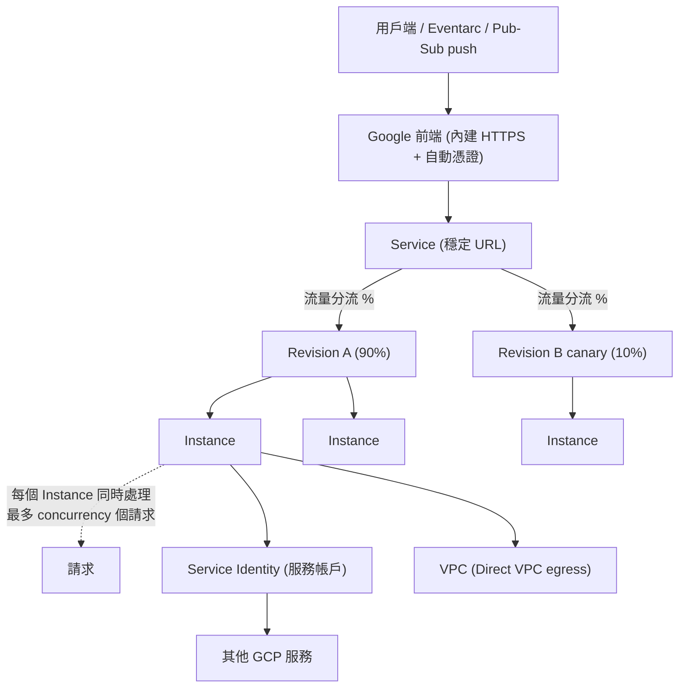

# Cloud Run

> [!abstract] 一句話定位
> **把容器變成一個會自己擴充、用多少算多少、可以縮到零的 HTTPS 端點。**
> 它是 PCD 考試的第一主角：Section 1（設計）與 Section 3（部署）都以它為核心。

---

## 📘 技術理解
*原理、限制與實務操作 —— 不為考試也該懂的部分。*

### 🧠 心智模型



**三層資源模型（必懂）**
1. **Service**：穩定的 URL 與設定容器，你部署的對象。
2. **Revision**：**不可變（immutable）** 的快照 = 映像 + 所有設定（環境變數、CPU、記憶體、SA…）。每次部署產生一個新 revision。
3. **Instance**：實際執行容器的實體，依流量自動增減。

> [!important] 為什麼 revision 不可變這件事很重要
> 因為它讓「回滾」變成**只是把流量指回舊 revision**，不需要重新建置或部署 → 秒級、零風險。考題只要出現 `immediately roll back`，答案就是 `update-traffic --to-revisions`。

---

### 📜 容器契約（Container Contract）

你的容器必須遵守這幾條，否則部署會失敗：

| 規則 | 說明 | 常見錯誤 |
|---|---|---|
| 監聽 `$PORT` 環境變數 | Cloud Run 注入 `PORT`（預設 8080） | 程式硬寫 `3000` → 健康檢查失敗 |
| 綁定 `0.0.0.0` | 不能只綁 `127.0.0.1` | 綁 localhost → 收不到外部請求 |
| 無狀態 | 檔案系統是記憶體內的（除非掛 volume）；實例隨時會被回收 | 把 session 存本地磁碟 → 見 [[Session 管理]] |
| 快速啟動 | 啟動要在 startup 限制內完成 🔢 | 載入大型模型 → 用 startup CPU boost 或 min-instances |
| 處理 `SIGTERM` | 收到後要**優雅關閉**（排空進行中的請求） | 直接被砍 → 請求中斷 |

```python
# 最小可用的 Cloud Run 容器（Python / Flask）
import os, signal, sys
from flask import Flask
app = Flask(__name__)

@app.get("/")
def hello():
    return "ok"

def graceful(*_):          # 收到 SIGTERM 時完成收尾
    sys.exit(0)
signal.signal(signal.SIGTERM, graceful)

if __name__ == "__main__":
    app.run(host="0.0.0.0", port=int(os.environ.get("PORT", 8080)))
```

---

### 🔑 核心概念

#### 1. 並行（Concurrency）— 最常考的設定
Cloud Run **一個實例可以同時處理多個請求**（這是它和傳統 FaaS 最大的差別）。

| 設定 | 行為 | 何時用 |
|---|---|---|
| `--concurrency=80`（預設）🔢 | 每實例同時 80 個請求 | 典型 I/O 密集的 web 服務 |
| 提高（上限 1000）🔢 | 更少實例、更省錢 | 大量等待 I/O、記憶體足夠 |
| `--concurrency=1` | 一次一個請求 | 程式**非執行緒安全**、CPU 密集、或每請求要吃大量記憶體 |

> [!warning] 陷阱
> 並行度高 → 單一實例的記憶體/CPU 被多個請求瓜分。看到 `OOM`（記憶體不足被殺）先想：**降低 concurrency 或提高記憶體**。

#### 2. 自動擴充
- 依**進行中的請求數 ÷ concurrency** 決定實例數，也會看 CPU 使用率。
- `--min-instances=N`：保留暖實例 → **消除冷啟動**，代價是持續計費（idle 時較便宜但不免費）。
- `--max-instances=N`：上限，用來**保護下游**（例如資料庫連線數）。預設值 🔢 不高，流量大時要調。
- **縮到 0**：沒流量時實例歸零、不計費 → 但下一個請求會冷啟動。

#### 3. CPU 配置（CPU allocation）
| 模式 | 行為 | 用途 |
|---|---|---|
| **僅請求期間**（`--cpu-throttling`，預設） | 沒處理請求時 CPU 被節流到近乎 0 | 一般 HTTP 服務，最省錢 |
| **一律配置**（`--no-cpu-throttling`） | 實例存活期間都有 CPU | 回應後仍需背景工作、要維持連線池/長輪詢、批次處理 |

> [!tip] 考點
> 「回應已送出，但還要繼續寫入資料庫 / 呼叫下游」→ 需要 **CPU always allocated**（或改用 [[Cloud Tasks]] 把工作丟出去，這通常是更 Google 的答案）。

#### 4. 執行環境
- **第一代（gen1）**：啟動快、系統呼叫支援較少。
- **第二代（gen2）**：完整 Linux 相容（支援網路檔案系統掛載、部分系統呼叫），啟動略慢、CPU 效能較好。
- 需要掛 **Cloud Storage FUSE / NFS volume** 或特殊系統呼叫 → gen2。

#### 5. 服務身分（Service Identity）
- 每個 revision 以一個**服務帳戶**執行；不指定就用 **default compute service account**（權限過大 → 考試裡永遠是錯選項）。
- 服務內用 ADC 自動取得該 SA 的 token，見 [[驗證與授權 ADC OAuth JWT]]。
- `--service-account=my-svc-sa@PROJECT.iam.gserviceaccount.com`

#### 6. 存取控制（誰能呼叫）
| 設定 | 效果 |
|---|---|
| `--allow-unauthenticated` | 公開（等於給 `allUsers` 加 `roles/run.invoker`） |
| `--no-allow-unauthenticated` | 需要有效的 **Google 簽發的 ID token**，且呼叫者有 `roles/run.invoker` |
| `--ingress=internal` | 只接受來自同 VPC / VPC-SC 邊界內的流量 |
| `--ingress=internal-and-cloud-load-balancing` | 內部 + 經過 LB（搭配 Cloud Armor 用） |

**服務對服務驗證（考試必考流程）**
```python
# 服務 A 呼叫需驗證的服務 B
import google.auth.transport.requests
import google.oauth2.id_token, requests

AUDIENCE = "https://service-b-xxxx.a.run.app"      # 目標服務的 URL 當 audience
def call_b():
    auth_req = google.auth.transport.requests.Request()
    token = google.oauth2.id_token.fetch_id_token(auth_req, AUDIENCE)   # 取 ID token
    return requests.get(AUDIENCE, headers={"Authorization": f"Bearer {token}"})
```
`gcloud run services add-iam-policy-binding service-b --member=serviceAccount:A_SA --role=roles/run.invoker`

> [!important] ID token vs access token
> 呼叫 **Cloud Run / Cloud Functions / IAP** 這類「服務端點」→ 用 **ID token**（audience = 目標 URL）。
> 呼叫 **Google Cloud API**（Firestore、GCS…）→ 用 **access token**（scope）。搞錯就是 401。

#### 7. 流量管理與漸進發布
```bash
# 部署新版但不給流量，掛 tag
gcloud run deploy api --image IMG --no-traffic --tag canary
#  → 得到專屬 URL：https://canary---api-xxxx.a.run.app （可單獨做 E2E 測試）

gcloud run services update-traffic api --to-tags canary=10   # 10% canary
gcloud run services update-traffic api --to-tags canary=50
gcloud run services update-traffic api --to-latest           # 全切最新
gcloud run services update-traffic api --to-revisions api-00007-abc=100   # 回滾
```
詳見 [[Cloud Deploy 與部署策略]]。

#### 8. 網路出口
- **Direct VPC egress**（較新、推薦）：實例直接取得 VPC 內 IP，不需要 connector，延遲與擴充性較好。
- **Serverless VPC Access connector**（傳統）：透過 connector 進 VPC。
- `--vpc-egress=private-ranges-only`（只有內部流量走 VPC）或 `all-traffic`（全部走 VPC，可搭 Cloud NAT 固定出口 IP）。
- 詳見 [[VPC 連線 Serverless VPC Access 與 Direct VPC Egress]]。

#### 9. 多容器（Sidecar）
一個 revision 可以有多個容器：一個 **ingress container**（收請求）+ 多個 **sidecar**（例如 OTel collector、Nginx、代理）。共用網路命名空間，用 `localhost` 互通。
> 但 **沒有 DaemonSet / 節點層級** 的概念 → 需要那些就上 [[GKE 基礎與 Autopilot]]。

#### 10. Volume 掛載
- **Secret Manager** 祕密（檔案或環境變數）
- **Cloud Storage bucket**（透過 GCS FUSE，gen2）
- **NFS / Filestore**
- **記憶體內 emptyDir**

---

### 🔢 關鍵設定與限制（查核日 2026-09-27）

| 項目 | 值 |
|---|---|
| 請求逾時 **預設** | **5 分鐘**（300 秒） |
| 請求逾時 **上限** | **60 分鐘**（3600 秒） |
| 並行 **預設** | **80** / 實例 |
| 並行 **上限** | **1000** / 實例 |
| 記憶體上限 | **32 GiB** / 實例 |
| vCPU 上限 | **8** / 實例 |
| 請求 / 回應大小（HTTP/1） | **32 MiB** |
| 容器啟動逾時 | **4 分鐘** |
| 實例連續執行上限 | 約 **7 天**後自動重啟 |
| 每服務 revision 上限 | **1000** |
| 環境變數數量 / 單一長度 | 1000 個 / 32 KB |
| 預設最大實例數（每 region） | **100**（可申請提高） |

> [!warning] 逾時的實務意義
> 超過 15 分鐘的請求，連線很容易被中斷。**長時間工作不要用 HTTP 請求扛** → 改用 [[Cloud Run Jobs 與 Functions]] 或 [[Cloud Tasks]] / [[Workflows 與 Cloud Scheduler]]。

---

### ⚙️ 常用操作

```bash
# 從原始碼部署（Buildpacks 自動建映像，不需 Dockerfile）
gcloud run deploy api --source . --region asia-east1 \
  --service-account api-sa@$PROJECT.iam.gserviceaccount.com \
  --no-allow-unauthenticated

# 完整設定範例
gcloud run deploy api \
  --image asia-east1-docker.pkg.dev/$PROJECT/repo/api:v2 \
  --region asia-east1 \
  --concurrency 40 --cpu 2 --memory 1Gi \
  --min-instances 1 --max-instances 50 \
  --timeout 120 \
  --no-cpu-throttling \
  --set-env-vars "ENV=prod" \
  --set-secrets "DB_PASS=db-password:latest" \
  --network default --subnet default --vpc-egress private-ranges-only \
  --labels team=payments

# 觀察
gcloud run revisions list --service api
gcloud run services describe api --format='value(status.url)'
gcloud logging read 'resource.type="cloud_run_revision"' --limit 20
```

**宣告式（YAML，適合 GitOps / Cloud Deploy）**
```yaml
apiVersion: serving.knative.dev/v1
kind: Service
metadata:
  name: api
spec:
  template:
    metadata:
      annotations:
        autoscaling.knative.dev/minScale: "1"
        autoscaling.knative.dev/maxScale: "50"
        run.googleapis.com/startup-cpu-boost: "true"
    spec:
      serviceAccountName: api-sa@PROJECT.iam.gserviceaccount.com
      containerConcurrency: 40
      timeoutSeconds: 120
      containers:
        - image: asia-east1-docker.pkg.dev/PROJECT/repo/api:v2
          resources:
            limits: { cpu: "2", memory: 1Gi }
  traffic:
    - revisionName: api-00007-abc
      percent: 90
    - latestRevision: true
      percent: 10
      tag: canary
```

---

## 🎯 應試
*考場上的提取線索與自我測驗 —— 備考期才需要。*

### 🎯 考點速記

| 看到題目說… | 就想到 |
|---|---|
| `minimal operational overhead` + 容器 | Cloud Run |
| `scale to zero` / `pay per use` | Cloud Run（GKE 一般不能縮到 0） |
| `immediately roll back` | `update-traffic --to-revisions` |
| `test new version in production without affecting users` | `--no-traffic --tag` + tag URL |
| `gradual rollout` / `A/B test` | revision 流量百分比 |
| 程式**非執行緒安全** / OOM | 降 `--concurrency`（極端就設 1） |
| `eliminate cold starts` | `--min-instances`（+ startup CPU boost） |
| 回應後還要做背景工作 | CPU always allocated，或改丟 Cloud Tasks |
| `protect the database from too many connections` | `--max-instances` + 小連線池 |
| 需要 `DaemonSet` / node 層級 / 自訂排程 | **不是** Cloud Run → GKE |
| 需要存取 VPC 內的 Cloud SQL private IP | Direct VPC egress 或 Serverless VPC Access |
| 需要固定出口 IP（第三方白名單） | VPC egress `all-traffic` + Cloud NAT |
| 需要 WAF / DDoS 防護 | ALB + Cloud Armor，並設 `--ingress=internal-and-cloud-load-balancing` |

---

### 💣 真實場景陷阱

1. **冷啟動被低估**：JVM/大型依賴的冷啟動可達數秒。解法：`min-instances`、startup CPU boost、瘦身映像（distroless）、延遲載入非必要模組。
2. **連線池 × 實例數 = 災難**：每實例 10 條 × 100 實例 = 1000 條連線打爆 Cloud SQL。務必同時調小連線池與 `max-instances`。
3. **在全域做「重初始化」但 CPU 被節流**：預設只在請求期間有 CPU，背景執行緒會被凍結。要背景處理 → `--no-cpu-throttling`。
4. **把 `/tmp` 當永久儲存**：`/tmp` 在記憶體裡，**會算進記憶體用量**，且實例消失就沒了。
5. **忘記 `SIGTERM`**：部署新版時舊實例被關閉，沒處理 SIGTERM 會造成請求中斷與 502。
6. **Pub/Sub push 重複送達**：Cloud Run 處理慢 → 超過 ack deadline → 重送。消費端一定要冪等，見 [[韌性模式 重試 冪等 退避 斷路器]]。
7. **`--allow-unauthenticated` 隨手加**：內部服務也開成公開，是最常見的安全缺陷。
8. **revision 累積**：大量無流量 revision 會讓管理混亂；用 `--tag` 管理測試版本並定期清理。

---

### ✍️ 自我檢核

1. Cloud Run 的 Service / Revision / Instance 各是什麼？回滾為什麼可以是秒級？
2. `--concurrency` 預設是多少？調成 1 的兩個正當理由是什麼？
3. 服務 A 要呼叫需驗證的服務 B：需要什麼 token、audience 填什麼、B 要授予什麼角色給誰？
4. 「回應送出後要再寫一筆稽核紀錄」有哪兩種正確做法？各自的代價？
5. 請求逾時預設/上限各是多少？處理 3 小時的批次該用什麼？
6. 要讓 Cloud Run 存取 Cloud SQL 的 private IP，有哪些選項？
7. 什麼情況下 Cloud Run 不是答案，必須用 GKE？（至少說三個）

## 🔗 相關

- [[Cloud Run Jobs 與 Functions]]
- [[決策樹 運算平台選型]]
- [[GKE 基礎與 Autopilot]]
- [[VPC 連線 Serverless VPC Access 與 Direct VPC Egress]]
- [[Cloud Deploy 與部署策略]]
- [[IAM 與服務帳戶]]
- [[驗證與授權 ADC OAuth JWT]]
- [[Eventarc]]
- [[Session 管理]]
- [[Lab 01 Cloud Run 端到端]]
- [[數字與限制速記]]
- [[Section 3 設定雲端原生應用的部署]]
