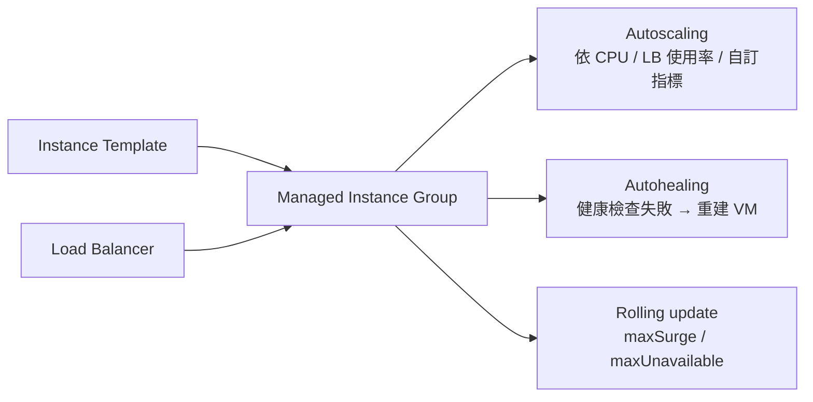
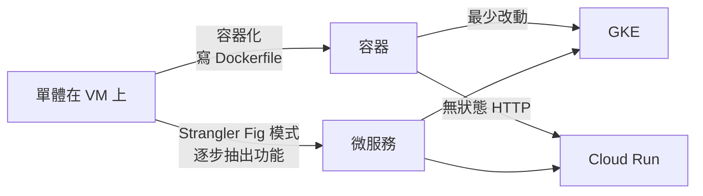

# Compute Engine 與 App Engine

> [!abstract] 一句話定位
> - **Compute Engine (IaaS)**：虛擬機。最大控制權，最高維運責任。考 PCD 時它通常是「**除非有明確理由，否則不選**」的選項。
> - **App Engine (PaaS)**：Google 最早的 PaaS。**新專案應該用 [[Cloud Run]]**；考試出現它通常是在測「你知不知道該用 Cloud Run 取代它」。

> [!note] 投報率提醒
> 2026 版考試指南在運算部分只點名 **Compute Engine、GKE、Cloud Run**，App Engine 幾乎消失。
> 這篇只要記住**定位表 + 何時才該選 VM**，不需要深入。

---

## 🖥 Compute Engine 你需要知道的最小集合

| 概念 | 說明 | 為什麼開發者要知道 |
|---|---|---|
| **機型家族** | `e2`（一般、便宜）、`n2/n4`（平衡）、`c3`（運算最佳化）、`m3`（記憶體最佳化）、`a3/g2`（GPU） | 「需要大量記憶體的 in-memory 處理」→ 記憶體最佳化機型 |
| **Spot VM / Preemptible** | 極低價，可能隨時被回收（通常提供短暫的關機通知） | 「可容忍中斷的批次工作、想省錢」→ Spot |
| **Managed Instance Group (MIG)** | 一群相同的 VM + **自動修復（autohealing）+ 自動擴充 + 滾動更新** | 傳統應用要有擴充與自我修復 → MIG，不是單台 VM |
| **Instance Template** | MIG 的藍圖（映像、機型、啟動腳本） | 更新應用 = 換 template + 滾動更新 |
| **Startup script / metadata** | 開機時執行的腳本；透過 metadata server 取得設定 | 取代 user-data；`metadata/computeMetadata/v1/` 可取得 token |
| **Custom / golden image** | 用 Packer 等工具預先烤好映像 | 縮短啟動時間（不要在開機時裝一堆東西） |
| **Persistent Disk / Hyperdisk** | 網路磁碟，可快照、可跨 VM 重新掛載 | 有狀態資料放這裡，不要放開機磁碟 |
| **Local SSD** | 實體連接、超低延遲、**VM 停止就消失** | 只放暫存/快取 |
| **Sole-tenant node** | 專屬實體主機 | 授權合規（BYOL） |

### MIG 的三個能力（考題常問「傳統 VM 怎麼變可靠」）

### 什麼時候「真的」該選 Compute Engine
| 訊號 | 原因 |
|---|---|
| 需要**特定作業系統/核心模組/驅動** | 容器平台無法提供 |
| 商業軟體要求**實體/專屬主機授權** | Sole-tenant node |
| 需要 **GPU/TPU + 完整控制**（雖然 GKE 也能） | 特殊硬體與驅動版本 |
| **lift-and-shift**：不能改程式、要先搬上雲 | 最小改動 |
| 需要**長時間執行、非 HTTP 的常駐程序**（且不想容器化） | Cloud Run 不適合 |
| 需要**固定 IP 與完整網路堆疊控制** | 例如自建 VPN/proxy |

> [!important] 考試判準
> 題目說 `minimal code changes` / `migrate as-is` / `legacy application` → **Compute Engine 或 GKE**。
> 題目說 `minimal operational overhead` / `no server management` → **Cloud Run / GKE Autopilot**。
> 這兩組關鍵詞是互斥的，抓到就能砍掉一半選項。

### 現代化路徑（Section 1 的「應用現代化」考點）

**Strangler Fig（絞殺榕）模式**：在單體前面放一層路由（LB / API Gateway），把新功能導向新服務、舊功能留在單體，逐步把單體「絞殺」掉。考題關鍵詞：`incrementally migrate`、`without a big-bang rewrite`。

---

## 🏗 App Engine 你需要知道的最小集合

| | **Standard 環境** | **Flexible 環境** |
|---|---|---|
| 執行方式 | 沙箱化的語言執行環境 | 在 Compute Engine VM 上跑容器 |
| 縮到 0 | ✅ 可以 | ❌ 最少 1 個實例 |
| 啟動速度 | 秒級 | 分鐘級 |
| 自訂執行環境 | ❌ 限定支援的語言版本 | ✅ 自訂 Dockerfile |
| 請求逾時 | 較短（自動擴充時約 10 分鐘）🔢 | 較長（約 60 分鐘）🔢 |
| 適合 | 流量起伏大的 web/API | 需要自訂執行環境的舊專案 |

**App Engine 特有概念（可能在舊題出現）**
- **Service（原 module）→ Version → Instance** 三層結構；一個 app 可有多個 service。
- **流量分流**：`gcloud app services set-traffic --splits v1=0.9,v2=0.1`（支援依 IP 或 cookie 分流）。
- **`dispatch.yaml`**：依 URL 路由到不同 service。
- **`cron.yaml`**：App Engine 的排程（現代做法用 [[Workflows 與 Cloud Scheduler]]）。
- **擴充類型**：`automatic`（依流量）、`basic`（有請求才起、閒置關閉）、`manual`（固定數量、常駐）。

> [!tip] 考試中的 App Engine
> 幾乎所有「App Engine 是不是答案」的題目，正解都是 **Cloud Run**（除非題目明確說「既有 App Engine 應用，要最小改動」）。
> 記住一組對照：App Engine Standard ≈ Cloud Run（縮到 0、快速擴充）；App Engine Flexible ≈ Cloud Run + 自訂容器（但 Cloud Run 更好）。

---

## 🎯 考點速記

| 看到題目說… | 就想到 |
|---|---|
| `legacy app`、`cannot modify code`、`lift and shift` | Compute Engine（或容器化後上 GKE） |
| `licensed software requires dedicated hardware` | Sole-tenant node |
| `fault-tolerant batch`、`up to 80% cheaper` | **Spot VM** |
| `VM 要自動修復與擴充` | **MIG** + 健康檢查 |
| `需要超低延遲暫存磁碟` | **Local SSD**（資料不持久） |
| `逐步汰換單體` | **Strangler Fig** + API Gateway / LB |
| `既有 App Engine 應用要加新的容器化服務` | 新服務用 Cloud Run，共存 |
| `全新專案、無伺服器、HTTP` | **Cloud Run**（不是 App Engine） |

## 💣 真實場景陷阱

1. **單台 VM 沒有 MIG**：VM 掛了沒人救。要高可用一定是 MIG + 健康檢查 + 跨 zone。
2. **在啟動腳本裡裝一堆套件**：擴充時啟動要 5 分鐘，來不及應付尖峰。改用自訂映像。
3. **把資料寫在開機磁碟**：VM 重建就消失。資料放 PD 或托管資料庫。
4. **Spot VM 用在需要持續運行的服務**：隨時被回收。
5. **App Engine Flexible 以為能縮到 0**：它不行，會一直計費。

## ✍️ 自我檢核

1. 什麼三種情況下 Compute Engine 才是比 Cloud Run / GKE 更好的答案？
2. MIG 提供哪三個能力？沒有 MIG 的單台 VM 缺了什麼？
3. Local SSD 與 Persistent Disk 的關鍵差異？各放什麼資料？
4. App Engine Standard 與 Flexible 的三個差異？哪個能縮到 0？
5. 要把一個單體逐步拆成微服務，你會用什麼模式、放什麼元件在最前面？

## 🔗 相關

- [[決策樹 運算平台選型]]
- [[Cloud Run]]
- [[GKE 基礎與 Autopilot]]
- [[12-Factor 與雲端原生設計原則]]
- [[Load Balancing 與 Session Affinity]]
- [[成本與資源最佳化]]
- [[Section 1 設計可擴充安全可靠的雲端原生應用]]
