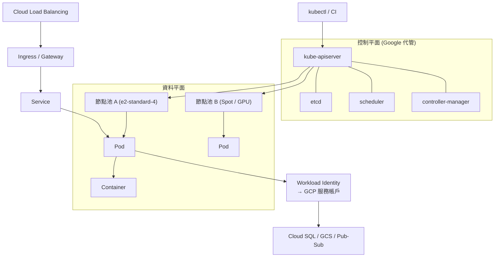
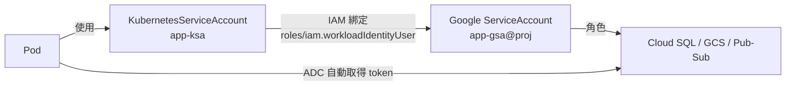

# GKE 基礎與 Autopilot

> [!abstract] 一句話定位
> **代管的 Kubernetes。** 當你需要 Kubernetes 的生態與控制力（sidecar 注入、DaemonSet、Operator、自訂排程、多協定、有狀態工作負載）時才選它；否則 [[Cloud Run]] 是更省事的預設。
> PCD 考的不是 CKA 深度，而是**「開發者要知道的 GKE」**：怎麼部署、怎麼健康檢查、怎麼擴充、怎麼安全存取 GCP 服務。

---

## 📘 技術理解
*原理、限制與實務操作 —— 不為考試也該懂的部分。*

### 🧠 心智模型



**兩個平面**
- **控制平面**：Google 管理（API server、etcd、scheduler）。你透過 `kubectl` 對它說話。
- **資料平面**：你的 Pod 跑的地方（節點）。Autopilot 連這層也由 Google 管。

---

### ⚖️ Autopilot vs Standard（必考的責任邊界）

| 維度 | **Autopilot** | **Standard** |
|---|---|---|
| 節點管理 | Google 完全代管，看不到也不能 SSH | 你自己建節點池、選機型、升級 |
| 計費 | 按 **Pod 請求的 CPU/記憶體/儲存** | 按 **節點** 計費（即使 Pod 沒用滿） |
| 擴充 | 自動（依 Pod 需求佈建節點） | 需設定 Cluster Autoscaler |
| 安全預設 | 強化：預設啟用 Workload Identity、Shielded Nodes，限制特權容器 | 需自行設定 |
| DaemonSet | ⚠️ 支援但有限制（不能做節點層級的特權操作） | ✅ 完整支援 |
| 特權容器 / hostPath / hostNetwork | ❌ 大多禁止 | ✅ 可以 |
| 自訂 kubelet / node 設定、裝核心模組 | ❌ | ✅ |
| 適合 | 一般微服務，想要最少維運 | 需要節點層級控制、特殊硬體、第三方 agent |

> [!important] 考題判準
> - 題目出現 `minimize operational overhead` + 要用 Kubernetes → **Autopilot**
> - 題目出現「安裝節點層級的監控/安全 agent（DaemonSet 需特權）」、「自訂 GPU 驅動」、「SSH 進節點除錯」、「hostNetwork」→ **Standard**
> - 題目出現「只為實際使用的資源付費」→ **Autopilot**

---

### 🔑 核心物件（開發者視角）

#### 工作負載
| 物件 | 用途 | 特徵 |
|---|---|---|
| **Pod** | 最小部署單位，1+ 個容器共用網路與儲存 | 不直接建，由控制器管理 |
| **Deployment** | 無狀態應用 | 滾動更新、可回滾（`kubectl rollout undo`） |
| **StatefulSet** | 有狀態應用（資料庫、Kafka） | **穩定的名稱與儲存**、有序啟動/終止 |
| **DaemonSet** | 每個節點跑一份 | log agent、監控 agent |
| **Job / CronJob** | 批次 / 排程 | 跑完結束；CronJob 依 cron 排程 |

#### 服務與網路
| 物件 | 用途 |
|---|---|
| **Service: ClusterIP**（預設） | 叢集內部虛擬 IP + DNS（`svc.ns.svc.cluster.local`） |
| **Service: NodePort** | 每個節點開一個 port（很少直接用） |
| **Service: LoadBalancer** | 建立 GCP L4 網路負載平衡器 |
| **Service: Headless**（`clusterIP: None`） | 直接回傳 Pod IP，給 StatefulSet / 自行做服務發現 |
| **Ingress** | L7 HTTP(S) 路由 → 建立 GCP Application Load Balancer |
| **Gateway API** | Ingress 的後繼者，角色分離（平台團隊 vs 應用團隊）、跨 namespace、更強的流量分流 |

> [!tip] Ingress vs Gateway
> 需要**進階流量管理（權重分流、header 路由、多團隊共用 LB）** → **Gateway API**。
> 傳統簡單 host/path 路由 → Ingress 就夠。

#### 設定與祕密
| 物件 | 用途 | 注意 |
|---|---|---|
| **ConfigMap** | 非敏感設定 | 以 env 注入 → **改了要重啟 Pod**；以 volume 掛載 → 檔案會自動更新（但程式要會重讀） |
| **Secret** | 敏感資料 | 預設只是 **base64 編碼**，不是加密！etcd 加密另外設定 |
| **Secret Manager + CSI driver** | 從 [[Secret Manager 與 Cloud KMS]] 同步 | **考試偏好這個**：集中管理、可輪替、有稽核 |

#### 命名空間與權限
- **Namespace**：邏輯隔離 + 配額（ResourceQuota / LimitRange）邊界。
- **兩層授權（必懂）**：
  1. **GCP IAM** 決定「你能不能呼叫這個叢集的 API」（如 `roles/container.developer`）
  2. **Kubernetes RBAC** 決定「在叢集內你能對哪些物件做什麼」（Role / RoleBinding / ClusterRole）
  → 題目問「限制開發者只能操作自己的 namespace」→ 答案是 **RBAC**（不是 IAM）。

---

### 🔐 Workload Identity Federation for GKE（**必考**）

讓 Pod 用 **Kubernetes ServiceAccount (KSA)** 取得 **Google ServiceAccount (GSA)** 的權限，**不需要任何金鑰檔案**。



```bash
# 1) 叢集啟用 Workload Identity（Autopilot 預設已開）
gcloud container clusters update CLUSTER --workload-pool=$PROJECT.svc.id.goog

# 2) 建 GSA 並授權
gcloud iam service-accounts create app-gsa
gcloud projects add-iam-policy-binding $PROJECT \
  --member="serviceAccount:app-gsa@$PROJECT.iam.gserviceaccount.com" \
  --role="roles/pubsub.publisher"

# 3) 把 KSA 綁到 GSA
gcloud iam service-accounts add-iam-policy-binding \
  app-gsa@$PROJECT.iam.gserviceaccount.com \
  --role=roles/iam.workloadIdentityUser \
  --member="serviceAccount:$PROJECT.svc.id.goog[default/app-ksa]"

# 4) 註解 KSA
kubectl annotate serviceaccount app-ksa \
  iam.gke.io/gcp-service-account=app-gsa@$PROJECT.iam.gserviceaccount.com
```

> [!warning] 反模式
> 把 SA 的 JSON 金鑰放進 Kubernetes Secret → 考試中永遠是錯的答案。正解一律是 **Workload Identity**。
> 相關：[[Workload Identity Federation]]、[[IAM 與服務帳戶]]

---

### ⚙️ 常用操作

```bash
# 建立 Autopilot 叢集（推薦的預設）
gcloud container clusters create-auto my-cluster --region asia-east1

# 建立 Standard 叢集 + 節點池
gcloud container clusters create std-cluster --zone asia-east1-a \
  --num-nodes 3 --machine-type e2-standard-4 --enable-ip-alias \
  --workload-pool=$PROJECT.svc.id.goog
gcloud container node-pools create spot-pool --cluster std-cluster \
  --zone asia-east1-a --spot --num-nodes 2 --enable-autoscaling --min-nodes 0 --max-nodes 10

# 取得憑證（會寫入 kubeconfig）
gcloud container clusters get-credentials my-cluster --region asia-east1

# 部署與檢查
kubectl apply -f deploy.yaml
kubectl get pods -o wide
kubectl describe pod POD          # 看 Events → 90% 的問題在這裡
kubectl logs POD -c CONTAINER --previous
kubectl rollout status deploy/api
kubectl rollout undo deploy/api
```
更多見 [[kubectl 與 YAML 速查]]。

---

### 🧯 常見故障與診斷（實務 + 考題都愛）

| 症狀 | 常見原因 | 怎麼查 |
|---|---|---|
| `ImagePullBackOff` | 映像不存在 / 節點 SA 沒有 Artifact Registry 讀取權 | `kubectl describe pod`；檢查 `roles/artifactregistry.reader` |
| `CrashLoopBackOff` | 程式啟動即失敗；或 liveness probe 太早開始 | `kubectl logs --previous`；加 `startupProbe` |
| `Pending` | 資源不足 / 沒有符合的節點（taint、nodeSelector） | `kubectl describe pod` 的 Events；Standard 要檢查 Cluster Autoscaler |
| `OOMKilled` | 超過 `limits.memory` | 調高 limits 或修記憶體洩漏 |
| Service 連不到 | selector 標籤不匹配 / readiness 失敗 | `kubectl get endpoints SVC`（空的就是 selector 或 readiness 問題） |
| `403` 呼叫 GCP API | Workload Identity 沒設好 | 檢查 KSA 註解與 IAM 綁定 |

---

## 🎯 應試
*考場上的提取線索與自我測驗 —— 備考期才需要。*

### 🎯 考點速記

| 看到題目說… | 就想到 |
|---|---|
| `Kubernetes` + `least operational overhead` | GKE **Autopilot** |
| `pay only for the resources your pods request` | Autopilot |
| DaemonSet 特權操作 / SSH 節點 / 自訂 GPU 驅動 | **Standard** |
| Pod 要存取 GCP 服務且不能用金鑰 | **Workload Identity** |
| 限制某團隊只能操作某 namespace | **RBAC**（不是 IAM） |
| 需要穩定的網路識別與持久磁碟（如 Kafka） | **StatefulSet** + Headless Service |
| 每個節點都要跑一份 log agent | **DaemonSet** |
| 要 L7 路徑路由 | Ingress（進階 → **Gateway API**） |
| 內部服務不要對外曝光 | **ClusterIP** + 內部 LB |
| 想省錢跑可中斷工作 | **Spot** 節點池 + PodDisruptionBudget |

---

### 💣 真實場景陷阱

1. **Autopilot 的限制清單沒讀**：第三方安全 agent（需特權 DaemonSet）裝不上去，專案做一半才發現。
2. **把 Secret 當成加密**：K8s Secret 只是 base64。敏感資料走 [[Secret Manager 與 Cloud KMS]] + CSI driver。
3. **沒設 `requests`**：排程器不知道你要多少資源 → 節點超賣 → 隨機被驅逐；HPA 也無法用 CPU 百分比。
4. **升級沒有 PodDisruptionBudget**：節點輪替時全部副本同時被驅逐 → 服務中斷。
5. **Ingress 的健康檢查與 readiness 不一致**：LB 認為後端不健康 → 502。GKE 會從 readinessProbe 推導健康檢查，路徑要能匿名存取。
6. **叢集版本與 API 棄用**：升級 GKE 後 `extensions/v1beta1` 之類的舊 API 消失，manifest 失效。

### ✍️ 自我檢核

1. Autopilot 與 Standard 的計費差異是什麼？各在什麼情況下更便宜？
2. 列出三個「Autopilot 做不到、必須用 Standard」的需求。
3. Pod 要讀 Cloud Storage，正確的身分設定步驟（四步）是什麼？
4. `kubectl get endpoints my-svc` 是空的，可能是哪兩個原因？
5. GCP IAM 與 Kubernetes RBAC 的分工是什麼？「只能看自己 namespace 的 Pod」要改哪一層？
6. StatefulSet 與 Deployment 的三個差異？什麼工作負載一定要 StatefulSet？

## 🔗 相關

- [[GKE 工作負載 健康檢查與自動擴充]]
- [[Cloud Run]]
- [[決策樹 運算平台選型]]
- [[Workload Identity Federation]]
- [[Cloud Service Mesh 與 Network Policy]]
- [[Load Balancing 與 Session Affinity]]
- [[kubectl 與 YAML 速查]]
- [[Lab 03 GKE 部署與 HPA]]
- [[Section 3 設定雲端原生應用的部署]]
