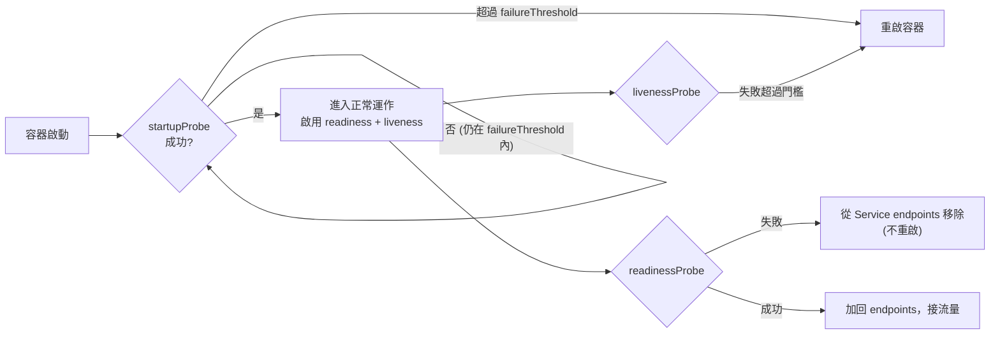
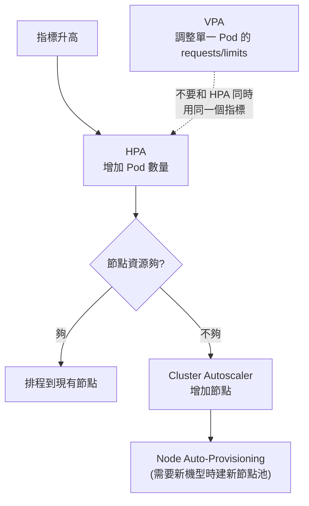

# GKE 工作負載、健康檢查與自動擴充

> [!abstract] 為什麼這篇很重要
> 官方 Section 3.2 只寫了三條考點，其中兩條就是這篇的內容：
> **「實作 Kubernetes health check 以提升可用性」** 與 **「納入 HPA 的屬性（擴充、指標）」**。
> 這是 GKE 題目最密集的地方。

---

## 🩺 健康檢查：三種 probe



| Probe | 問的問題 | 失敗後果 | 一定要記的事 |
|---|---|---|---|
| **startupProbe** | 「你起來了嗎？」 | 重啟容器 | **成功前，readiness 與 liveness 都不執行** → 專治啟動慢的應用 |
| **readinessProbe** | 「你現在能收流量嗎？」 | 從 Service endpoints 移除，**不重啟** | 可以檢查下游依賴（DB 連不上就暫時不收流量） |
| **livenessProbe** | 「你還活著嗎？」 | **重啟容器** | **不要**檢查下游依賴，否則下游故障會造成連鎖重啟 |

### 三種檢查機制
`httpGet`（最常用，2xx/3xx 算成功）、`tcpSocket`（能建立連線就算成功）、`exec`（指令 exit 0 算成功；成本最高）。
gRPC 服務可用 `grpc` probe 或實作 gRPC Health Checking Protocol。

### 關鍵參數 🔢
| 參數 | 預設 | 意義 |
|---|---|---|
| `initialDelaySeconds` | 0 | 容器啟動後等幾秒才開始探測 |
| `periodSeconds` | 10 | 探測間隔 |
| `timeoutSeconds` | 1 | 單次探測逾時（**很短，容易誤判**） |
| `failureThreshold` | 3 | 連續失敗幾次才算失敗 |
| `successThreshold` | 1 | 連續成功幾次才算成功（liveness/startup 只能是 1） |

**最長容忍啟動時間** = `initialDelaySeconds + failureThreshold × periodSeconds`
→ 例：`failureThreshold: 30, periodSeconds: 10` = 容忍 **300 秒**啟動。

### 正確範例
```yaml
spec:
  containers:
    - name: api
      image: asia-east1-docker.pkg.dev/PROJ/repo/api:v2
      ports: [{ containerPort: 8080 }]
      startupProbe:                    # 給 5 分鐘慢慢啟動
        httpGet: { path: /healthz, port: 8080 }
        periodSeconds: 10
        failureThreshold: 30
      readinessProbe:                  # 含下游檢查
        httpGet: { path: /ready, port: 8080 }
        periodSeconds: 5
        timeoutSeconds: 3
        failureThreshold: 2
      livenessProbe:                   # 只看自己是否死鎖
        httpGet: { path: /healthz, port: 8080 }
        periodSeconds: 10
        timeoutSeconds: 3
        failureThreshold: 3
      lifecycle:
        preStop:                       # 給 LB 時間把自己移出後端
          exec: { command: ["sh", "-c", "sleep 10"] }
  terminationGracePeriodSeconds: 45    # 要 > preStop + 最長請求處理時間
```

> [!warning] 四個經典誤用
> 1. **沒有 startupProbe，liveness 的 initialDelay 又太短** → JVM 還在暖機就被殺 → `CrashLoopBackOff`
> 2. **liveness 檢查資料庫** → DB 抖一下，全部 Pod 一起重啟 → 雪崩
> 3. **readiness 與 liveness 用同一個端點且該端點檢查下游** → 同上
> 4. **沒有 `preStop` + graceful shutdown** → 滾動更新時大量 502

---

## 📦 資源請求與限制（requests / limits）

| 欄位 | 意義 | 影響 |
|---|---|---|
| `requests` | **保證**配額，排程器用它挑節點 | 設太低 → 節點超賣、被驅逐；HPA 算不出 CPU 百分比 |
| `limits` | **上限** | CPU 超過 → 被節流（throttle，變慢）；記憶體超過 → **OOMKilled**（直接殺） |

> [!important] CPU 與記憶體的行為不同
> - **CPU 是可壓縮資源**：超過 limit 只會變慢。
> - **記憶體是不可壓縮資源**：超過 limit 直接被殺（`OOMKilled`）。
> 考題：「Pod 間歇性被重啟，事件顯示 OOMKilled」→ 記憶體 limit 太低或有洩漏。

### QoS 等級（決定資源不足時誰先被驅逐）
| 等級 | 條件 | 被驅逐順序 |
|---|---|---|
| **Guaranteed** | 每個容器的 requests == limits（CPU 與記憶體都設） | 最後 |
| **Burstable** | 有設 requests，但 requests < limits | 中間 |
| **BestEffort** | 完全沒設 requests/limits | **最先被驅逐** |

> 關鍵服務 → 設成 **Guaranteed**。Autopilot 會把沒設 limits 的自動補齊。

---

## 📈 自動擴充四兄弟



### HPA（Horizontal Pod Autoscaler）— 考試重點
| 指標型別 | 來源 | 範例 |
|---|---|---|
| `Resource` | CPU / 記憶體 | CPU 平均使用率 70% |
| `Pods` | 每個 Pod 的自訂指標平均 | 每 Pod 每秒請求數 |
| `Object` | 某個 K8s 物件的指標 | Ingress 的 RPS |
| `External` | 叢集外部指標（透過 Custom Metrics Adapter → Cloud Monitoring） | **Pub/Sub 未確認訊息數** ⭐常考 |

```yaml
apiVersion: autoscaling/v2
kind: HorizontalPodAutoscaler
metadata: { name: api-hpa }
spec:
  scaleTargetRef: { apiVersion: apps/v1, kind: Deployment, name: api }
  minReplicas: 2
  maxReplicas: 50
  metrics:
    - type: Resource
      resource:
        name: cpu
        target: { type: Utilization, averageUtilization: 70 }
    - type: External                       # 依 Pub/Sub 積壓擴充
      external:
        metric:
          name: pubsub.googleapis.com|subscription|num_undelivered_messages
          selector:
            matchLabels: { resource.labels.subscription_id: "orders-sub" }
        target: { type: AverageValue, averageValue: "100" }
  behavior:                                # 控制擴縮速度，避免抖動
    scaleDown:
      stabilizationWindowSeconds: 300
```

> [!important] HPA 的三個必考細節
> 1. 用 **CPU Utilization 百分比** 時，**Pod 必須設 `requests.cpu`**（百分比是相對於 requests 算的）。沒設 → HPA 無法運作。
> 2. HPA 預設每 **15 秒** 🔢 評估一次（controller 的 `--horizontal-pod-autoscaler-sync-period`）。
> 3. 多個指標並存時，**取需要最多副本的那個結果**。

### VPA（Vertical Pod Autoscaler）
自動調整 `requests`/`limits`。模式：`Off`（只給建議）、`Initial`（只在建立時套用）、`Auto`（會重建 Pod）。
> **不要**對同一個 Deployment 用 HPA(CPU) + VPA(CPU)，兩者會互相打架。VPA 調記憶體 + HPA 調 CPU 是可接受的組合。

### Cluster Autoscaler（CA）
- 依**未排程的 Pod** 增加節點；節點長時間低使用率則移除。
- 只在 **Standard** 需要手動設定；**Autopilot 內建**。
- 節點縮減會受 **PodDisruptionBudget** 與 `local storage` / `hostPath` 的 Pod 阻擋。

### Node Auto-Provisioning（NAP）
CA 的加強版：當現有節點池的機型都不合（例如需要 GPU 或超大記憶體）時，**自動建立新的節點池**。

---

## 🛡 可用性設計（常和擴充一起考）

| 機制 | 作用 |
|---|---|
| **PodDisruptionBudget (PDB)** | 保證自願性中斷（升級、縮容）時至少有 N 個（或 N%）Pod 可用 |
| **topologySpreadConstraints / Pod anti-affinity** | 把副本分散到不同**節點/可用區**，避免單點失效 |
| **多可用區叢集（regional cluster）** | 控制平面與節點跨多個 zone |
| **`terminationGracePeriodSeconds` + `preStop`** | 優雅關閉，避免滾動更新掉請求 |
| **`maxSurge` / `maxUnavailable`** | 控制滾動更新的節奏 |

```yaml
apiVersion: policy/v1
kind: PodDisruptionBudget
metadata: { name: api-pdb }
spec:
  minAvailable: 2          # 或 maxUnavailable: 1
  selector: { matchLabels: { app: api } }
```

```yaml
# 把副本平均分散到不同可用區
topologySpreadConstraints:
  - maxSkew: 1
    topologyKey: topology.kubernetes.io/zone
    whenUnsatisfiable: DoNotSchedule
    labelSelector: { matchLabels: { app: api } }
```

---

## 🎯 考點速記

| 看到題目說… | 就想到 |
|---|---|
| 應用啟動要 2 分鐘、一直被重啟 | **startupProbe**（或加大 liveness 的 failureThreshold） |
| 服務暫時無法處理請求，但不該重啟 | **readinessProbe** |
| 偵測死鎖 / 卡住的 process | **livenessProbe** |
| 滾動更新時出現 502 | `preStop` + graceful shutdown + readiness |
| 依請求量自動增減 Pod | **HPA** |
| 依 Pub/Sub 積壓量擴充 | HPA + **External metric** + Custom Metrics Adapter |
| Pod 一直 `Pending` | 資源不足 → **Cluster Autoscaler**（或 requests 設太大） |
| 不知道該設多少 requests | **VPA**（先用 `Off` 模式看建議） |
| 節點升級時要保證服務不中斷 | **PodDisruptionBudget** |
| 一個 zone 掛掉服務要活著 | regional cluster + **topologySpreadConstraints** |
| `OOMKilled` | 記憶體 limit 太低 |
| CPU 被節流、延遲變高 | CPU limit 太低 |

---

## 💣 真實場景陷阱

1. **HPA 沒設 requests**：設了 HPA 卻完全不擴充，查了半天發現缺 `resources.requests.cpu`。
2. **HPA 與 CronJob 尖峰打架**：批次工作吃滿 CPU → HPA 誤判擴充 web 服務。用不同節點池/namespace 隔離。
3. **抖動（flapping）**：擴了又縮、縮了又擴。用 `behavior.scaleDown.stabilizationWindowSeconds` 壓住。
4. **PDB 設太嚴（`minAvailable` = 副本數）**：節點永遠無法排空，升級卡死。
5. **Spot 節點 + 沒有 PDB / 沒有多副本**：節點被回收就中斷。
6. **liveness 的 `timeoutSeconds: 1`（預設）**：GC 暫停或瞬間高載就誤判為死亡 → 無意義重啟。

## ✍️ 自我檢核

1. 三種 probe 各自失敗的後果是什麼？哪一種絕對不能檢查下游依賴，為什麼？
2. 一個 Pod 啟動需要 3 分鐘，probe 該怎麼設？算式寫出來。
3. `requests` 與 `limits` 對 CPU 和記憶體的行為差異？`OOMKilled` 是哪個造成的？
4. 要依「Pub/Sub 訂閱積壓」自動擴充，需要哪些元件、HPA 要用哪種 metric type？
5. HPA 與 VPA 可以同時用嗎？在什麼條件下？
6. 滾動更新期間有 502，你會依序檢查哪四件事？
7. QoS 三個等級如何決定？哪個最先被驅逐？

## 🔗 相關

- [[GKE 基礎與 Autopilot]]
- [[Cloud Run]]
- [[Load Balancing 與 Session Affinity]]
- [[Cloud Monitoring 與 SLO]]
- [[Pub Sub]]
- [[成本與資源最佳化]]
- [[kubectl 與 YAML 速查]]
- [[Lab 03 GKE 部署與 HPA]]
- [[Section 3 設定雲端原生應用的部署]]
