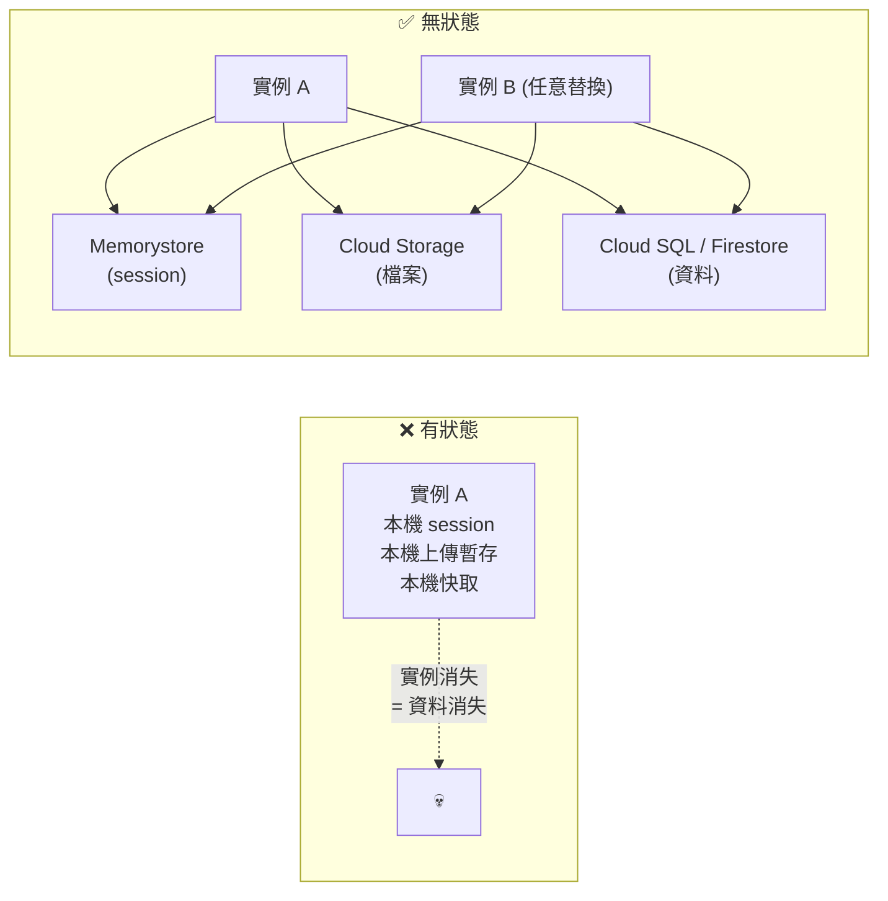

# 12-Factor 與雲端原生設計原則

> [!abstract] 為什麼要讀這篇
> 考試不會直接問「12-Factor 的第 7 條是什麼」，但**幾乎所有設計題的正確答案都是 12-Factor 的某一條**。
> 把它當成「Google 想要的答案長什麼樣」的字典。

---

## 📘 技術理解
*原理、限制與實務操作 —— 不為考試也該懂的部分。*

### 📜 12 Factors 對應 Google Cloud

| # | Factor | 意思 | Google Cloud 上的做法 | 考點 |
|---|---|---|---|---|
| 1 | **Codebase** | 一份程式碼、多個部署 | 一個 repo → dev/staging/prod 用不同設定 | 不要為每個環境開分支 |
| 2 | **Dependencies** | 明確宣告依賴 | `requirements.txt` / `go.mod`；容器映像固定 digest | [[Artifact Registry]] remote repo 代理 |
| 3 | **Config** | **設定存在環境中** | 環境變數 + **[[Secret Manager 與 Cloud KMS]]**；不要進 git | ⭐ 高頻：祕密不進程式碼 |
| 4 | **Backing services** | 後端服務都是可替換的附加資源 | 用連線字串/服務名稱，不要硬寫 IP | 換 DB 不用改程式 |
| 5 | **Build, release, run** | 三階段嚴格分離 | [[Cloud Build]] 建置 → 不可變映像 → [[Cloud Deploy 與部署策略]] 發布 | ⭐ **不要在執行時修改程式碼** |
| 6 | **Processes** | **無狀態**、share-nothing | [[Cloud Run]] 實例隨時被回收；狀態放外部 | ⭐ 高頻：session 不放本機 |
| 7 | **Port binding** | 自我包含，透過 port 對外 | 監聽 `$PORT`、`0.0.0.0` | ⭐ Cloud Run 容器契約 |
| 8 | **Concurrency** | 用**水平擴充**（多程序）處理負載 | Cloud Run 實例數 / GKE HPA | ⭐ 不是把機器變大 |
| 9 | **Disposability** | **快速啟動、優雅關閉** | 處理 `SIGTERM`；K8s `preStop`；輕量映像 | ⭐ 高頻：部署不掉請求 |
| 10 | **Dev/prod parity** | 各環境盡量一致 | 容器 + [[開發環境 Cloud Code Shell Workstations 與 AI 工具]] 的 emulator/Workstations | 「在我電腦上可以跑」 |
| 11 | **Logs** | log 是**事件串流**，寫到 stdout | [[Cloud Logging]] 自動收集 stdout；**結構化 JSON** | ⭐ 不要自己寫 log 檔輪替 |
| 12 | **Admin processes** | 管理任務當一次性程序跑 | **[[Cloud Run Jobs 與 Functions]]** 跑 migration/批次 | 不要在服務啟動時跑 migration |

> [!important] 最常被考的四條
> **#3 Config（祕密外置）、#6 Processes（無狀態）、#9 Disposability（優雅關閉）、#11 Logs（stdout 結構化）。**
> 遇到設計題先檢查這四條有沒有被違反。

---

### 🧱 雲端原生的五個補充原則

#### 1. 為失敗而設計（Design for failure）
**任何東西都會壞**：實例會消失、網路會抖、下游會慢。
→ 對應 [[韌性模式 重試 冪等 退避 斷路器]] 的全部內容。

#### 2. 無狀態優先

詳見 [[Session 管理]]。

#### 3. 鬆耦合（Loose coupling）
| 緊耦合 | 鬆耦合 |
|---|---|
| 同步呼叫鏈 A→B→C→D | 事件驅動（[[Pub Sub]]），各自獨立 |
| 共用資料庫 | 每個服務有自己的資料儲存 |
| 硬寫下游 IP | 服務發現 / DNS / LB |
| 共用程式庫強制同版本 | 透過 API 契約溝通 |

#### 4. 自動化一切
建置、測試、部署、擴充、回滾、憑證輪替、修補 → 全部自動化。
**人工步驟 = 未來的事故。**

#### 5. 可觀測性內建，不是事後加
從第一天就做結構化 log、trace 傳播、關鍵業務指標 → 見 [[OpenTelemetry 與 Trace 關聯]]。

---

### 🏗 微服務 vs 單體（Section 1 的判斷題）

| | **單體** | **微服務** |
|---|---|---|
| 開發初期速度 | **快** | 慢（基礎設施成本） |
| 部署 | 一次全部 | 各自獨立 ⭐ |
| 擴充 | 整個一起擴 | **只擴瓶頸那塊** ⭐ |
| 技術選擇 | 統一 | 各自最適 |
| 交易 | 本機 ACID **簡單** | 分散式（Saga）**困難** |
| 除錯 | 簡單 | 需要分散式追蹤 |
| 團隊 | 小團隊有效 | 多團隊並行 ⭐ |
| 維運複雜度 | 低 | **高** |

> [!warning] 微服務不是免費的
> 考題若說 `small team`、`simple application`、`tight deadline` → **不要**建議拆微服務。
> 考題若說 `different scaling needs`、`independent deployment`、`multiple teams` → 微服務合理。
>
> **正確的拆分邊界**：依**業務能力 / 領域邊界（bounded context）**，不是依技術層（不要拆成「資料庫服務」、「邏輯服務」）。

#### 微服務的資料策略
| 原則 | 說明 |
|---|---|
| **每個服務擁有自己的資料** | 其他服務只能透過 API 存取，不能直連別人的 DB |
| **最終一致是常態** | 跨服務的資料同步靠事件（[[Pub Sub]]） |
| **CQRS**（讀寫分離模型） | 讀多寫少時，建立專用的讀取模型（例如寫 Spanner、讀 BigQuery/Firestore） |
| **API 版本化** | 見 [[API 設計 REST 與 gRPC]] |

---

### 🚀 部署與設定的具體做法（考試喜歡的答案）

| 需求 | 正解 | 錯誤答案 |
|---|---|---|
| 不同環境的設定 | 環境變數 + Secret Manager + 不同專案 | 程式裡 `if env == "prod"` 的硬編碼 |
| 資料庫密碼 | **Secret Manager**（volume 或 env） | 設定檔進 git、寫死在映像裡 |
| 資料庫 migration | **Cloud Run Job** / CI 的獨立步驟 | 服務啟動時自動跑（多實例會打架） |
| 功能開關 | Feature flag（外部設定，執行時可改） | 重新部署才能開關功能 |
| 排程任務 | **Cloud Scheduler → Job** | 在服務裡跑 `while True: sleep()` |
| 本機檔案暫存 | GCS 或記憶體，並假設會消失 | 寫 `/data` 期待它存在 |
| log | **stdout 結構化 JSON** | 寫檔案 + logrotate |

---

## 🎯 應試
*考場上的提取線索與自我測驗 —— 備考期才需要。*

### 🎯 考點速記

| 看到題目說… | 就想到 |
|---|---|
| `application must be stateless` | session → [[Memorystore 與快取策略]]；檔案 → [[Cloud Storage]] |
| `configuration should not be in the code` | 環境變數 + **Secret Manager** |
| `no requests lost during deployment` | **優雅關閉**（SIGTERM / preStop）+ readiness |
| `logs should be searchable by field` | **stdout 結構化 JSON** |
| `run a one-off database migration` | **Cloud Run Job** |
| `handle more load` | **水平擴充**（不是換大機器） |
| `same image across dev/staging/prod` | 不可變產出物 + 設定外置（Cloud Deploy 晉升） |
| `incrementally break apart a monolith` | **Strangler Fig** |
| `small team, simple app, tight deadline` | **不要**拆微服務 |
| `services must not share a database` | 每服務擁有自己的資料 + 事件同步 |

### ✍️ 自我檢核

1. 最常考的四條 factor 是哪些？各自在 Google Cloud 上怎麼實作？
2. 「無狀態」在實務上要把哪三類東西搬到外部？各搬到哪裡？
3. 優雅關閉在 Cloud Run 與 GKE 上分別怎麼做？不做會有什麼症狀？
4. 微服務的五個成本？什麼情況下不該拆？
5. 正確的微服務拆分邊界依據是什麼？錯誤的拆法是什麼？
6. 資料庫 migration 該怎麼跑？為什麼不能在服務啟動時跑？
7. 「一份程式碼、多個部署」在 GCP 上的具體落地方式？

## 🔗 相關

- [[決策樹 運算平台選型]]
- [[Cloud Run]]
- [[Session 管理]]
- [[韌性模式 重試 冪等 退避 斷路器]]
- [[Secret Manager 與 Cloud KMS]]
- [[Cloud Logging]]
- [[Cloud Deploy 與部署策略]]
- [[API 設計 REST 與 gRPC]]
- [[Compute Engine 與 App Engine]]
- [[Section 1 設計可擴充安全可靠的雲端原生應用]]
