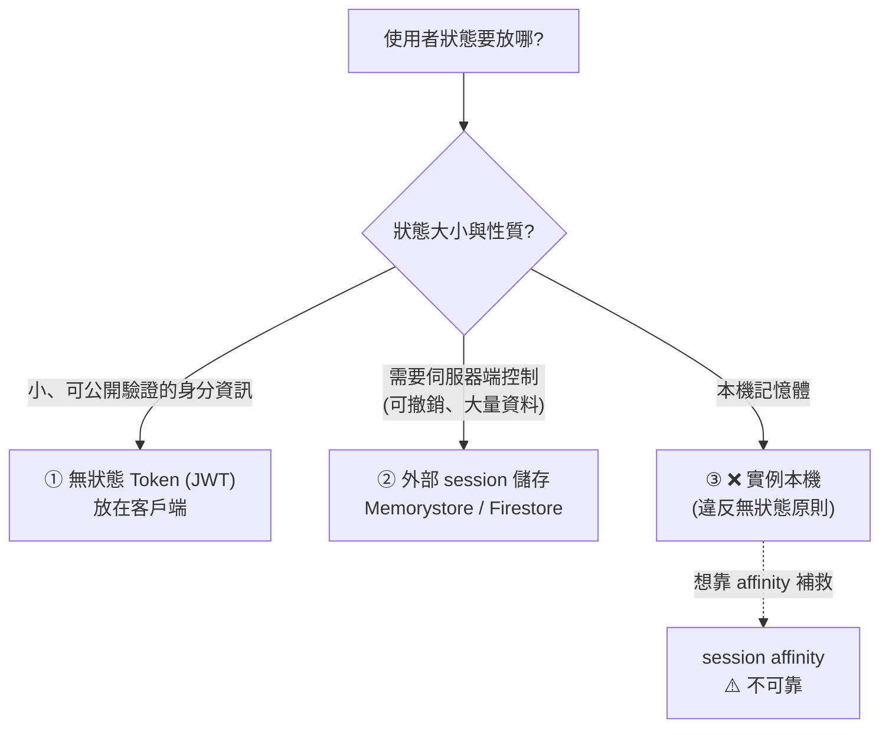
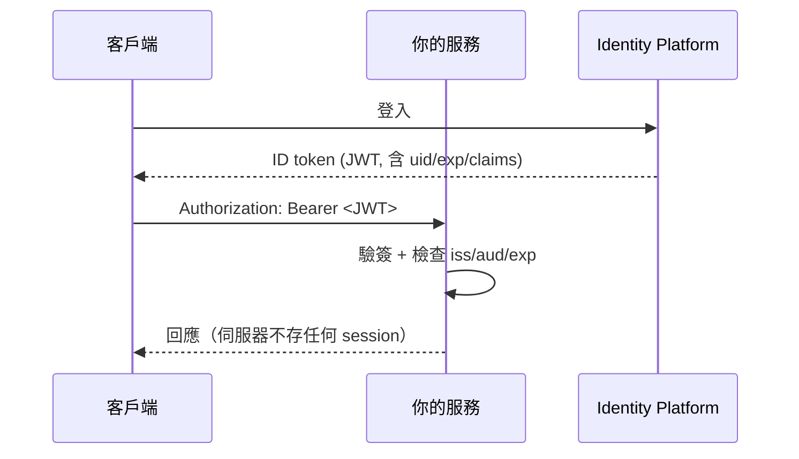

# Session 與使用者狀態管理

> [!abstract] 為什麼有這篇
> 「使用者 session 管理」是 PCD 考試的經典題型，而且**最常見的錯誤答案是 session affinity**。
> 核心觀念：**session affinity 是效能最佳化，不是狀態儲存方案。**

---

## 📘 技術理解
*原理、限制與實務操作 —— 不為考試也該懂的部分。*

### 🧠 三種策略



---

### ① 無狀態 Token（JWT）



| 優點 | 缺點 |
|---|---|
| **完全無狀態** → 任何實例都能處理 | **難以立即撤銷**（token 在到期前都有效） |
| 水平擴充零成本 | 內容會變大（放太多 claims → header 變胖） |
| 跨服務容易（每個服務自己驗證） | **不能放敏感資料**（JWT payload 只是 base64，不是加密） |

**解決撤銷問題的標準做法**
- **短期 access token（5–15 分鐘）+ 長期 refresh token**（refresh token 存伺服器端，可撤銷）。
- 維護一份**撤銷清單 / token 版本號**在 [[Memorystore 與快取策略]]（例如 `user:123:tokenVersion`），驗證時比對。

> 實作參考：[[IAP Identity Platform 與 Web Security Scanner]]、[[驗證與授權 ADC OAuth JWT]]

---

### ② 外部 Session 儲存（考試最常見的正解）

| 儲存 | 適合 | 特性 |
|---|---|---|
| **Memorystore (Redis)** ⭐ | 一般 web session | 亞毫秒、原生 TTL、`SETEX` 一行搞定 |
| **Firestore** | 需要持久化、查詢、跨區域 | 強一致、有 **TTL 政策**、成本較高、延遲較高 |
| **Cloud SQL / Spanner** | 需要與業務資料一起交易 | 最重，通常不必要 |
| **簽章 cookie**（無伺服器儲存） | 極小狀態（如語言偏好） | 4 KB 限制、要簽章防篡改 |

```python
# Redis session（含 TTL 與滑動過期）
import json, secrets
TTL = 1800

def create_session(user_id, data):
    sid = secrets.token_urlsafe(32)                    # 高熵、不可預測
    r.setex(f"sess:{sid}", TTL, json.dumps({"uid": user_id, **data}))
    return sid                                          # 放進 HttpOnly; Secure; SameSite cookie

def get_session(sid):
    raw = r.get(f"sess:{sid}")
    if not raw:
        return None
    r.expire(f"sess:{sid}", TTL)                        # 滑動過期：每次存取延長
    return json.loads(raw)

def destroy_session(sid):
    r.delete(f"sess:{sid}")                             # ⭐ 可以立即撤銷（JWT 做不到）
```

> [!important] Cloud Run + Memorystore 的必要設定
> Memorystore **只有私有 IP** → Cloud Run 必須用 **Direct VPC egress 或 Serverless VPC Access**。
> 這是「Cloud Run 存 session 到 Memorystore」題目的完整答案（不只是「用 Redis」）。
> 見 [[VPC 連線 Serverless VPC Access 與 Direct VPC Egress]]。

#### Cookie 的安全設定（會考）
```
Set-Cookie: sid=<value>; HttpOnly; Secure; SameSite=Lax; Path=/; Max-Age=1800
```
| 屬性 | 作用 |
|---|---|
| `HttpOnly` | JS 讀不到 → 降低 XSS 竊取風險 |
| `Secure` | 只走 HTTPS |
| `SameSite=Lax/Strict` | 降低 CSRF |
| 高熵 session ID | 防猜測 |
| 登入後**輪替 session ID** | 防 session fixation |

---

### ③ Session Affinity（**不是狀態方案**）

> [!warning] 為什麼不能靠它
> 1. 實例會因**擴縮、部署、故障**而消失 → 那些使用者的狀態直接不見。
> 2. Affinity **不保證 100%**（cookie 遺失、LB 後端變動）。
> 3. 造成**負載不均**，擴充效果變差。
> 4. 在 Cloud Run 上與並行/自動擴充機制相衝。

**Affinity 的正當用途**
- 提高**本機快取命中率**（例如每個實例快取熱門商品）。
- 維持**長連線**（WebSocket、gRPC streaming、SSE）。
- 減少重複的暖機成本（模型載入）。

設定方式見 [[Load Balancing 與 Session Affinity]]。

---

### 🧩 其他狀態類型的正確去處

| 狀態類型 | 放哪裡 |
|---|---|
| 使用者 session | **Memorystore** / JWT |
| 購物車（要持久） | **Firestore**（或 Redis + 定期持久化） |
| 檔案上傳暫存 | **Cloud Storage**（用 signed URL 直傳） |
| 長任務進度 | Firestore / Redis + 任務 ID |
| 應用內快取 | Memorystore（共享）或程序內（可容忍不一致時） |
| 表單多步驟的中間狀態 | Redis（短 TTL）或前端狀態 |
| WebSocket 連線狀態 | 連線本身在實例上（用 affinity）；但**訊息廣播要透過 Pub/Sub 或 Redis pub/sub**，不能假設所有連線在同一實例 |

#### WebSocket / SSE 在 serverless 上的注意事項
- Cloud Run 支援 WebSocket，但**實例可能被回收** → 客戶端要能自動重連。
- 廣播訊息給所有連線的使用者 → **不能**只在單一實例的記憶體裡遍歷連線；要用 **Redis pub/sub 或 Pub/Sub** 讓每個實例通知自己持有的連線。
- 請求逾時上限（60 分鐘）也適用於長連線。

---

## 🎯 應試
*考場上的提取線索與自我測驗 —— 備考期才需要。*

### 🎯 考點速記

| 看到題目說… | 就想到 |
|---|---|
| `store user session for a stateless service` | **Memorystore (Redis)** |
| `Cloud Run + Memorystore` | 別忘了 **Direct VPC egress / VPC connector** |
| `session must be immediately revocable` | **伺服器端 session**（或短期 token + 撤銷清單） |
| `avoid server-side session storage entirely` | **JWT**（注意撤銷限制） |
| `session lost when instances scale down` | 狀態放在本機 → **搬到外部儲存** |
| `session affinity` 是答案的題目 | 只有「提高快取命中率 / 維持長連線」時 |
| `shopping cart must survive days` | **Firestore**（持久） |
| `large file upload` | **Cloud Storage signed URL**（不要經過應用實例） |
| `session cookie security` | `HttpOnly; Secure; SameSite` + 高熵 ID + 登入後輪替 |
| `broadcast to all connected WebSocket clients` | Redis pub/sub 或 **Pub/Sub** 扇出到每個實例 |

### 💣 真實場景陷阱

1. **用 affinity 當 session 儲存**：縮容/部署時大量使用者被登出。
2. **JWT 放敏感資料**：payload 只是 base64，任何人都能看。
3. **JWT 有效期太長**：無法撤銷 → 帳號被盜後仍可用數天。
4. **Redis Basic tier 存 session**：節點重啟 → 全員登出。用 **Standard (HA)**。
5. **忘了 TTL**：session 永不過期，Redis 記憶體被吃滿。
6. **session ID 可預測**（自增、時間戳）：可被猜測劫持。
7. **Cloud Run 忘記進 VPC**：連不上 Memorystore，錯誤是 timeout 而非權限錯誤。

### ✍️ 自我檢核

1. 三種 session 策略的優缺點？考試最常見的正解是哪個？
2. 為什麼 session affinity 不是狀態方案？它的正當用途是什麼？
3. JWT 的撤銷問題如何解決（兩種做法）？
4. Cloud Run 要用 Memorystore 存 session，完整需要哪些設定？
5. Session cookie 的四個安全屬性/實務？
6. 使用者上傳大檔案時，「狀態」該怎麼處理？
7. 在 Cloud Run 上做 WebSocket 廣播，為什麼不能只靠實例記憶體？

## 🔗 相關

- [[Memorystore 與快取策略]]
- [[Load Balancing 與 Session Affinity]]
- [[VPC 連線 Serverless VPC Access 與 Direct VPC Egress]]
- [[Firestore]]
- [[驗證與授權 ADC OAuth JWT]]
- [[IAP Identity Platform 與 Web Security Scanner]]
- [[12-Factor 與雲端原生設計原則]]
- [[Cloud Storage]]
- [[Cloud Run]]
- [[Section 1 設計可擴充安全可靠的雲端原生應用]]
