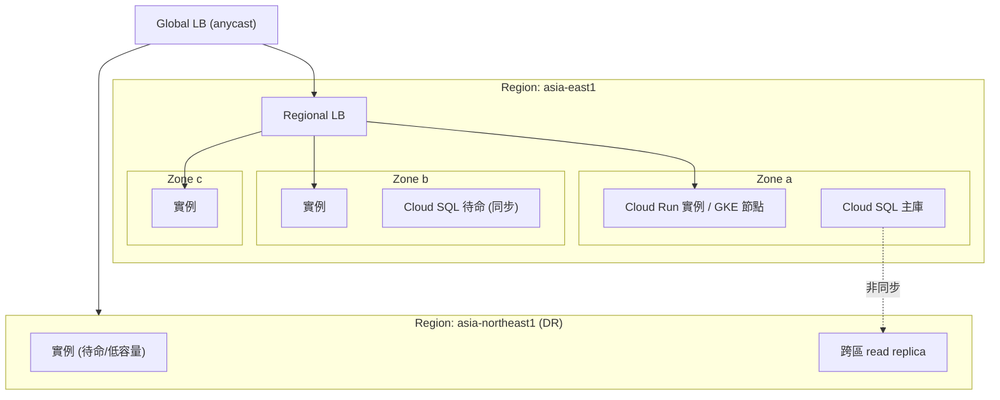
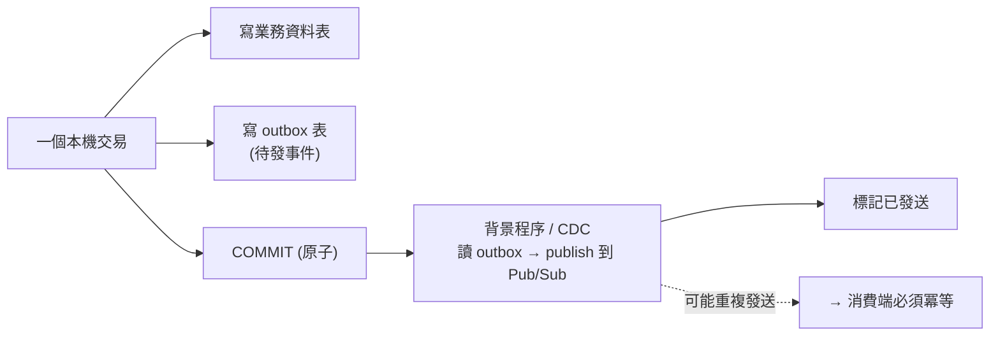

# 一致性、交易與資料複寫

> [!abstract] 一句話定位
> 官方考點原文：**「理解 AlloyDB、Bigtable、Cloud SQL、Spanner、Cloud Storage 的最終一致與強一致複寫的影響」**、
> **「理解資料複寫如何支援 zonal 與 regional 容錯模型」**。
> 這篇要讓你能回答：**「這個服務的一致性保證是什麼？一個 zone/region 掛掉會發生什麼？」**

---

## 📖 一致性的三個層級

| 層級 | 保證 | 例子 |
|---|---|---|
| **最終一致（eventual）** | 寫入後，讀取**可能**拿到舊值；最終會收斂 | Cloud SQL **read replica**、Bigtable **跨叢集** |
| **強一致（strong）** | 讀取一定看到最新已提交的寫入 | Firestore、Cloud Storage、Spanner |
| **外部一致（external）** | 比強一致更嚴：交易順序與**真實時間順序**一致 | **Spanner**（靠 TrueTime） |

> [!important] 開發者最痛的症狀：read-your-writes
> 使用者按下「儲存」→ 頁面重新載入 → **看到舊資料**。
> 原因：寫到主庫，讀從 replica。
> **解法**：① 寫入後的讀取導向主庫；② 用 session consistency / sticky 讀；③ 前端樂觀更新；④ 改用強一致的資料庫。

---

## 🗺 各服務的一致性與容錯（**必背表**）

| 服務 | 讀一致性 | 複寫方式 | Zone 故障 | Region 故障 |
|---|---|---|---|---|
| **Cloud SQL（HA / REGIONAL）** | 主庫**強一致**；replica **最終一致** | 待命執行個體**同步**複寫（同 region 跨 zone） | **自動 failover**（連線名稱不變，短暫中斷） | ❌ 需跨區 replica **手動 promote** |
| **AlloyDB** | 同上，read pool 略有延遲 | 區域內多 zone | 自動 | 需跨區設定 |
| **Spanner（regional）** | **外部一致** | 三個複本跨 zone，Paxos 多數共識 | 自動、無感 | ❌ |
| **Spanner（multi-region）** | **外部一致** | 跨 region 複本 | 自動 | **自動**（99.999% SLA） |
| **Firestore（多區域）** | **強一致** | 同步複寫到多個區域 | 自動 | 多區域設定可容忍 |
| **Bigtable（單叢集）** | 強一致 | 無 | ❌ 單一 zone → 中斷 | ❌ |
| **Bigtable（多叢集複寫）** | **跨叢集最終一致** | 非同步雙向複寫 | ✅（multi-cluster 路由自動切換） | ✅（跨區叢集） |
| **Cloud Storage（region）** | **強一致**（寫後讀、列出都是） | 區域內冗餘 | 自動 | ❌ |
| **Cloud Storage（dual/multi-region）** | 強一致 | 跨區域 | 自動 | ✅ |
| **Memorystore（Standard/HA）** | 強一致（單一主節點） | 主從跨 zone | **自動 failover**（可能丟少量資料） | ❌ |
| **BigQuery** | 強一致 | 依 dataset location | 自動 | 依 location |
| **Pub/Sub** | — | **全球服務**，訊息多區域儲存 | 自動 | 自動 |

> [!tip] 兩個容易記錯的點
> 1. **Cloud SQL 的 HA 是「同 region 跨 zone」**，不能抵抗 region 故障。要跨區災難復原 → **跨區 read replica + 手動 promote**（RTO/RPO 都較差）。
> 2. **Bigtable 多叢集複寫是最終一致的**，且 multi-cluster 路由時**不支援單行交易**（要交易就用 single-cluster 路由）。

---

## 🔒 交易能力對照

| 服務 | 交易範圍 | 併發控制 | 注意 |
|---|---|---|---|
| **Cloud SQL / AlloyDB** | 完整 ACID（單一執行個體） | MVCC + 鎖 | 跨執行個體不行 |
| **Spanner** | **跨行、跨表、跨 region** ACID | 讀寫交易用鎖；可能回 `ABORTED` **需重試** | 交易要短；避免交易內做遠端呼叫 |
| **Firestore** | 跨文件（同一資料庫），有操作數上限 | **樂觀**（讀到的資料被改 → 自動重試） | batch write 最多 500 個操作 |
| **Bigtable** | **僅單一 row** | `CheckAndMutate` / `ReadModifyWrite` | 需 single-cluster 路由 |
| **Cloud Storage** | 單一物件 | 前置條件（`ifGenerationMatch`）做樂觀鎖 | 沒有跨物件交易 |
| **BigQuery** | 單一 DML 陳述式 / 多陳述式交易（有限制） | — | 不是 OLTP |

```python
# Cloud Storage 的樂觀鎖（避免覆寫別人的更新）
blob = bucket.blob("config.json")
blob.reload()
generation = blob.generation
blob.upload_from_string(new_content, if_generation_match=generation)   # 若已被改 → 412 錯誤
```

> [!important] 跨服務沒有分散式交易
> 「訂單寫 Cloud SQL + 檔案寫 GCS + 事件發 Pub/Sub」**不可能原子化**。
> **正解：Saga + 補償 + 冪等**（見 [[韌性模式 重試 冪等 退避 斷路器]]），或 **transactional outbox**（先在同一個交易裡寫入「待發事件」表，再由背景程序發出）。

---

## 🌍 容錯模型設計（zonal / regional）



| 目標 | 需要什麼 |
|---|---|
| **抵抗 zone 故障** | 運算跨多 zone（Cloud Run 自動；GKE regional cluster + `topologySpreadConstraints`）+ 資料庫 HA（REGIONAL） |
| **抵抗 region 故障** | 多 region 部署 + **Global LB** + 跨區資料複寫（Spanner multi-region / 跨區 replica / multi-region bucket） |
| **RTO（恢復時間目標）** | 自動 failover → 分鐘；手動 promote → 數十分鐘～小時 |
| **RPO（資料遺失目標）** | 同步複寫 → 0；非同步 → 等於複寫延遲 |

> 相關：[[地理分布 區域與可用區設計]]

---

## 🧩 常見一致性陷阱與解法

| 陷阱 | 症狀 | 解法 |
|---|---|---|
| **read-your-writes** | 存檔後看到舊資料 | 寫後讀主庫 / 樂觀 UI / 強一致資料庫 |
| **快取與 DB 不一致** | 顯示舊價格 | 更新 DB 後刪快取；短 TTL；版本化 key（見 [[Memorystore 與快取策略]]） |
| **雙寫（dual write）** | DB 寫成功、事件沒發出 | **transactional outbox** 或 CDC（Datastream） |
| **事件順序錯亂** | 先收到「更新」再收到「建立」 | Pub/Sub **ordering key**，或事件帶版本號讓消費端排序/丟棄舊的 |
| **重複處理** | 重複扣款 | **冪等鍵** |
| **樂觀鎖衝突風暴** | 大量 `ABORTED` | 降低熱點（分片）、縮短交易、重試加 jitter |
| **replica 延遲被當成錯誤** | 「資料不見了」 | 監控複寫延遲；關鍵讀走主庫 |

### Transactional Outbox 模式

> 解決「資料庫寫了但事件沒發」的雙寫問題。考題關鍵詞：`guarantee the event is published if and only if the data is saved`。

---

## 🎯 考點速記

| 看到題目說… | 就想到 |
|---|---|
| `strongly consistent globally` + relational | **Spanner multi-region** |
| `survive a zone failure automatically` | Cloud SQL **HA (REGIONAL)** / GKE regional / Cloud Run（自動） |
| `survive a region failure` | 多 region 部署 + Global LB + 跨區資料複寫 |
| `read replica 看不到剛寫入的資料` | **最終一致** → 關鍵讀走主庫 |
| `RPO = 0` | **同步**複寫（Cloud SQL HA / Spanner） |
| `tolerate a few seconds of stale data to reduce load` | Spanner **stale read** / read replica / 快取 |
| `atomic across services` | **Saga + 補償 + 冪等**（沒有 2PC） |
| `event must be published iff data is committed` | **transactional outbox** |
| `Bigtable 要單行原子操作` | **single-cluster** App Profile |
| `Cloud Storage 避免覆寫衝突` | `ifGenerationMatch`（樂觀鎖） |
| `Firestore 交易失敗重試` | 樂觀併發 → 交易函式必須可重入 |

## ✍️ 自我檢核

1. 最終一致、強一致、外部一致的差別？各舉一個 GCP 服務。
2. Cloud SQL HA 能抵抗 zone 故障還是 region 故障？要抵抗另一種怎麼做？
3. read-your-writes 問題的四種解法？
4. Bigtable 多叢集複寫的一致性是什麼？對交易有什麼影響？
5. 「訂單存進 DB 且一定要發出事件」怎麼保證？模式叫什麼？
6. Spanner 交易回 `ABORTED` 代表什麼？你的程式碼要有什麼特性？
7. RTO 與 RPO 的差別？同步 vs 非同步複寫如何影響它們？

## 🔗 相關

- [[決策樹 資料庫選型]]
- [[Spanner]]
- [[Cloud SQL 與 AlloyDB]]
- [[Firestore]]
- [[Bigtable]]
- [[Cloud Storage]]
- [[Memorystore 與快取策略]]
- [[韌性模式 重試 冪等 退避 斷路器]]
- [[地理分布 區域與可用區設計]]
- [[Pub Sub]]
- [[Section 1 設計可擴充安全可靠的雲端原生應用]]
