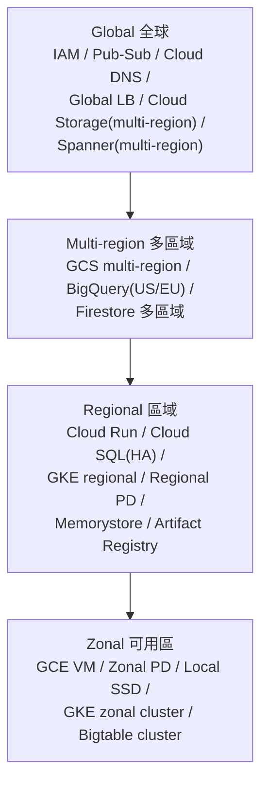
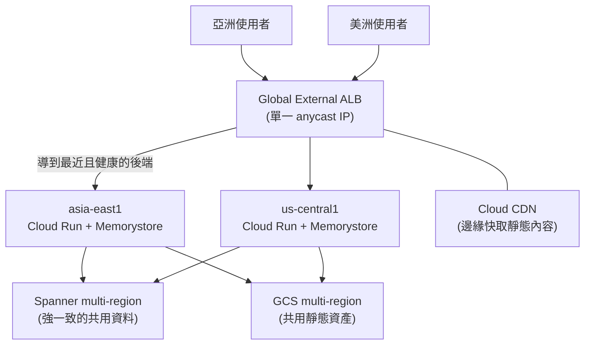

# 地理分布：區域、可用區與延遲設計

> [!abstract] 一句話定位
> 官方考點原文：**「理解 Google Cloud 服務如何地理分布（延遲、regional 服務、zonal 服務）」**。
> 兩個核心問題：**① 這個服務的失效範圍有多大？② 我的延遲預算怎麼分配？**

---

## 🗺 四個範圍層級



| 範圍 | 失效影響 | 例子 |
|---|---|---|
| **Zonal** | **一個 zone 掛 → 資源不可用** | Compute Engine VM、zonal PD、Local SSD、GKE zonal cluster、單一 Bigtable cluster |
| **Regional** | 自動跨該 region 的多個 zone 冗餘；**region 掛 → 不可用** | Cloud Run、Cloud SQL HA、GKE regional cluster、regional PD、Memorystore Standard |
| **Multi-region** | 跨多個 region | GCS multi-region、BigQuery `US`/`EU`、Firestore 多區域、Spanner multi-region |
| **Global** | 全球單一控制平面 | IAM、VPC（網路本身）、Cloud DNS、Global LB、Pub/Sub |

> [!important] 三個常考的判斷
> 1. **Compute Engine VM 是 zonal** → 高可用一定要 **MIG + 跨 zone**。
> 2. **Cloud Run 是 regional，但在 region 內自動跨 zone** → zone 故障你不會感覺到；region 故障就要多 region 部署 + Global LB。
> 3. **Cloud SQL HA 是「region 內跨 zone」** → 不能抵抗 region 故障（要跨區 replica）。

---

## ⏱ 延遲的數量級（要有直覺）

| 路徑 | 大致延遲 |
|---|---|
| 同 zone 內（VM ↔ VM） | 亞毫秒 |
| 同 region 跨 zone | 約 1 ms 以內 |
| 同洲跨 region（如 asia-east1 ↔ asia-northeast1） | 數十 ms |
| 跨洲（asia ↔ us ↔ europe） | 100–250 ms+ |
| 記憶體（Memorystore）讀取 | 亞毫秒 |
| 本機 SSD | 微秒級 |
| 網路磁碟（PD） | 亞毫秒～數毫秒 |
| Cloud Storage 讀取（同區） | 數十 ms |

> [!warning] 光速是物理上限
> 台灣 ↔ 美西的來回至少 ~100 ms，**沒有任何技術能改善**。
> → 延遲敏感的服務**必須把運算放在使用者附近**，這就是 Global LB + 多區域部署的理由。

### 延遲預算的分配思維
```
使用者感知目標: 200 ms
  ├─ 網路（使用者 → 最近的 Google 邊緣）: 20 ms   ← Anycast LB + CDN 改善這段
  ├─ Google 內部網路（邊緣 → region）: 30 ms
  ├─ 應用處理: 50 ms
  ├─ 資料庫查詢 × 3 次串聯: 60 ms                ← 減少往返次數 / 快取 / 批次
  └─ 緩衝: 40 ms
```
**改善順序**：① 減少串聯往返次數（批次/併發） → ② 快取 → ③ 把資料移近運算 → ④ 多區域部署。

---

## 🌍 多區域架構模式



| 模式 | 說明 | 資料層選擇 |
|---|---|---|
| **單一 region（多 zone）** | 最簡單，SLA 通常已足夠 | Cloud SQL HA / Spanner regional |
| **主-備（active-passive）** | 第二區域待命，故障時切換 | 跨區 read replica（需手動 promote） |
| **多活（active-active）** | 各區域都服務流量 | **Spanner multi-region** / Firestore 多區域 / Bigtable 多叢集 |
| **讀多活、寫單點** | 讀取就近，寫入回主區域 | read replica + 寫入導向主區 |

> [!tip] 選擇判準
> - 題目只說 `high availability` → **單 region 多 zone 就夠**（不要過度設計）。
> - 題目說 `survive a region outage`、`99.999%`、`global users with low latency` → **多區域**。
> - 題目說 `active-active with strong consistency` → **Spanner multi-region**。

---

## 📜 資料落地與合規（Data residency）

| 需求 | 做法 |
|---|---|
| 資料必須留在特定國家/地區 | 選擇該 **region**（不要用 multi-region/global 選項） |
| Secret 必須留在特定區域 | Secret Manager **user-managed replication** |
| Log 必須留在歐洲 | 建 **regional log bucket** + 調整 `_Default` sink |
| BigQuery 資料落地 | dataset 的 **location**（建立後不可改） |
| 限制可用區域 | **Organization Policy**: `constraints/gcp.resourceLocations` |
| 防止資料跨邊界外流 | **VPC Service Controls** |

> [!warning] location 大多不可變更
> Bucket、BigQuery dataset、KMS KeyRing、Firestore 資料庫的 location **建立後不能改**。
> 要搬 = 建新的 + 複製資料 + 切換。**設計階段就要決定對。**

---

## 🎯 考點速記

| 看到題目說… | 就想到 |
|---|---|
| `survive a zone failure` | regional 資源（Cloud Run 自動 / GKE regional / Cloud SQL HA / MIG 跨 zone） |
| `survive a region failure` | **多 region + Global LB** + 跨區資料複寫 |
| `single global IP address` | **Global external Application LB**（anycast） |
| `lowest latency for global users` | 多區域部署 + Global LB + **Cloud CDN** |
| `data must stay in Germany` | 選 `europe-west3` region + **resourceLocations** 政策 |
| `99.999% for a relational DB` | **Spanner multi-region** |
| `VM must be highly available` | **MIG 跨多 zone** + 健康檢查 |
| `reduce cross-region egress cost` | 運算與資料**同 region** |
| `Local SSD 資料在 VM 停止後消失` | Local SSD 是 **zonal 且非持久** |
| `cannot change the bucket location` | 正確：location 不可變 → 重建 + 複製 |

## 💣 真實場景陷阱

1. **單一 zone 的 GKE 叢集在生產環境**：一個 zone 維護就全掛。用 regional cluster。
2. **VM 沒有 MIG**：掛了沒人救。
3. **bucket 在 `us` multi-region、運算在亞洲**：延遲與流量費雙輸。
4. **以為 Cloud SQL HA 能抵抗 region 故障**：不能。
5. **多區域部署但資料只在一區**：寫入要跨洲 → 延遲高且單點。
6. **忘記 location 不可變**：上線後才發現合規要求，只能重建。
7. **過度設計**：只需要 99.9% 卻做多活多區域 → 成本與複雜度暴增。

## ✍️ 自我檢核

1. 四個範圍層級各舉兩個服務？
2. Compute Engine VM 與 Cloud Run 的可用性範圍差在哪？各要怎麼做高可用？
3. 跨洲來回延遲大約多少？這對架構有什麼強制影響？
4. 「抵抗 zone 故障」與「抵抗 region 故障」各需要什麼？
5. 哪些資源的 location 建立後不能改？（至少四個）
6. 資料必須留在特定國家，有哪三層機制可以確保？
7. 什麼時候「單一 region 多 zone」就足夠，不需要多區域？

## 🔗 相關

- [[一致性 交易與資料複寫]]
- [[Load Balancing 與 Session Affinity]]
- [[Cloud Run]]
- [[GKE 基礎與 Autopilot]]
- [[Compute Engine 與 App Engine]]
- [[Spanner]]
- [[Cloud SQL 與 AlloyDB]]
- [[Cloud Storage]]
- [[成本與資源最佳化]]
- [[Secret Manager 與 Cloud KMS]]
- [[Section 1 設計可擴充安全可靠的雲端原生應用]]
