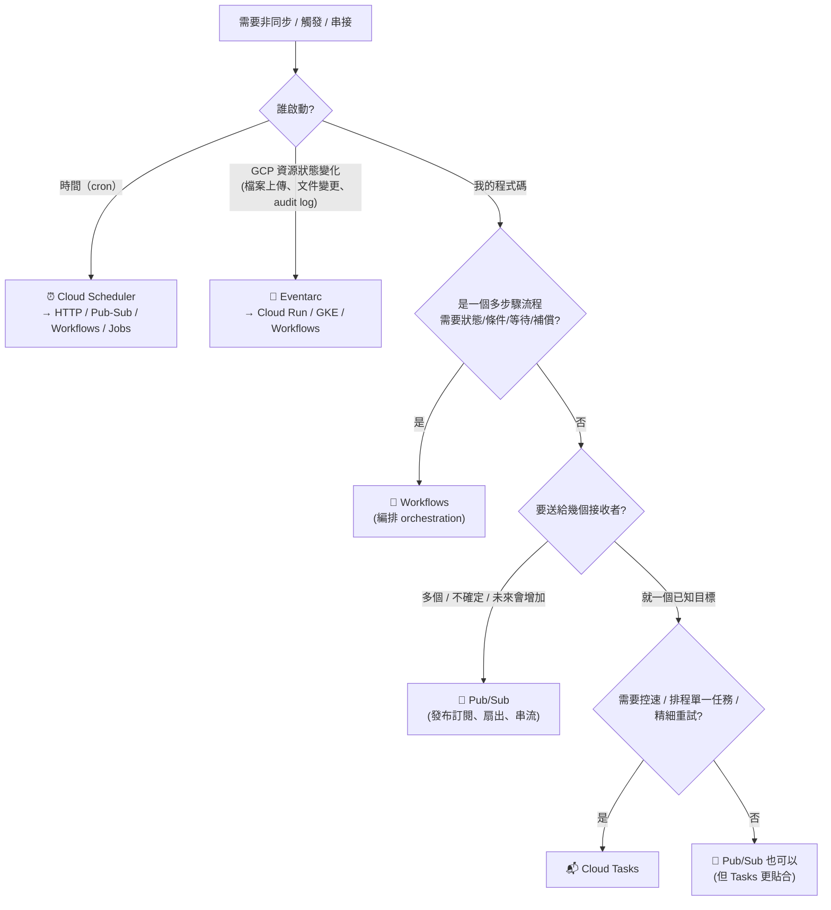

# 決策樹：訊息、事件與編排選型

> [!abstract] 目標
> 五個服務（Pub/Sub、Cloud Tasks、Eventarc、Workflows、Cloud Scheduler）長得很像，但定位完全不同。
> **這張決策樹幾乎每份考卷都會用到 2～3 次。**

---

## 📘 技術理解
*原理、限制與實務操作 —— 不為考試也該懂的部分。*

### 🌳 主決策樹

---

### 🧭 五個服務的一句話定位（**必背**）

| 服務 | 一句話 | 最強的關鍵詞 |
|---|---|---|
| **Cloud Scheduler** | 「到時間就去戳一下」 | `cron`、`every day at 2 AM`、`scheduled` |
| **Eventarc** | 「GCP 資源變化 → 標準事件送出」 | `when a file is uploaded`、`audit log`、`CloudEvents` |
| **Pub/Sub** | 「這件事發生了，誰想知道自己來訂」 | `fan-out`、`decouple`、`absorb spikes`、`stream` |
| **Cloud Tasks** | 「這件工作稍後做，而且要控速」 | `rate limit`、`delay`、`retry to one endpoint`、`throttle downstream` |
| **Workflows** | 「照這個流程一步步做，我幫你記狀態」 | `orchestrate`、`multi-step`、`conditional`、`wait for approval` |

---

### ⚖️ Pub/Sub vs Cloud Tasks（**最高頻對照**）

| 維度 | **Pub/Sub** | **Cloud Tasks** |
|---|---|---|
| 模型 | **發布/訂閱**（一對多） | **佇列/派工**（一對一） |
| 目標決定於 | **訂閱**（訂閱者自己建立） | **建立任務時**（發送方指定 URL） |
| 扇出 | ✅ 多個 subscription 各得一份 | ❌（要建多個 task） |
| 速率控制 | 訂閱端 flow control | ✅ **佇列層級**：`max-dispatches-per-second`、`max-concurrent-dispatches` |
| 單一訊息延遲執行 | ❌ | ✅ **`scheduleTime`**（最長約 30 天） |
| 重試 | 訂閱層級的 retry policy | 任務層級 `max-attempts` / backoff |
| DLQ | ✅ **dead-letter topic** | ❌ 無（用盡即丟，需自行記錄） |
| 順序 | **ordering key**（同 key 有序） | 無順序保證 |
| 去重 | 無（需冪等） | **task name 去重**（短期內） |
| 吞吐 | 極高（串流等級） | 中（適合任務型） |
| 典型場景 | 事件廣播、資料管線、多服務反應 | 寄信、產 PDF、呼叫第三方 API、延遲取消訂單 |

> [!important] 一句話判準
> **「要廣播 → Pub/Sub；要派工並控速 → Cloud Tasks。」**
> 題目出現 `rate limit the downstream`、`schedule a single task 30 minutes later` → **一定是 Cloud Tasks**。
> 題目出現 `multiple services must react`、`add new consumers later without changing the publisher` → **一定是 Pub/Sub**。

---

### ⚖️ Eventarc vs Pub/Sub

| | **Eventarc** | **Pub/Sub** |
|---|---|---|
| 事件產生者 | **GCP 服務**（GCS、Firestore、Audit Log…） | **你自己的程式碼** |
| 格式 | **CloudEvents 標準** | 任意 payload |
| 過濾 | 觸發器條件（type、bucket、methodName、path pattern） | subscription filter（訊息屬性） |
| 底層 | **就是 Pub/Sub**（所以也 at-least-once） | — |

> **判準**：事件是「Google Cloud 幫你產生的」→ Eventarc；是「你自己 publish 的」→ Pub/Sub。

---

### ⚖️ Workflows vs Pub/Sub（編排 vs 協作）

| | **Workflows（編排）** | **Pub/Sub（協作）** |
|---|---|---|
| 流程知識 | 集中在一份定義，**看得見全貌** | 分散在各服務 |
| 狀態 | 平台保管執行狀態與歷史 | 無中央狀態 |
| 錯誤處理 | 宣告式 retry / except / **補償步驟** | 各服務自理 |
| 耦合度 | 編排器認識所有參與者 | 最鬆耦合 |
| 吞吐 | 中（按步驟計費） | 極高 |
| 適合 | 訂單流程、審核流程、**saga** | 事件廣播、資料管線 |

> **判準**：`需要知道流程走到哪一步`、`失敗要回滾前面的步驟`、`要等人工核准` → **Workflows**。

---

### 🧪 情境練習（先自己答）

| 情境 | 答案 |
|---|---|
| 訂單成立後，出貨、通知、分析三個服務都要知道 | **Pub/Sub**（一個 topic、三個 subscription） |
| 使用者註冊後寄歡迎信，第三方寄信 API 每秒只能 10 次 | **Cloud Tasks**（佇列速率限制） |
| 使用者上傳圖片後自動產生縮圖 | **Eventarc**（GCS finalized）→ Cloud Run |
| 每天凌晨 2 點匯出前一天訂單 | **Cloud Scheduler** → **Cloud Run Jobs** |
| 30 分鐘後若未付款就取消訂單 | **Cloud Tasks**（`scheduleTime`） |
| 有人修改 IAM 政策要立即通知安全團隊 | **Eventarc**（Cloud Audit Log 觸發） |
| 訂單流程：驗證 → 風控 → （高風險要人工審核）→ 扣款 → 出貨，失敗要退款 | **Workflows**（含 callback + 補償） |
| 每秒 50,000 筆點擊事件要進 BigQuery 分析 | **Pub/Sub** + **BigQuery 訂閱** |
| 同一個帳戶的交易必須依序處理 | Pub/Sub + **ordering key = accountId** |
| 壞訊息不能無限重試 | Pub/Sub **dead-letter topic** + `max-delivery-attempts` |
| 要重播昨天的所有事件 | Pub/Sub **topic retention + seek**（或 snapshot） |
| 保護只能承受 5 併發的舊系統 | **Cloud Tasks** `max-concurrent-dispatches=5` |

---

### 🧯 所有非同步設計的共同必修課

> [!danger] 不管選哪個服務，這三件事都要做
> 1. **冪等**：Pub/Sub、Eventarc、Cloud Tasks、Cloud Scheduler **全部都是 at-least-once** → 消費端必須能安全重跑。
> 2. **失敗出口**：DLQ（Pub/Sub）或自行記錄失敗（Cloud Tasks），避免毒藥訊息無限循環。
> 3. **可觀測性**：積壓量（`num_undelivered_messages`）、處理延遲、失敗率都要有指標與警示。
>
> 詳見 [[韌性模式 重試 冪等 退避 斷路器]]。

---

## 🎯 應試
*考場上的提取線索與自我測驗 —— 備考期才需要。*

### 🚩 常見誘答選項

| 誘答 | 為什麼錯 |
|---|---|
| 「要控制呼叫第三方的速率 → Pub/Sub」 | Pub/Sub 沒有佇列層級速率控制 → Cloud Tasks |
| 「要延遲 30 分鐘執行 → Pub/Sub」 | Pub/Sub 沒有 per-message delay → Cloud Tasks（或 Workflows 的 sleep） |
| 「多個服務要處理同一則訊息 → 同一個 subscription 多個 consumer」 | 那是負載分攤 → 要多個 **subscription** |
| 「GCS 上傳觸發 → 自己輪詢 bucket」 | 有 Eventarc 就不該輪詢 |
| 「多步驟流程 → 一連串 Pub/Sub topic」 | 可行但難追蹤狀態與錯誤 → Workflows |
| 「Cloud Scheduler 同步等 3 小時的批次」 | 會超過 attempt deadline → 改觸發 Cloud Run Jobs |
| 「用 Cloud Tasks 做事件廣播」 | 要為每個接收者建 task，失去解耦優勢 |

### ✍️ 自我檢核

1. 默寫主決策樹（四個判斷點）。
2. 五個服務各一句話定位。
3. Pub/Sub 與 Cloud Tasks 的六個維度差異？
4. Eventarc 與 Pub/Sub 的差別？Eventarc 底層是什麼？
5. 編排與協作的取捨？什麼情況一定要 Workflows？
6. 這五個服務的共同傳遞保證是什麼？帶來什麼設計義務？
7. 「30 分鐘後取消未付款訂單」與「每天 2 點跑批次」分別用什麼？

## 🔗 相關

- [[Pub Sub]]
- [[Cloud Tasks]]
- [[Eventarc]]
- [[Workflows 與 Cloud Scheduler]]
- [[Cloud Run Jobs 與 Functions]]
- [[韌性模式 重試 冪等 退避 斷路器]]
- [[決策樹 運算平台選型]]
- [[決策樹 資料庫選型]]
- [[Lab 02 事件驅動 Pub Sub Eventarc Cloud Tasks]]
- [[Section 1 設計可擴充安全可靠的雲端原生應用]]
