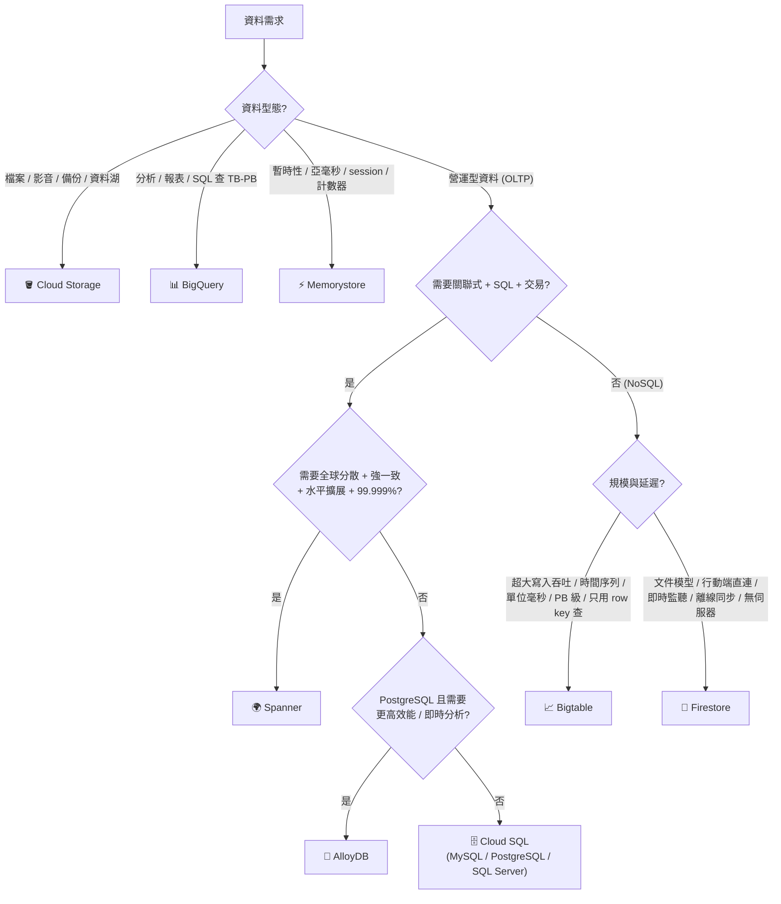

# 決策樹：資料庫與儲存選型

> [!abstract] 目標
> 看到需求描述，**30 秒內鎖定服務**。考試裡這類題目通常有兩個「看起來都對」的選項，靠的就是判準的精確度。

---

## 📘 技術理解
*原理、限制與實務操作 —— 不為考試也該懂的部分。*

### 🌳 主決策樹

---

### 🔑 關鍵詞 → 服務 對照表（**必背**）

| 關鍵詞 | 服務 |
|---|---|
| `objects`、`files`、`images`、`backup`、`data lake`、`static website` | **Cloud Storage** |
| `signed URL`、`lifecycle`、`retention lock` | Cloud Storage |
| `data warehouse`、`analytics`、`SQL over terabytes`、`BI`、`ML training data` | **BigQuery** |
| `sub-millisecond`、`in-memory`、`cache`、`session store`、`leaderboard` | **Memorystore** |
| `existing MySQL / SQL Server`、`lift and shift a relational DB` | **Cloud SQL** |
| `PostgreSQL-compatible` + `high performance` / `HTAP` / `real-time analytics` | **AlloyDB** |
| `globally distributed relational`、`strong/external consistency`、`horizontal scale`、`99.999%` | **Spanner** |
| `ACID transactions across regions` | Spanner |
| `time-series`、`IoT`、`sensor data`、`financial ticks`、`millions of writes/sec`、`petabytes` | **Bigtable** |
| `HBase API`、`row key design` | Bigtable |
| `mobile/web app`、`real-time listeners`、`offline support`、`document database`、`serverless, no capacity planning` | **Firestore** |
| `Security Rules`、`client-side SDK` | Firestore |
| `vector search / embeddings` | Vertex AI Vector Search（或 AlloyDB/Spanner 的向量支援） |

---

### 📊 全維度對照表（Day 18 自己默寫這張）

| | **Cloud SQL** | **AlloyDB** | **Spanner** | **Firestore** | **Bigtable** | **BigQuery** | **Memorystore** | **Cloud Storage** |
|---|---|---|---|---|---|---|---|---|
| 模型 | 關聯式 | 關聯式(PG) | 關聯式 | 文件 | 寬列 | 列式倉儲 | KV/資料結構 | 物件 |
| SQL | ✅ | ✅ | ✅ | ❌（有限查詢） | ❌ | ✅ | ❌ | ❌ |
| JOIN | ✅ | ✅ | ✅ | ❌ | ❌ | ✅ | ❌ | ❌ |
| 交易 | ✅ | ✅ | ✅ 跨行/跨區 | ✅ 文件級 | ⚠️ 單行 | ⚠️ 有限 | ⚠️ 指令級 | ❌ |
| 一致性 | 主庫強一致 replica 最終 | 同左 | **外部一致** | **強一致** | 單叢集強一致 跨叢集最終 | 強一致 | 強一致 | 強一致 |
| 水平擴展 | ❌（垂直 + replica） | 有限 | **✅ 無上限** | ✅ 自動 | **✅ 加節點** | ✅ 自動 | ✅ Cluster | ✅ 無上限 |
| 延遲 | ms | ms | ms（跨區較高） | ms | **單位 ms** | 秒級 | **亞 ms** | 數十 ms |
| 縮到 0 | ❌ | ❌ | ❌ | **✅** | ❌ | ✅（無伺服器） | ❌ | ✅ |
| 二級索引 | ✅ | ✅ | ✅ | ✅ | **❌** | ⚠️（分區/叢集） | ❌ | ❌ |
| 典型上限 | TB 級 | TB 級 | **PB 級** | TB 級 | **PB 級** | **PB 級** | GB–TB | 無限 |
| 成本特性 | 執行個體 | 執行個體 | 高（最小容量貴） | 依用量 | 節點固定成本 | 依掃描/容量 | 記憶體 | 極低 |

---

### 🧪 情境練習（**先自己答，再看答案**）

| 情境 | 答案 | 判準 |
|---|---|---|
| 全球電商購物車，庫存要跨區強一致，要 SQL | **Spanner** | global + strong + relational |
| 行動記帳 App，要離線編輯、上線同步 | **Firestore** | offline sync + 客戶端 SDK |
| 每天 10 億筆感測器讀數，查「某裝置最近一小時」 | **Bigtable** | time-series + 高寫入 + row key 查詢 |
| 既有 WordPress 要上雲 | **Cloud SQL (MySQL)** | 既有 MySQL |
| 使用者上傳的影片 | **Cloud Storage**（+ signed URL） | 物件 |
| 每晚跑報表分析 3 億筆交易 | **BigQuery** | 分析型 SQL |
| 購物網站的 session 與熱門商品快取 | **Memorystore** | 亞毫秒 + 暫時性 |
| PostgreSQL 應用，交易量大且要即時儀表板 | **AlloyDB** | PG 相容 + HTAP |
| 遊戲排行榜前 100 名，即時更新 | **Memorystore（sorted set）** | 亞毫秒 + 排序結構 |
| 多租戶 SaaS，每個租戶資料量差異極大，要 SQL | **Spanner**（或 Cloud SQL + 分庫，看規模） | 水平擴展 |
| 稽核紀錄要保存 7 年且不可刪改 | **Cloud Storage + retention lock** | 合規保存 |
| 聊天室訊息，客戶端要即時看到新訊息 | **Firestore**（即時監聽） | real-time listener |

---

### 🧱 Schema 設計的共同原則（考試會出設計題）

| 服務 | 最重要的設計原則 | 反模式 |
|---|---|---|
| **Bigtable** | row key 決定一切；**高基數欄位放前面** | `timestamp` 開頭 → 熱點 |
| **Spanner** | 主鍵分布均勻；父子常一起查用 **interleave** | 自增主鍵 → 熱點 |
| **Firestore** | **為查詢設計**（denormalize）；避免單一熱文件 | 全站計數器放一個文件（1 寫/秒） |
| **Cloud SQL / AlloyDB** | 正規化 + 適當索引；注意連線數 | 每請求開新連線 |
| **BigQuery** | **分區 + 叢集**；避免 `SELECT *` | 全表掃描 |
| **Cloud Storage** | 物件名稱前綴分散；lifecycle 管成本 | 高頻覆寫同一物件 |

> [!important] 三個服務都在考「避免熱點」
> Bigtable 的 row key、Spanner 的主鍵、Firestore 的單文件寫入 — **本質是同一個問題：寫入集中在一個分片上。**
> 解法也同源：**讓鍵的前綴分散**（雜湊、UUID、欄位翻轉、分片）。

---

## 🎯 應試
*考場上的提取線索與自我測驗 —— 備考期才需要。*

### 🚩 常見誘答選項

| 誘答 | 為什麼錯 |
|---|---|
| 「要分析 → Bigtable」 | Bigtable 不能 ad-hoc SQL → 選 BigQuery |
| 「要高吞吐 → Firestore」 | 單文件 1 寫/秒的限制；超大吞吐選 Bigtable |
| 「要全球 → Cloud SQL 多個 read replica」 | replica 是最終一致且不能寫 → 選 Spanner |
| 「BigQuery 當應用主資料庫」 | 秒級延遲、併發限制 → OLTP 不適合 |
| 「用 Memorystore 當唯一儲存」 | 快取不是可靠儲存 |
| 「小專案用 Spanner」 | 最小容量成本高 → Cloud SQL |
| 「Bigtable 加個二級索引就好」 | 它沒有二級索引 |
| 「Cloud Storage 存 session」 | 延遲與更新頻率都不適合 |

### ✍️ 自我檢核

1. 默寫主決策樹（四個分支點）。
2. Spanner 與 Cloud SQL 的四個決定性差異？
3. Firestore 與 Bigtable 各適合什麼？為什麼不能互換？
4. 三個「避免熱點」的設計問題與各自解法？
5. 什麼時候該選 AlloyDB 而不是 Cloud SQL / Spanner？
6. 「稽核紀錄 7 年不可刪」與「使用者上傳大檔」分別用什麼機制？
7. BigQuery 為什麼不能當 OLTP 資料庫？

## 🔗 相關

- [[Cloud Storage]]
- [[Cloud SQL 與 AlloyDB]]
- [[Spanner]]
- [[Firestore]]
- [[Bigtable]]
- [[Memorystore 與快取策略]]
- [[BigQuery 給開發者]]
- [[一致性 交易與資料複寫]]
- [[決策樹 運算平台選型]]
- [[Section 1 設計可擴充安全可靠的雲端原生應用]]
