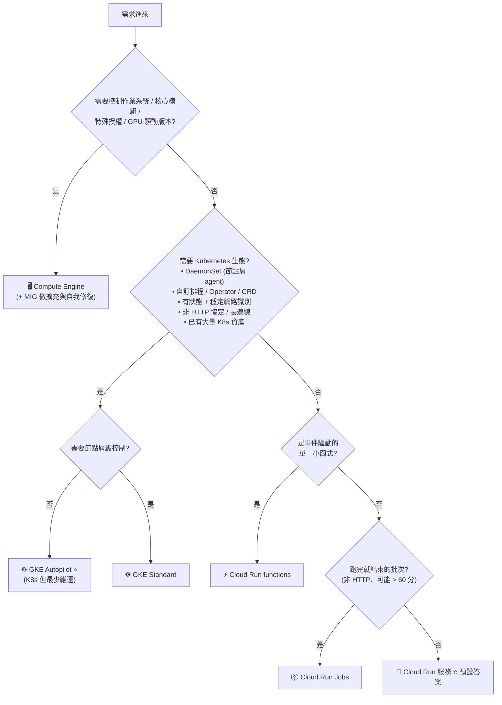
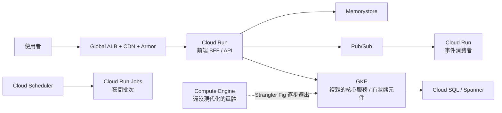

# 決策樹：運算平台選型

> [!abstract] 為什麼這是最重要的一篇
> 每份 PCD 考卷大約有 **3～5 題**直接靠這張決策樹判斷，還有更多題間接依賴它。
> **目標：能在 30 秒內默寫出來。**

---

## 📘 技術理解
*原理、限制與實務操作 —— 不為考試也該懂的部分。*

### 🌳 主決策樹

> [!important] 一句話原則
> **Cloud Run 是預設答案。** 只有出現「明確需要更多控制」的訊號時才往上走（GKE → Compute Engine）。
> Google 的偏好順序：**serverless > 代管容器 > VM**。

---

### 🔑 關鍵詞 → 平台 對照表（**考場實用**）

| 題目出現的關鍵詞 | 答案 |
|---|---|
| `minimal operational overhead`、`no infrastructure to manage`、`fully managed` | **Cloud Run** |
| `scale to zero`、`pay only when handling requests` | **Cloud Run** |
| `containerized stateless HTTP service` | **Cloud Run** |
| `deploy from source without a Dockerfile` | Cloud Run（Buildpacks） |
| `Kubernetes` + `least operational overhead` | **GKE Autopilot** |
| `pay only for pod requests` | GKE Autopilot |
| `DaemonSet`、`privileged`、`hostNetwork`、`SSH into nodes`、`custom kernel` | **GKE Standard** |
| `service mesh with sidecar injection across many services` | GKE（+ Cloud Service Mesh） |
| `StatefulSet`、`stable network identity`、`ordered startup` | **GKE** |
| `existing Helm charts / Kubernetes manifests` | **GKE** |
| `lift and shift`、`minimal code changes`、`legacy app` | **Compute Engine**（或容器化上 GKE） |
| `licensed software requires dedicated hardware` | Compute Engine **sole-tenant** |
| `fault-tolerant batch, 80% cheaper` | **Spot VM** / GKE Spot 節點池 |
| `run to completion`、`nightly ETL`、`parallel tasks` | **Cloud Run Jobs** |
| `single function triggered by a file upload` | **Cloud Run functions** + Eventarc |
| `long-running background process, not HTTP` | Cloud Run Jobs / GKE（不是 Cloud Run 服務） |
| `needs to run for 3 hours per request` | 拆開！→ Jobs / Tasks / Workflows |

---

### 📊 四個維度的完整對照

| 維度 | Cloud Run | GKE Autopilot | GKE Standard | Compute Engine |
|---|---|---|---|---|
| **抽象層級** | 容器即服務 | 容器編排（代管節點） | 容器編排（自管節點） | 虛擬機 |
| **縮到 0** | ✅ | ❌（Pod 最少 1，除非用 KEDA 等） | ❌ | ❌ |
| **計費單位** | 請求期間的 CPU/記憶體 | Pod requests | **節點** | VM 執行時間 |
| **擴充機制** | 內建（依請求數） | HPA + 自動佈建節點 | HPA + CA | MIG autoscaler |
| **維運負擔** | 最低 | 低 | 中 | 高 |
| **彈性/控制力** | 低 | 中 | 高 | 最高 |
| **冷啟動** | 有（可用 min-instances 消除） | 較少 | 較少 | 無（但擴充慢） |
| **協定** | HTTP/1、HTTP/2、gRPC、WebSocket | 任意 | 任意 | 任意 |
| **Sidecar** | ✅（多容器） | ✅ | ✅ | 自己裝 |
| **DaemonSet** | ❌ | ⚠️ 受限 | ✅ | N/A |
| **狀態** | 無狀態（可掛 volume） | StatefulSet + PV | StatefulSet + PV | 本機/PD |

---

### 🧭 混合架構才是現實（真實場景）

> 考題若問「最佳架構」，**不必所有東西都用同一個平台**。選「每個工作負載最合適的」。

---

### 🔄 現代化路徑（Section 1 的「應用現代化」）

| 階段 | 做法 | 適用 |
|---|---|---|
| ① Rehost（lift & shift） | VM → Compute Engine | 時間壓力大、不能改程式 |
| ② Replatform | 容器化 → GKE / Cloud Run | 想要擴充與部署效率 |
| ③ Refactor | 拆微服務（**Strangler Fig**） | 需要獨立擴充與交付節奏 |
| ④ Rebuild | 雲端原生重寫（serverless + 代管資料庫） | 業務模型也在變 |

**Strangler Fig 模式**：在單體前放一層路由（LB / API Gateway），新功能導向新服務、舊功能留單體，逐步替換。
→ 題目關鍵詞：`incrementally`、`without a big-bang rewrite`、`reduce risk of migration`。

---

## 🎯 應試
*考場上的提取線索與自我測驗 —— 備考期才需要。*

### 🚩 常見誘答選項（**拿分關鍵**）

| 誘答 | 為什麼錯 |
|---|---|
| 「需要最少維運 → GKE Standard」 | Standard 要管節點升級與容量 → 應選 Autopilot 或 Cloud Run |
| 「要跑 DaemonSet 收節點指標 → Cloud Run」 | Cloud Run 沒有節點概念 |
| 「3 小時的批次 → Cloud Run 服務」 | 請求逾時上限 60 分鐘 → 用 Jobs |
| 「App Engine」出現在全新專案的選項中 | 新專案應選 Cloud Run |
| 「所有服務都上 GKE 才統一」 | 過度工程；簡單無狀態服務用 Cloud Run 更省 |
| 「Compute Engine + 自己裝 Docker」 | 除非有明確理由，否則違反「最少維運」 |
| 「用 Cloud Functions gen1」 | 現在統一為 Cloud Run functions |

---

### ✍️ 自我檢核（默寫測驗）

1. 蓋住上面，**畫出主決策樹**（四個判斷點）。
2. 列出五個「必須用 GKE 而不能用 Cloud Run」的訊號。
3. 列出三個「必須用 Compute Engine」的訊號。
4. Autopilot 與 Standard 的計費差異？各在什麼情境更省？
5. 「每天凌晨處理 500 萬筆資料、要平行、可能跑 2 小時」→ 完整服務組合？
6. 一個既有的 Java 單體，要求「最少改動 + 自動擴充 + 之後逐步拆微服務」→ 你的三階段路線？

## 🔗 相關

- [[Cloud Run]]
- [[Cloud Run Jobs 與 Functions]]
- [[GKE 基礎與 Autopilot]]
- [[GKE 工作負載 健康檢查與自動擴充]]
- [[Compute Engine 與 App Engine]]
- [[決策樹 資料庫選型]]
- [[決策樹 訊息與事件選型]]
- [[12-Factor 與雲端原生設計原則]]
- [[成本與資源最佳化]]
- [[Section 1 設計可擴充安全可靠的雲端原生應用]]
