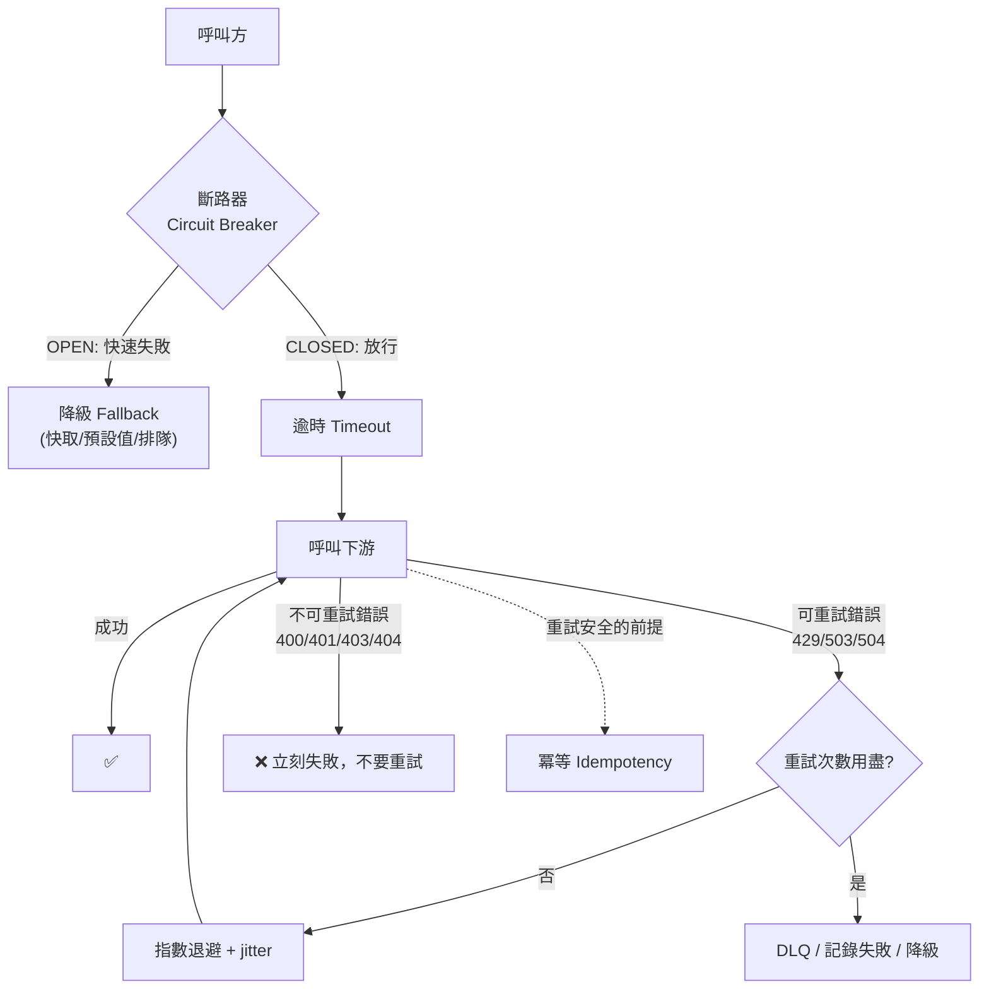
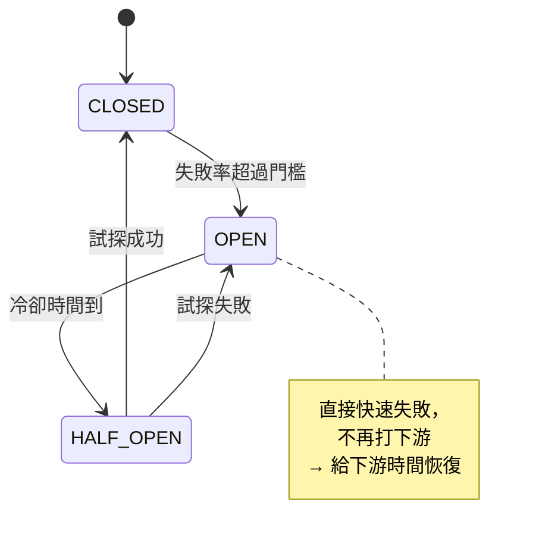

# 韌性模式：重試、冪等、指數退避、斷路器

> [!abstract] 為什麼這篇特別重要
> 官方考點直接寫了 **「處理錯誤（例如指數退避）」**，而 **冪等** 是所有訊息服務題目的隱含答案。
> 這篇是「**分散式系統一定會失敗，你怎麼設計**」的完整解答。考試中至少 4～6 題與此相關。

---

## 🧠 全景圖



---

## 1️⃣ 冪等（Idempotency）— **最核心的考點**

**定義**：同一個操作執行一次或多次，**結果相同**。

> [!danger] 為什麼必須要
> Pub/Sub、Eventarc、Cloud Tasks、Cloud Scheduler **全部都是 at-least-once**。
> 「訊息重複」不是 bug，是**規格**。你的消費端不冪等，就一定會重複扣款/重複寄信。

### 三種實作方式

**① 冪等鍵 + 唯一性約束（最推薦）**
```python
# Firestore：用 create() 的「已存在就失敗」特性做去重
from google.cloud import firestore
from google.api_core import exceptions

db = firestore.Client()

def handle(event_id: str, payload: dict):
    try:
        db.document(f"processed/{event_id}").create({
            "at": firestore.SERVER_TIMESTAMP, "status": "processing"
        })
    except exceptions.AlreadyExists:
        return "duplicate, skipped"        # 已處理過 → 直接 ack
    do_work(payload)                        # 真正的業務邏輯
    db.document(f"processed/{event_id}").update({"status": "done"})
```

```python
# Redis / Memorystore：SET NX EX
if not r.set(f"processed:{event_id}", "1", nx=True, ex=86400):
    return "duplicate"
```

```sql
-- 關聯式資料庫：唯一索引 + UPSERT
CREATE UNIQUE INDEX idx_idem ON payments(idempotency_key);
INSERT INTO payments (idempotency_key, order_id, amount)
VALUES ($1, $2, $3)
ON CONFLICT (idempotency_key) DO NOTHING;
```

**② 天然冪等的操作設計**
| 不冪等 | 改成冪等 |
|---|---|
| `balance = balance - 100`（相對） | `SET status='paid' WHERE id=X AND status='pending'`（條件式/絕對值） |
| `INSERT` 新列 | `UPSERT` 依業務鍵 |
| `counter++` | 記錄「事件已計入」再重算，或用去重表 |

**③ 樂觀鎖 / 版本號**
```python
# 只有 version 符合時才更新（CAS）
UPDATE orders SET status='shipped', version=version+1
WHERE id=$1 AND version=$2      -- 影響 0 列 → 已被別人改過，重讀再試
```

> [!important] 冪等鍵從哪來
> 1. **業務鍵**（order ID + 步驟名稱）← 最好，跨重送/跨系統都一致
> 2. 訊息的 `message_id`（Pub/Sub 提供）
> 3. 呼叫方產生的 UUID 並放在 header（`Idempotency-Key`）← 對外 API 的標準做法
>
> **考題常問：「同一筆訂單被送兩次，如何避免重複收費」→ 用 order ID 當冪等鍵 + 唯一約束。**

---

## 2️⃣ 重試與指數退避（Exponential Backoff）

### 哪些錯誤該重試
| 錯誤 | 重試？ | 說明 |
|---|---|---|
| `429 RESOURCE_EXHAUSTED` | ✅ 退避重試 | 超過配額/速率 |
| `500 INTERNAL` / `503 UNAVAILABLE` | ✅ 退避重試 | 暫時性 |
| `504 DEADLINE_EXCEEDED` | ✅ 小心重試 | 可能已執行成功 → **必須冪等** |
| `409 ABORTED`（交易衝突） | ✅ 重試整個交易 | Spanner/Firestore 常見 |
| `400 INVALID_ARGUMENT` | ❌ | 請求本身錯，重試永遠失敗 |
| `401 UNAUTHENTICATED` | ❌（先修憑證） | |
| `403 PERMISSION_DENIED` | ❌ | 要補 IAM 角色 |
| `404 NOT_FOUND` | ❌ | |

### 正確的退避公式
```
delay = min(base * 2^attempt, max_delay) + random(0, jitter)
```
```python
import random, time

def call_with_backoff(fn, max_attempts=5, base=0.5, cap=32.0):
    for attempt in range(max_attempts):
        try:
            return fn()
        except RetryableError as e:
            if attempt == max_attempts - 1:
                raise
            delay = min(base * (2 ** attempt), cap)
            delay += random.uniform(0, delay * 0.5)     # ⭐ jitter 必須有
            time.sleep(delay)
```

> [!warning] Jitter（抖動）為什麼必要
> 沒有 jitter → 所有失敗的用戶端在**同一時刻**一起重試 → **重試風暴（thundering herd）** 把下游再打掛一次。
> **考題只要問「重試策略要包含什麼」，答案一定包含：指數增長 + 上限 + jitter + 最大次數。**

### 用戶端程式庫已經幫你做了
```python
from google.api_core import retry
from google.cloud import storage

client = storage.Client()
blob = client.bucket("b").blob("o")
blob.upload_from_string("data", retry=retry.Retry(initial=0.5, maximum=32.0, multiplier=2.0, deadline=120))
```
> **Cloud Client Libraries 預設就有退避重試**。考題問「最簡單的正確做法」→ **用官方用戶端程式庫的內建重試**，不要自己手刻。

### 平台層的重試設定
| 服務 | 設定 |
|---|---|
| **Pub/Sub** | 訂閱的 retry policy（exponential backoff）+ dead-letter topic |
| **Cloud Tasks** | `max-attempts`、`min/max-backoff`、`max-doublings` |
| **Eventarc** | 底層 Pub/Sub 訂閱的設定 |
| **Workflows** | 宣告式 `retry` + `predicate` |
| **Cloud Scheduler** | `max-retry-attempts`、`min/max-backoff` |
| **GKE / Cloud Service Mesh** | VirtualService 的 `retries`（`attempts`、`perTryTimeout`、`retryOn`） |

---

## 3️⃣ 逾時（Timeout）— 最被忽略的一層

> [!important] 沒有 timeout 的重試是災難
> 呼叫卡住 60 秒 × 3 次重試 = 使用者等 3 分鐘，而且你的執行緒/實例全被佔用。

**逾時預算（timeout budget）原則**
```
使用者可接受的總延遲 = 1s
  → API Gateway timeout 1s
    → 服務 A timeout 800ms
      → 呼叫服務 B timeout 300ms（含 2 次重試 → 每次 ~120ms）
        → 呼叫資料庫 timeout 100ms
```
**外層的 timeout 必須 > 內層的（timeout × 重試次數）**，否則外層先斷，內層的重試白做。

---

## 4️⃣ 斷路器（Circuit Breaker）



| 狀態 | 行為 |
|---|---|
| **CLOSED** | 正常放行，統計失敗率 |
| **OPEN** | **立刻失敗**（不呼叫下游）→ 保護下游 + 避免自己被拖垮 |
| **HALF_OPEN** | 放少量請求試探 |

**在 Google Cloud 上怎麼實作**
- **Cloud Service Mesh / Istio**：`DestinationRule` 的 `outlierDetection`（自動把不健康的後端移出）→ 見 [[Cloud Service Mesh 與 Network Policy]]
- **應用內**：Resilience4j (Java)、`pybreaker` (Python)、`opossum` (Node)
- **Cloud Run**：靠應用內實作 + `--max-instances` 限制打下游的併發

---

## 5️⃣ 其他必知模式

| 模式 | 說明 | Google Cloud 對應 |
|---|---|---|
| **降級 / Fallback** | 下游掛了回快取或預設值 | Memorystore 的舊值、靜態預設 |
| **Bulkhead（隔離艙）** | 不同下游用不同的執行緒池/連線池，避免一個拖垮全部 | 分開的連線池、分開的服務 |
| **Backpressure（背壓）** | 上游減速而不是崩潰 | Pub/Sub flow control、Cloud Tasks 速率、`--max-instances` |
| **Queue-based load leveling** | 用佇列吸收尖峰 | Pub/Sub / Cloud Tasks |
| **Dead-letter queue** | 壞訊息的隔離區 | Pub/Sub dead-letter topic |
| **Saga / 補償交易** | 分散式交易用「逐步執行 + 失敗時補償」取代 2PC | **Workflows** 的 `except` 補償步驟 |
| **優雅關閉** | 收到 SIGTERM 後排空進行中的請求 | Cloud Run SIGTERM、K8s `preStop` + `terminationGracePeriodSeconds` |
| **Health check 分層** | liveness 只看自己、readiness 才看下游 | 見 [[GKE 工作負載 健康檢查與自動擴充]] |

### Saga 範例（Workflows）
```yaml
- chargePayment:
    try:
      call: http.post
      args: { url: "${PAYMENT_URL}/charge", auth: { type: OIDC },
              body: { orderId: "${orderId}", idempotencyKey: "${orderId}-charge" } }
    except:
      as: e
      steps:
        - compensate:                      # 補償：釋放庫存
            call: http.post
            args: { url: "${INVENTORY_URL}/release", auth: { type: OIDC },
                    body: { orderId: "${orderId}", idempotencyKey: "${orderId}-release" } }
        - fail:
            raise: ${e}
```
> 注意補償步驟**本身也要冪等**（用 `idempotencyKey`）。

---

## 🎯 考點速記

| 看到題目說… | 就想到 |
|---|---|
| `messages may be delivered more than once` | **冪等**（去重表 / 唯一約束 / 條件式更新） |
| `avoid duplicate charges` | 用業務鍵當**冪等鍵** + 唯一索引 |
| `handle 429 / quota exceeded` | **指數退避 + jitter** |
| `what should a retry strategy include?` | 指數增長 + 上限 + **jitter** + 最大次數 + 只重試可重試錯誤 |
| `400 錯誤要不要重試` | **不要**（修請求） |
| `thundering herd` | **jitter** |
| `protect a fragile downstream` | **斷路器** + Cloud Tasks 速率限制 + `--max-instances` |
| `poison message loops forever` | **dead-letter topic** + `max-delivery-attempts` |
| `distributed transaction across services` | **Saga + 補償**（Workflows），不是 2PC |
| `no requests dropped during deployment` | **優雅關閉**（SIGTERM / preStop） |
| `absorb traffic spikes` | **佇列削峰**（Pub/Sub / Cloud Tasks） |
| `simplest correct retry implementation` | 用 **Cloud Client Library 的內建重試** |

## 💣 真實場景陷阱

1. **重試但不冪等**：越重試資料越亂。
2. **沒有 jitter**：自己造成 DDoS。
3. **每一層都重試 3 次**：3 層 = 27 次呼叫 → 放大效應。**只在最外層或最合適的一層重試**。
4. **重試 `400`**：浪費配額且永遠不會成功。
5. **沒有 timeout**：連線池耗盡 → 整個服務假死。
6. **斷路器門檻太敏感**：正常抖動就切斷服務。
7. **補償步驟不冪等**：補償重試造成二次錯誤（庫存被釋放兩次）。
8. **DLQ 建了但沒人看**：訊息靜靜躺著，問題沒被發現 → **要對 DLQ 深度設警示**。

## ✍️ 自我檢核

1. 為什麼 at-least-once 一定要冪等？列出三種實作冪等的方式。
2. 冪等鍵最好用什麼？為什麼業務鍵優於 message ID？
3. 哪些 HTTP/gRPC 錯誤該重試、哪些不該？`504` 特別要注意什麼？
4. 寫出指數退避的公式，並說明 jitter 的必要性。
5. 「每層都重試 3 次」的問題是什麼？怎麼設計 timeout 預算？
6. 斷路器的三個狀態與轉換條件？在 GKE 上怎麼實作？
7. 分散式交易在雲端原生的正解是什麼？補償步驟要注意什麼？
8. Pub/Sub 的毒藥訊息怎麼處理？處理後還要做什麼（監控面）？

## 🔗 相關

- [[Pub Sub]]
- [[Cloud Tasks]]
- [[Eventarc]]
- [[Workflows 與 Cloud Scheduler]]
- [[Cloud API 呼叫最佳實務]]
- [[Cloud Service Mesh 與 Network Policy]]
- [[GKE 工作負載 健康檢查與自動擴充]]
- [[Cloud Monitoring 與 SLO]]
- [[Firestore]]
- [[Memorystore 與快取策略]]
- [[Vertex AI Gemini API 給開發者]]
- [[決策樹 訊息與事件選型]]
