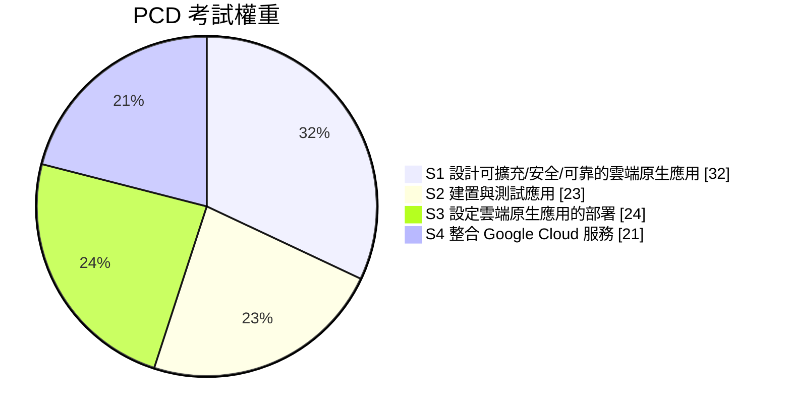

# 🎯 Google Cloud Professional Cloud Developer 備考 Vault

> [!abstract] 這是什麼
> 一份為 **Google Cloud Certified – Professional Cloud Developer (PCD)** 打造的 Obsidian 知識庫。
> 目標不只是「過考試」，而是讓你在真實專案裡能做出正確的技術決策：選對運算平台、設計對的資料模型、寫出可觀測且安全的服務。
>
> 內容依據 **2026 年版官方考試指南**（4 大範圍、含 AI 輔助開發與 Gen AI API 主題）撰寫。

---

## 🚪 兩個入口：先選你現在的目的

同一批筆記，兩種讀法。**每篇服務／模式筆記內部也分成 `📘 技術理解` 與 `🎯 應試` 兩區**，所以你永遠只需要讀自己現在需要的那一半。

### 🔧 A. 我要懂技術（不為考試也有用）

| 順序 | 去哪裡 | 為什麼 |
|:--:|---|---|
| 1 | ⭐ [[00 技術關聯地圖]] | 四張圖看懂服務怎麼串成一個系統：請求生命週期、資料依賴、交付鏈、訊號流 |
| 2 | [[決策樹 運算平台選型]]、[[決策樹 資料庫選型]]、[[決策樹 訊息與事件選型]] | 面對需求時的選型判準 |
| 3 | [[00 服務索引]] → 個別服務筆記的 `📘 技術理解` 區 | 原理、限制、實務設定 |
| 4 | `05-實作實驗室` 的 6 個 Lab（從 [[Lab 01 Cloud Run 端到端]] 開始） | 動手把圖跑起來 |
| 5 | [[gcloud 速查]]、[[kubectl 與 YAML 速查]]、[[程式碼片段 Python Node Go]] | 寫程式時查 |

### 🎓 B. 我要考證照

| 順序 | 去哪裡 | 為什麼 |
|:--:|---|---|
| 1 | [[00 考試總覽]] | 5 分鐘知道要考什麼、怎麼考 |
| 2 | [[01 如何使用本 Vault]]、[[02 Obsidian 設定與外掛建議]] | 讓連結、閃卡、進度追蹤能動 |
| 3 | 挑一份計劃（見下表） | 節奏比內容量更決定成敗 |
| 4 | [[Section 1 設計可擴充安全可靠的雲端原生應用]] 等四篇 | 官方考點的檢核清單 |
| 5 | 各筆記的 `🎯 應試` 區 + [[情境題 Section 1]] + [[閃卡 運算與部署]] 等 | 提取練習 |
| 6 | [[數字與限制速記]]、[[常見陷阱與誘答選項識別]]、[[考前 48 小時衝刺]] | 考前 48 小時只讀這些 |

| 計劃 | 節奏 | 適合 |
|---|---|---|
| ⭐ [[25 天衝刺計劃]] | 2.5 h/天，5 天一區塊（第 5 天固定複習） | 考試日期已定且在 25 天內 |
| [[6 週穩紮計劃]] | 1.5 h/天 + 週末 Lab | 上班族、想長期記住（**保留率最佳**） |
| [[10 天急救計劃]] | 2.5 h/天，只補洞 | 已有 2 年以上 GCP 實務經驗 |
| [[替代方案 比較與選擇]] | — | 不確定選哪個？看這裡的決策樹 |

---

## 🗺️ Vault 地圖

共 **82 篇筆記**，全部以雙括號 wikilink 互連（Graph View 可看出完整結構），**沒有斷連結**。

**每篇服務／模式筆記的內部結構**（技術與應試分區）：

```
# 服務名稱
> 一句話定位

## 📘 技術理解      ← 想學會的人讀到這裡就夠
   心智模型 / 核心概念 / 關鍵設定與限制 🔢 / 常用操作
---
## 🎯 應試          ← 備考期才需要
   考點速記（看到 X → 想到 Y）/ 真實場景陷阱 / 自我檢核

## 🔗 相關
```

| 資料夾 | 內容 | 什麼時候看 |
|---|---|---|
| `00-開始這裡` | 考試規格、資源清單、使用說明 | 第一天 |
| `01-讀書計劃` | 25 天 / 6 週 / 10 天三種節奏 + 每日追蹤 | 第一天，之後每天 |
| `02-考試範圍` | 官方 4 大 Section 的逐條拆解與對應筆記 | 當作「檢核清單」反覆回看 |
| `03-核心服務` | **技術關聯地圖** + 服務索引 + 每個服務的深度筆記（技術／應試分區） | 主要學習期 |
| `04-模式與決策` | 選型決策樹、設計模式、跨服務比較 | 學完服務後、考前必看 |
| `05-實作實驗室` | 6 個可在免費額度內跑完的動手練習 | 每個主題結束時 |
| `06-速查表` | gcloud / kubectl / 程式碼片段 / 數字限制 | 實作時查、考前背 |
| `07-練習題` | 情境題與詳解、誘答選項拆解 | 每個 Section 結束、考前兩天 |
| `08-Flashcards` | 間隔重複閃卡（`::` 格式） | 每天 10 分鐘 |

---

## 📚 四大考試範圍（含官方權重）



- [[Section 1 設計可擴充安全可靠的雲端原生應用]] — 32%｜**最重，先讀**
- [[Section 3 設定雲端原生應用的部署]] — 24%｜Cloud Run + GKE 實作細節
- [[Section 2 建置與測試應用]] — 23%｜開發環境、Cloud Build、測試、AI 工具
- [[Section 4 整合 Google Cloud 服務]] — 21%｜用戶端程式庫、可觀測性

---

## 🧭 最高頻考點捷徑

想快速補強最常出現的主題，直接跳這幾篇：

- [[決策樹 運算平台選型]] — 幾乎每份考卷都有 3～5 題靠這個判斷
- [[Cloud Run]] — 單一最重要的服務筆記
- [[決策樹 資料庫選型]] — Firestore / Spanner / Bigtable / Cloud SQL / AlloyDB 的分水嶺
- [[決策樹 訊息與事件選型]] — Pub/Sub vs Cloud Tasks vs Eventarc vs Workflows
- [[IAM 與服務帳戶]] + [[驗證與授權 ADC OAuth JWT]] — 安全題的地基
- [[韌性模式 重試 冪等 退避 斷路器]] — 「訊息重複處理」類題目的解法
- [[數字與限制速記]] — 考前 24 小時只讀這篇
- [[常見陷阱與誘答選項識別]] — 直接提升 5～10 分

---

## ✅ 進度儀表板

> [!tip] 需要 Dataview 外掛
> 若已安裝 Dataview，下面會自動列出所有筆記的複習狀態；沒安裝也不影響閱讀。

```dataview
TABLE status AS "狀態", confidence AS "信心(1-5)", file.mtime AS "最後修改"
FROM "03-核心服務"
SORT confidence ASC, file.name ASC
```

每篇服務筆記的 frontmatter 都有 `status` 與 `confidence` 欄位，讀完就更新：

```yaml
status: 未讀 | 讀過 | 熟練
confidence: 1   # 1=沒把握 5=可以教別人
```

---

## ⚠️ 關於資料時效

> [!warning] 以官方文件為準
> 本 Vault 中的配額、限制、預設值以 **2026-09-27** 查核為基準。Google Cloud 變動快（尤其 Cloud Run / GKE / Gen AI），考前請對照 [[03 官方資源清單]] 快速複查。
> 標記 🔢 的數字代表「可能被考、但也可能改版」。

## 🔗 相關

- [[00 技術關聯地圖]]
- [[00 服務索引]]
- [[00 考試總覽]]
- [[25 天衝刺計劃]]
- [[考前 48 小時衝刺]]
